# 法医深度学习:Kaggle 相机模型识别挑战

> 原文：<https://towardsdatascience.com/forensic-deep-learning-kaggle-camera-model-identification-challenge-f6a3892561bd?source=collection_archive---------7----------------------->

## 数据扩充的重要性

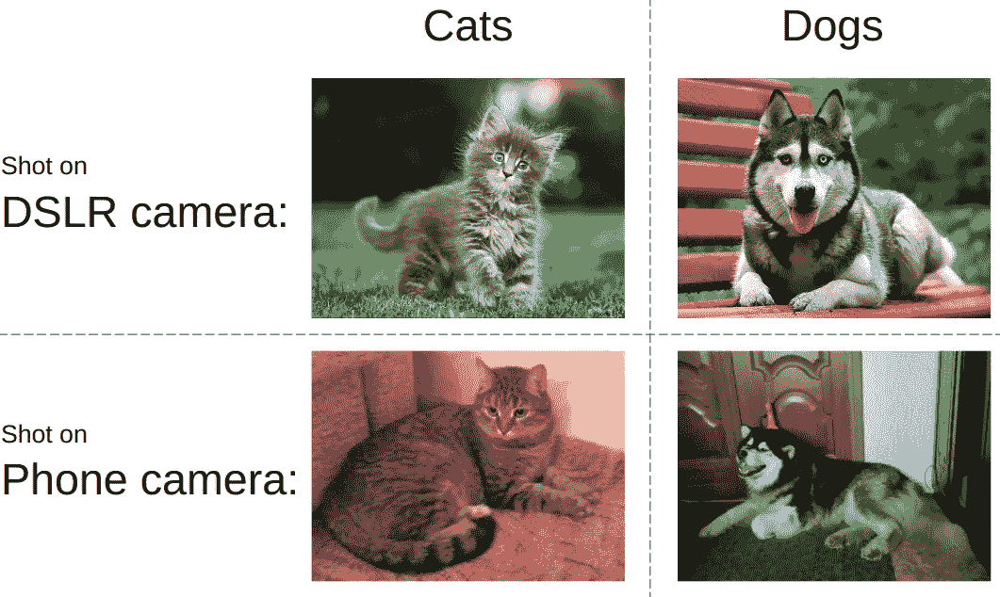

From [https://habr.com/company/ods/blog/415571/](https://habr.com/company/ods/blog/415571/)

大约一年前，在 kaggle.com 举办了一场名为 [IEEE 信号处理学会——相机型号识别](https://www.kaggle.com/c/sp-society-camera-model-identification)的计算机视觉挑战赛。任务是分配哪种类型的相机用于捕捉图像。比赛结束后，[亚瑟·库津](https://www.kaggle.com/drn01z3)、[阿图尔·法塔霍夫](https://www.kaggle.com/fartuk1)、[伊利亚·基巴尔丁](https://www.kaggle.com/ikibardin)、[鲁斯兰·道托夫](https://www.kaggle.com/dautovri)和[我](https://www.kaggle.com/iglovikov)决定写一份技术报告，描述如何解决这个问题，并分享我们在这个过程中获得的一些见解。它被接受参加在西雅图举行的第二届网络犯罪调查大数据分析国际研讨会，我将于 2018 年 12 月 10 日在那里发表演讲。在这篇博文中，我想写一个[文本](https://arxiv.org/abs/1810.02981)的扩展版本。

这篇论文有五位作者:

亚瑟·法塔霍夫、亚瑟·库津、伊利亚·基布丁和其他队员以 0.987 的成绩获得第二名。

我是以 0.985 分获得第九名的队伍中的一员。

我们的解决方案非常相似，所以我们决定写一份技术报告。深圳大学大数据研究所的研究生鲁斯兰(Ruslan )自愿帮我做文本，这对这篇论文至关重要。

在下文中，我将把第二名团队的方法称为“我们的”解决方案。此外，我将跳过一些对整体信息不重要的技术细节。第二名解决方案的代码可在 GitHub[https://GitHub . com/iki bardin/ka ggle-camera-model-identificati on](https://github.com/ikibardin/kaggle-camera-model-identification)上获得。比赛结束后，我们使用我们开发的洞察力进行了一系列单独的实验。这里的工作主要是基于这一进一步的调查。

图像处理的许多应用之一是相机模型检测。例如，在法医学领域，可能至关重要的是要知道一张图片是使用谷歌 Pixel 还是 iPhone 拍摄的，以确定谁可能是非法或有罪照片的所有者，甚至确定谁是知识产权的合法所有者。这种系统还可以用于检测诽谤、中伤或传播假新闻的肇事者。

计算机中的图像存储为数字矩阵和附带的元数据。在最简单的情况下，相机模型应该存储在图像元数据中，这使得相机识别成为一个基本问题。但是图像元数据可能不可靠，并且很容易被恶意用户操纵。

还有另一种更复杂但更可靠的方法。采集完成后，数码相机中的图像将经过一系列后处理步骤，从而生成图像保真度和内存占用优化的图像。这些算法非常复杂，高度非线性。例子可以包括去马赛克、噪声过滤、修正镜头失真等。不同的算法用于各种相机模型，这意味着它们中的每一个都创建特定于模型的工件，人们可以将其用作机器学习管道的特征。

当然，有很多关于这个主题的文献。它的大部分提出了手动特征提取的步骤，在此基础上使用 SVM 或类似的分类算法。例如，当我面对这个问题时，我想到的第一个想法是拍摄一张图像，减去它的平滑版本，并计算这种差异的不同统计数据，如均值、中值、标准差和不同的量，并在其上训练 xgboost。关于如何进行这种相机型号检测的第一篇论文之一非常接近我刚才描述的内容。其他文章提出了一些更复杂的东西，但方法非常相似，基于领域知识的手动特征提取，并在此基础上使用逻辑回归、决策树或 SVM。

将这种方法推广到新的相机型号也很困难。假设我们想为一个新的、刚刚发布的模型进行相机检测。专家应该花多长时间来找出哪些特征有助于将它与其他模型区分开来？

另一方面，深度学习方法可以解决这两个问题。总的来说，深度学习是一头强大的野兽，如果你知道如何驯服它，它可能会帮助你创建高度准确的黑盒模型。

当你在查阅文献并试图理解哪种方法是“最好的”时，这是不可能的。几乎每篇论文都告诉你它们是最先进的。处理的方法是在同一个数据集上评估不同的方法。这种比较不会给你一个总体上哪种算法更好的答案，而是在给定的数据集上，哪种算法更好。这并不意味着在相似的数据集上算法排名是相同的，比如在 CIFAR 上最先进的架构可能在 ImageNet 上表现不佳，反之亦然。但这样的统一对比总比没有好。

对于相机检测任务，IEEE 信号处理协会组织了一次挑战，其中 582 个团队有两个月的时间和一个实时排行榜来比较他们的方法。582 是一个很大的数字，这确保了问题会被不同背景和技能的人所攻击。一些参与者在工业界和学术界从事法医工作，以此谋生。其他人，比如我，有使用计算机视觉技术的经验，但是没有意识到甚至存在像相机识别这样的问题，并且有人有兴趣解决它。

组织者准备了一个由 2750 张图片组成的训练集，这些图片来自 10 台相机——每台相机 275 张。

我们需要区分的相机型号有:

1.  索尼 NEX-7
2.  摩托罗拉摩托 X
3.  摩托罗拉 Nexus 6
4.  摩托罗拉 DROID MAXX
5.  LG Nexus 5x
6.  苹果 iPhone 6
7.  苹果 iPhone 4s
8.  HTC One M7
9.  三星银河 S4
10.  三星 Galaxy Note 3

为了让这个问题不那么无聊，组织者使用了 20 部不同的手机来收集图像:10 部用于训练，10 部用于测试。这意味着在训练期间，您的模型可能不会学习与后处理算法相关的相机模型特定的功能，而是过度适应特定手机特定的伪像。

测试集中的图像是用相同的 10 个相机模型捕获的，但是使用第二个设备。例如，如果 iPhone 6 的火车数据图片是用 Ben Hamner 的设备(相机 1)拍摄的，那么测试数据中的图像是用 Ben Hamner 的第二个设备(相机 2)拍摄的，因为他在风筝冲浪时丢失了海湾中的第一个设备。

此外，火车中的图像是全尺寸的，而在测试中，只使用了中央 512x512 作物。其原因是径向失真在图像的侧面更加明显。一些论文显示了纯粹基于径向畸变特征的有希望的结果。他们能增加多少附加值还不清楚，但组织者决定阻止参与者利用他们。

这还不是全部。在许多情况下，通常存储在电脑上的图像会受到不同转换的影响，如 jpeg 压缩、gamma 转换、对比度、亮度、调整大小等。

从实践的角度来看，有一个健壮的模型来进行这样的转换是很好的。以下类似的逻辑组织者用以下变换之一修改了一半的测试图像:

*   质量因子= 70 的 JPEG 压缩
*   质量因子= 90 的 JPEG 压缩
*   通过因子 0.5 调整大小(通过双三次插值)
*   通过因子 0.8 调整大小(通过双三次插值)
*   通过因子 1.5 调整大小(通过双三次插值)
*   通过因子 2.0 调整大小(通过双三次插值)
*   使用 Gamma = 0.8 进行 gamma 校正
*   使用 Gamma = 1.2 进行 gamma 校正

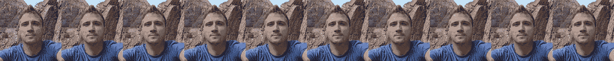

Jpeg compression with quality [5, 15, 25, 35, 45, 55, 65, 75, 85, 95]

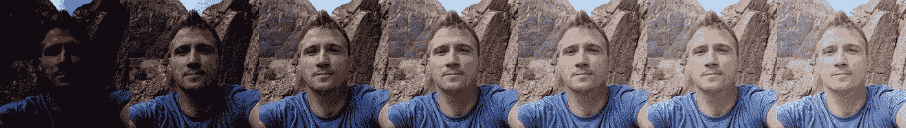

Gamma Transform with quality [0.25, 0.5, 0.75, 1, 1.25, 1.5, 1.75]

正如我上面提到的，在不同的图像主机上有数 Pb 的图像，我们可以从中提取相机模型。Kaggle 的各种比赛对外部数据有不同的规则，但在这种情况下，这是允许的。一般来说，所有允许外部数据的竞赛都有一条规则，强制所有参与者也可以访问这些数据。在任何此类比赛中，论坛上都有一个主题，参与者可以分享他们计划使用的数据和预先训练的模型。

这次比赛是个例外。管理员忘记在规则中加入关于共享数据的句子。这改变了游戏。

深度学习模型的好处在于，由于容量大，它们通常会受益于用于训练的数据量。同样重要的是，许多火车标签可能是错误的。这很好。只要错误标签的百分比低于 15%，你就没事。你使用的数据越多，你的模型就越好。

参与者可能不是法医专家，但他们肯定知道更多数据对 DL 更好的事实。这改变了竞争的态势。通常，在竞争中，您会试图从给定的数据集中获取最多的信息。经过一些实验后，你选择一个性能良好的模型，聪明地选择你的增强，探索领域知识，花时间制定一个智能训练计划，损失函数等。如果你没有更好的选择，所有这些都很重要。但是我们做到了。

Flickr，Yandex，Fotki，Wikipedia commons 都被废弃了，该团队拥有的原始图像数据总量约为 500Gb。我们可以使用所有这些数据，但是为了加速训练并潜在地提高模型的质量，我们进行了过滤。

对于训练，我们想要未经处理的数据，这意味着不受 Photoshop 或 LightRoom 或类似图像编辑软件的影响，不调整大小，并且是高质量的。

首先，我们删除了元数据中包含 Photoshop 和 LightRoom 的图像。其次，我们删除了 Jpeg 质量低于 95 的图像。第三，我们知道不同的相机以固定的尺寸拍摄照片。如果图像的大小与我们预期的不匹配，我们认为它被调整了大小。我们删除了不符合这些标准的图片。

这并不意味着我们得到的所有图像都是未经处理的，比如有人可能使用 10%质量的 jpeg 压缩，然后再使用 99%质量的 jpeg 压缩。实际上它仍然是 10%，但是对于我们的软件来说，很难发现它是 10 而不是 99。我不想说“困难”，我想说不可能，但是回想一下，在研究这个问题时，我看到过试图识别“双重 jpeg 压缩”的论文。再说一次，我甚至不知道有这样的问题存在。

过滤后，我们有 78807 个废弃的图像，它们被认为是原始的和未经处理的。阶级分布不均匀。正如人们所料，并非所有手机都同样受欢迎，或者手机型号与机主拍照并上传到互联网的频率之间存在相关性。因此，对于某些类，我们有更少的图像。

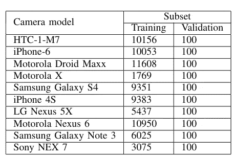

Camera model classes with the number of samples each part of the dataset. The table presents the final dataset, which contains external and organizers datasets.

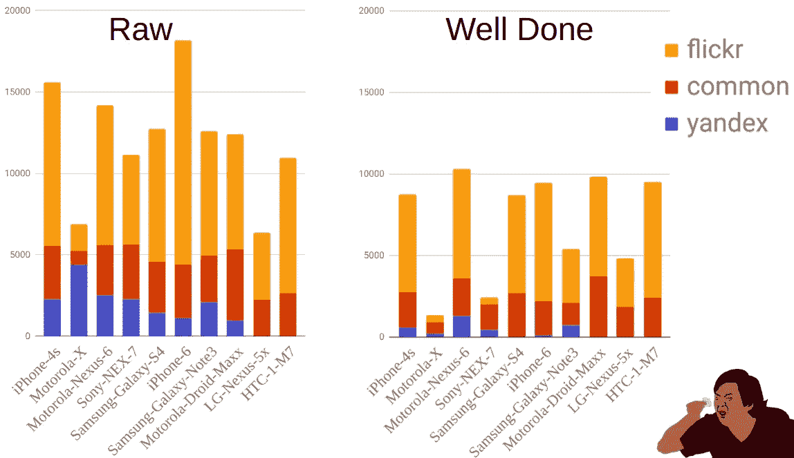

From [https://habr.com/company/ods/blog/415571/](https://habr.com/company/ods/blog/415571/)

总的来说，这是一个从 ImageNet 学习的过程。你拿一个预先训练好的网络，去掉预测 1000 个类的最后一层，换成预测你需要什么的一层。在我们的例子中，这个数字是 10。在此之后，您使用分类交叉熵来计算您的损失，并训练网络。第一名和第 50 名的区别通常不在于你使用的网络类型，而在于培训程序和进行培训的人。从实践的角度来看，深度学习仍然是炼金术多于科学。因此，当一个人从事不同的工作时，发展出来的直觉是至关重要的。

对 PyTorch 有影响力的网络有一个很好的列表，那就是雷米·卡登 https://github.com/Cadene/pretrained-models.pytorch[的回购。人们可以使用类似的 API 访问不同的网络和预先训练的权重，从而快速进行实验。这种回购被挑战的参与者广泛使用。团队试验了 Resnet、VGG、DPN 和所有其他类型的网络。](https://github.com/Cadene/pretrained-models.pytorch)

对于这个问题，一个经验主义的结论是 [DenseNet](https://arxiv.org/abs/1608.06993) 工作得稍微好一点，但是团队之间的差异是如此之小，以至于它是真是假还不清楚。

什么是 DenseNet？DenseNet 是一种体系结构，它将在 Resnet 类型的网络中使用跳过连接的思想推进了一步。

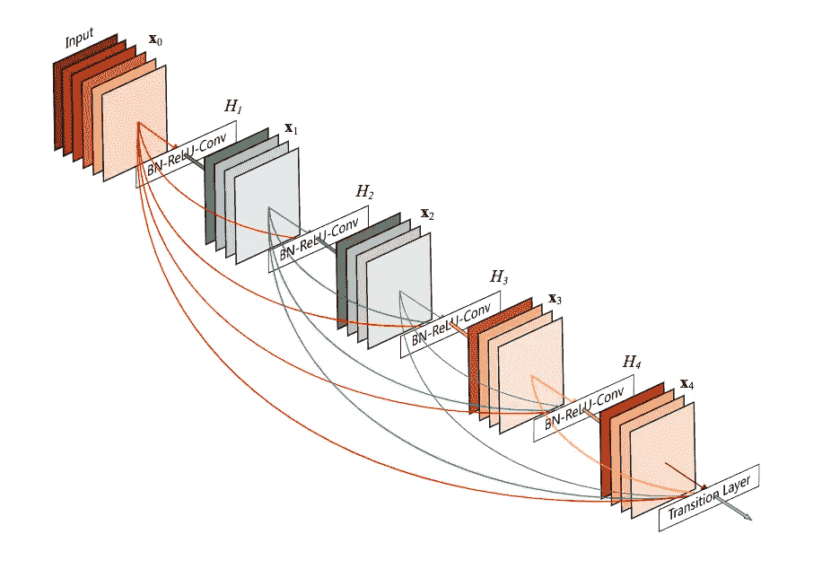

[https://arthurdouillard.com/post/densenet/](https://arthurdouillard.com/post/densenet/) [https://arxiv.org/abs/1608.06993](https://arxiv.org/abs/1608.06993)

**更多被跳过的连接给被跳过的连接之神！**

DenseNet 论文的作者将卷积块中的所有层连接起来。跳跃连接简化了梯度的流动，使得训练深度网络成为可能。在 skip connections 成为主流之前，处理只有 19 层的 VGG19 是一件痛苦的事情。在引入它们之后，具有 100 层以上的网络可以处理非常高级的抽象功能，不再是训练的问题。

还认为损失曲面变得更平滑，防止训练陷入许多局部最小值。

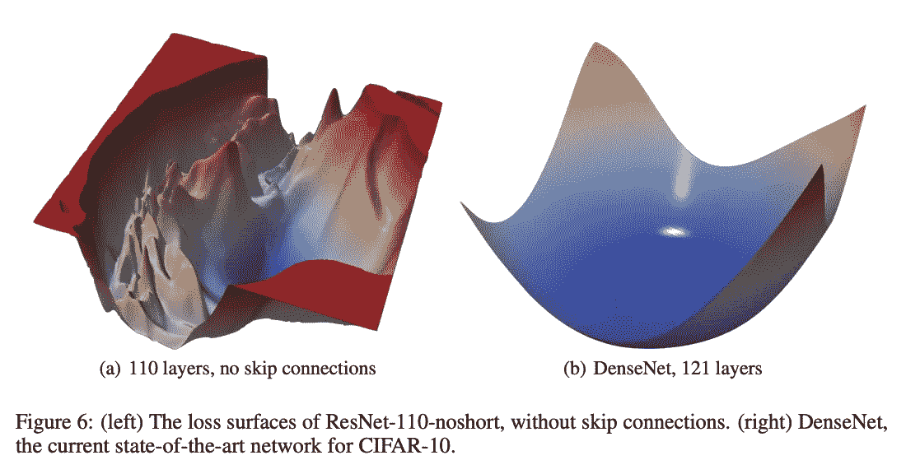

[https://arxiv.org/abs/1712.09913](https://arxiv.org/abs/1712.09913)

除此之外，网络比较规范。一组卷积块，具有批范数和 ReLu 层，在块之间有最大池。全球平均池和密集层在最后。有必要提及的是，存在全局平均池层的事实允许我们使用不同大小的图像作为输入。

有些人认为 DenseNet 总是优于 Resnet，因为它是后来推出的，并成为 2017 年 CVPR 最佳论文。事实并非如此。在最初的文章中，DenseNet 在 CIFAR 上显示了良好的结果，但是在更多样化的 ImageNet 数据集上，更深的 Densenet 需要在准确性上匹配更浅的 ResNet 网络。


DenseNet 比 Resnet 好/差？看情况。在[星球:从太空挑战](https://www.kaggle.com/c/planet-understanding-the-amazon-from-space)中了解亚马逊，DenseNet，我们的团队在 900+中获得了第 7 名，在这个相机检测问题上表现更好。但在 ImageNet 上，情况更糟。

我与我的合作者进行了一次讨论，有人提出跳过连接不仅提供了良好的光滑损失表面，而且还降低了模型容量。这可能解释了为什么 DenseNet 在像 CIFAR 这样的非多样性问题中表现得更好。尽管如此，人们需要增加网络的深度，以弥补更多样化的 ImageNet 数据集的容量损失。基于这种推测，人们可能会想到 DenseNets 工作良好的用例是当数据集不是非常多样化并且不需要大容量时。尽管如此，区别性特征是高水平的，这可能需要非常深的网络。

摄像机检测任务属于这一类吗？我不知道。经验上是的，但是证据不足。

将智能正则化添加到训练过程的标准方法是使用增强。不同的问题可能受益于不同的增强，同样，你的直觉越好，你就可以选择更好的增强及其参数。

对于这个问题，我们使用:

*   二面角组 D4 变换:旋转 90 度、180 度、270 度和翻转。
*   伽玛变换。我们从[80，120]范围内统一选择伽马参数。
*   参数从 70 到 90 均匀采样的 JPEG 压缩。
*   重新缩放变换，从[0.5，2]范围中选择比例。

在代码中，使用[相册库](https://github.com/albu/albumentations)，它可以被描述为:

```
import albumentations as albu def train_transform(image, p=1):
    aug = albu.Compose([albu.RandomRotate90(p=0.5),
                        albu.HorizontalFlip(p=0.5),
                        albu.RandomGamma(gamma_limit=(80, 120), p=0.5),
                        albu.JpegCompression(quality_lower=70, quality_upper=90, p=0.5),
                        albu.RandomScale(scale_limit=(0.5, 2), interpolation=cv2.INTER_CUBIC, p=1)
                        ], p=p)
    return aug(image=image)['image']
```

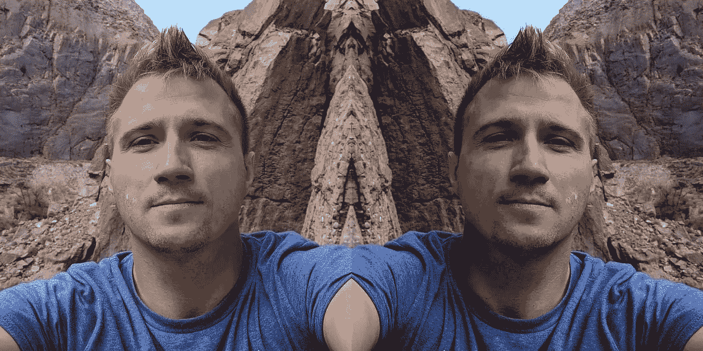

Left is the original image from my recent rock-climbing trip to Bishop, and right is flipped and a bit darker. The latter is the effect of the gamma transformation. Jpeg compression was also applied, but it is hard to find its effects because quality [70:90] is relatively high.

组织者告诉我们，他们使用三次插值来调整大小。如果我们没有这些信息，我们可以在不同插值之间交替使用。一般来说，竞争激烈的 ML 社区经常使用这个技巧，但是我还没有在文献中看到它。

无论如何，如果我们想要添加这种改变，代码会更复杂，但仍然相对透明。

```
import albumentations as albu def train_transform(image, p=1):
    scale_limit = (0.5, 2) aug = albu.Compose([
        albu.RandomRotate90(p=0.5),
        albu.HorizontalFlip(p=0.5),
        albu.RandomGamma(gamma_limit=(80, 120), p=0.5),
        albu.JpegCompression(quality_lower=70, quality_upper=90, p=0.5),
        albu.OneOf([albu.RandomScale(scale_limit=scale_limit, interpolation=cv2.INTER_NEAREST, p=0.5),
                    albu.RandomScale(scale_limit=scale_limit, interpolation=cv2.INTER_LINEAR, p=0.5),
                    albu.RandomScale(scale_limit=scale_limit, interpolation=cv2.INTER_CUBIC, p=0.5),
                    albu.RandomScale(scale_limit=scale_limit, interpolation=cv2.INTER_AREA, p=0.5),
                    albu.RandomScale(scale_limit=scale_limit, interpolation=cv2.INTER_LANCZOS4, p=0.5),
                    ], p=0.5),
    ], p=p)
    return aug(image=image)['image']
```

原始图像的分辨率很高。在全分辨率下重新调整它们是不明智的。因此我们连续收获了两季。一个在调整大小之前，一个在调整大小之后。

```
import albumentations as albu def train_transform(image, p=1):
    aug = albu.Compose([
        albu.RandomCrop(height=960, width=960, p=1),
        albu.RandomRotate90(p=0.5),
        albu.HorizontalFlip(p=0.5),
        albu.RandomGamma(gamma_limit=(80, 120), p=0.5),
        albu.JpegCompression(quality_lower=70, quality_upper=90, p=0.5),
        albu.RandomScale(scale_limit=(0.5, 2), interpolation=cv2.INTER_CUBIC, p=1)
        albu.RandomCrop(height=480, width=480, p=1),
    ], p=p)
    return aug(image=image)['image']
```

使用初始学习率为 0.001 的 Adam optimizer 对网络进行 100 个时期的训练。

为了获得更好的精度，当学习率在不同值之间振荡时，我们还使用了循环学习率方法。

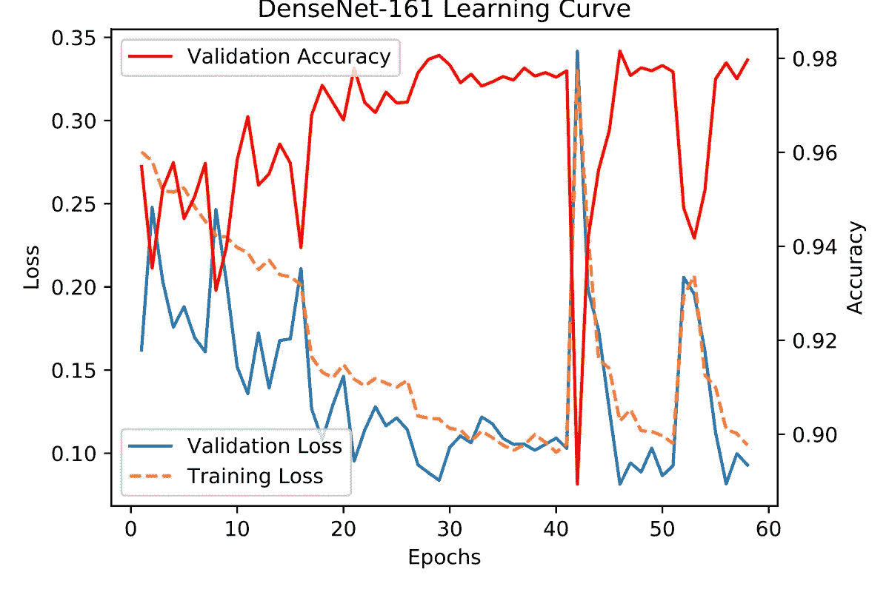

正如你从这张图片中所猜测的，学习率在 17 世纪左右下降了。

同时，在 42°左右和 53°左右有两个连续衰减的损耗峰。在训练过程中，网络往往会陷入局部最小值，而这些振荡有助于摆脱它们。

在推断时，我们执行测试时间增加，平均来自测试图像的不同 480x480 裁剪的预测。

我们还对估计不同的转换如何在推理时降低模型的准确性感兴趣。

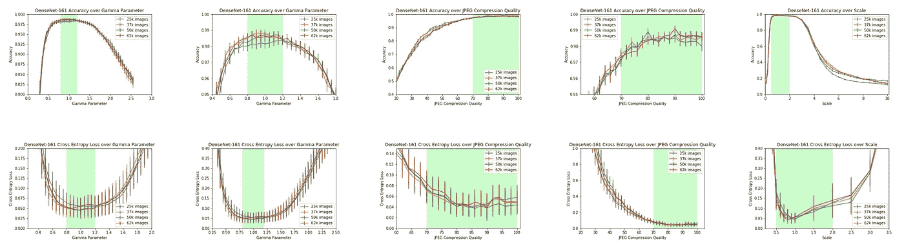

绿色表示训练中使用的参数范围。

正如预期的那样，在模型被训练的范围内，精确度没有显著降低。这表明，如果使用深度学习方法并拥有足够数量的数据，增加所应用的增强的范围可能会导致更稳健的模型。

我们想要回答的另一个问题是，如果我们在测试时减少输入到网络的作物的输入大小，精确度会如何？

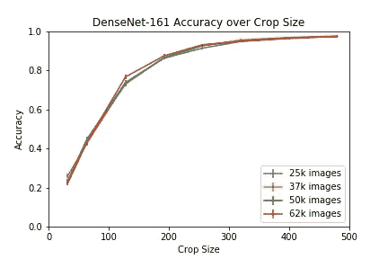

我会认为网络正在学习的特性是如此的局部化，以至于不需要大规模的裁剪，但是看起来事实并非如此。为了使 10 个类别的准确率达到 90%以上，人们需要至少 250x250 的作物，这可能意味着后处理算法会在网络捕捉的像素之间创建长距离相关性。

我们还希望验证，当训练数据量增加时，模型的准确性也会提高。从图中可以看出，这种情况并没有发生。我想我们的最低数据点 25k 对于高质量的模型来说已经足够了。如果我们需要检测的不是 10 个，而是 1000 个类别，那么作为训练数据的函数，模型质量的提高可能会更明显。

## 总结:

*   来自 ImageNet 的迁移学习即使对于像照相机检测任务中的那些低级特征也工作得很好。
*   DenseNet 表现更好，但我们认为，人们可以从 Cadene 的列表中选择任何预训练网络，它会表现类似。
*   在训练期间应用增强可能有助于使模型更健壮。
*   如果你能得到更多的标签数据，那就去得到它。在许多(但不是全部)问题中，使用大量数据的蛮力可能比复杂的解决方案更容易使用。尽管利用领域知识可以增加重要的额外推动力。

# 课文中跳过的内容:

*   添加额外的输出来判断图像是否被操纵有意义吗？
*   像检查点平均这样的技巧。
*   其他架构表现如何？
*   如何完成这项任务？
*   如何利用测试中的类是平衡的？
*   如何将伪标签应用于此任务。
*   讨论我们尝试了什么，但它在这个任务中不起作用。
*   网络了解到的特征有哪些？
*   此问题评估标准的细微差别。

所有这些话题都很重要，但我并不认为它们有很大的影响力，或者我更愿意对每一个话题进行单独的讨论。

P.S .参加 2018 年 12 月 10-13 日在美国西雅图举行的 2018 年 IEEE 大数据国际会议的人。参观[第二届网络犯罪调查和预防大数据分析国际研讨会](http://folk.ntnu.no/andriis/bdaccip2018/)的研讨会并问好:)

帮助编辑:[埃里克·加塞德伦](https://www.linkedin.com/in/erikgaas/)