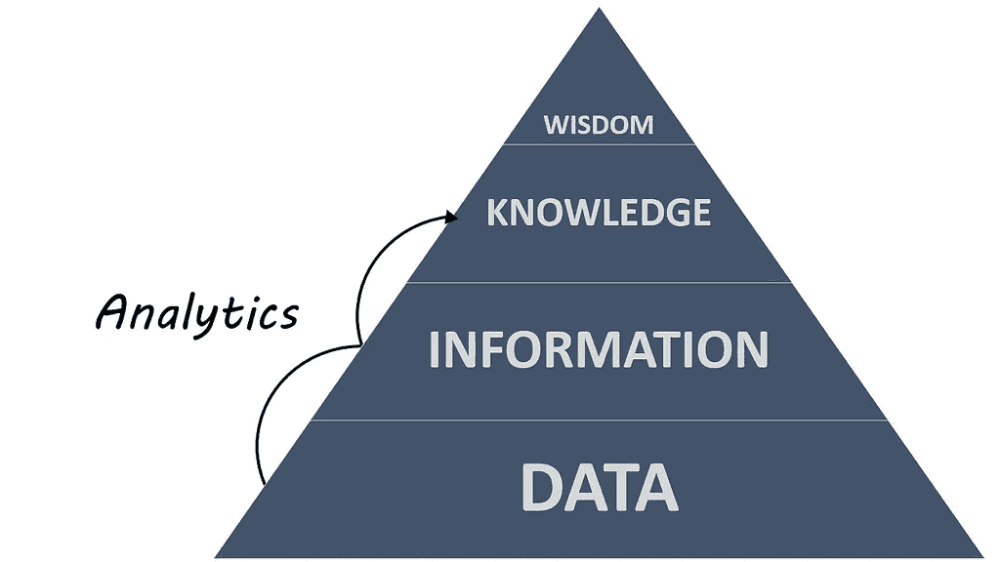

# 2018 年需要关注的四大分析趋势

> 原文：<https://towardsdatascience.com/four-analytics-trends-to-keep-an-eye-on-in-2018-854646e390f6?source=collection_archive---------12----------------------->

Courtesy:Flickr

当你想到 2018 年的分析时，是什么让你早上起床？是 AI 在我们生活中的突出地位、数据的民主化还是高级分析让你感到兴奋？让我们接受这一点，去年是多事之秋，自助分析、物联网分析以及聊天机器人变得越来越智能。感受到这些发展，2018 年应该成为分析行业加速创新的又一年-当然会有一些预期和意外的中断！激动吗？毫不费力地阅读我们在 2018 年要关注的四大分析趋势！

人工智能聊天机器人不再是镇上的“新手”，很快将成为所有操作的主要驱动力！

“Siri，今晚我该看哪部电影？或者“谷歌，告诉我去办公室的最佳路线”，熟悉这些日常对话？想象一下没有他们的生活吧！可以吗？不太可能，对吧？考虑到它们对我们繁忙生活的影响。2017 年，围绕智能推荐有太多的噪音，人工智能聊天机器人可以识别我们的情绪，并相应地回应我们。不仅是关于天气或交通拥堵的更新，聊天机器人将会发展，还可能有助于搜索财务运营指标或获得“为什么”和“如果”问题的答案，从而实现商业和消费者空间的转型。尽管这可能需要几年时间才能成熟，但我们可以预计 2018 年也不会有多少成功故事。

**增强现实:从卷轴到现实，增强现实正在并将改变我们周围的世界**

还记得 2016 年 7 月，数百万人如何穿过公园，走过人们的坟墓，进入教堂，寻找增强现实版的神奇宝贝角色。记忆犹新，对吧？虽然口袋妖怪的狂热已经消退，但增强现实却没有，我们可以在 2018 年看到一些更先进和更动态的 AR 模式。随着企业已经在使用 AR 来增强制造和研究流程或提供新的客户体验，人机交互将会增强。为什么这对分析行业很重要？根据 Gartner 副总裁 David Cleary 的说法，“增强分析是一个特别具有战略意义的增长领域，它使用机器学习来为广泛的企业用户、运营人员和公民数据科学家自动化数据准备、洞察发现和洞察共享。”因此，是的，在几年内，所有的资源消耗和时间敏感的分析将大大变得容易和流畅的增强分析！

**物联网分析**:**2018 年，每个行业的银弹？**

2017 年，是“互联互通”收获巨大的一年。尽管存在大量安全问题，但围绕物联网还是有很多投资和采用。2018 年怎么样？物联网分析会像 2017 年一样激动人心吗？不可忽视的是，物联网今年也将继续扩展，几乎每秒钟都会有越来越多的设备联网。尽管零售**、**医疗、**和**工业/供应链行业一直在使用物联网来提高投资回报率，但今年我们可以看到越来越多的公司将物联网用于更加个性化的营销工作。此外， *Business Insider* 预测，到 2021 年，企业在物联网解决方案上的支出将达到 6 万亿美元。根据这一预测，我们将看到许多风险投资家继续向物联网的承诺投入资金，这凸显了物联网在几乎每个行业改善客户体验的潜力！

**区块链科技:实现新形式的数据货币化**

所有人都同意，2017 年是区块链取得巨大增长的一年？许多人认为我们已经处于采用的“早期多数”阶段，并且我们正在朝着完全采用区块链的方向前进。与任何新技术一样，数据的重要性也在增长。今年，我们可能会看到区块链变得更加主流，医疗保健和零售等行业也开始使用它来处理数据，以防止黑客攻击数据泄露。根据戴尔 EMC 服务首席技术官 Bill Schmarzo 的说法，区块链技术还“有可能通过消除促成交易的中间人，使数据和分析的共享和货币化民主化。”因此，是的，组织将加快对这些虚拟货币的数据分析过程，以揭示强大的趋势、欺诈和洞察力，并做出明智的决策！

[如何搭上虚拟货币涨势？请继续阅读，了解更多信息。](http://blog.yantrajaal.com/2016/02/bitcoin-blockchain-and-crypto.html)

虽然很难说这些分析趋势会以多快的速度在我们的生活中体现出来，但我们相信 2018 年将再次成为多事之秋。将会有关于安全、治理以及最重要的消费者接受和适应这些创新和变化的能力的问题。唯一可以确定的是，今年的未来会有所不同，非常有希望！敬请关注！