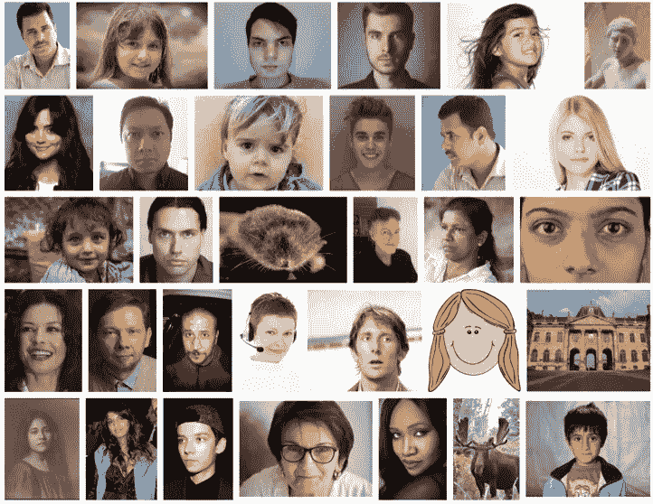
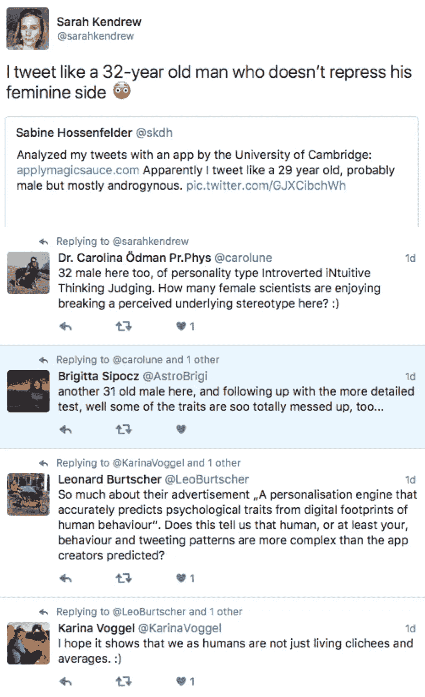
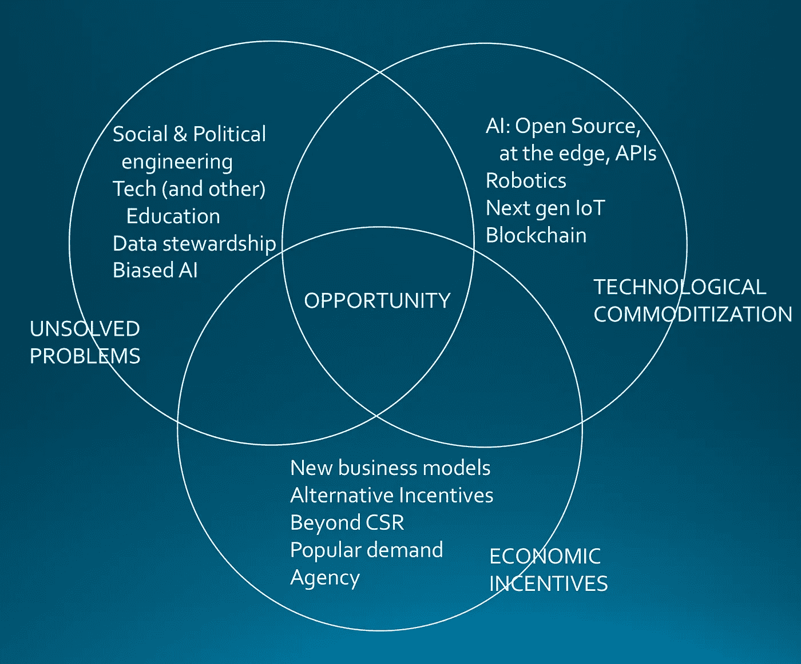

# 四个破碎的系统& 2018 年的四大技术趋势

> 原文：<https://towardsdatascience.com/four-broken-systems-four-tech-trends-for-2018-bd4698a3bef0?source=collection_archive---------11----------------------->

我受邀在未来女性活动上发表关于 2018 年科技趋势的演讲。[未来女性](http://futurefemales.co)是一场由现任和有抱负的女性企业家组成的运动。我非常钦佩这类女性，所以我很荣幸被邀请来演讲。此外，这是一个多么吉祥的方式来结束这一年，被要求思考未来，所以这里有一些关于这个巨大的话题的想法。

*免责声明:我来自天体物理学，偏爱数据科学、统计学和目前归入机器学习和人工智能范畴的算法家族。*

如何看待技术趋势这个话题？关于这方面的[报道](https://www.gartner.com/smarterwithgartner/gartner-top-10-strategic-technology-trends-for-2018/)、[刊物](https://dupress.deloitte.com/dup-us-en/focus/tech-trends.html)、[文章](http://www.nasdaq.com/press-release/telenor-research-7-tech-trends-for-2018-20171213-00046)、[领域](https://www.forbes.com/sites/kimberlywhitler/2017/12/03/the-top-6-data-and-technology-trends-for-2018/#13663bae3680) - [具体](http://usblogs.pwc.com/emerging-technology/top-10-ai-tech-trends-for-2018/)、[分析](https://www.forbes.com/sites/johnhall/2017/12/03/6-marketing-trends-to-help-you-budget-for-2018/)、、[信息图](https://www.lianatech.com/news/liana-technologies-hints-and-tips/tip/10-trends-in-digital-marketing-to-happen-in-2017-infographic.html)。如何在这个时髦词汇的海洋中航行，并试图理解它对我们明年或以后的人意味着什么？我的出发点是问:

# 什么坏了？哪些在 2017 年行不通的，在 2018 年应该会更好？

虽然这个列表可能很长，但我想到了 4 个系统，它们在 2017 年表现出了多么不合适、不准确或彻底崩溃。

## 1.社会和政治工程

2017 年，社交媒体网络证明，它们并不像以前宣称的那样是一股团结的力量，在世界各地的人们之间建立桥梁。事实上，社交媒体平台恰恰相反，它分化了社区，分裂了社会，暴露了深刻的意识形态分歧，并以 YouTube 评论中首次发现的恶意和攻击性进行辩护。事实证明，南非本身并没有小到可以不被[旨在煽动党派观点的推特机器人所注意。](https://medium.com/code-for-africa/american-fake-twitter-accounts-boost-messaging-as-anc-picks-new-leader-5414f28ab5d0)

我们已经看到公关公司改变公众舆论，加剧政治动荡，外国[国家](https://www.theguardian.com/world/2017/nov/14/how-400-russia-run-fake-accounts-posted-bogus-brexit-tweets) [利用](https://www.nytimes.com/2017/10/30/technology/facebook-google-russia.html)社交媒体[平台](https://www.nytimes.com/2017/11/15/world/europe/russia-brexit-twitter-facebook.html)影响其他国家的投票和选举。我们已经看到政治预测者，从传统的民意测验专家到前沿的统计分析师都搞错了。

很明显，这没用。

## 2.传统(技术)教育

每年都有很多声音描述教育系统是如何崩溃的。虽然这可能是真的，而且太大了，无法在这里解决，但我认为专注于技术教育会很有趣，因为那里正在发生一些非常有趣的事情。

问题是，许多公司认为他们不能雇佣大学毕业生，因为他们(T2)不能像这些公司所希望的那样立即投入运营。[南非的毕业生失业是一个问题。有一些努力。金伯利的 Sol Plaatjie 大学于 2014 年成立，专注于数据科学。像](https://www.businesslive.co.za/bd/national/education/2017-03-11-a-degree-and-deep-desire-to-work-isnt-always-enough-in-sa/) [Coursera](https://www.coursera.org) 、 [edX](https://www.edx.org) 、 [Udacity](https://www.udacity.com) 和 [others](https://www.thegreatcourses.com) 这样的大规模开放在线课程平台现在不仅提供课程，还提供专业学位，或者纳米学位，这些学位捆绑了一组急需的技能。这些在线学位在就业市场上越来越受到重视，以至于许多大公司，如微软，在这些平台上开设了许多认证课程。

让这个领域的创新变得有趣的另一个方面是不同商业模式的出现，以及除了赚钱之外的其他激励手段的使用。我想到的例子有 [Insight 数据科学奖学金](http://insightdatascience.com)、 [Ecole 42](http://www.42.fr) 以及它的南非版本，最优秀的[我们认为代码 _](https://www.wethinkcode.co.za) 。在这些科技教育机构中，学生不负责学费，但需要他们培养的人才的企业负责。这极大地改变了游戏的可访问性。Ecole42 和我们认为 code_ 在资格方面没有任何先决条件。没错。有人可能在 15 岁就辍学了，但仍然被录取，只要他们通过了在线解决问题技能测试。它不是对知识的测试，而是对人们如何处理问题的测试。这是大多数学校都不教的。

## 3.数据管理

今年我们已经看到了历史上一些最大的数据泄露事件，以及一些最大的掩盖事件。无论是优步、Equifax 还是雅虎，至少有一个漏洞最有可能影响到我们每一个人。在南非，我们已经看到一个数据泄露事件[泄露了身份证号码和其他个人信息](https://www.biznews.com/global-citizen/2017/10/20/biggest-ever-sa-data-breach/)，这些信息可能被用于身份盗窃。

这里的问题是[激励、所有权和风险都以错误的方式分配](https://sciencetrends.com/problems-data-ownership-data-security/)。我们都从[系统](https://hbr.org/2017/09/do-tech-companies-really-need-all-that-user-data)中受益，大公司[利用我们的数据](http://time.com/4673602/terms-service-privacy-security/)来销售有针对性的广告，作为交换，我们愿意将我们的数据交给他人，这样我们就可以免费使用社交网络、网络平台和搜索引擎。当出现漏洞时，问题就来了。虽然这些大公司可能拥有数据，但他们不承担违规带来的风险。这种风险——身份盗窃、信用卡滥用等等——仍然由我们自己——消费者——承担。因此，应用能够抵御越来越聪明的黑客攻击的适当数据安全措施的动机不在于拥有和保存数据的大公司。完整的[报告](https://www.mcafee.com/us/resources/reports/rp-hidden-data-economy.pdf)存在于被盗数据经济中；事实证明，在黑暗网络上，一个身份[并不昂贵](https://betanews.com/2017/06/22/dark-web-information-value/)。

这些待售的身份不是大公司的信息，而是你我的。很明显这没用。

这个问题如此严重，以至于有些人投入巨资试图改变这种状况。这里面有很多钱。

## 4.人工智能应用传播其创造者的偏见

今天使用的人工智能算法主要建立在机器学习算法的基础上，这些算法经过编程，然后根据数据进行训练。这为[算法和训练阶段](https://www.forbes.com/sites/danielnewman/2017/09/12/your-artificial-intelligence-is-not-bias-free/#30868ee5c783)的[偏差](https://www.technologyreview.com/s/608986/forget-killer-robotsbias-is-the-real-ai-danger/)留下了空间，后者可能是最能揭示问题的。AI 的[偏见](http://www.telegraph.co.uk/news/2017/08/24/ai-robots-sexist-racist-experts-warn/)已经在 2017 年被[多家](https://www.technologyreview.com/s/609338/new-research-aims-to-solve-the-problem-of-ai-bias-in-black-box-algorithms/)主要[刊物](https://www.wsj.com/articles/artificial-intelligencewith-very-real-biases-1508252717)彻底[记录](https://www.theguardian.com/technology/2017/apr/13/ai-programs-exhibit-racist-and-sexist-biases-research-reveals)。(请点击所有这些链接了解更多信息，有些文章可能在付费墙后面)。

下面的两个例子说明了这些偏见有多普遍。

第一张图片是谷歌图片搜索“正面”的屏幕截图，带有额外的彩色图片过滤器和知识共享许可，允许我在其他地方显示图片。寻找一张脸，我得到了一个雕像，一幅画，一座建筑，两只动物，但只有一个黑人。这实质上意味着，当搜索一张脸的图像时，黑色的脸出现的频率不会比动物和建筑物之类的错误更高！这不仅是对世界面孔的拙劣表现，也是一种完全有偏见的信噪比。

在第二个案例中，我的一个朋友玩了剑桥大学(Cambridge University)开发的在线人工智能服务[，该服务通过分析推文或 facebook 帖子获得人口统计数据。不用说，我的朋友、我自己和一大群女科学家立即被贴上了男性标签，提出了一个合理的问题:“**在人工智能时代，泛化是合理的吗？**”。](https://applymagicsauce.com)

答案当然是否定的。因此，这显然是行不通的。如果我们要信任我们的人工智能，我们都需要改进它，并记住人工智能会错过的边缘情况。我们必须比人工智能更聪明([我们也能](https://arxiv.org/abs/1710.06169))。

这涵盖了 2017 年的一些重大破事，以我谦卑和人性偏见的观点来看。现在谈谈我(和许多其他人)预见的一些有趣的技术趋势。

# 2018 年，技术可能会对我们的生活产生怎样不同的影响？

同样，这不是一个详尽的清单。我刚刚确定了四个有趣的趋势，我渴望看到发展。这个列表有一个偏差，因为这主要是对消费者可见的技术，如果不是直接的消费者技术的话。在工业和研究领域有着迷人的技术发展，我们无法直接看到，这是一个全新的探索世界。

## 1.与机器人一起工作和生活

几年来，这已经成为许多科学家的标准，但这仍然有助于科学研究。从用于寻找水污染源头的机器鳗鱼到学校认可的隐形 T2 机器斑马鱼，机器人技术正以创造性的方式应用于尖端领域。离我们更近的是，[机器人手术](https://www.medscape.com/viewarticle/890595)正在成为许多医生的现实(伴随着过渡期的自然[痛苦)，因此也成为病人的现实。更有趣的是，价格实惠、外观自然的个性化智能假肢的兴起。有了 3D 打印，假肢不再需要看起来像商店橱窗里的人体模型，它们可以适合任何个人。随着神经修复术的进步，现在这是真正的机器人生活。](http://theconversation.com/young-doctors-struggle-to-learn-robotic-surgery-so-they-are-practicing-in-the-shadows-89646)

我认为，我们还将看到机器人更多地进入我们的物理空间。除了电话号码末尾的机器人，或者管理我们的社交媒体，我们将开始看到它们。任何自动驾驶车辆实际上都是机器人，无论是自动驾驶汽车、[穿梭车](https://www.theverge.com/2017/11/6/16614388/las-vegas-self-driving-shuttle-navya-keolis-aaa)、[卡车](https://www.wired.com/story/embark-self-driving-truck-deliveries/)，还是无人驾驶飞机[、室内](https://www.engadget.com/2017/08/25/mit-drone-fleets-track-warehouse-inventory/)或室外，机器人正在变得可见，它们将很快成为我们生活环境的一部分。

## 2.消失的界面

在过去，我们会出去购买一些技术来访问一些东西，无论是听音乐的随身听，玩游戏的游戏机，还是阅读电子邮件的电脑。现在，这种情况似乎越来越少，我们不再需要购买更多的技术，而是回来坚持使用几十年来我们一直使用的一些产品，这些产品似乎会一直存在下去；汽车，[手表](http://www.techradar.com/news/wearables/best-smart-watches-what-s-the-best-wearable-tech-for-you-1154074)，电话，娱乐系统。我们喜欢的一切的界面开始存在于那些[对象](http://www.businessinsider.com/best-smart-speaker-amazon-echo)中，但是在它们之间无缝导航。我们从手机上听音乐，但当我们开始开车时，汽车会接管它，它会接下一个电话，等等。

界面现在正在消失，无处不在，这为未来几年带来了一些非常有趣的机遇和挑战，从界面/交互设计到数据和隐私。期待看到 2018 年这个趋势会如何发展。

1.  人工智能作为一种商品

人工智能是不可避免的。它将贯穿我们的大部分工作。人工智能有一些非常有趣的创造性应用，例如根据难民被重新安置的地点优化他们获得就业的机会，到你的普通聊天机器人。不同的是，现在人工智能正在变得商品化，因此，任何人都可以将其纳入他们的产品和服务。这种商品化有三个主要方面:

*   开源软件
    [tensor flow](https://www.tensorflow.org)[Spark](http://spark.apache.org)[py brain](http://pybrain.org)[open nn](http://www.opennn.net)等。一些最好的人工智能和机器学习库是开源的。不再躲在专有的微调算法后面。除此之外，还有丰富的免费在线课程，几乎任何人都可以学习将机器学习和人工智能应用到自己的业务中。
*   例如，如果没有大量数据来训练机器学习算法，那么可以通过 API 轻松访问预先训练的引擎。比方说，每次调用分析一张图片或一些文本，都不再非常昂贵。所有大公司都有一套全面的人工智能 API 可供使用；微软 Azure 的[认知服务](https://azure.microsoft.com/en-us/services/cognitive-services/)，谷歌的云服务——比如针对[语音](https://cloud.google.com/speech/)、[视觉](https://cloud.google.com/vision/)和[自然语言](https://cloud.google.com/natural-language/)，或者亚马逊的[认知](https://aws.amazon.com/rekognition/)。
*   边缘计算
    在我看来，这是一个特别有趣的问题。以前，如果你环顾互联设备的世界，你几乎可以说物联网主要是一堆互联的传感器，收集数据并在其他地方集中分析，因此需要连接。现在，世界各地的芯片制造商已经意识到 GPU 革命——图形处理单元(通常在游戏电脑中发现)比普通 CPU、中央处理器——笔记本电脑和手机中的芯片等更有效地用于机器学习和人工智能。去年我们已经看到了[主要](https://newsroom.intel.com/editorials/intels-new-self-learning-chip-promises-accelerate-artificial-intelligence/)芯片[制造商](http://fortune.com/2017/12/05/ibm-ai-chip-nvidia/)在[发布了一系列](http://www.wired.co.uk/article/ai-neuromorphic-chips-brains)[公告](https://www.engadget.com/2017/09/26/intel-loihi-neuromorphic-chip-human-brain/)，这是一种为人工智能设计的新型芯片；神经形态计算(称为神经形态，指大多数人工智能使用的神经网络)。芯片就是芯片，它们往往价值数十亿，而且价格低廉。这将在传感器所在的边缘带来负担得起的人工智能硬件能力。我相信这将改变我们对世界上人工智能应用的看法，我很高兴看到这将引领我们走向何方。

## 4.区块链

最后，我必须提一下这种“房间里的大象”技术，我不是这方面的专家。我了解它的工作原理，但不要问我加密货币和交易所之间的具体区别。[区块链](https://en.wikipedia.org/wiki/Blockchain)是加密货币的基础技术，据观察，在中央当局不再受信任的地方，这些加密货币提供了[有吸引力的替代方案](https://qz.com/1021155/bitcoin-is-being-taken-up-in-zimbabwe-nigeria-south-africa-and-venezuela-among-developing-countries/)。他们也吸引了有着邪恶目的的[组织。这让我想到了区块链科技的两个特点，正是这两个特点让它成为了游戏规则的改变者:](https://qz.com/1100886/bitcoin-in-africa-is-driven-by-mmm-mavrodi-ponzi-scheme/)

*   可信的分散化取代不可信的集中式系统
*   数字人工制品的独特性

第一点是，为什么加密货币在中央经济当局陷入困境或不受信任的国家如此有吸引力。它可以应用于合同、供应链等。第二点是前所未有的。在此之前，用数字人工制品区分原作和复制品的能力是不可能的。这可以保证艺术品的真实性，限制版权材料的复制等。

我将把它留在这里，不做进一步的开发，但我认为重要的是不要被围绕加密货币的所有宣传所蒙蔽，要看到这项技术的独特性，也许要看看它可以在任何行业中实现什么。2018 年无疑会看到一些有趣的应用从加密货币价值波动的噪音中出现。

# 最后

因为这是写给企业家的，所以我决定思考一下机会在哪里。我的印象是，光有技术和要解决的问题是不够的，还需要正确的经济激励模式，这里有大量创造力的空间，这是我试图说明的。

## 如果你有时间继续读下去:

我想强调的最后一点是经济激励的“超越企业社会责任”思想。

在这篇文章中，有两个双赢的例子，一点也不仁慈。第一个是 we think code_(和 Ecole 42)的商业模式。通过资助学校，雇佣他们毕业生的公司可以被视为自私地照顾他们的利益，即解决他们所需人才的稀缺问题，但事实上远不止如此。在南非，一个有工作的人常常要养活整个家庭，通常也是一个大家庭，特别是如果他们进入编码学校时没有主要资格证书，这有助于减轻贫困的可怕影响。因此，除了这种模式本身的双赢之外，还有一个额外的积极副作用。

第二个例子是大赦国际申请重新安置难民，以增加他们找到工作的机会。虽然这个例子不是来自私营部门，学术界的回报/货币是科学出版物，这显然导致了至少一个。但它也应用了尖端技术来造福那些利益往往被放在最后的人。此外，结果，更高的就业机会，直接导致更好的融合，看到融合是双向的，也导致更多的宽容。因此，除了这个项目的双赢之外，还有一个额外的积极副作用。

底线是，通过进一步关注而不仅仅是一个单一的受益者，一个人可以围绕价值/财富/健康创造和技术的生成链进行创新，这是不可能改变的。