# 傅立叶变换及其数学

> 原文：<https://towardsdatascience.com/fourier-transformation-and-its-mathematics-fff54a6f6659?source=collection_archive---------1----------------------->

## 信号分解、时域和频域

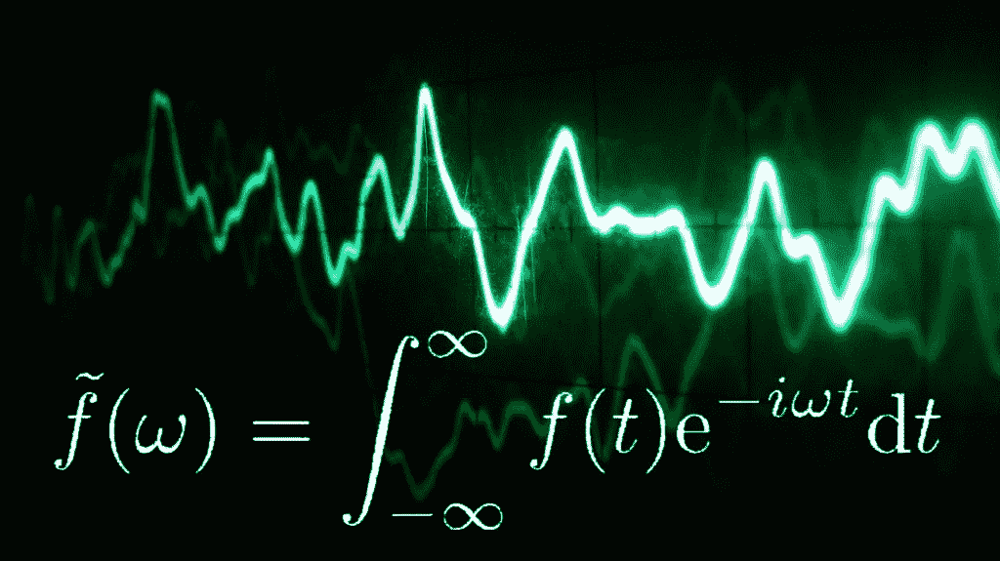

[source](https://www.google.com/url?sa=i&source=images&cd=&cad=rja&uact=8&ved=2ahUKEwjKlKeussHfAhXFQY8KHVKNDhgQjRx6BAgBEAU&url=https%3A%2F%2Faharchaou.com%2Ffrom-fourier-to-curvelets%2F&psig=AOvVaw0X2Rq0eLnjTnvh1YWAacGn&ust=1546047528148142)

# **简介**

傅立叶变换(FT)将信号分解成组成它的频率。

*这是什么意思？*

所以，我们来举个例子。让我们有一个信号 *S1。*

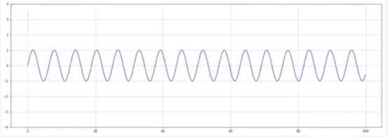

S1: x-axis is time and the y-axis is amplitude

如果我们想在某个特定的*时间测量这个信号的强度。*我们用它的 [*振幅*](https://physics.tutorvista.com/waves/amplitude-of-a-wave.html) 来衡量。

> 所以，信号 S1 的振幅是 1

如果我们对另一个信号进行同样的操作，选择相同的时间点，测量其幅度。让我们有另一个这样的信号 S2

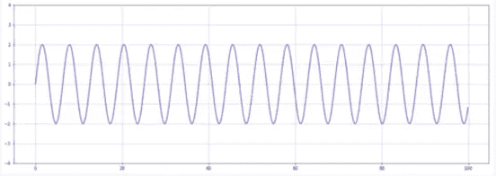

S2: x-axis is time and the y-axis is amplitude

> 同样，信号 S2 的幅度是 2

***现在，我们同时发出这两个信号(S1 和 S2)会发生什么？***

因此，当我们在同一时刻发射这两个信号时，我们会得到一个新信号，它是这两个信号幅度的*之和。*这是因为这两个信号被加在一起。

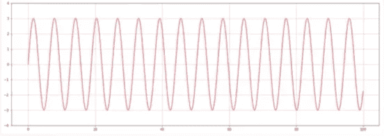

S3=S1+S2: x-axis is time and the y-axis is amplitude

> 所以，S3 的幅度= S1 的幅度+S2 的幅度= 1 + 2 = 3
> 所以，信号 S3 的幅度是 3

*现在，有趣的问题是:*

***如果只给我们信号 S3(也就是信号 S1 和 S2 之和)。我们能恢复 S1 和 S2 的原始信号吗？***

是的。这就是傅立叶变换的作用。它接收一个信号，并将其分解成组成该信号的频率。

*在我们的例子中，傅立叶变换会将信号 S3 分解成其组成频率，如信号 S1 和 S2*

***但是，我们怎么才能恢复原来的信号呢？傅立叶变换能为我们做什么？***

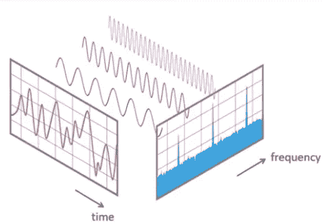

y-axis is the strength of the signal (amplitude)

假设上图中的三个信号是 S1、S2 和 S3，当我们将这三个信号合并在一起时，我们得到的是红色的信号，实际上是 S1+S2+S3。

傅立叶变换的作用是将我们从时域转移到频域。

**万一有人在疑惑，我们要从频域回到时域怎么办？**

我们可以通过使用*逆傅立叶变换(IFT)* 来实现。但我们不会在本文中讨论这个问题。

## 信号产生和相移

如果我们想描述一个信号，我们需要三样东西:

1.  **信号**的频率，它显示了在我们的周期内发生了多少次。
2.  **振幅**显示信号的高度或信号的强度。
3.  **相移**至于信号从哪里开始。

我们举的第一个例子非常简单，每个信号都有相同的*频率*和*相位差*，只有不同的*幅度*。

现在我们来看一个稍微复杂的例子，我们来看上面例子中的单个信号，因为为了更好地理解傅里叶变换，我们需要仔细观察单个信号。

下面是我们在上面看到的原始信号。

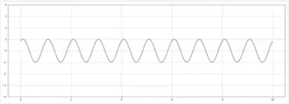

Signal 1

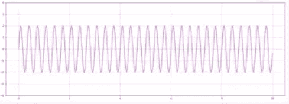

Signal 2

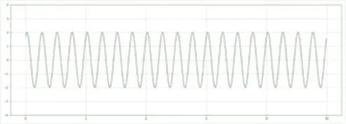

Signal 3

**频率:**如果我们仔细观察这三个信号，我们会注意到所有三个信号的*频率都是不同的。*

*如果在同一时间段内，信号 1 中有 n 个波，则信号 2 中有 2n 个波，反之亦然。*

**相位:**同样，当我们仔细观察信号实际上是从哪里开始的。我们会发现，当*信号 1 开始于(0，0)* 时，*信号 2 开始于(-0.5，0)* ，如果我们追踪波形以在 0 处与 y 轴相交。因此，在 0，我们已经有了信号的最大幅度。这就是我们所说的*相移*。

**振幅**:三个信号的振幅不同，信号 1 的振幅为 1，信号 2 和信号 3 的振幅分别为 2 和 3。

这一切都包含在一个优雅而超级简单的数学公式中。因此，在上述示例中，如果 x 轴表示为 x，y 轴表示为 y，我们可以将`y`生成为`t`的函数，如下所示:

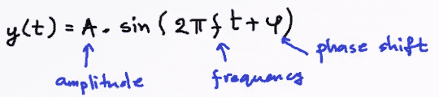

使用这个公式，我们可以产生我们想要的任何类型的信号，然后我们可以将它们合并在一起并进行处理。例如，如果我们合并信号 1、2 和 3。我们会得到这样的信号:

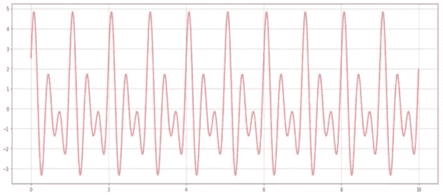

Signal 1 + Signal2 + Signal3

## **傅立叶变换背后的数学原理**

傅立叶变换背后的主要思想是:

> 时域中的任何**连续信号**都可以由一个**无限**正弦系列唯一且明确地表示。

**这意味着什么？**

这意味着，如果我们有一个信号，并且这个信号是由某个函数`x(t)`产生的，那么我们可以得出另一个函数`f(t)`，这样:

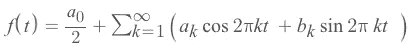

因此，信号有多强并不重要，我们可以找到一个类似于`f(t)`的函数，它是一系列正弦曲线的*之和，实际上可以完美地代表信号。*

现在的问题是，我们如何在上面的等式中找到系数，因为这些值将决定输出的形状，从而决定信号。

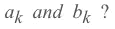

因此，为了获得这些系数，我们使用*傅立叶变换*，傅立叶变换的结果是一组系数。因此，我们使用`X(F)`来表示傅立叶系数，它是频率的函数，我们通过求解积分得到，如下所示:

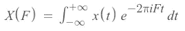

这个积分中棘手的部分实际上是表示复数的`i`。所以，我们大概记得`i² = -1`或者`i = √-1`。记住复数的形式是`a + *i*b` *可能会有所帮助。*所以，它有一个*实部*和*虚部*。

此外，当我们实际求解上述积分时，我们会得到这些复数，其中`a`和`b`对应于我们要寻找的系数。

然而，我们确实有三个问题需要处理:

1.  如何应对`*i*` *。*
2.  如何处理离散信号？

所以，我们从第二个开始。

要理解*离散傅里叶变换*，我们首先需要理解*如何对连续信号进行采样？*

根据[维基百科](https://en.wikipedia.org/wiki/Sampling_(signal_processing))介绍，在信号处理中，*采样*是将连续时间信号还原为离散时间信号。下面是一个信号形式如何随采样速率变化的示例:

*假设原始信号是在一秒钟内振幅为 2、频率为 5 的信号:*

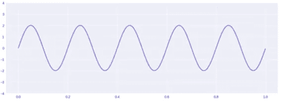

sampling rate = 1000

*现在，当我们降低采样率时，让我们看看信号的形状是如何变化的:*

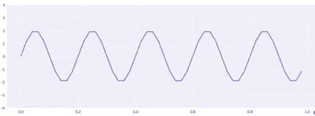

sampling rate = 50

*当我们进一步降低采样率时，我们得到:*

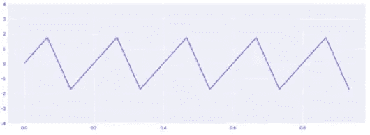

sampling rate = 15

**所以，底线是** : *采样速率越高，信号质量越好，我们也可以区分更多频率。*

现在，我们知道了如何对信号进行采样，接下来我们来看看称为*离散傅里叶变换的算法的修改。*

# 离散傅里叶变换

> 时域中任何长度为 N 的**采样信号**都可以由一系列**有限的**正弦曲线唯一且明确地表示。

所以，在我们的新定义中，我们不用再处理无穷大了。

*有什么区别？*

在标准傅立叶变换中，我们使用时间函数`x(t)`来产生连续信号。在离散情况下，我们没有函数，只有数据集，即通过对连续信号进行采样获得的一组点。因此，我将使用`{x}`来捐赠一个数据集，使其包含来自采样的读数，这样:

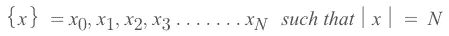

*离散傅立叶变换*将为我们做的是它将把`{x}`的数据集变换成另一个包含*傅立叶系数*的数据集`{X}`，使得:

如果我们看一下傅立叶变换的定义，`{X}`中的每个`X`都是一个复数，它包含频率的`a`和`b`分量。

***但是，两个数据集*** `***{x}***` ***和*** `***{X}***` ***怎么会有相同的长度呢？***

如果我们想一想，驱动`{x}`数据集长度的是采样率，因为在一段时间内，我读取的数据点数量正好是采样率，对吗？如果我们考虑另一个数据集`{X}`，我们说过频率是单位时间内出现的次数。因此，如果我以某一频率进行采样，我无法识别频率高于采样频率的信号，因为我们没有获得足够的数据点。

因此，如果我们以非常低的采样速率获得非常高频率的信号，我们根本无法识别这些信号。因此，*我们可以通过应用傅立叶变换识别的频率数量实际上也是由采样速率决定的。*

因此，现在我们有了数据集`{x}`，我们将得到`{X*k}*` ，这样它就是`{X}`中的一个元素，它们是我的傅立叶系数，这样:

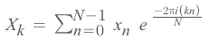

Fourier Transform

这本质上就是离散傅里叶变换。我们可以进行这种计算，它将产生一个形式为`a + *i*b`的复数，其中我们有两个傅立叶级数的系数。

现在，我们知道*如何对信号*进行采样，以及*如何应用离散傅立叶变换。*我们想做的最后一件事是，我们想通过使用所谓的*欧拉公式*来去掉复数`*i*`，因为它在`mllib`或`systemML`中不受支持，该公式表示:

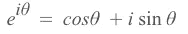

Eulers Formula

所以，如果我们把欧拉公式代入傅里叶变换方程，我们得到

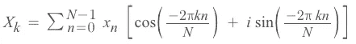

我们还知道`cos(-θ) = cos(θ)`和`sin(-θ) = -sin(θ)`，如果我们在上面的等式中使用它，等式可以简化为:

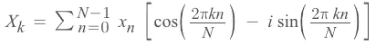

实际上，我们可以将上述等式分解为两部分，即:

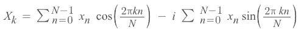

现在，如果我们将上面的等式与一个复数的等式`a + *i*b`相比较，那么我们得到相应的值为:

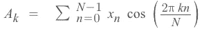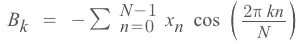

所以，现在我们可以把这些值放入`*f(t)*`的方程中，得到结果。

## 结论

在实践中，我们使用一种称为*快速傅立叶变换*的离散傅立叶变换的微小修改，因为离散傅立叶变换非常简单、基本且缓慢。如果我们真的想在生产环境中做些什么，这是不合适的。离散傅立叶变换的计算复杂度是二次时间`O(n²)`，用于比较的快速傅立叶变换是准线性时间`O(nlogn)`。*快速傅立叶变换*通过利用傅立叶变换中的不对称性来实现这一点。