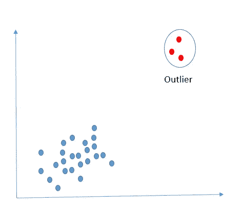
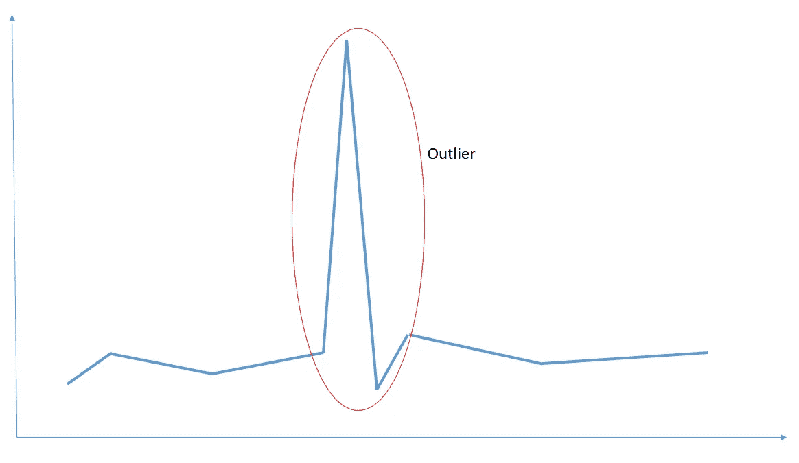
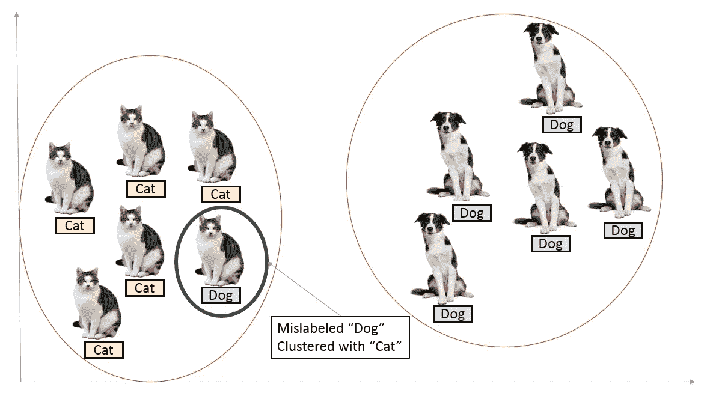
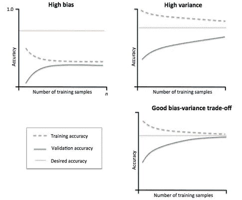
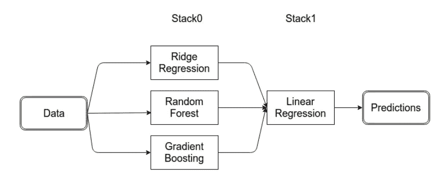
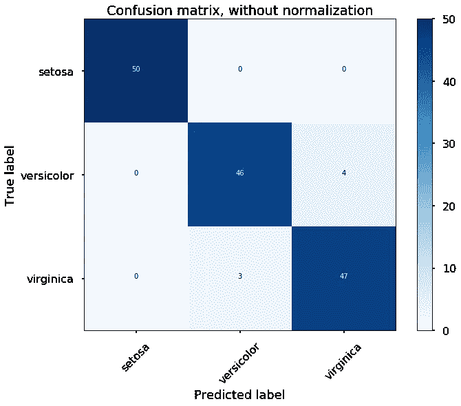
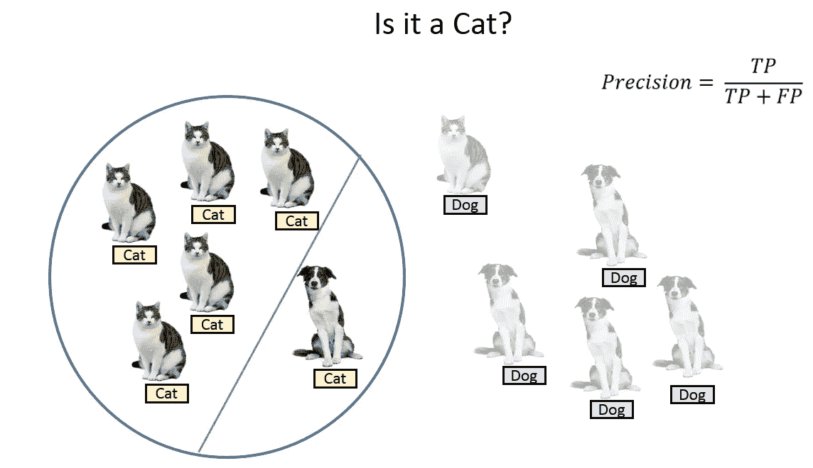
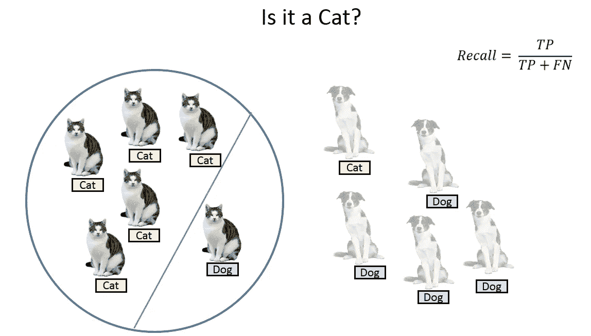
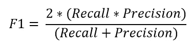

# 极端类别不平衡下的欺诈检测

> 原文：<https://towardsdatascience.com/fraud-detection-under-extreme-class-imbalance-c241854e60c?source=collection_archive---------3----------------------->

数据科学中的一个热门领域是欺诈分析。这可能包括信用卡/借记卡欺诈、反洗钱或网络安全。所有这些领域的一个共同点是阶级不平衡的程度。一般来说，交易总数中只有一小部分是真正的欺诈。以信用卡诈骗为例。在给定用户的 1000 次交易中，只有 1 次是真正的欺诈。这可能是因为客户的信用卡信息被盗，或者供应商的 PoS 设备受损。需要尽快抓住这个问题，以最大限度地减少对客户和供应商的经济损失。同时，我们需要注意假阳性。很自然，如果信用卡在没有发生实际欺诈的情况下被银行冻结，信用卡所有者会不高兴。在这篇博客中，我将介绍一些常用策略，用于揭露金融和网络不端行为，同时最大限度地减少假警报。

# 无监督学习模型

当交易记录没有被标记时，无监督学习模型是有用的。对于互联网流量数据来说尤其如此，因为没有明确的方法来判断特定的互联网交易本质上是否是恶意的。在这种情况下，异常检测是常见的。

## 异常检测

想象你在浏览互联网时有某种行为。你在浏览 YouTube 时传输了一定量的数据，通过脸书信使发送了一定量的数据。现在，让我们将它汇总到整个组织中。平均而言，端点将具有可预测的端口使用率。现在，假设其中一个端点碰巧使用某个端口(它通常从不使用)来访问服务器端口(该端口可能因发送恶意软件而被列入黑名单)。这可能是潜在的端口扫描，甚至是公司网络上的 torrent 使用。另一个例子可能是一个或多个端口的突然高使用率，这表明 DDoS 攻击。有很多无监督学习算法，从 K-Means 到高斯混合模型。

对于时间序列数据，可以查看数据点的标准偏差来寻找异常值。时间序列中的某些异常值可能显示不同的模式，可以使用傅立叶变换或隐马尔可夫模型来检测。

更多细节，请查看我关于基于[聚类的无监督学习](/clustering-based-unsupervised-learning-8d705298ae51)的博客。

# 监督学习模型

某些欺诈检测数据集带有标签。就拿信用卡诈骗来说吧。如果银行怀疑有欺诈行为，他们可以打电话给持卡人，检查卡是否真的被盗。该信息可以用作新模型构建的训练数据。正如我将在本节中介绍的那样，监督学习模型也有自己的一系列机遇和挑战。

## 标签错误的数据

在欺诈检测问题中，数据集已经严重失衡。想象一下，除此之外还有贴错标签的数据？可惜现实世界没有 Kaggle 干净。你会得到极其杂乱的数据。我个人的一般策略是使用 K-Means 来可视化数据，以检查标记是否真的有意义。

然而，这是非常主观的，将取决于用例。如果做得好，我们可以得到一个更可靠的数据集来训练我们的模型。不利的一面是，有目标泄露的可能。

## 模型复杂性

自然，对于大多数欺诈检测用例，模型往往更复杂。考虑到所需的粒度和特性工程水平，简单的线性回归可能没有帮助。也就是说，人们需要意识到过度拟合他们的数据集。学习曲线通常有助于检查模型是否具有高偏差或高方差。

如果模型是高度偏向的，那么就有可能研究更复杂的东西，比如决策树、随机森林甚至神经网络。通常，在金融机构中，通常使用系综模型。某些工程特征在单独的模型上工作得最好(通常是由于方差的巨大差异)。或者甚至将无监督学习模型与有监督模型结合使用(特别是当错误标签的可能性很大时)。

关于学习曲线、集合模型和其他基础知识的复习，请查看我的[数据科学面试指南](/data-science-interview-guide-4ee9f5dc778)。

## 惩罚模型

你可以使用相同的算法，但给他们一个不同的角度来看问题。惩罚分类对模型施加了额外的成本，用于在训练期间对少数类进行分类错误。这些惩罚会使模型偏向于更多地关注少数群体。通常，类别惩罚或权重的处理专用于学习算法。有惩罚版本的算法，如惩罚 SVM 和惩罚 LDA。

# 性能指标

评估模型性能最常用的方法是分类得分。然而，当只有 2%的数据集属于一个类别(欺诈)，而 98%属于其他类别(非欺诈)时，错误分类分数实际上没有意义。你可以达到 98%的准确率，但仍然没有发现任何欺诈行为。此外，请记住，在处理欺诈时，我们关心误报。在这一部分，我将讨论一些可供选择的性能指标。

## 混淆矩阵

在分析误分类时，混淆矩阵是一种常见的偏好。矩阵的每一行代表预测类中的实例，而每一列代表实际类中的实例

对角线代表已被正确分类的类别。这很有帮助，因为我们不仅知道哪些类被错误分类，还知道它们被错误分类为什么。

## 精确度、召回率和 F1 分数

为了更好地了解错误分类，我们经常使用以下指标来更好地了解真阳性(TP)、真阴性(TN)、假阳性(FP)和假阴性(FN)。

**精度**是正确预测的正观测值与总预测正观测值之比。

**回忆**是正确预测的正面观察值与实际类中所有观察值的比率。

**F1-Score** 是准确率和召回率的加权平均值。

F1 分数越高，模型越好。对于所有三个指标，0 是最差的，而 1 是最好的。

## ROC 曲线

接收器操作特性或 ROC 曲线是欺诈分析(以及数字信号处理)领域中非常流行的指标。

45 度线是随机线，其中曲线下面积或 AUC 是 0.5。曲线离这条线越远，AUC 越高，模型越好。一个模型能得到的最高 AUC 是 1，其中曲线形成一个直角三角形。ROC 曲线也可以帮助调试模型。例如，如果曲线的左下角更接近随机线，则暗示模型在 Y=0 处分类错误。然而，如果右上角是随机的，则意味着误差发生在 Y=1 处。此外，如果曲线上有尖峰(而不是平滑的)，这意味着模型不稳定。对付诈骗模特，ROC 是你最好的朋友。更多信息，请阅读[接收器工作特性曲线解密(Python 语言)](/receiver-operating-characteristic-curves-demystified-in-python-bd531a4364d0)。

# 重新取样

我的最后一个建议是重新采样。如果有可能获得更多的数据来使这些类更加平衡，这将是最简单和最好的方法。如果没有，创建合成数据也是一种可能。本节将介绍这些方法。

## 过采样

对模型中的欺诈记录进行过采样有助于改进分类。但是，要意识到它需要代表真实世界(相对于非欺诈，欺诈实际上很少发生)。SMOTE 和 ADASYN 是这方面的常用算法。自动编码器也可用于创建合成欺诈数据。

## 欠采样

欠采样非欺诈是另一种被使用的技术。基于聚类方法(例如 K-Means)生成质心是一种常见的策略。

# 结束语

理想情况下，我在这篇博客中提到的内容将帮助你想出更好的方法来应对欺诈模型(无论是工作、学校还是 Kaggle 竞赛)。我提到的许多事情可以在我的其他博客中找到更多细节:

 [## 数据科学面试指南

### 数据科学是一个相当大且多样化的领域。因此，做一个万事通真的很难…

towardsdatascience.com](/data-science-interview-guide-4ee9f5dc778)  [## 基于聚类的无监督学习

### 无监督机器学习是一种机器学习任务，它从神经网络中推断出一个描述隐藏结构的函数

towardsdatascience.com](/clustering-based-unsupervised-learning-8d705298ae51)  [## Scikit-Learn 上决策树和集成的研究

### 现在科技界最热门的话题之一是机器学习领域。应用范围从…

medium.com](https://medium.com/@sadatnazrul/study-of-decision-trees-and-ensembles-on-scikit-learn-e713a8e532b8)