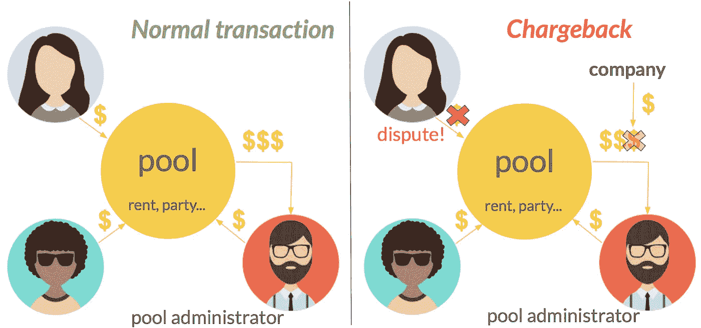
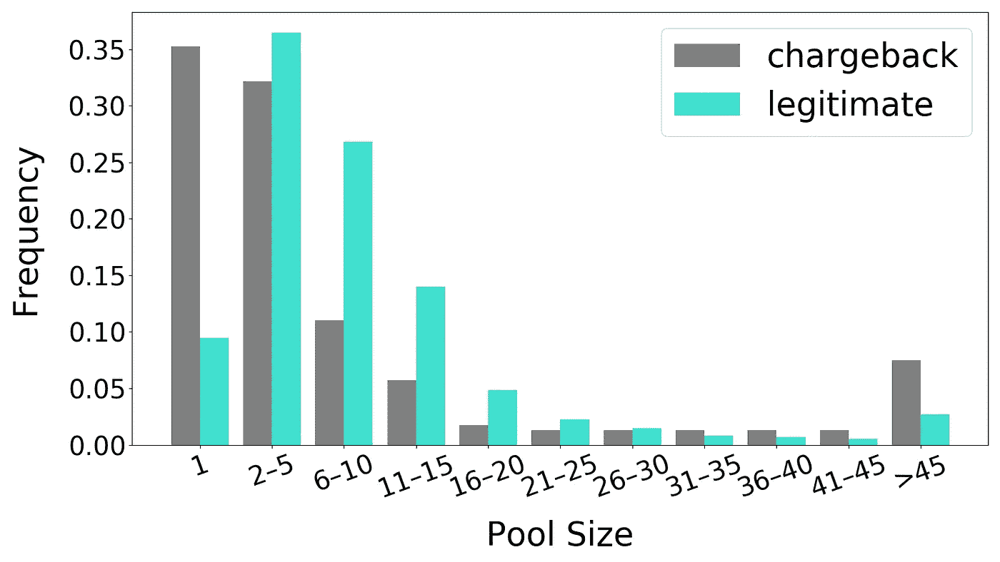
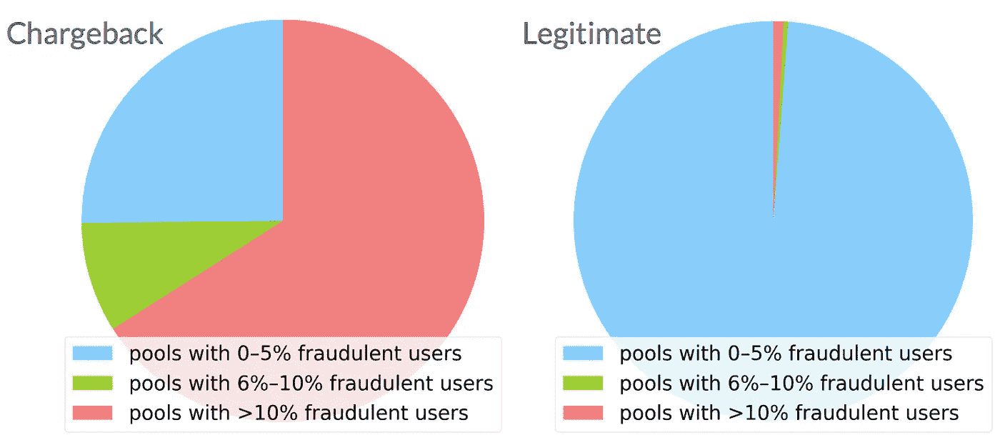
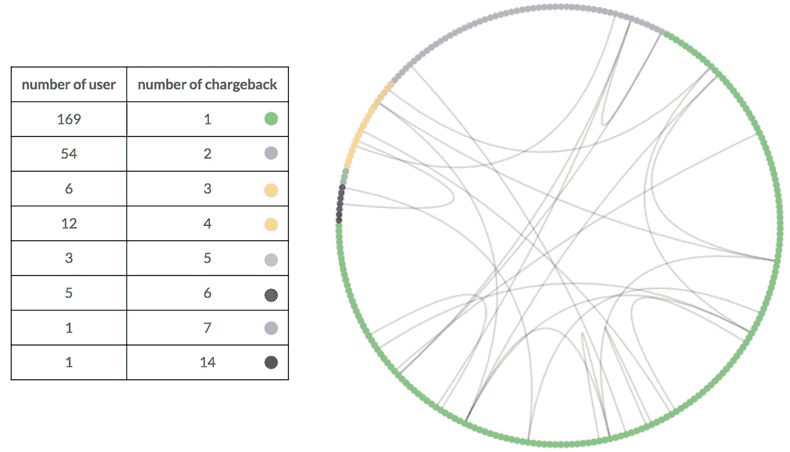
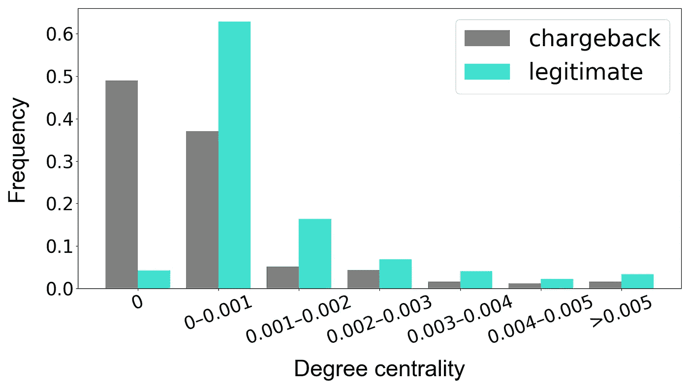
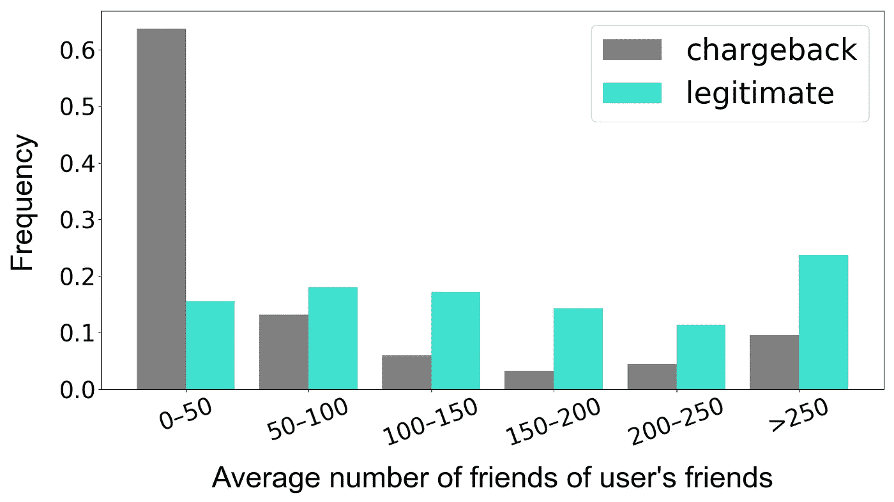
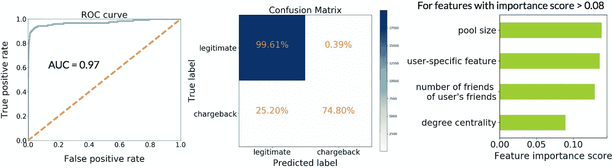

# 池保护器:利用网络分析防止支付欺诈

> 原文：<https://towardsdatascience.com/frauddetection-f801b781410b?source=collection_archive---------14----------------------->

一个典型的组织会因欺诈损失大约[5%](http://www.acfe.com/press-release.aspx?id=4294973129)的收入。对于规模较小的企业来说，情况可能更为严峻，因为它们通常受到的保护更少，承受损失的能力也更弱。通过[Insight Data Science Fellowship](http://insightdatascience.com/)，我为一家支付服务初创公司提供咨询，该公司因欺诈遭受了重大损失。这家公司，我们称之为公司 A，为用户提供了一个平台来集中他们的钱进行一次购买。例如，假设爱丽丝和鲍勃要去克里斯家参加聚会，他们都想分摊费用。在这种情况下，Chris 创建了一个池，他、Bob 和 Alice 都参与其中。克里斯然后取出钱来支付聚会的费用。然而，有可能稍后爱丽丝决定她不想为聚会付钱。她可以对自己向泳池支付的费用提出异议，而不是要求克里斯退款。如果她拿到了钱，而克里斯已经提取了资金池的余额，A 公司就只剩下支票了！这样的交易被称为[退款](https://chargebacks911.com/chargebacks/)。

* User avatars in this picture are created by Freepik ([https://www.freepik.com/free-photos-vectors/people](https://www.freepik.com/free-photos-vectors/people))

按存储容量使用计费旨在保护消费者。例如，在上面的案例中，如果 Chris 多收了她的钱并且拒绝退款，Alice 可以对她的付款提出异议。尽管如此，一些用户滥用退款流程，故意从公司 A 偷窃。由于不可能了解公司 A 每笔退款交易背后的真实动机，我从公司的角度将所有退款视为欺诈交易，因为它们都会给公司造成直接损失，并使用这种启发式方法在数据中找到可能指出真正欺诈的模式。

# 概观

在 2017 年的前三个季度，我所工作的公司因退款而损失了大约一半的交易费收益。记录显示，不到 1%的用户和不到 1%的交易会导致这种严重的损失。为了防止潜在的退款，该公司已经开始努力提取特定于用户和交易的特征，以建立一个欺诈检测模型。鉴于欺诈通常不是一个孤立的事件，我认为利用用户网络环境中的用户信息来增强模型是有价值的。具体来说，我发现用户的池社区和社交网络影响他们欺诈行为的机会，这可以用来提高公司 A 预测欺诈的能力。

# 泳池社区

在公司 A 的平台上进行的每一笔交易都将一群用户联系在一起。经过多年的支付，一个丰富的、潜在的强大的网络结构开始形成。关于这些泳池社区的第一个问题是:泳池的大小重要吗？下面是涉及按存储容量使用计费的池与完全合法的池的池大小的频率分布。总的来说，合法交易更有可能发生在中等规模的池中，有趣的是，有退款的大部分池的规模为 1。一号池一开始就是奇怪的实体(人们试图与自己分担成本吗？)这强烈表明用户只是利用它们来实施欺诈。下面的数据表明，阻止甚至标记从 1 号池中的提款将会减少三分之一以上的退款频率，同时减少不到 10%的合法交易。假设交易金额和费用不会随着池的大小而变化太大，这些数字表明，与交易费用损失相比，像阻止大小为 1 的池这样的简单政策转变将节省大约两倍的费用，从而对公司的底线产生重大影响。

对于更大的池，分析池的组成可以让我们了解人们如何相互影响。将罪责归咎于个人可能取决于他们所交往的人，而不是他们犯下的任何欺诈行为，这种行为被称为“牵连犯罪”。下图显示了每个池中涉及按存储容量使用计费的欺诈用户与完全合法用户的百分比分布。按存储容量使用计费池组中有很大一部分池包含超过 10%的欺诈用户。这强烈表明，处于欺诈环境中会增加人们申请退款的倾向。

# 社交网络

除了池社区，用户的社交网络也可能与他们提交退款的机会有关。我们鼓励该平台的用户使用他们的脸书帐户进行注册。下面我展示了脸书的欺诈用户友谊网络，其中圆圈上的每个点代表一个用户，每个用户都标有一种颜色，表示他或她已提交的退款数量。连接线代表用户在平台内的脸书连接。与上一节显示欺诈用户倾向于群集相反，当涉及到实际的社会联系时，欺诈用户似乎是独立的。此外，有许多欺诈用户在记录上没有一个脸书朋友，可能是因为他们选择不将他们的脸书账户链接到该公司的平台。

Facebook friendship network of fraudulent users

我们可以使用每个用户的“度中心性”来量化用户在网络中的重要性，即用户的朋友数量除以网络中的用户总数。下面的分布显示，与合法用户相比，在按存储容量使用计费用户组中没有朋友的用户的频率要高得多。合法用户往往有更多的朋友，如果我们进一步查看二级连接，并测量用户朋友的平均朋友数量(分布如下所示)，情况也是如此。换句话说，与欺诈用户的朋友相比，合法用户的朋友也有更多的朋友。

# 预测退款交易

上面讨论的网络特性本身显然是强大的。为了利用他们的集体力量，我将他们与公司 A 已经拥有的基于用户和基于交易的功能结合到一个单一的机器学习模型中。选择了一个[随机森林](http://dataaspirant.com/2017/05/22/random-forest-algorithm-machine-learing/)模型来将每个交易分类为欺诈或合法。使用[网格搜索](http://scikit-learn.org/stable/modules/grid_search.html)来调整模型参数，这产生了具有 1300 棵树和最大深度 10 的模型。[受试者工作特征(ROC)](https://en.wikipedia.org/wiki/Receiver_operating_characteristic) 曲线(左下)显示该模型具有很高的预测性。“完美”模型的曲线下面积(AUC)为 1.0，表明它对每个样本进行了完美分类，而“抛硬币”模型的 AUC 为 0.5。我训练的最终模型的 AUC 为 0.97。

由于欺诈的成本(每月约 4800 美元)比调查合法交易的成本(每月约 300 美元)高得多，A 公司主要对实现高召回率的模型感兴趣。混淆矩阵(中上)显示最终模型的召回率为 74.8%。与 61.0%的无网络功能的原有型号召回相比，这相当于在公司当前规模下，每年大约增加价值 8，600 美元的欺诈防范。虽然模型的精确度从 74.3%下降到 53.8%，但欺诈防范节省的成本远远超过了增加的调查成本。突出在此项目中构建的网络要素的重要性是它们的重要性-这些要素由模型中 4 个最重要的要素中的 3 个组成(上图最右侧仅显示了重要性> 0.08 的要素)。我工作过的公司已经在努力将这种模式纳入他们的平台，这将有助于调查人员在案件结束前标记案件，转化为实际的节约。

# **未来工作**

在模型参数的网格搜索中，我当前的模型在优化过程中使用 AUC 作为度量。虽然这种选择可以产生具有高总体预测能力的模型，但我们可以使用 [F_beta](https://en.wikipedia.org/wiki/F1_score) 分数来更好地优化模型，以降低退款造成的总损失，同时考虑调查成本。F_beta 分数是精确度和召回率的加权调和平均值。一方面，召回率高的车型可以减少退换货带来的损失；另一方面，模型的精确性也很重要，因为每一项交易的调查都伴随着成本。因此，为了平衡损失和成本，需要以 F_beta 作为优化度量来网格搜索更好的模型。F_beta 分数中的权重 beta 可以从退款的平均损失和调查的平均成本中得出。我与该公司的未来工作将是利用损失和成本的知识来优化模型，以便我们可以降低退款造成的总损失，同时最大限度地减少合法交易的标志。

# 关于惠宗 **(** [)领英](https://www.linkedin.com/in/zonghuiwei/) **)**

我目前是纽约市的 Insight 数据科学研究员，也是西北大学应用物理学的博士生。我的研究生研究主要集中在用于基因治疗的聚合基因递送系统的计算研究。在使用深度学习技术开发聚合物凝胶化的预测模型时，我对数据科学产生了兴趣。在这个项目中，我看到了数据驱动的方法如何解决有趣和相关的问题，我期待着继续沿着这个方向前进！