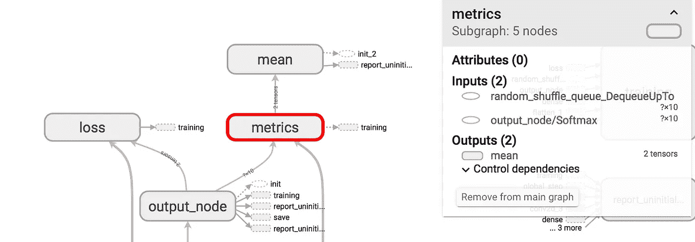

# 冻结 Keras 模型

> 原文：<https://towardsdatascience.com/freezing-a-keras-model-c2e26cb84a38?source=collection_archive---------2----------------------->

## 如何为服务和其他应用程序冻结模型

“landscape photography of snowy mountain and body of water” by [Joel & Jasmin Førestbird](https://unsplash.com/@theforestbirds?utm_source=medium&utm_medium=referral) on [Unsplash](https://unsplash.com?utm_source=medium&utm_medium=referral)

# **简介**

Keras 已经成为工业界和学术界开发和测试神经网络的主要 API 之一。由于其各种后端可能性，它结合了用户友好的语法和灵活性，这意味着你可以用 TensorFlow，Theano 或 CNTK 编写并在 Keras 中调用它。

一旦你用 Keras 设计了一个网络，你可能想在另一个 API 中，在网络上，或者在其他媒介上服务它。做上述许多事情的最简单的方法之一是使用预先构建的 TensorFlow 库(例如用于 C++环境中的模型推理的 [TensorFlow C++ API](https://www.tensorflow.org/api_guides/cc/guide) )。为了做到这一点，由于这些 API 的后端工作方式，您很可能不得不“冻结”您训练过的 Keras 模型。不幸的是，为了轻松地做到这一点，您必须在 Keras 的 TensorFlow 实现中重新训练您的模型。然而，幸运的是，如果你知道你的目标是什么，这个过程非常简单，这要归功于 Keras 集成到 TensorFlow 的方式，以及 TensorFlow 为此任务提供的各种其他材料。

当我最初研究如何在 C++环境中为模型提供服务时，我从类似的帖子中找到了几个可能的答案，比如关于[堆栈溢出](https://stackoverflow.com/questions/36720498/convert-keras-model-to-c)的帖子，以及关于[介质](https://medium.com/@hamedmp/exporting-trained-tensorflow-models-to-c-the-right-way-cf24b609d183)的帖子。类似地，一些人已经制作了各种很棒的开源包来做到这一点，比如 [keras2cpp](https://github.com/pplonski/keras2cpp) 。然而，我发现这些文章缺乏一些关键的细节，并且经常使用复杂的技术，这些技术在写作时是必要的，但由于 TensorFlow 的更新，这些技术已经大大简化了。

我希望这篇文章提供了一个简单的、最新的演练，展示了如何为任何一般需求冻结 Keras 模型，而不仅仅是为了在 C++环境中服务。虽然本文中描述的方法是专门为转换 Keras API 中编写的模型(本机或 TensorFlow 实现)而编写的，但它也可以用于任何用本机 TensorFlow 编写的模型。

## 为什么我需要转换我的模型？

如果您的模型经过训练并保存在 Keras API 中，那么您可能已经保存了模型的 hdf5 文件，其中网络架构和权重一起保存在一个文件中。这个文件可以被调用并加载回 Keras API 进行推理。然而，遗憾的是，TensorFlow APIs 无法识别这种文件类型，而且存储、加载和执行推理也不必要太大。

同样，如果你在 TensorFlow Python API 中编写一个模型，那么训练过程将使用 Google 的 [ProtoBuf 库](https://www.tensorflow.org/extend/tool_developers/)保存一个 TensorFlow [图](https://www.tensorflow.org/guide/graphs)，以及一系列检查点文件。该图存储了关于带有`Variable` ops 的网络架构的信息，而检查点文件包含了训练不同阶段的权重值(取决于训练期间您的会话检查点的频率)。这些通常可以在 TensorFlow Python API 会话中加载用于推断，在此期间，来自检查点文件的权重被插入到图中的`Variable` ops 中。然而，当仅仅执行推理时，这是低效的。另一方面，一个保存的 Keras `.h5`文件仅仅是图形和最终状态检查点文件的组合，同时仍然保持超参数存储为`Variable` ops。(注:以上不需要详细了解，我只是给想要更详细解释的人补充一下。)

冻结模型意味着生成一个包含图和检查点变量信息的单一文件，但是将这些超参数作为常量保存在图结构中。这消除了保存在检查点文件中的额外信息，例如每个点的梯度，这些信息包括在内，以便可以重新加载模型并从您停止的地方继续训练。因为这在为纯粹用于推理的模型服务时是不需要的，所以它们在冻结时被丢弃。冻结模型是一个谷歌`.pb`文件类型的文件。

## **要求**

冻结推理模型的要求很简单，但是，根据您的应用程序，您可能需要安装各种其他包来实际执行推理:

*   将 Keras 与 TensorFlow 后端一起使用
*   尽管安装了 TensorFlow 应该可以自动运行，但您需要确保 [TensorBoard](https://www.tensorflow.org/guide/summaries_and_tensorboard) 在您的计算机上运行
*   从 TensorFlow 存储库中，将 [freeze_graph.py](https://github.com/tensorflow/tensorflow/blob/master/tensorflow/python/tools/freeze_graph.py) python 脚本复制到您的工作目录中。或者，您可以使用定制设计的`freeze_graph`函数，我们将在后面看到。

# 转换模型

为了生成包含必要信息的`.pb`文件，TensorFlow 编写了`freeze_graph.py`文件，该文件在被调用时将合并 TensorFlow 图形和检查点文件。使用这个 Python 脚本通常是明智的，因为它是由 TensorFlow 团队编写的，他们确保它可以与他们内部的文件格式一起工作。但是，为了使用它，您必须首先拥有正确格式的图形和检查点文件。Keras API 不会自动生成这个文件，所以您需要重新训练模型来生成它们。

有两种相对简单的方法来获取以正确格式保存的训练模型以进行冻结。如果您直接使用 Keras API，那么您将需要切换到在 TensorFlow 环境中实现的 Keras API。

**注意:**这应该只需要在导入阶段进行更改，例如，您将拥有`from tensorflow.keras.layers import Convolution2D`而不是`from keras.layers import Convolution2D`。

第一种方法调用模型，然后将其转换为 TensorFlow [估计器](https://www.tensorflow.org/guide/estimators)，后者将处理训练。第二个要求理解 TensorFlow [会话](https://www.tensorflow.org/guide/graphs)是如何工作的，因为这种方法训练网络就像你用本地 TensorFlow 编写的一样。实施这些训练方法后，您将能够运行`freeze_graph`以获得正确的输出。

让我们通过一个例子来演示这个过程。在这里，我们将把一个简单的 Keras 模型转换成一个估计量，用于对 [MNIST](http://yann.lecun.com/exdb/mnist/) 数据集进行数字分类。

首先，我们在 TensorFlow 中实现的 Keras API 中构建模型，确保命名您的输入和输出层，因为我们稍后将需要这些名称:

Defining the model, note we do not define an input layer here since the type of input layer depends on which method you choose for training

## 选项 1:转换为估计值

一般来说，这种方法可能是两种方法中最简单的，但是，由于处理[定制估计器](https://www.tensorflow.org/guide/custom_estimators)的性质，它可以很快变得更复杂，这取决于您想要如何训练模型。如果您只熟悉原生 Keras API 中的训练模型，那么这是最相似的训练模型的方式。TensorFlow 1.4 引入了将 Keras 模型转换为 TensorFlow 估算器的功能，本[教程](https://cloud.google.com/blog/products/gcp/new-in-tensorflow-14-converting-a-keras-model-to-a-tensorflow-estimator)对此进行了描述。

要将上述模型转换成估算器，首先使用 TensorFlow 中实现的普通 Keras API 编译模型，然后使用`model_to_estimator()`函数:

Converting the model into an Estimator, here the checkpoint files and graph will be saved in the model directory

现在`estimator_model`表现得像一个张量流估计器，我们可以相应地训练模型。有关如何培训评估员的指南，请参见[文档](https://www.tensorflow.org/api_docs/python/tf/estimator/Estimator)。

对于训练，定义一个输入函数并相应地训练模型:

模型现在已经训练好了，并且`graph.pbtxt`和检查点`.ckpt`文件将保存在`./Keras_MNIST`模型目录中。

## 选项 2:像原生张量流模型一样训练

另一种方法是通过启动张量流会话并在会话中训练来训练模型。这需要对会话如何工作有更详细的了解，这超出了本文的范围，我建议读者参考这个 [MNIST 教程](https://www.tensorflow.org/tutorials/)作为这种培训的例子。然而，与示例不同的是，您不需要在 native TensorFlow 中*编写*模型，相反，我们可以调用上面的模型，只需更改输入层:

剩下的就可以从教程中遵循了。

# 冻结模型

现在模型已经训练好了，图形和检查点文件也制作好了，我们可以使用 TensorFlow 的`freeze_graph.py`将它们合并在一起。

**注意:**确保`freeze_graph.py`与您想要冻结的检查点和图形文件在同一个目录中。

或者，我发现由[摩根](https://medium.com/u/17b66605e1fa?source=post_page-----c2e26cb84a38--------------------------------)开发的[简化版](https://blog.metaflow.fr/tensorflow-how-to-freeze-a-model-and-serve-it-with-a-python-api-d4f3596b3adc)更不容易标记错误。

Simplified freeze_graph implementation by [Morgan](https://medium.com/u/17b66605e1fa?source=post_page-----c2e26cb84a38--------------------------------)

此函数使用图形重新启动临时会话，以恢复最近的检查点。使用这种实现的另一个优点是，您不必确保指定了正确的检查点文件，或者处理语法上更加密集的`freeze_graph.py`输入。

我们需要知道输出节点的名称，作为函数的引用点。这和我们用不用`freeze_graph`的简化版是一样的。你给最后一层起的名字是不够的，打开 TensorBoard 会给出一个可视化的图形。

TensorBoard output showing input to ‘metrics’ node

在这个例子中，我们想要的是进入“度量”节点的张量，叫做`output_node/Softmax`。

这将在模型目录中生成一个冻结的图形。

# 关键要点

1.  Keras 模型可以在 TensorFlow 环境中训练，或者更方便的是，变成一个语法变化很小的估计器。
2.  要冻结一个模型，你首先需要生成检查点和图形文件，以便调用`freeze_graph.py`或上面的简化版本。
3.  TensorFlow 上有许多标记为 Keras GitHubs 的问题，以及关于冻结模型的堆栈溢出，其中许多问题可以通过了解需要生成的文件以及如何指定输出节点来解决。
4.  输出节点可以很容易地从 TensorBoard 可视化中找到，但它并不总是你指定的最后一层的名称。