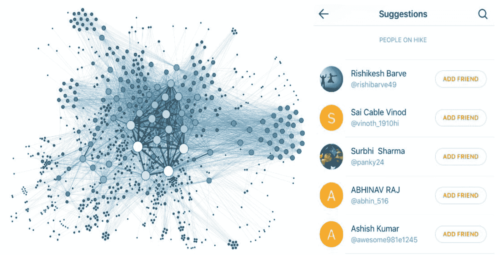
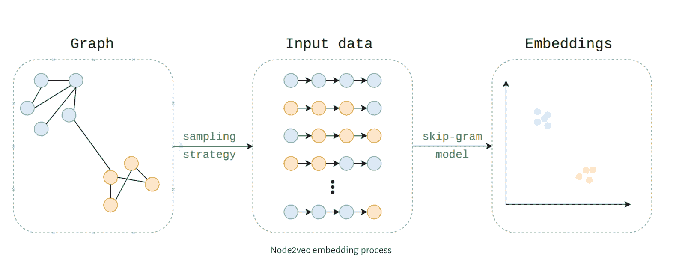
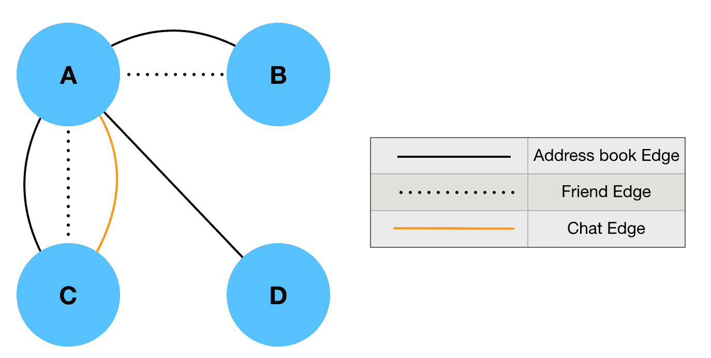
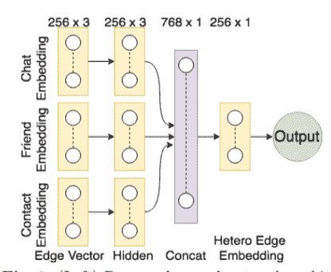
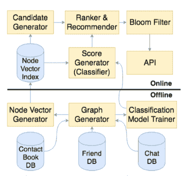

# 使用异构网络嵌入的朋友推荐

> 原文：<https://towardsdatascience.com/friend-recommendation-using-heterogeneous-network-embeddings-54f95babdb13?source=collection_archive---------22----------------------->

想象一下史努比没有伍德斯托克或者卡尔文没有霍布斯，老友记没有瑞秋，蝙蝠侠没有罗宾或者无忌没有布鲁。社交平台的繁荣依赖于成员找到相关朋友进行互动的能力。网络效应是驱动应用程序增长或花费时间和每日活跃用户的因素。这对于 Hike 来说更加重要，因为 Hike 是一个亲密朋友的网络。因此，我们需要确保找到朋友、邀请他们并将其添加到网络中很容易。

从一个人第一次开始徒步旅行，提供朋友建议作为登车体验的一部分是至关重要的。我们的数据显示，在加入后的最初几分钟内找到朋友的新用户，其留存率明显高于没有找到朋友的用户。因此，好友推荐算法的功效对于平台的增长和参与度至关重要。

“Society friendship and love, Divinely bestow’d upon man” — William Cowper, The Solitude of Alexander Selkirk

在像 Hike 这样活跃的现实社会网络上设计一个朋友推荐系统意味着:

1.  **好友建议需要相关** —由于屏幕空间有限，一次只能显示几个好友建议，这意味着我们需要推荐相关的人
2.  **好友推荐需要顺利进行**这样新用户可以毫不费力地加入网络
3.  **它需要以未来为中心**。网络在不断发展，每天都有新用户加入，添加朋友，老用户之间建立友谊等等。基于当前网络，我们希望能够预测网络中即将发生的变化，并相应地提出建议

在 Hike，我们在自然语言处理(NLP)、计算机视觉、相关性和推荐、网络分析等领域部署了最先进的机器学习算法。([ML @ Hike 概述](https://blog.hike.in/data-science-hike-nlp-vision-network-analysis-more-152bae47ad09))。我们的朋友建议模型是使用深度学习和网络分析的高级研究建立的。我们对此进行了深入研究，并开发了一个框架，用于在具有多种边缘类型的异构网络上进行图形表示学习，以进行朋友推荐。这对我们来说非常好，除了商业收益，当这项研究被提名发表在 2019 年 4 月的欧洲信息检索会议(ECIR)上时，我们非常兴奋。

朋友推荐问题符合社交网络中的经典链接预测问题。我们将平台上的用户表示为位于一个图上，图中的边是用户之间的连接。给定一个社交网络在时间 *t* 的快照，我们能否准确预测在从时间 *t* 到给定的未来时间 *t`* 的间隔期间将被添加到网络的边？简而言之，网络的当前状态可以用来预测未来的链接吗？传统的链路预测方法是基于分析网络中节点“接近度”的测量。具体而言，如果两个节点的邻域有很大的重叠，则这种方法将指示它们很可能共享一条链路。*共同邻居、Jaccard 系数、Adamic-Adar 度量、*是已经被设计用于评估节点邻域之间的重叠的不同度量。还有使用节点特征来训练分类模型的监督机器学习技术。这些功能并不总是容易获得，因此需要大量的功能工程。

两个节点的节点嵌入可以被组合以形成连接它们的边的表示。在链接预测的情况下，这种边缘嵌入可以被给予分类器，以预测边缘是否可能存在。

最近，在开发用于学习图形表示的方法方面已经有了很多工作。这些表示捕捉节点与其邻居的关系。我们可以使用这些图形表示来跳过我们的模型的手动特征工程，并且可以使用节点向量来训练模型，以解决诸如链接预测、节点分类和社区检测之类的问题。这种表现形式已被证明比手工设计的特征更有效。其思想是学习一种映射，该映射将节点投影到低维向量空间中，从而保持相邻关系。嵌入生成通常遵循两个步骤:

1.  网络中每个节点的样本邻域，例如通过生成从节点发出的随机行走。这些示例捕获了节点之间的上下文关系。
2.  一种 skip-gram 类型的模型，它将随机行走作为输入，并将节点投影到低维空间。

一个类比是文本文档中的单词嵌入(word 2 vec)——随机游走是句子的网络对应物。两种流行的节点嵌入方法如下:

Deepwalk 方法学习同构网络中的节点嵌入。首先，我们从每个节点开始，生成固定数量的选定长度的无偏且均匀的随机行走。Skip-gram 算法用于从随机行走中获得节点嵌入，随机行走期望捕获网络节点的上下文属性——出现在相同上下文中的节点具有相似的向量嵌入。

学习同构节点嵌入的另一个重要方法是 node2vec，其中随机行走偏向于导航节点的邻域，使得它们可以从广度优先搜索(BFS)过渡到深度优先搜索(DFS)遍历。BFS 和 DFS 之间的插值由一个参数指定，为了获得良好的性能，这需要进行大量调整。

朋友推荐可以被定义为二元分类问题，该问题从一对用户获取特征，并且如果是朋友对，则学习将它们映射到 1，否则映射到 0。我们可以利用网络嵌入来获取用户特征。如果 *u，v* 是两个用户，并且 *vec_u，vec_v* 分别是对应的节点嵌入，我们可以以各种方式组合这些嵌入来创建分类模型的输入，例如

*   串联，*vec =**vec _ u*⊕*vec _ v*
*   平均值，*vec =*(*vec _ u*+*vec _ v)/n*
*   哈达玛乘积，*vec =**vec _ u***vec _ v*

注意，这些都是向量运算。向量 *vec* 可以认为是边< *u，v* >的嵌入。然后将 *vec* 输入机器学习模型，如逻辑回归、神经网络等。训练分类器需要模型“学习”的已知朋友和非朋友对的大量标记数据

*D = { < u，v >，label}，其中 label ∈ {0，1}*

为了评估，保留了一个测试集。这种模型可以通过各种度量来评估，例如

ROC 曲线下面积(AUC)

-k 处的精度(P @ k)

为了在 Hike 等真实世界的活跃社交网络上测试朋友推荐模型，人们还需要评估该模型在应用程序上的功效，这可以通过比较前 k 名推荐的点击率(CTR)来完成。

Hike 的社交图谱相当独特。网络是高度异构的，具有多种节点类型，例如用户、帖子、主题等。以及多个边缘类型，例如友谊、喜欢、评论、关注等。对于朋友推荐系统，我们假设一个徒步旅行的用户网络是同类型的，但是这个网络的边是异构的，在节点之间有多种类型的边。为了便于说明和扩展，我们使用了具有三种边缘类型的异构网络:

“联系人”—如果用户在彼此的联系人中

“朋友”——如果用户是徒步旅行的朋友

“聊天”——如果用户在一段时间内至少聊过一次

这允许在两个节点之间存在多条边，例如，如果用户出现在彼此的联系人列表中，是朋友并且在过去的一个月中交换了聊天消息，则在他们之间将存在三条边。Hike 网络比以前使用网络嵌入方法对链接预测进行的研究要大得多。边缘类型的异质性对于我们的网络也是非常独特的，我们的网络在数学上可以描述为具有多种边缘类型的多图。我们数据中的另一个混淆因素是，在我们的验证数据中，46%的节点对没有共同的朋友——有许多孤立和松散连接的节点。这些挑战增加了朋友推荐问题的难度。

DeepWalk 和 Node2vec 的适用性仅限于具有一种类型的节点和节点间单一类型的边的同构网络。为同构网络设计的现有网络嵌入方法可能不直接适用于异构网络。最近， *metapath2vec* 提出了一种异构网络的嵌入技术，它定义了元路径(一系列节点类型)来限制随机游走。然而，如何定义这样的元路径并不明显，因为我们通常缺乏对路径和元路径以及元路径长度的直觉。此外，对于具有不同边类型和两个节点之间的多条边的异构网络(异构多图)，没有直观的方式来定义边类型的元路径。在 *metapath2vec* 中，提出了一种在具有图像和文本节点的多模态网络中学习节点嵌入的深度架构。然而，它不能推广到一个多图，其中一对节点之间存在不同类型的边。对于异构网络，Deepwalk 有一些简单的扩展。

无偏随机行走是通过分配穿过两个节点之间的任何边的相等概率来生成的。这增加了随机行走到与当前节点有多条边的节点的概率。一个限制是，在 Hike 网络中，接触边远远多于朋友，聊天连接甚至更少。因此，随机漫步有更高的机会通过接触边，在某些情况下完全避免聊天边。

一个简单的解决方案是，随机游走受主导边类型的影响，随机游走是这样生成的，即有相等的概率跳到每个边类型上。这通过随机选择边缘类型来实现，然后在所选边缘类型中随机选择边缘。实际上，不同的边类型对随机游走的贡献不同，并且会有不同的权重。我们没有直观的方法来获得这些权重。

这些方法的主要缺点是，没有明显的方法来找出如何对每种边类型的随机游走进行偏置；没有理由认为边类型具有同等的重要性。

我们提出了一种方法来自动估计每个边缘类型的贡献，以获得边缘的最终嵌入。我们展示了与朋友推荐问题的相关性。计算过程如下:

1.  将 Hike 网络分为朋友子网、联系人子网和聊天子网，用户分别通过友谊、联系人列表和聊天连接。这些子图中的每一个都是同质的。
2.  使用 *Deepwalk* 或 *Node2Vec* 从每个子网中获取节点嵌入。我们现在有了一个节点在多个空间中的表示。
3.  在每个同质嵌入空间中，从节点嵌入计算边缘嵌入
4.  为链路预测训练统一的异构边缘嵌入。

用于学习统一表示的模型基于多输入神经网络，该网络从不同空间获取同质边缘嵌入，并将它们组合以在新空间中形成嵌入，该新空间具有来自 3 种边缘类型的贡献。下图显示了神经网络体系结构，其中节点嵌入被连接以产生边嵌入:

与其他最先进的技术相比，这种方法表现出优越的性能。我们报告了 AUC 分数比 Deepwalk 方法提高了 20%,并且在 5 处的精确度提高了 4.4%。我们还通过发送最可能的友谊作为应用内通知进行了用户实验，我们观察到比基线提高了 7.6%。

简单说一下工程方面——该系统有离线和在线组件。在离线系统中，社交图每天重新计算，节点嵌入被计算并存储在像 FIASS 这样的可扩展系统中，该系统建立索引以促进快速相似性搜索。如前所述，我们还基于神经网络训练了一个新的推荐模型。用户的朋友建议是以在线方式创建的，其中我们查找用户的节点嵌入并执行最近邻搜索以获取候选集，然后使用神经网络模型对其进行评分。布隆过滤器检查确保不会为用户重复推荐。以这种方式生成的前 k 个推荐在 Hike 应用程序上的不同推荐部件中提供。该系统如下图所示:

改进对[远足](http://blog.hike.in/)的朋友推荐是我们团队本季度的一项关键 OKR 指标，我们已经达到了本季度的改进指标。在这次旅程中，我们开发了一个框架，用于在具有边缘异构性的图上进行图形表示学习，本文中介绍的模型基于我们即将在 2019 年 ECIR 会议上发表的研究论文🏆😎

*原载于 2018 年 12 月 18 日*[*blog . hike . in*](https://blog.hike.in/networking-d06f58aa3f3e)*。*