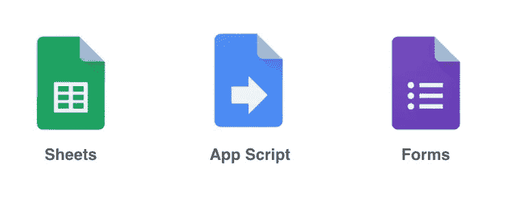
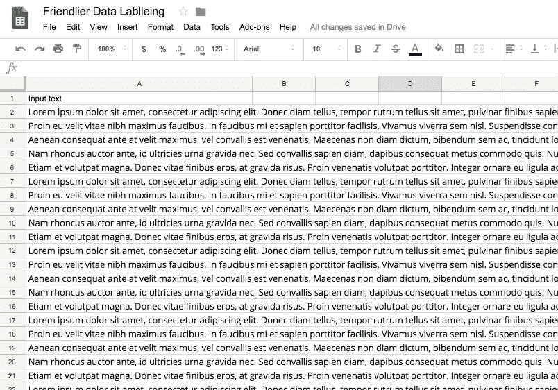
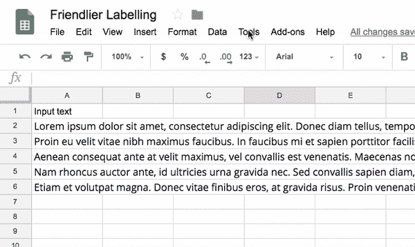
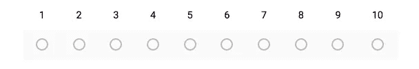
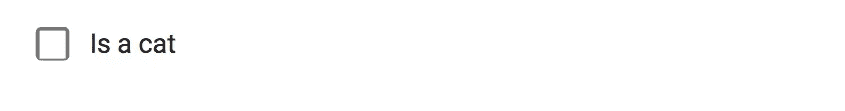
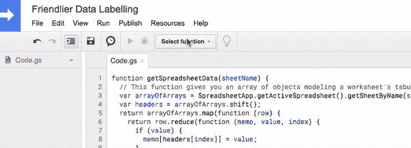
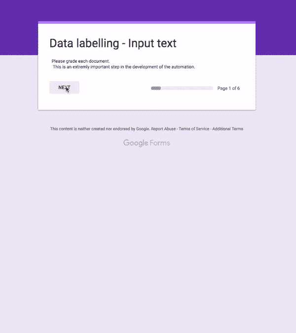

# 使用生成的谷歌表单进行更友好的数据标注

> 原文：<https://towardsdatascience.com/friendlier-data-labelling-using-generated-google-forms-d25e3e9f6aa6?source=collection_archive---------7----------------------->

手动标记数据是无人喜爱的机器学习琐事。如果你能给别人一个愉快的工具来完成这项任务，你就不必担心要求别人帮忙。让我向您展示:使用 [Google App 脚本](https://developers.google.com/apps-script/)生成的 Google 表单！



Google App Scripts allow you to build automation between Google Apps

人们给数据加标签的常规方式是在电子表格中输入标签。我通常也会这样做，但是在最近的一项任务中，我需要标记文本段落。你曾经尝试过阅读电子表格中的文本段落吗？..简直是地狱！幸运的是，当我试图找出一种方法使标签过程不那么累的时候，我遇到了一种使用 Google App Script 根据电子表格文档中的数据自动生成表单的方法。



Nasty! Nobody wants to strain their eyes trying to read documents in spreadsheet cells!

# 创建将生成我们表单的脚本

首先，我们只需从包含我们想要收集标签的数据的 Google 电子表格中进入应用程序脚本编辑器:



Opening the App Script editor from a Google Spreadsheet

使用应用程序脚本(pssst！这只是 JavaScript)我们可以读取电子表格数据，并向其他谷歌应用程序(在这种情况下，谷歌表单)发送命令。

使用表单进行标记的好处在于，您可以通过指定数据输入类型来保证用户输入的一致性。例如:

**号码范围:**



```
form.addScaleItem()
.setTitle(dataToLabel)                    
.setBounds(1, 10)        
.setRequired(true);
```

**二进制标签:**



```
form.addCheckboxItem()
.setTitle(dataToLabel)
.setChoices([
           item.createChoice('Is a cat')
           ])
```

**多类标签**


```
form.addMultipleChoiceItem()
.setTitle(dataToLabel)
.setChoices([
         item.createChoice('Cats'),
         item.createChoice('Dogs'),
         item.createChoice('Fish')   
])
```

在 [App Script API docs](https://developers.google.com/apps-script/reference/forms/) 中查看更多输入类型的详细信息(*或者手动创建 Google 表单时只查看不同的输入类型*)。

您可以从我的 Github 中获取我用来生成用数字 0 到 10 标记文本文档的表单的脚本:

[](https://github.com/ZackAkil/friendlier-data-labelling/blob/master/Code.gs) [## ZackAkil/更友好的数据标签

### 更友好的数据标注代码资源，用于生成标注数据的 google 表单。

github.com](https://github.com/ZackAkil/friendlier-data-labelling/blob/master/Code.gs) 

在你写好剧本(或者复制粘贴)之后；然后选择脚本的入口点并运行它！警告:第一次做的时候，你可能需要通过一些授权环节。



Make sure to select the entry point function of the script before running.

# 使用生成的表单

脚本运行后，您可以前往您的 Google 表单，在那里您应该会找到一个全新的表单！你可以把表格发给任何你想贴标签的人:



Finally you can send your labellers a convenient link to a familiar Google Form that they can use to carry out the labelling task.

# 访问数据标签

完成标记后，您可以将标签作为电子表格查看，并导出为 CSV 格式:


It’s pretty straight forward to get the labels out as a CSV.

希望这能让你在未来的机器学习工作中少一点头痛！

本文中使用的完整脚本和数据集可以在我的 Github 上找到:

[](https://github.com/ZackAkil/friendlier-data-labelling) [## ZackAkil/更友好的数据标签

### 更友好的数据标注代码资源，用于生成标注数据的 google 表单。

github.com](https://github.com/ZackAkil/friendlier-data-labelling)