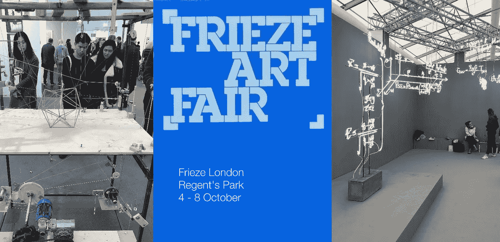
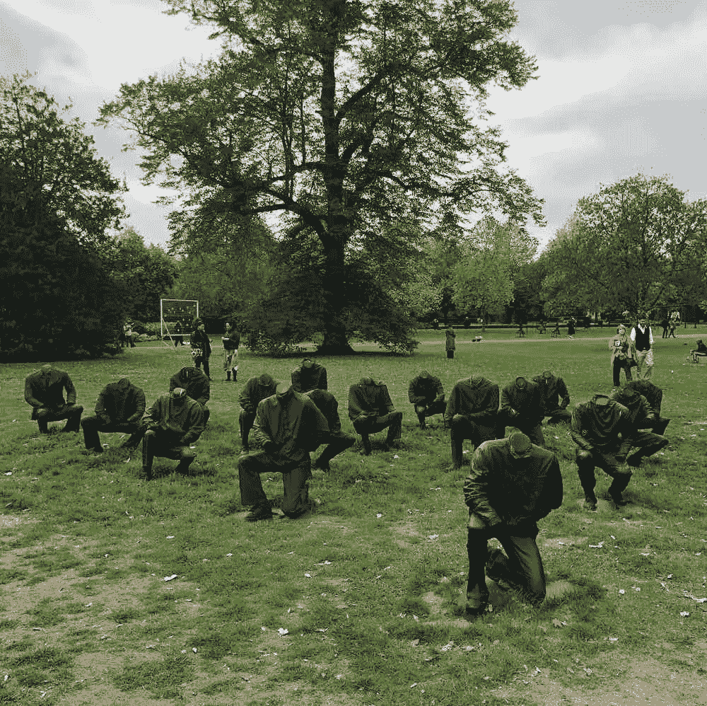
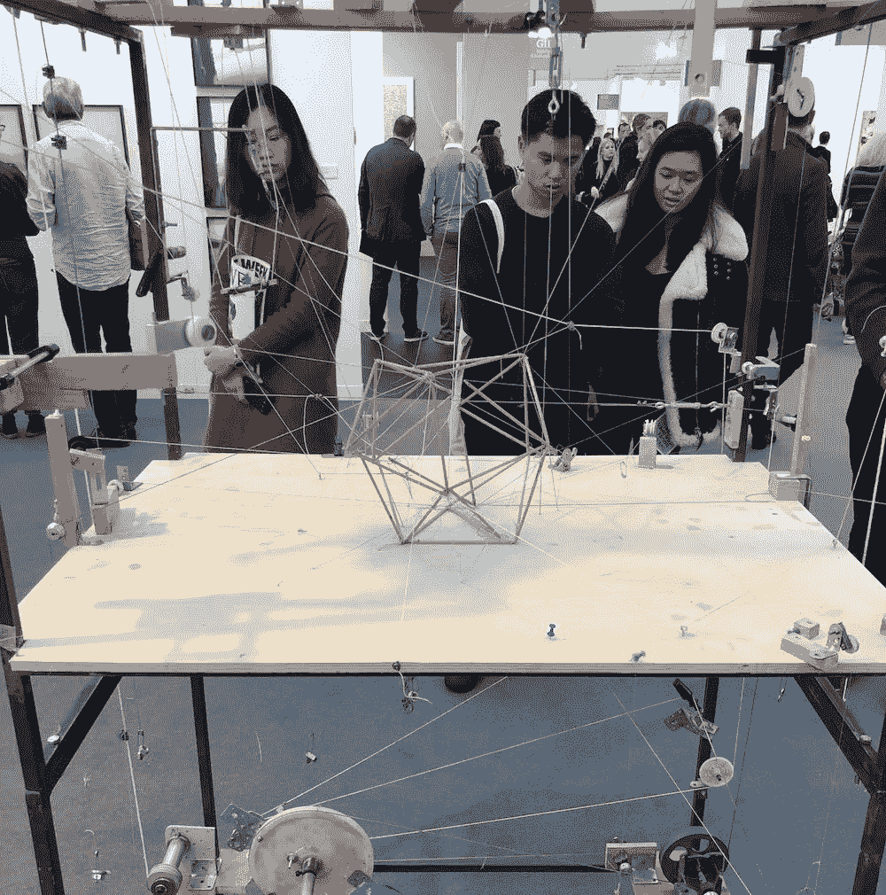
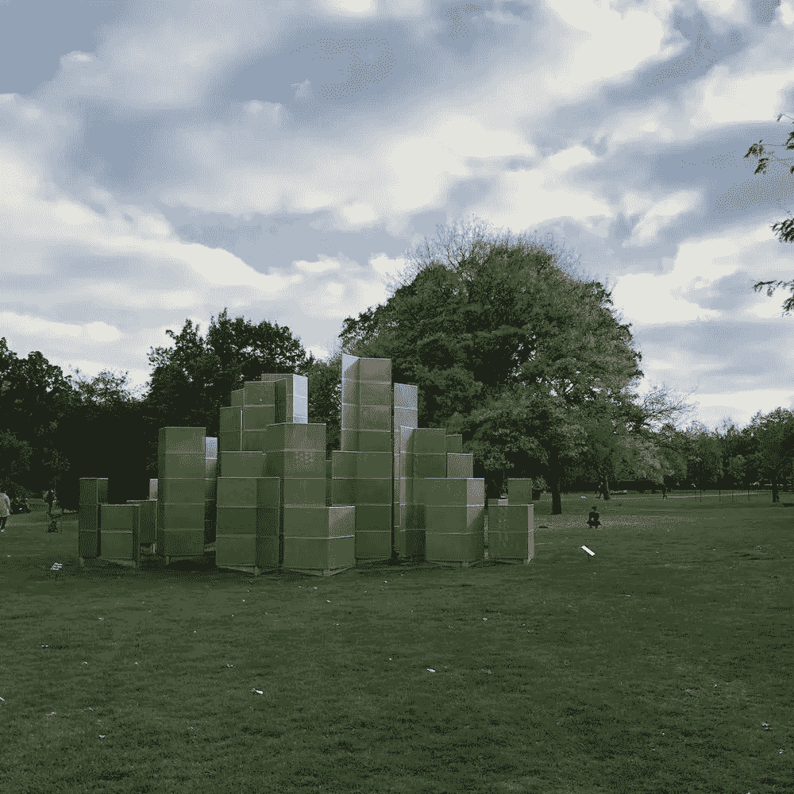

# Frieze London 2018(第二部分):自然语言处理

> 原文：<https://towardsdatascience.com/frieze-london-2018-part-2-natural-language-processing-66d0627f39af?source=collection_archive---------18----------------------->

## 第二部分:5.6k Instagram 和 3.2k Twitter 帖子的自然语言处理

## 介绍

Frieze 是一家国际艺术商业特许经营公司，1991 年以杂志起家，但后来发展成为一家组织一些年度日历上最重要的艺术博览会和活动的机构。

自 2003 年以来，每年 10 月，Frieze 都会在伦敦摄政公园的中央组织一次大型当代艺术展，吸引成千上万的人。来自 20 多个国家的 150 多家画廊通常会参加盈利性艺术博览会。

然而，Frieze 现在已经不仅仅是一个艺术博览会。
“楣周”已经成为一个文化娱乐周，人们纯粹是为了观赏而参加，这里有一个雕塑公园，甚至主要的拍卖行也举办他们的中期当代拍卖会，以配合楣周。

本文的目的是通过展示我对关于艺术博览会的 5.6k Instagram 和 3.2k Twitter 帖子的**自然语言处理分析**的发现，更好地了解 Frieze London 2018。

请向下滚动，通过交互式数据可视化查看我的分析！

## 数据和方法

这一事件的官方标签是#frieze。在通过 Twitter API 和 [Instagram API](https://developers.facebook.com/docs/instagram-api/) 收集了事件[发生时包含这个标签的 9000 个帖子之后，我首先清理了 Python 笔记本中的文本数据。](/access-data-from-twitter-api-using-r-and-or-python-b8ac342d3efe)

然后，我使用谷歌的 [*langdetect 库*](https://code.google.com/archive/p/language-detection/) 过滤掉非英语推文，并从 NLP 分析中删除所有转发，这样就不会出现重复。在这些步骤之后，我剩下了 7400 个独特的帖子。接下来，我使用[谷歌云自然语言 API](https://cloud.google.com/natural-language/) 来获取每条推文的情感。

最后，我使用 [gensim 库的 Word2Vec 模型](https://radimrehurek.com/gensim/models/word2vec.html)来获取整个 tweets 语料库中与单词“frieze”相关的每个单词的单词嵌入向量。Word2Vec 用于从大型文本语料库中计算单词之间的相似度——[卡维塔·加内桑](https://medium.com/u/cd869a6dee38?source=post_page-----66d0627f39af--------------------------------)的[文章](https://medium.freecodecamp.org/how-to-get-started-with-word2vec-and-then-how-to-make-it-work-d0a2fca9dad3)就是一个很好的解释。

一旦我有了每个单词的向量，我就使用 [scikitlearn 库](https://scikit-learn.org/stable/modules/generated/sklearn.decomposition.PCA.html)来执行主成分分析(PCA)以进行降维，并绘制出与“frieze”最相似的单词(最近邻居)。

你可以在这里查看[我的 Kaggle 内核](https://www.kaggle.com/vishalkumarlondon/frieze-london-2018-nlp-analysis/data?scriptVersionId=8074408)这篇文章的所有分析。

## 分析帖子

在这一节中，我将展示我的自然语言处理(NLP)分析的发现。下面，我报告以下三个指标:

1.  每日推文的情感分析；
2.  词频和标签频率分析；
3.  Word2Vec 模型的输出:主成分分析(PCA)和最近邻分析。

## 情感分析

每条推文的情绪是使用谷歌的云 NLP API 计算的。下面的条形图显示了每天推文的平均情绪，其中-1 表示非常消极的情绪，+1 表示非常积极的情绪。

不幸的是，我们看到，随着展会的进行，人们对 2018 年伦敦奥运会的热情逐渐降低。开始时为 0.47，到周日时一路下跌至 0.37。然而，到了交易会的最后一天，它又反弹到了 0.47！

Figure 1: Line chart showing the average sentiment of the tweets per day

## 文本频率分析

下面的条形图显示了一个词和一个标签在所有社交媒体帖子中出现的次数，分别在左侧和右侧。不出所料，“中楣”出现的次数最多。

但是，因为标签也出现在社交媒体帖子的主体中，所以在计算单词频率时，它们成为了一个混淆变量。因此，我采取措施将 hashtag 计数从单词计数中移除。

然而，下面的结果并不能很好地告诉我们人们对该事件的看法。我们只发现名词而不是形容词。我们可以使用一些机器学习技术来尝试挖掘一些形容词。

Figure 2: Bar graphs showing the count of words and hashtags appearing in all the tweets

## 最近的邻居

[Word2Vec](https://en.wikipedia.org/wiki/Word2vec) 是神经语言机器学习模型。它采用大量的文本，在这种情况下，来自 9000 个社交媒体帖子的文本作为输入，并产生一个向量空间，通常有数百个维度，每个唯一的单词对应于空间中的一个向量——单词嵌入。然后使用主成分分析将 Word2Vec 空间的维度降低到 *x* 和 *y* 坐标。

重要的是，Word2Vec 用于从 9000 条推文中捕捉单词之间的相似性和关系。具体来说，空间中距离较近的对象意味着它们是相似的。“最近邻”是来自 Word2Vec 模型的少数几个基于余弦度量相似性得分与“frieze”最相似的单词。

Figure 3: PCA output of the nearest neighbours of #frieze from the Word2Vec model

上面的散点图使用两个不同的语料库显示了“frieze”的最近邻居；一个包含标签，一个没有标签。

在带有标签的语料库中，我们看到许多与“frieze”最近的邻居实际上就是标签；比如《friezelondon 2018》《friezeartfaire》《friezemasters》。有趣的是，“regentspark”和“sculpture”出现在附近，可见雕塑公园的受欢迎程度。

不幸的是，很少有形容词或描述性词语来描述人们对艺术博览会的看法。在没有标签的语料库中，我们看到一些描述性的词，如“谢谢”、“最好”和“亮点”，但同样，这些词很少告诉我们人们对事件的看法。需要更深入的分析。

## 结论

所以你有它！我已经展示了我对关于艺术博览会的 5.6k Instagram 和 3.2k Twitter 帖子进行 NLP 分析的结果。我的发现没能告诉我们人们对博览会的看法。

在未来的研究中，我将致力于更深入的分析。有这么多的 NLP 库，我很可能会在未来使用 [GloVe](https://nlp.stanford.edu/projects/glove/) 、 [Tensorflow](https://www.tensorflow.org/tutorials/representation/word2vec) 或 [Bert](https://ai.googleblog.com/2018/11/open-sourcing-bert-state-of-art-pre.html) 重新审视这个分析。

## 下次…

在我的下一篇文章(第 3 部分)中，我将展示我的计算机视觉分析的发现。期待看到哪些艺术品出现的次数最多。敬请关注。

感谢阅读！

Vishal

我是一名文化数据科学家，是伦敦 UCL 学院**的研究生。我对城市文化的经济和社会影响感兴趣。我欢迎反馈和建设性的批评。* *你可以在*[*Twitter*](https://twitter.com/vishalkumarldn)*或*[*LinkedIn*](https://www.linkedin.com/in/vishalkumarlondon/)*、*[*insta gram*](https://www.instagram.com/vishalkumar.london/)*或我的* [*网站*](https://vishalkumar.london/) *上与我取得联系。**