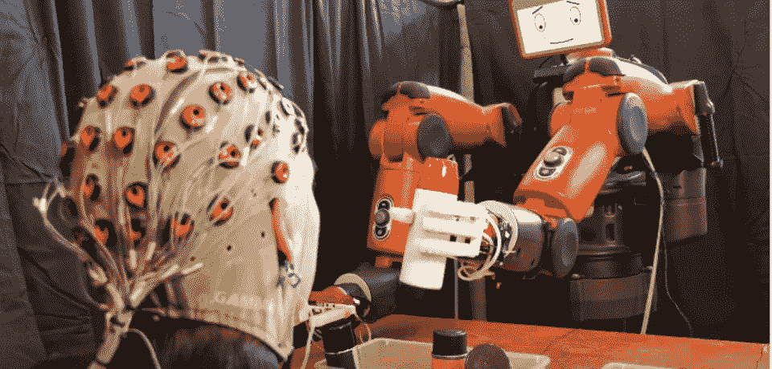
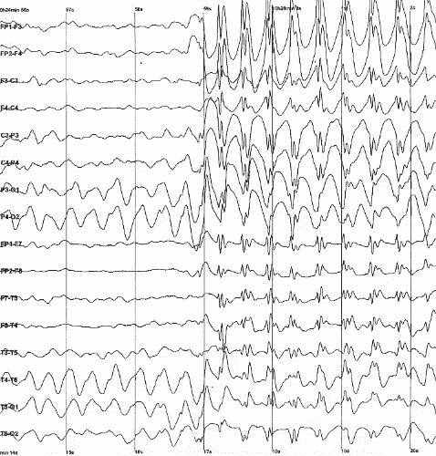
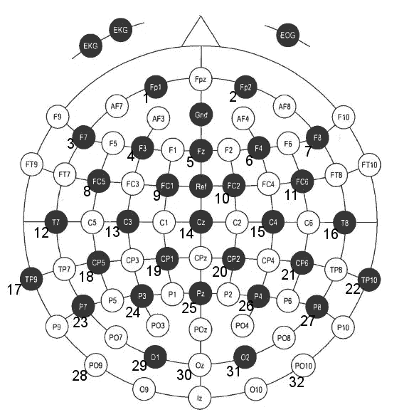
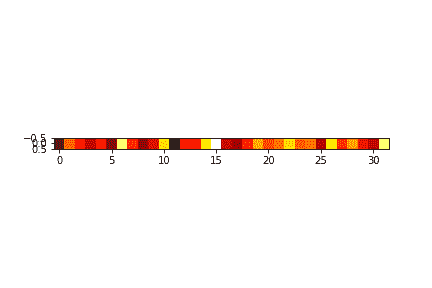
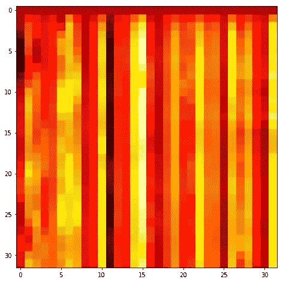
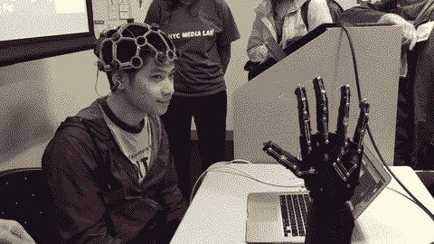
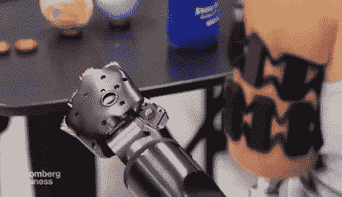
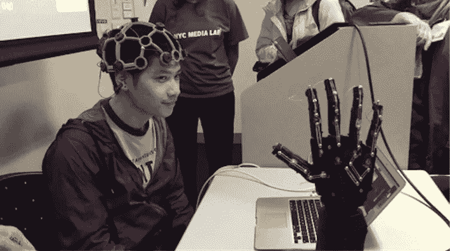

# 从脑电波到具有深度学习的机器人运动:导论。

> 原文：<https://towardsdatascience.com/from-brain-waves-to-arm-movements-with-deep-learning-an-introduction-3c2a8b535ece?source=collection_archive---------5----------------------->

## 用神经网络可视化和解码大脑活动。

你可以在[这个在线合作笔记本](https://colab.research.google.com/drive/1lDfmXMo7_mcVBo9EAtgLNIgeJV50GTce#scrollTo=AFoTOqC-4Rjl)中找到这篇文章的所有代码，你可以直接在你的浏览器上运行它。这里是 [GitHub 回购](https://github.com/normandipalo/eeg-to-action)。

在推特上关注我的工作更新和更多:【https://twitter.com/normandipalo 



神经系统是一个极其复杂的结构。在你的全身，超过十万公里长的神经连接着你的脊髓和大脑。这个“网格”传输控制每个动作的电脉冲。每一个命令都来自你的大脑，一个更神奇的神经元结构，它通过电激活信号进行交流。理解和解释脑电模式是神经科学家和神经生物学家最大的梦想之一，但事实证明这是一项极具挑战性的任务。

一种记录大脑活动的非侵入性方法是**脑电图(EEG)** 。这是一种允许使用放置在患者头皮上的电极来记录脑电压波动的技术。通常，大约 30 个这样的电极被放置在头皮周围，允许记录脑电波的整体活动。总之，[大脑活动和 EEG 信号之间的关系是复杂的，除了特定的实验室测试之外，对其了解甚少](https://www.kaggle.com/c/grasp-and-lift-eeg-detection)。因此，一个巨大的挑战是学习如何“解码”，从某种意义上说，这些脑电图扫描，可以允许控制机器人假肢和其他设备使用非侵入式**脑机接口(BCI)** 。



Example of brain waves recorded with EEG. CC BY-SA 2.0, [https://commons.wikimedia.org/w/index.php?curid=845554](https://commons.wikimedia.org/w/index.php?curid=845554)

作为强数据驱动的学科，**深度学习**最近在相关模式识别任务中的突破，创造了一种使用**神经网络**分析这些电信号的新方法。在这篇文章中，我们将看到这个主题的介绍:我们将阅读由 [Kaggle 竞赛](https://www.kaggle.com/c/grasp-and-lift-eeg-detection)提供的脑电图数据，该竞赛旨在检测哪些脑电图模式对应于特定的手臂和手势，如抓住或举起物体。在用不同的方式对数据进行预处理之后，我们将设计一个神经网络来执行这种分类。我也将展示一些大脑活动的数据可视化，以给出我们正在处理的数据的一个总体概念。该研究领域的最终目标是开发负担得起且有用的**假肢装置**，通过用大脑控制假肢，帮助截肢者重新获得轻松完成基本任务的能力。类似的技术也可以应用于读取肌肉电激活，从而通过分析激活的肌肉来解码一个人试图执行的运动类型。

你可以在[这个在线合作笔记本](https://colab.research.google.com/drive/1lDfmXMo7_mcVBo9EAtgLNIgeJV50GTce#scrollTo=AFoTOqC-4Rjl)中找到这篇文章的所有代码，你可以直接在你的浏览器上运行它。下面是 [GitHub 回购](https://github.com/normandipalo/eeg-to-action)。

# 数据简介

如果你有一个 Kaggle 帐户[你可以在这里](https://www.kaggle.com/c/grasp-and-lift-eeg-detection)免费下载数据。正如您将看到的，该数据仅由几个*组成。csv* 文件。这些文件分别是:

*   用作模型输入的 EEG 数据，由放置在患者头皮上的 32 个电极记录。数据以 500 赫兹的频率记录。
*   测试人员试图实现的运动的逐帧标签，在 6 个可能的标签中。

这些数据是通过记录不同人类测试者执行简单动作(如抓取和举起物体)时的脑电图来收集的。因此，数据集被分成不同的剧集，但也有不同的主题。我们将在稍后的准确度预测中看到，**脑电波可能是非常个人化的**，因为一个模型可以非常准确地预测同一个人在看不见的情节中的意图，但是如果训练不够多样，在对新测试人员做同样的事情时可能会有困难。

因此，目标是创建一个神经网络，该网络将 EEG 读数作为输入，并输出测试者试图实现的这 6 个可能动作的概率分布。由于“无动作”不是一个可能的类，我们可以将其添加为一个类，或者将所有可能的输出设置为 0 到 1 之间的值，并使用阈值来决定是否检测到该动作。如果每个动作都低于阈值，我们就认为它没有动作。



Position of electrodes, source: [https://www.kaggle.com/c/grasp-and-lift-eeg-detection/data](https://www.kaggle.com/c/grasp-and-lift-eeg-detection/data)

我制作了这些电极活动的动画数据可视化。由于采样频率相当高(500 Hz)，我使用了一个简单的 3 步低通滤波器**来平滑数据，我用前 100 帧创建了一个动画，大约 1/5 秒。**



Activations of the 32 electrodes in the first 1/5 of second.

我们还可以将时间数据可视化为 2D 热图，其中纵轴是时间(从顶部开始向下)，横轴表示 32 个电极。



EEG temporal heatmap. (time starts from top and goes down)

这也非常有用，因为正如我们将看到的，它将允许我们使用**时空卷积**。

# 数据预处理

这些原始数据应该进行预处理，以适应学习阶段。例如，与所执行的动作的相对低的变化率相比，EEG 的非常高的采样频率会导致许多问题:数据变化非常快，但是动作实际上保持不变，因此波动几乎可以被认为是噪声。此外，时态模型会接收大量快速变化的数据，而分类输出从不改变。

第一个可能的步骤是用低通滤波器对数据进行**滤波。即使简单的移动平均也是可行的:通过这种方式，我们减轻了数据的高频变化，同时保留了更有用的低频结构，因为我们将分类的运动具有非常低的变化频率(最多 1Hz)。之后，我们可以**对数据**进行二次采样，即我们可以每 10、100 等只保留一个数据点。这也有助于减少时间维度，降低数据的相关性，在某种意义上使其更加时间稀疏。**

可以采用许多其他预处理技术，但是为了简单起见，我们可以在这里停下来，开始设计我们的神经网络。



# 神经网络设计和实验

处理时态数据时，我们首先想到的架构之一是**递归神经网络。**这些网络具有动态结构，因此内部状态允许它们对时间数据进行编码，因此它们也基于过去的输入来计算输出。我在 Keras 设计了一个 **LSTM 网络，用时序结构给它输入训练数据。结果很好，但在这个特殊的例子中，我更感兴趣的是展示一个常用于图像的**卷积神经网络**如何能够很好地处理时态数据。**

如前所述，在某种意义上，我们实际上是在处理时空数据:上面显示的热图的垂直轴代表时间演变，而水平轴显示各种电极，并且接近的电极几乎总是在人类头皮上空间上接近。这意味着我们实际上可以用卷积提取有用特征:2D 核可以对时间和空间中的模式进行编码。想象一个 **3x3 卷积核**:它能够在热图中描绘的矩阵上，通过对三个不同的时间步长(3 个核行)以及三个不同的电极(3 个核列)进行加权求和来提取特征。因此，具有许多内核的 CNN 可以**发现电极的激活如何在有限的时间周期内相对于期望的运动而变化的特征**。

我在 Keras 中实现了一个简单的 CNN 来检查它在这个数据集上的性能。你可以在[这个在线合作笔记本](https://colab.research.google.com/drive/1lDfmXMo7_mcVBo9EAtgLNIgeJV50GTce#scrollTo=AFoTOqC-4Rjl)中找到这篇文章的所有代码，你可以直接在你的浏览器上运行它。下面是 [GitHub 回购](https://github.com/normandipalo/eeg-to-action)。

```
import keras
from keras.models import Sequential
from keras.layers import Dense, Dropout
from keras.layers import Embedding
from keras.layers import LSTM, CuDNNLSTM, BatchNormalization, Conv2D, Flatten, MaxPooling2D, Dropout
from keras.optimizers import Adammodel = Sequential()
#model.add(CuDNNLSTM(128, input_shape = (time_steps//subsample, 32)))
model.add(Conv2D(filters = 64, kernel_size = (7,7), padding = "same", activation = "relu", input_shape = (time_steps//subsample, 32, 1)))
model.add(BatchNormalization())
#model.add(MaxPooling2D(pool_size = (3,3)))
model.add(Conv2D(filters = 64, kernel_size = (5,5), padding = "same", activation = "relu", input_shape = (time_steps//subsample, 32, 1)))
model.add(BatchNormalization())
#model.add(MaxPooling2D(pool_size = (3,3)))
model.add(Conv2D(filters = 64, kernel_size = (3,3), padding = "same", activation = "relu", input_shape = (time_steps//subsample, 32, 1)))
model.add(BatchNormalization())
#model.add(MaxPooling2D(pool_size = (3,3)))
model.add(Flatten())
#model.add(Dropout(0.2))
model.add(Dense(32, activation = "relu"))
model.add(BatchNormalization())
# model.add(Dropout(0.2))
model.add(Dense(6, activation = "sigmoid"))adam = Adam(lr = 0.001)model.compile(optimizer = adam, loss = "categorical_crossentropy", metrics = ["accuracy"])model.summary()
```

为了检查我们模型的性能，正如 Kaggle 竞赛中所建议的，我们检查了 **AUC 分数**。如果你不熟悉 AUC 是什么，我建议[这个清晰直观的解释](https://datascience.stackexchange.com/questions/806/advantages-of-auc-vs-standard-accuracy)。您可以在在线笔记本中自行查看，通过快速培训阶段，我们可以达到 0.85 左右的 AUC 分数。

通过训练不同的神经网络架构以及预处理技术等，可以实现许多改进，但这种概念的介绍性证明显示了神经网络从这种数据中学习的显著能力。



# 结论

在这篇文章中，我们介绍了脑电图的脑电信号，这是一种非侵入性和相对简单的记录用户头皮有用信号的方法。我们看到了一些数据的直观可视化，以及如何使用神经网络从中提取运动意图等特征。我相信，由于深度学习，更广泛的各种数据科学技术，平台和逐年增长的竞赛，这个领域(机器人假体，脑机接口)将有一个深刻的推动。

这些技术的影响将是巨大的。拥有可以以自然方式控制的低成本假体可以极大地改善数百万人的生活。

我建议你去看看[symbion 项目](https://medium.com/symbionic-project)，这是一个最近开始的项目，一些有才华的人试图拼凑一个**低成本、智能手臂假体**，可以通过肌肉激活来控制，以真正实现这种设备的大众化。

在推特上关注我的工作更新和更多:[https://twitter.com/normandipalo](https://twitter.com/normandipalo)

