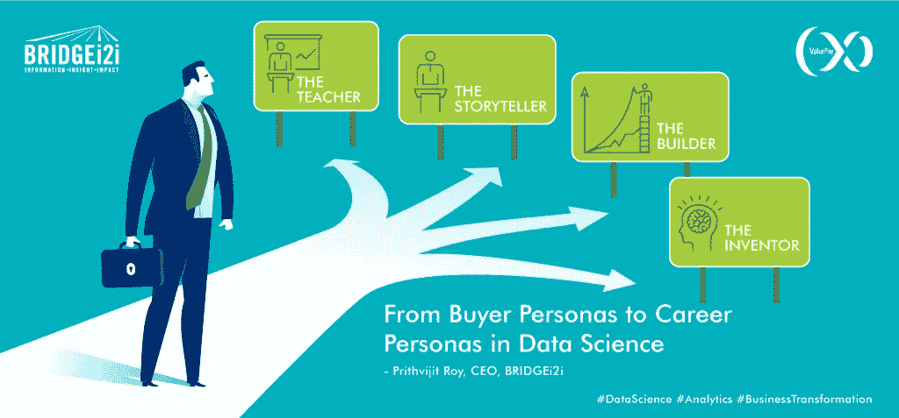
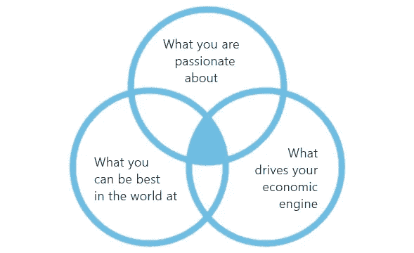
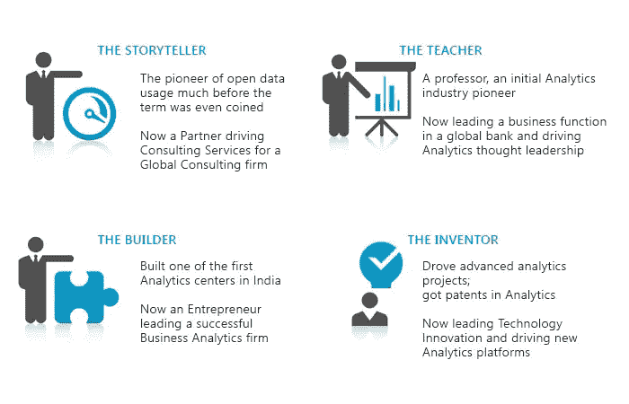

# 从买方角色到数据科学中的职业角色

> 原文：<https://towardsdatascience.com/from-buyer-personas-to-career-personas-in-data-science-f677873f2e02?source=collection_archive---------9----------------------->

image credit: BRIDGEi2i.com

***场景*** *:班加罗尔一个新办公室里一个不太大的会议室。*

***时间戳*** *: 17 年前。*

**人物:一群背景和教育程度各异的年轻人:统计学家、计量经济学家、经理、顾问、投资银行家和信用评级师。**

***:作为第一批开始证明围绕“分析”的宣传是真实的公司之一，每个人都有在数据行业留下印记的远大梦想。***

****:梦想是伟大的，但对于这个新的、尚未定义的行业，什么构成了职业成长和职业道路？****

**听起来像一本新书的开场白？**

**当我们加入分析行业时，这是我们许多人的现实，当时用数据解决问题尚未开始其爆炸性的旅程。今天，随着越来越多的人接受数据科学的力量，年轻人蜂拥加入这一职业，这个问题仍然被提出。**

# **如果我从事分析，我可以期待什么样的职业？**

**时髦的词语和天花乱坠的宣传给那些纠结于如何建立深度和广度的年轻人制造了更多的困惑；是选择早期专业化还是尝试直到他们找到自己的定位。**

****

**image credit: BRIDGEi2i.com**

**嗯，我想通过这篇文章回答的是，在分析领域的职业生涯与你看待任何其他职业选择的方式没有任何不同。它始于吉姆·科林斯经典著作《从优秀到卓越》中讨论的基本原则(刺猬原则)。**

****

**image credit: BRIDGEi2i.com**

**上图中的交叉点就是你在职业生涯中想要达到的位置。**

**关于数据科学家的工作以及他或她需要具备的独角兽式技能组合，已经有很多文章。在我看来，并不是所有的数据科学专业人员都需要具备所有这些技能；事实上，他们不能。**

**然而，这个职业需要一套多学科的技能，最适合解决商业问题，而不仅仅是那些看起来像是彼此克隆的人。**

**作为分析专家，我们习惯于创建买家角色来更好地了解我们的客户，并细分适合他们的产品。让我们在这里应用同样的逻辑。**

**我将在分析领域创建四个职业角色——四个完全不同的人，他们拥有不同的技能，在行业中有着非常成功的职业生涯。就像电影里说的那样，与你的老板或前任老板的任何相似之处纯属巧合。**

****

**image credit: BRIDGEi2i.com**

**四个角色。四种不同的选择。**

**你认为他们在开始职业生涯时知道自己最终会选择哪个方向吗？**

**大概不会。**

**他们是否拥有与独角兽数据科学家相同的技能？**

**肯定不是。**

**相反，他们所拥有的是:**

*   **理解和解决问题的强烈好奇心**
*   **愿意学习、忘却、再学习和帮助**
*   **倾向于扮演重要的角色，而不是担心指定**
*   **增加接触，发现自己的优势**
*   **导师和更广泛的网络来探索新的机会**

**他们找到了自己的路。**

**正如我们为不同的买家角色设计不同的优惠一样，并非所有的分析工作都是一样的。这个行业有跨越多个角色的角色。那么，为什么我们只是试图创造克隆？是的，随着这个行业如此活跃，发展速度如此之快，我们将很快看到新的角色演变，从“商业模式破坏者”到“梦想设计师”，再到“全脑营销者”。**

**所以，祝你们所有在这个领域刚刚开始职业生涯的人，也祝那些目前正处于十字路口、决定角色的人一切顺利。**

**正如一幅著名的漫画所说:**

> **你不能呆在森林的角落里等着别人来找你。有时候你必须去找他们。**
> 
> ***——小熊维尼***

**在其中一个角色中认出你自己？让我知道这是否有助于你思考你的分析职业选择。我很想听听你的想法。**

***(本文最早出现在* [*BRIDGEi2i 博客*](http://bridgei2i.com/blog/from-buyer-personas-to-career-personas-in-data-science/) *上，作者是 Prithvijit Roy，*[*bridge i2i Analytics Solutions*](http://www.bridgei2i.com/)*)***

## **如果你喜欢这篇文章，请给它一个掌声，并留下评论，以便它达到更多的专业人士和有志之士！**