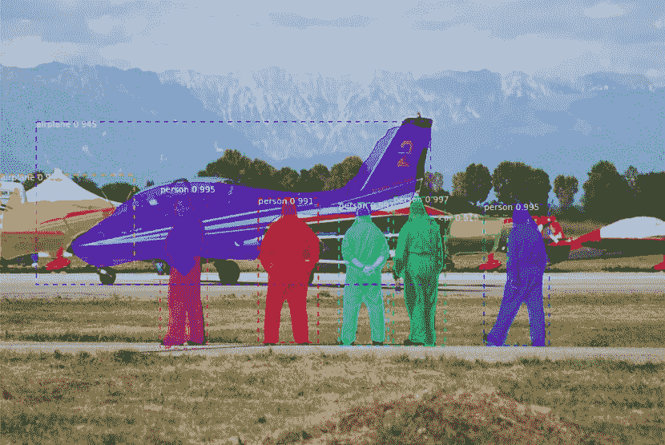
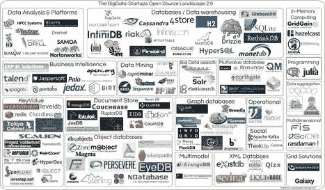
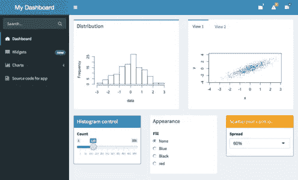

# 从数据分析师到数据科学家

> 原文：<https://towardsdatascience.com/from-data-analyst-to-data-scientist-f67a724ea265?source=collection_archive---------3----------------------->

Source: [Matterport mask RCNN](https://github.com/matterport/Mask_RCNN)

一个人如何从数据分析师转型为数据科学家？

1.  去 [LinkedIn](https://uk.linkedin.com/) 网站。登录。
2.  点击“编辑我的个人资料”。
3.  找到“数据分析师”这几个字，换成“数据科学家”。

搞定了。哇，那很容易。

不幸的是，生活没那么简单。在这里，我们承认，要从或多或少的数据中发掘洞察力，需要付出艰苦的努力。

有很多关于从数据科学起步的好文章(例如这里的和这里的)，但是关于从数据分析师转型的文章却很少。

在开始之前，我有必要尝试一下这两个角色的定义。

**数据分析师**收集、处理结构化数据并应用统计算法，以获得收益并改进决策。

一个**数据科学家**有类似的目标，但也有强大的处理大量非结构化数据的技能，可能接近实时处理。他们发现重要的信息，并能够对来自各种来源的数据进行清理、处理和运行高级算法。他们有很强的讲故事和想象技巧。

我经常遇到有才华的分析师，他们渴望开始他们的数据科学之旅，却因缺乏机会和不确定从哪里开始而沮丧。这促使我写了这篇文章。

# 为什么要成为数据科学家？

呃，事实上有很多原因…

**影响** —产生巨大商业利益的潜力。一个被高层倾听并帮助塑造未来方向的机会。

**精通—** 在一个快速发展的领域中，有无数迷人的问题需要通过各种方法来解决。例如，建立一个图像识别器或文本分类器来识别社交媒体上的有毒评论。

**相关性**——有人预测[人工智能最终会取代我们的工作](http://www.bbc.com/capital/story/20170619-how-long-will-it-take-for-your-job-to-be-automated)。一种安全的方法是让 it 部门创造自动化，而不是等待自己被自动化。

**报酬/机会—** 乘坐大游艇四处旅行，在按摩浴缸里喝香槟。也许不会，但是薪水会相对较高。好的数据科学家很少，需求量很大；让那成为你，生活应该是美好的。

Data science — loads to learn (left) , robots taking our jobs (middle) and good pay but remember that The Wolf a Wall Street ended in tears! (right)

# 我已经是数据科学家了吗？

大多数分析师都有良好的基础，但需要多年的努力来发展技能，以便在复杂的结构和/或大型数据集上全面应用尖端方法。也就是说，不需要很长时间就可以开始取得成功，甚至达到超出我们早期预期的水平。

那么，我们在朝着什么技能努力呢？这个问题可能没有正确的答案，但是一个复杂的数据科学项目可能有一个包含许多元素的复杂管道。在数据科学发展的最初几年，人们可能会期望至少触及以下合理的部分:

**数据科学语言** — Python/R

**关系数据库** — MySQL、Postgress

非关系数据库 — MongoDB

**机器学习模型** —例如，回归、提升树 SVM、NNs

**图形** — Neo4J，GraphX

**分布式计算** — Hadoop、Spark

**云** — GCP/AWS/Azure

**API** **交互** — OAuth，Rest

**数据可视化和 Webapps —** D3，RShiny

**专业领域—** 自然语言处理、光学字符识别和计算机视觉

Boosted Trees models are popular in data science competitions

RShiny dashboards can be an effective way to develop an interactive means for others to explore data.

获得这些技能需要很多时间(可能比你的学位课程还要长)。即使是世界上最优秀的人也还有很多东西要学。然而，我们总是可以知道更多，不应该担心我们有局限性。如果我们每天都能变得更好一点，我们都有潜力在某一天达到相当高的技能水平。

决心和坚韧会比我们原始的智力更好地为我们服务。

# 行动（或活动、袭击）计划

在做其他事情之前，我们需要一些基本技能:

1.  **从正确的哲学开始**。十年前，等待数周时间被送去上数据软件课程可能是可以接受的。那些日子早已过去。到处都有奇妙的材料。让学习持续不断。不断练习技能。
2.  **学习一门语言，发展你的数学技能**——Python 和/或 R 是大多数人的起点。在像 [Coursera](https://www.coursera.org/) 和 [Udemy](https://www.udemy.com/) 这样的网站上有大量的免费培训。许多 Python 用户喜欢使用 [Anaconda](https://www.anaconda.com/download/) 和 [Jupyter](http://jupyter.org/) 笔记本。很多 R 用户喜欢 [R Studio](https://www.rstudio.com/) 。在数字方面，[吴恩达机器学习课程](https://www.coursera.org/learn/machine-learning)和[斯坦福神经网络课程](http://cs231n.stanford.edu/)都非常棒，学习起来非常愉快。
3.  **解决问题**——最好是你工作场所的真实问题，与商业专家和数据工程师一起工作。这是最好的端到端开发形式。
4.  **进入**[**ka ggle**](https://www.kaggle.com/)**竞赛** — Kaggle 任务被划分范围和清理，但是没有比和其他几千人一起做一个具有挑战性的问题更好的方法来提高建模技能了。不要担心等级。从操场比赛开始，然后从那里开始。每个人都有起点，试一试吧。
5.  **了解该领域的领导者在说什么** —有些人喜欢称之为“数据科学的摇滚明星”。这个小组做出了令人着迷的贡献，非常值得你花时间去做。留意像杰弗里·辛顿、吴恩达、扬·勒昆、雷切尔·托马斯和杰瑞米·霍华德这样的人。
6.  **使用有效的工作方式**——一旦奠定了基础，就开始使用版本控制系统来改进你的工作流程，例如 [GitHub](https://github.com/) 来部署和维护代码。考虑集装箱化的[码头工人](https://www.docker.com/)。
7.  有效沟通——我们需要能够推销我们的作品。高管们喜欢闪亮的演示，所以一定要朝着你能在关键演示上展示的东西努力。

Lots of great materials on youtube. Andrew Ng’s state of artificial intelligence is fascinating.

Twitter can be another useful medium. Learn from the best such as Rachel Thomas.

**获得正确的设置**

即使拥有世界上所有的技能，如果你的组织没有合适的工具和环境，那么等待你的将是一场艰苦的斗争。很可能总是有我们无法控制的因素，所以我们需要考虑我们能够影响什么。

1.  **迁移到正确的团队** —最简单的计划。大多数大中型组织都至少有一个小型数据科学团队。加入它。
2.  **与合适的人合作** —如果不可能快速跳槽，那么就创造一个机会，与你认识的知识最渊博的数据科学家一起工作。例如，发现一个可以自动化的问题，然后与专家合作，而不是委托他们去做。
3.  **支持合适的工具和环境**—组织并不总是确定是否以及如何投资数据科学工具。他们需要担心传统分析交付的繁忙计划。安全和审计都需要时间来发展，所以他们只会听到有明显好处的强有力的业务案例。抓住机会支持适当的环境、工具和培训。
4.  **开发清晰的用例** —了解您的业务以及如何应用数据科学。用一个小的概念证明将两者联系起来。利用成功来支持获得更多工具和环境的案例。
5.  **与懂得比你多的有才能的人一起工作—** 成为拥有你不具备的技能的高技能多元化团队的一员。你不仅会获得更多，还会潜移默化地学到他们的一些知识。

# **结论**

现在是开始行动的最佳时机。今天就开始学习，尽快着手解决一个真正的问题。将没有回头路。坚持不懈，用你的成就给自己惊喜。珍惜这个机会。