# 从特征分解到行列式:带有直观例子的机器学习基础数学第 3/3 部分

> 原文：<https://towardsdatascience.com/from-eigendecomposition-to-determinant-fundamental-mathematics-for-machine-learning-with-1b6b449a82c6?source=collection_archive---------13----------------------->

为了理解机器学习算法的数学，特别是深度学习算法，从基础到更高级建立数学概念是必不可少的。不幸的是，数学理论在许多情况下太难/抽象/枯燥，难以消化。想象你正在吃一个比萨饼，喝一杯可乐总是更容易和更有趣。

这篇文章的目的是**为基础数学理论提供直观的例子**使学习体验更加愉快和难忘，那就是鸡翅配啤酒，薯条配番茄酱，里脊配葡萄酒。

包含 3 门课程的机器学习基础数学课程组织如下:

[**从标量到张量**:带有直观例子的机器学习基础数学**第 1/3 部分**](https://medium.com/@alina.li.zhang/from-scalar-to-tensor-fundamental-mathematics-for-machine-learning-with-intuitive-examples-part-163727dfea8d)

*   什么是标量、向量、矩阵和张量？
*   标量、向量和矩阵之间的加法
*   标量、向量和矩阵之间的乘法
*   单位矩阵和逆矩阵
*   对角矩阵和对称矩阵

[**从范数到正交**:机器学习的基础数学与直观示例**第 2/3 部分**](/from-norm-to-orthogonality-fundamental-mathematics-for-machine-learning-with-intuitive-examples-57bb898e69f2)

*   向量的 1-范数，2-范数，最大范数
*   正交和标准正交向量
*   正交矩阵

**从特征分解到行列式**:带有直观例子的机器学习基础数学**第 3/3 部分**

*   矩阵的特征分解:特征值和特征向量
*   跟踪运算符
*   方阵的行列式

在本文中，我们将通过直观的例子，从特征分解到行列式来浏览第 3/3 部分**。**

## 矩阵的特征分解:特征值和特征向量

为什么我们需要分解？如果我们想发现事物的本质，分解是一种有效而实用的方法。假设你刚交了一个新朋友，把他/她分解成以下四个组成部分，可以帮助你迅速对具体的人建立更深入的了解。

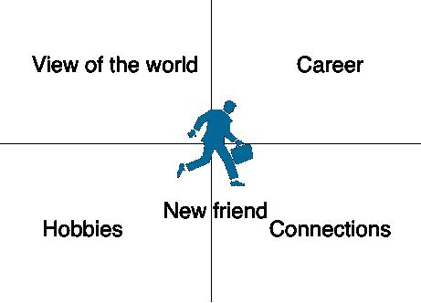

同样的数学方法。一个整数可以分解成质因数，比如 20 = 2 * 2 * 5，也就是说 20 不能被 3 整除，20 的任何整数倍都会被 5 整除。

特征分解是一种将矩阵分解成一组特征向量和特征值的方法。非零向量 ***v*** 是方阵 ***A*** 的特征向量，如果它满足特征值方程:

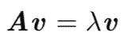

其中 **λ** 是一个标量，称为向量 ***v*** 对应的特征值。

矩阵 ***A*** 的特征分解由下式给出

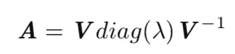

其中 ***V*** 为方阵，其第 I 列为矩阵 ***A*** 的第 I 个特征向量，diag(λ)为对角元素为对应特征值的对角矩阵。

例如，一个真实的矩阵:

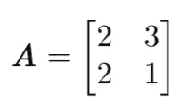

可以通过非奇异矩阵 ***V*** 的乘法分解成对角矩阵:

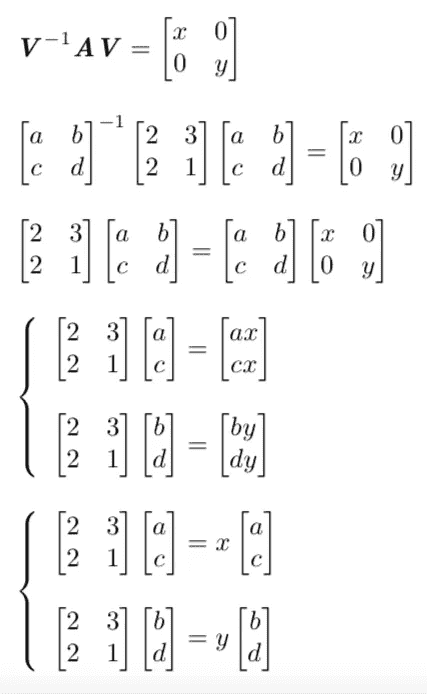

上述两个向量方程可以由单个向量方程表示:

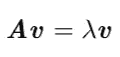

通过将 ***λv*** 移至左侧，我们可以得到

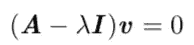

其中向量 V 非零，因为矩阵 ***V*** 是非奇异的。因此，

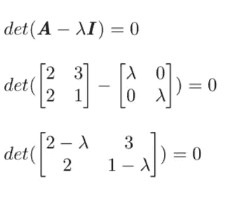

根据[行列式](https://en.wikipedia.org/wiki/Determinant)矩阵的定义，我们可以有:

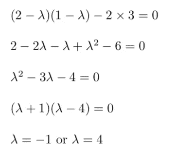

将解放回到上面的向量方程中:

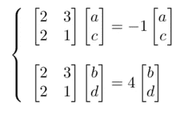

解方程，我们有

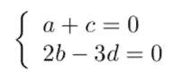

因此矩阵*对*进行本征分解所需的矩阵为:**

**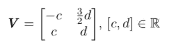**

**举个例子，**

**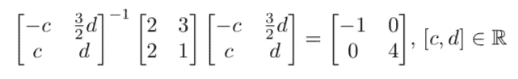**

## **跟踪运算符**

**线性代数中，方阵*的迹被定义为主对角线上元素的和:***

***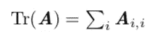***

***比如有一个 3*3 的矩阵 ***一个*** ，***

**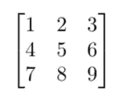****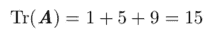**

**trace 运算符的一些基本属性如下:**

**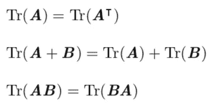**

**更一般地，轨迹对于将最后一个因子移动到第一个位置是不变的，这被称为[循环置换](https://en.wikipedia.org/wiki/Cyclic_permutation)，即，**

**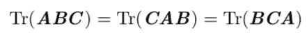**

## **方阵的行列式**

**什么是行列式？为什么我们需要了解如何计算矩阵的行列式？行列式的值在机器学习中有什么意义？**

**表示为 det( ***A*** )的方阵的行列式是可以从矩阵的元素中计算出来的值。对于一个 2*2 矩阵，它的行列式是:**

**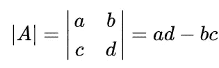**

**对于 3*3 矩阵，行列式定义为**

**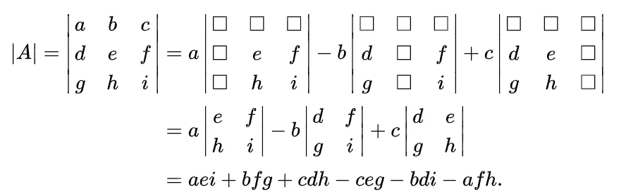**

**在 4*4 矩阵的情况下，行列式为**

**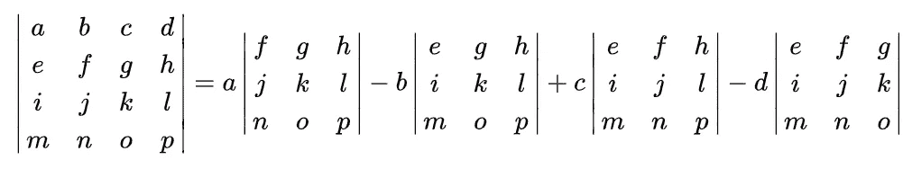**

**Photo credit to [Wikipedia](https://en.wikipedia.org/wiki/Determinant#Applications)**

**行列式等于一个矩阵的所有特征值的乘积，我们可以用行列式把一个矩阵映射成一个实标量。您可以使用 [numpy.linalg.det](https://docs.scipy.org/doc/numpy-1.13.0/reference/generated/numpy.linalg.det.html) 来计算数组的行列式。**

**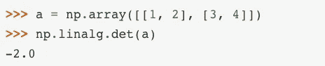**

**[scipy](https://docs.scipy.org/doc/numpy-1.13.0/reference/generated/numpy.linalg.det.html)**

**行列式是机器学习算法中一个重要的数学概念，例如广泛使用的降维解决方案:主成分分析(PCA)。正如我们所知，一个矩阵可以被视为空间的线性变换，其行列式的值可以被认为是用这个矩阵变换空间时得到的**乘法变化**，可以是旋转、缩放或方向变化等。**

**恭喜你！您已经完成了第三部分，也是最后一部分**机器学习的基础数学和直观示例**。**

**“哪里有数字，哪里就有美。”—普罗克洛斯**

**基础数学理论的美妙之处在于它们永远不会过时。十年后的 2028 年，软件开发人员和数据科学家可能不会再使用 Python 或 TensorFlow 了。但标量还是标量，矩阵还是矩阵，张量还是张量。矩阵求逆的充分必要条件和现在一样。基础数学能够经受时间的考验。你可以在这个系列中投资一周或一个月。幸运的是，收获是你可以终身应用的知识和技能，因为“数学是一种思维方式。”**

# **报名参加🦞:的 Udemy 课程**

# **[具有机器学习和统计的推荐系统](https://www.udemy.com/course/recommender-system-with-machine-learning-and-statistics/?referralCode=178D030EF728F966D62D)**

****

**[https://www.udemy.com/course/recommender-system-with-machine-learning-and-statistics/?referralCode=178D030EF728F966D62D](https://www.udemy.com/course/recommender-system-with-machine-learning-and-statistics/?referralCode=178D030EF728F966D62D)**