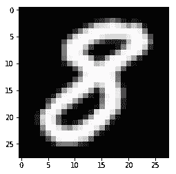
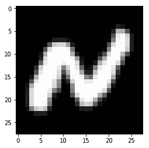
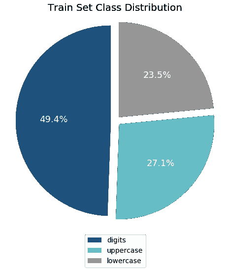
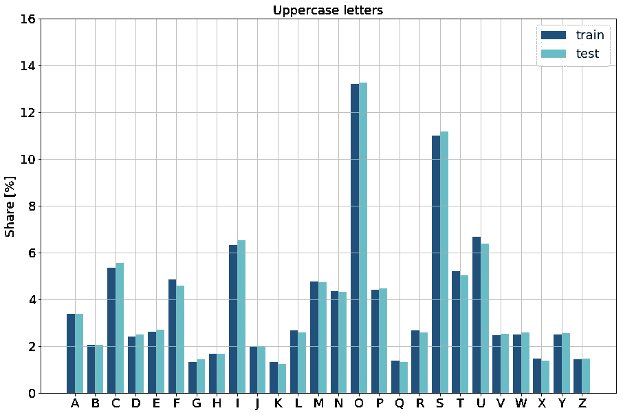
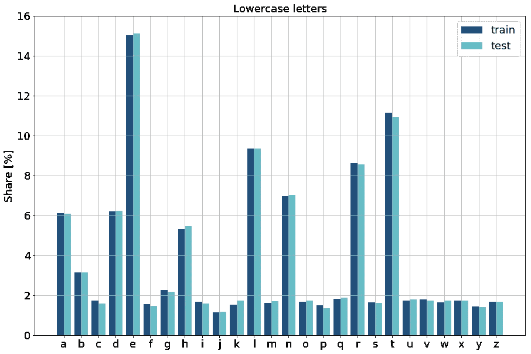
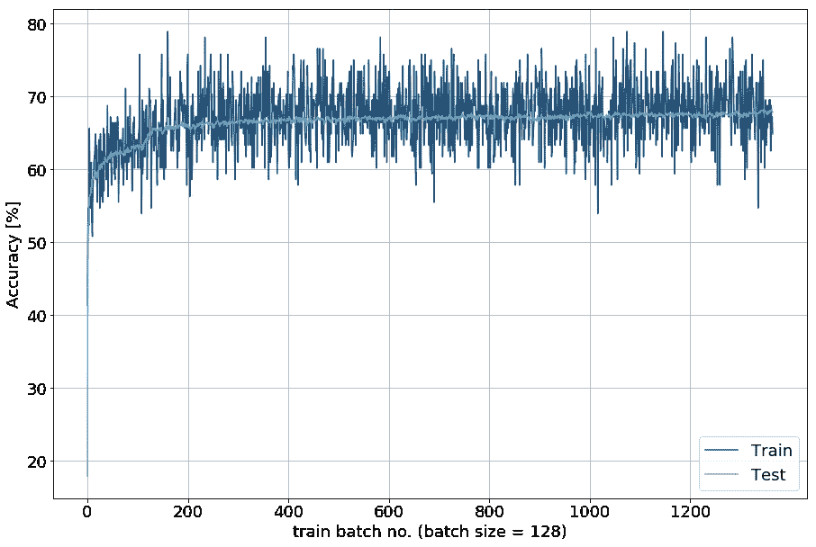
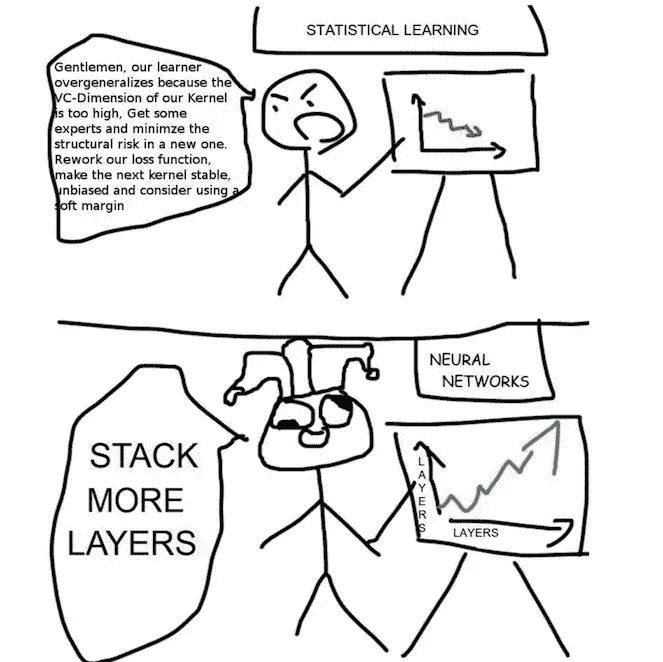
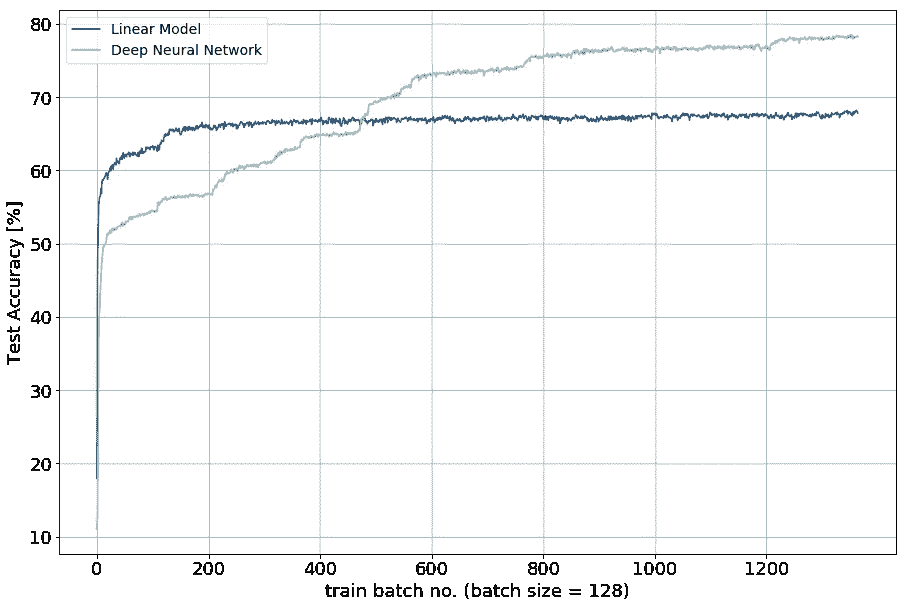
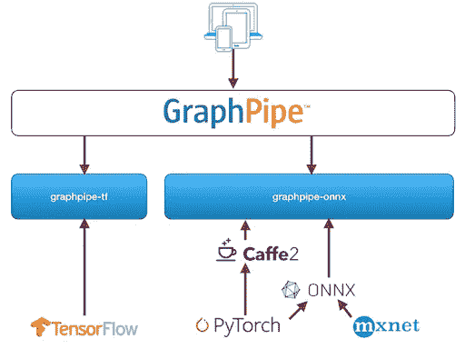

# 从探索到生产——弥合深度学习的部署差距(第 1 部分)

> 原文：<https://towardsdatascience.com/from-exploration-to-production-bridging-the-deployment-gap-for-deep-learning-8b59a5e1c819?source=collection_archive---------7----------------------->


这是关于深度学习模型探索、翻译和部署的两个博客系列的第一部分。两者都涉及许多技术，如 PyTorch、TensorFlow、TensorFlow Serving、Docker、ONNX、NNEF、GraphPipe 和 Flask。我们将协调这些技术，使用更具挑战性但不太受欢迎的 EMNIST 数据集来解决图像分类的任务。第一部分介绍 EMNIST，我们用 PyTorch 开发和训练模型，用开放的神经网络交换格式 ONNX 翻译它们，并通过 GraphPipe 服务它们。第二部分介绍 TensorFlow 服务和 Docker，以及一种相当业余的方法，在这种方法中，我们构建了一个服务于我们模型的简单 web 应用程序。你可以在 GitHub 上找到所有相关的源代码。[在这里](/from-exploration-to-production-bridging-the-deployment-gap-for-deep-learning-part-2-9e33cc8dfe5e)你可以找到第二部分。

# 弥合差距，迈向人工智能驱动的社会

吴恩达是人工智能摇滚明星。作为斯坦福大学的教授，Coursera 和 deeplearning.ai 的联合创始人，他极大地推动了人工智能教育和应用。他可以被认为是这个领域学生最多的老师，这为他赢得了很大的权威。由此，他创造了人工智能这个术语，称之为点燃新工业革命的新电力。但是，与这种说法的轻松形成对比的是，将电力从实验室输送到数百万家庭和工厂需要付出巨大的努力。它需要人力、大量投资和切实可行的解决方案来将其从理论付诸实践，并使之成为大众的一件理所当然的事情。吴恩达也知道这件事。

回到艾的类比，情况是相似的。在人工智能方面有无数的研究，在医疗保健、交通运输或商业方面也有越来越多的实际应用——仅举几例。然而，大多数人仍然远远没有积极地将人工智能视为日常生活的一部分。可能有政治、社会或文化因素减缓适应。公平地说，当我们谈论*人工智能时，我们也需要更精确地了解我们的意思。狭义人工智能和广义人工智能之间的区别表明，我们还没有越过许多人实际谈论人工智能时所指的那一点。*

不管怎样，为了解决缺乏大众参与和理解的问题，**我们需要** **让人工智能更容易接近**。在[他在 2017 年人工智能前沿会议上的演讲](https://www.youtube.com/watch?v=JsGPh-HOqjY&t=)中，吴恩达分享了他对人工智能社会的愿景，以及为人们提供所有工具来实现这一愿景的必要性。在我看来，这与更好地弥合勘探和生产之间的差距是齐头并进的。我指的是从概念和开发阶段到部署的机器学习模型的步骤。模型部署赋予模型生命，使它们对大众来说是可访问的，并允许我们看到它们的真实性能。按照吴恩达的类比，我们可以将人工智能的**探索-翻译-部署**与电力的产生-运输-消耗进行比较。为了让人们能够做到这一点并弥合差距，我决定写一篇博客，整合从探索到部署神经网络模型的不同技术。

# 使用 PyTorch 的 EMNIST 图像分类模型，使用 ONNX 的翻译，使用 GraphPipe 的部署

在这个从探索到生产的教程中，我们将使用神经网络解决一个监督学习任务，并通过 web 服务提供预测。我们将其分为以下 4 个步骤:

*   **数据探索**
*   **模型开发**
*   **模型翻译**
*   **模型部署**

从探索阶段开始，我将首先介绍 EMNIST 数据集并概述其特征。其次，我们继续构建和探索神经网络，通过为图像分配正确的数字和字符标签来学习输入和输出之间的正确映射。几次迭代将很快为我们提供令人满意的精度水平。请注意:我不会在这里详细讨论数据科学主题，因为这不是这篇博客的重点，所以数据和模型探索将是相当肤浅的，进一步的模型调整留给你。在第三步中，是时候离开实验室卷起袖子了:我们将模型转换成独立于框架的表示。在最后一部分，我们导入这个表示，将它转换成一个可部署的模型，并配置推理接口，使它对用户可用。

# 数据探索:EMNIST 数据集

手写数字的 [MNIST](http://yann.lecun.com/exdb/mnist/) 数据集是数据科学事实上的 *Hello World* (在 Iris flower 数据和 Boston pricing 之间)。 [EMNIST](https://www.nist.gov/itl/iad/image-group/emnist-dataset) 由美国国家标准与技术研究所(NIST)提供。它通过手写字符(大写和小写)的图像来扩展数字。28x28 像素和单一颜色通道(灰度)的图像具有与 MNIST 相同的格式。整个数据集包含来自 62 个类别(10 个数字、26 个小写字符和 26 个大写字符)的 814，255 个图像。对于那些对更多细节感兴趣的人，可以看看 2017 年相应的[论文](https://arxiv.org/pdf/1702.05373v1.pdf)。由于其易于访问、有限的大小和易于掌握的结构，MNIST 已经成为各种深度学习教程的真正普及点。然而，在我看来，它也被过度使用了。因此，我决定对这篇博文的实用部分更进一步，它离现有内容不太远，但足以增加一些多样性。

NIST 以两种不同的格式提供 EMNIST 数据集:二进制和 Matlab。我决定继续使用 Matlab 格式，如果你喜欢走同样的路，欢迎你使用合适的[装载机](https://github.com/squall-1002/emnist_dl2prod/blob/master/src/emnist_dl2prod/utils.py)。读取图像和标签为我们提供了 697 932 个训练和 116 323 个测试示例，这几乎是我们在这里保留的 6:1 训练-测试分割。下面，您可以从数据集中看到一些示例:



EMNIST 带来的一个问题是高度不平衡的阶级分布。所有这 10 个数字构成了训练和测试数据集中大约一半的实例。在信件内部，也有两方面的巨大不平衡。首先，跨越大写和小写字母。这尤其适用于英语中一些最常用的字母，如 *e* 、 *s* 、 *t* 或 *o* 。第二，在大写字母和小写字母之间有很大的不平衡，这反映了语言中不同的使用频率。然而，还有一个好的方面:字母份额在整个训练和测试数据分布中几乎保持不变。



这种不平衡的数据会妨碍分类模型正确地学习正确的模式-标签匹配。有很多方法可以预测这一点，各有利弊。我们可以对类进行缩减采样以实现均匀分布。我们可以通过复制代表性不足的类实例或创建合成样本来增加数据的采样。但是，我们也可以调整稍后的训练损失计算，使得未被充分代表的类获得更高的权重，以便分类错误同等地影响损失，而不管它们的潜在频率。但是，按照我的说法，这不应该是我们关心的问题。

# 模型探索:使用 PyTorch 开发神经网络模型

根据我们对数据的第一印象，我们可以开始探索有用的模型。这通常是一个迭代过程，包括建立一个模型，训练它，并评估它在我们的测试数据上的性能，以估计它的泛化能力。然后，我们选择最好的一个(或多个)并将其投入生产。

## *关于我们如何在数据科学中失败的简短说明*

这个过程也包括很多失败，如果你失败得快，学得也快，这绝对没问题。因此，我一般区分三种失败:

*   技术的
*   数学的
*   性能方面

**技术**失败是由于 API 的不正确使用导致了不可编译的模型或运行时错误。例如，在神经网络中实现一个完全连接的层，我们必须定义该层的权重矩阵期望的单元数和输出单元数。如果我们现在将该层堆叠在不满足定义的维度的输入层之上，则模型定义过程或实例化将导致错误。这种类型的问题通常很简单，或多或少容易检测和纠正。它专注于我们脑海中的模型的现有概念的实现。

**数学**识别和修复失败会变得更加复杂。由于高偏差和/或高方差而表现出一般预测质量的模型大多属于这一类。这意味着一个模型被正确地定义并成功地在训练数据上运行——从技术的角度来看——但会导致不合逻辑或完全糟糕的结果，因为该模型没有学习到从输入到输出数据的适当映射。我们可以将这些问题归因于不利的超参数或不适当的模型架构。例如，我们可以选择一个过高的学习率，并看到我们的损失函数大幅振荡，而不是收敛。这类问题通常涉及更深入的原因分析，有时需要大量的反复试验。他们的解决方案从经验、领域知识和对理论基础的扎实理解中受益匪浅。

**性能方面的**失败是达不到我们期望的车型的特征。这些期望可以是面向质量或效率的，并且与分类准确度、假阳性的可容忍量有关，但是也与训练持续时间、模型复杂性或关于后来的可扩展性的推断时间有关。在这个失败的最高阶段，我们看到的模型在技术上是正确的，并成功地从我们的数据中学习。但是我们仍然对他们学习的内容和方式不满意。例如，我们可以在图像上训练浅层神经网络来正确地对它们进行分类，并且我们的模型以 60%的分类精度收敛。因此，我们可能对其结果不满意，并可能增加模型的复杂性以提高准确性。

## *选择正确的深度学习框架*

正如我们所看到的，一个模型需要通过不同的质量关。一般来说，需要多次迭代来驱动我们的方法通过它们。特别是对于初学者，我因此建议使用支持快速失败和学习的框架，以及促进我们理解为什么失败。当我开始构建我的第一个神经网络[时，TensorFlow](https://www.tensorflow.org/) 的版本是 1.0。现在我们正在接近 2.0 版本。它是最广泛采用的深度学习框架，具有强大的社区，并由 Google 支持。我已经习惯了用它来解决问题的有时相当不自然的方式。与之相反的是，PyTorch 已经成为一个强大的竞争对手，得到了社区和脸书的大力支持。TensorFlow 是一个成熟的框架，具有一些有用的功能，如用于可视化的 TensorBoard 和用于模型部署和生产的 TensorFlow，但它也有一点静态图形范例的缺点，这会减慢失败和学习的速度。在这里，PyTorch 更好地集成了 Python 数据科学生态系统，而是使用了一种动态图形范式，让您可以轻松快速地探索变量并对故障做出响应。然而，它缺少一些功能和成熟性，而且人们还必须提到，TensorFlow 正以其急切的执行模式预测动态图，该模式宣布将成为[“2.0 的核心功能”](https://groups.google.com/a/tensorflow.org/forum/m/#!topic/announce/qXfsxr2sF-0)。我把这篇博客作为一个机会来更加熟悉 PyTorch，特别是探索我们如何从不同的世界中获得最大的收益。为此，我将把重点放在 TensorFlow 和 PyTorch 这两个最重要的框架上，并避免比较其他框架，如 CNTK 或 Caffee。

## PyTorch 中的神经网络建模

回到 EMNIST 和我们的数字和字母分类问题:
在本节中，我们构建了两个不同的模型，并在 EMNIST 训练数据集上对它们进行训练。首先，一个简单的线性模型将输入与输出单元完全连接起来，并对输出单元应用 softmax 函数来预测与最高输出值相关的类。其次，我们通过添加两个也完全相互连接的隐藏层来增加这个浅层神经网络的深度。作为损失函数，我们使用平均交叉熵。为了反向传播损失并执行梯度更新，我们使用 Adam 优化器，该优化器在随机梯度下降中对逐渐减小的学习速率使用自适应动量。此外，我们使用每个具有 128 个图像的小批量，并且训练五个时期。在看到我的 JuPyter 笔记本内核芯片有将近 100 GB 的压缩内存后，我决定不使用所有测试实例进行评估，而是随机抽取 5%的子集用于每个评估步骤。然而，我们应该使用整个测试数据集，并在训练后分批评估，以获得对两个模型的泛化能力的更可靠的感知。参考[这个笔记本](https://github.com/squall-1002/emnist_dl2prod/blob/master/notebooks/2_exploration_model.ipynb)的代码，自己试试。

## *线性模型*

首先，我们加载 EMNIST 数据集，并为后面的训练过程设置一些信息变量:

接下来，我们从 NumPy 数组中轻松地创建 PyTorch 张量作为基本数据构建块。此外，我们将灰度图像的像素值归一化为单位间隔，并将它们展平。在 PyTorch 中，我们不必为分类任务对标签进行一次性编码。这是 PyTorch 内部处理的。这里我们唯一需要注意的是以整数格式提供它们:

现在，我们将线性模型定义为一个继承自`torch.nn.Module`的新类。我们通常在构造函数中定义模型，并覆盖`forward`方法。在训练期间，我们向它传递输入数据，它执行正向传播并返回输出层的结果。这是 PyTorch 中一个模型的最小配置，具有简单的可扩展性，我们将在第二个模型中看到:

在我们建立模型之后，我们创建一个模型实例并定义损失函数(最小化的标准)。此外，我们通过为优化过程传递模型参数和适当的学习率来设置 Adam 优化器:

为了控制总的训练持续时间，我们定义了历元的数量，即训练数据的完整遍数，以及适当的批量大小。为了在整个训练过程中跟踪和可视化模型性能，我们还提供了一些保持训练和测试数据集的损失和准确性的列表。最后，我们定义评估的频率:

现在，我们可以建立一个贯穿各时期和批次的训练程序。每次迭代，我们从训练数据中抽取一批，重置之前累积的梯度，执行向前传递以获得预测，并计算由预测和真实值之间的偏差导致的损失。我们通过调用它的`backward()`函数来反向传播这个损失，并执行相应地调整网络参数的参数更新。可选地，我们采用当前模型，并将其应用于测试数据进行评估。现在我们都准备好开始训练程序了。

下面是我们从中得到的:测试准确率收敛到 68%左右。通常，我们现在会进入一些更深层次的错误分析，例如，通过参考混淆矩阵来识别哪些类别的模型是特别错误的，或者通过根据它们的逆频率来调整我们的损失函数加权代表不足的类别。



为了说明从 PyTorch 中现有的模型定义进行扩展是多么容易，我宁愿通过添加两个隐藏层来将现有的架构扩展到深度神经网络。没有一个体面的讨论是什么构成了 DNNs 实际上是深的，让我们去做它，简单地调整一下我们的网络。然而，如果你想有所准备，请咨询古德菲勒、本吉奥和库维尔[这里](https://www.deeplearningbook.org/contents/intro.html)。



## *深度神经网络*

一旦我们设置了周围的参数和跟踪能力，交换或调整模型是相当容易的。我们可以在现有的基础上定义更多的类，或者按照上面已经显示的结构定义全新的模型。在这里，我们通过扩展层数以及定义将这些层相互连接的操作来类似地定义 DNN。这里，我们应用[指数线性单位函数](https://arxiv.org/pdf/1511.07289.pdf)来激活隐藏层的逻辑。

最后，我们观察 DNN，以达到更准确的线性模型分类结果。当然，我们坚持使用更精确的模型，因为它在测试数据集上表现得更好，大约有 78%的精确度。这种性能作为泛化能力的代理，我们希望使用我们期望在新数据上很好地泛化的模型。



不言而喻，这些结果远非真正令人满意和严谨。相反，它们用于说明目的。我们可以用层次模型结构扩展我们的方法，首先区分数字和大小写字母，然后再进行识别。我们也可以转向使用卷积神经网络。然而，这里的重点不是模型调整，而是更好地将探索与生产联系起来。因此，我们在这一点上完成了模型开发，并继续进行模型转换。

# 模型转换:使用 ONNX——开放式神经网络交换格式

在模型探索和选择之后，我们不得不考虑如何将模型投入生产。部署依赖于框架的模型可能具有挑战性。一般来说，有两种范例可以在更高的层次上实现这一点:一方面，可以使用用于建模和训练的框架，例如通过实现嵌入前向传播的 web 服务。另一方面，人们可以跨越框架边界，混合使用各种技术。我个人更喜欢使用不同世界的精华，并希望说服你也这样做——通过轻松和一些指导。话虽如此，让我们跨越鸿沟，超越界限。

首先，我们阐述了在生产中部署机器学习模型的一些标准:

*   **高性能和可扩展性**
*   **灵活性**
*   **互通**
*   **到期日**

该解决方案需要处理请求的并发性和频率，并在传输、预处理、前向传播和后处理方面高速处理这些请求。如果资源耗尽，还需要快速适应传入的请求，特别是在容错(可靠性)方面。灵活性是指语言支持、配置和模型处理。互操作性涉及以最少的努力支持多种框架和格式。最后，如果没有满足某些标准，那么成熟度从一开始就可以获得回报。成熟促进采纳，从而促进讨论、解决问题以及想法的多样性和数量。这使得从新事物开始变得更容易。然而，如果解决方案在某些点上已经非常好了，这并不重要，因为在开始时，很少有人采用它。


[https://onnx.ai/](https://onnx.ai/)

## 开放式神经网络交换格式(ONNX)

**ONNX** 代表 [**开放神经网络交换格式**](https://onnx.ai/) ，号称是“可互换 AI 模型的新开放生态系统”。它提供了一种标准格式来表示深度学习模型，并通过在框架之间轻松共享模型来实现互操作性。它由亚马逊、脸书和微软支持，自 2017 年以来一直存在。ONNX 格式定义了计算图形模型。在他们的 [GitHub 页面](https://github.com/onnx/tutorials)上有很多关于从不同框架导出和导入的教程。Caffee2，微软认知工具包，MXNet，PyTorch 原生支持 ONNX。还有用于 [TensorFlow](https://github.com/onnx/onnx-tensorflow) 和 [CoreML](https://github.com/onnx/onnx-coreml) 的连接器。随着 [TensorFlow 2.0 公告](https://groups.google.com/a/tensorflow.org/forum/m/#!topic/announce/qXfsxr2sF-0)指出“交换格式的标准化”，我们也可能希望 TensorFlow 很快就能原生支持 ONNX。然而，在 GitHub 正在进行的讨论中，我们可以看到一些官员犹豫不决的反应。总的来说，ONNX 可以被视为 PMML[预测模型标记语言(PMML)](http://dmg.org/) 的现代、可访问和专注于深度学习的继任者，用于以框架非特定的方式表示预测模型和数据转换。

幸运的是，PyTorch 已经集成了 ONNX，因此提供了[功能](https://pytorch.org/docs/stable/onnx.html)来将模型导出为 ONNX protobuf 格式。因此，我们用`torch.onnx.export`导出我们的模型，并向它传递模型、保存它的路径和示例输入。由于模型导出本身通过*跟踪*工作，我们需要提供这个示例输入。这意味着调用导出会触发模型使用该输入执行向前传递，并记录参与计算输出的操作符的踪迹。因此，该示例也可以是随机数据，但是需要与我们为模型输入指定的形状相匹配。最后，我们还可以指定模型参数的名称。现在，我们可以将其应用于训练好的深度神经网络`dnn_model`以获得输出文件:

# 模型部署:高效模型服务器实现的 GraphPipe 和 Docker

[Oracle](https://blogs.oracle.com/developers/introducing-graphpipe) 最近发布了 [GraphPipe](https://oracle.github.io/graphpipe/) 来“简化机器学习模型部署，并将其与特定于框架的模型实现分离。”GraphPipe 的机器学习传输规范使用了[谷歌的 flatbuffers](https://google.github.io/flatbuffers/) 。它为 TensorFlow、caffee2 和 ONNX 提供参考模型服务器，并为 Go、Java 和 Python 提供客户端实现。集成 ONNX 支持扩展了它对更多深度学习框架的支持。尽管它接受 ONNX 作为独立于框架的模型格式，但 GraphPipe 使用特定于框架的模型服务器。通过调整模型服务器配置和标准化客户端-服务器通信，GraphPipe 在服务器效率和性能方面表现出色。各个模型服务器嵌入到他们网站上提供的 Docker 容器中。ONNX 模型服务器接受 ONNX 模型以及 caffee2 NetDef 格式的模型。TensorFlow 模型服务器处理 TensorFlow 模型、SavedModel 和 GraphDef 格式。以下是 GraphPipe 如何处理请求的总结:

> 本质上，GraphPipe 请求的行为类似于 TensorFlow-serving predict 请求，但是使用 flatbuffers 作为消息格式。Flatbuffers 类似于 google protocol buffers，具有避免在反序列化步骤中进行内存复制的额外好处。flatbuffer 定义提供包括输入张量、输入名称和输出名称的请求消息。GraphPipe 远程模型接受请求消息，并为每个请求的输出名称返回一个张量。远程模型还必须提供关于它所支持的输入和输出的类型和形状的元数据。



ONNX 和 GraphPipe 并不是促进互操作性和部署简易性的唯一技术。几乎在 GraphPipe 发布的同时，Khronos Group 发布了其[神经网络交换格式(NNEF)](https://www.khronos.org/nnef) 作为支持互操作性的新标准。此外，使用[Glow——一个用于神经网络硬件加速器的编译器](https://github.com/pytorch/glow),有了另一种将不同框架的模型转换成通用标准的方法。请随意检查它们，不要忘记分享您的经验。在这篇博文中，我们现在将集中讨论 ONNX 和 GraphPipe，然后回到实际部分。说到这里，让我们回到我们的 EMNIST 图像分类模型，并通过 GraphPipe 提供它。代码可以参考[这款 JuPyter 笔记本](https://github.com/squall-1002/emnist_dl2prod/blob/master/notebooks/3_translation_ONNX_GraphPipe.ipynb)。

首先，确保你的机器上安装了 Docker。其次，用`docker pull sleepsonthefloor/graphpipe-onnx:cpu`和`docker pull sleepsonthefloor/graphpipe-tf:cpu`拉动 *graphpipe-tf* 和 *graphpipe-onnx* 容器图像。第三，使用`pip install graphpipe` 安装 GraphPipe 客户端来测试我们的模型。更多信息，请参考[用户指南](https://oracle.github.io/graphpipe/#/guide/user-guide/overview)。这些参考资料使用简单，让我们可以通过运行的模型服务器快速提供深度学习模型。我们继续使用 ONNX 模型，并使用端口 9000 从存储库的根目录启动我们的模型服务器。为此，我们必须首先创建`value-inputs`，这是使用 *graphpipe-onnx* 服务模型所需的。不幸的是，用户指南中关于如何设置`value_inputs.json`的信息非常少:

```
--value-inputs string value_inputs.json for the model. Accepts local file or http(s) url.
```

然而，我们可以遵循示例性 [Squeezenet 输入](https://oracle.github.io/graphpipe/models/squeezenet.value_inputs.json)的结构，假设外部列表描述每个请求的批量大小，内部列表保存输入维度:

```
{"data_0": [1, [1, 3, 227, 227]]}
```

```
{"flattened_rescaled_img_28x28": [1, [1, 784]]}
```

现在可以用下面的命令启动模型服务器了:

```
docker run -it — rm \
 -v “$PWD/models:/models/” \
 -p 9000:9000 \
 sleepsonthefloor/graphpipe-onnx:cpu \
 — value-inputs=/models/dnn_model_pt.value_inputs.json \
 — model=../models/dnn_model_pt.onnx \
 — listen=0.0.0.0:9000
```

不幸的是，我们失败了，并显示以下日志消息(有关完整的日志，请参阅笔记本):

```
terminate called after throwing an instance of ‘caffe2::EnforceNotMet’
 what(): [enforce fail at tensor.h:147] values.size() == size_. 784 vs 1229312
```

这似乎是一些张量形状没有按照预期设置。然而，如果没有 Caffee2 的相关知识，这可能很难调试。因此，我们尝试直接从 GitHub 加载两个资源(`dnn_model_pt.value_inputs.json`和`dnn_model_pt.onnx`)，但也失败了。尽管 Squeezenet 的例子起了作用，但是在 GraphPipe 中，试图在我们自己的 ONNX 模型中复制这个例子是一个很大的麻烦。然而，随着 *graphpipe-tf* 成为 TensorFlow 模型服务器，似乎有了一条出路。多亏了 ONNX，我们可以轻松地从 ONNX-model 中生成 TensorFlow 模型导出，并尝试通过 GraphPipe 服务于该模型。因此，我们只需安装 [ONNX TensorFlow 连接器](https://github.com/onnx/tensorflow-onnx)。因此，让我们再试一次:

将 ONNX 模型转换成 TensorFlow protobuf 后，我们用以下代码启动 Docker 容器:

```
docker run -it — rm \
 -v “$PWD/models:/models/” \
 -p 9000:9000 \
 sleepsonthefloor/graphpipe-tf:cpu \
 — model=/models/dnn_model_tf.pb \
 — listen=0.0.0.0:9000
```

为我们的终端带来以下内容:

```
INFO[0000] Starting graphpipe-tf version 1.0.0.10.f235920 (built from sha f235920)
INFO[0000] Model hash is ‘e3ee2541642a8ef855d49ba387cee37d5678901f95e8aa0d3ed9a355cf464fb2’ 
INFO[0000] Using default inputs [flattened_rescaled_img_28x28:0] 
INFO[0000] Using default outputs [Softmax:0] 
INFO[0000] Listening on ‘0.0.0.0:9000
```

现在看起来好多了。尽管最初有些困难，但我们只用了几行代码就快速部署了我们的模型。这就是为什么我们现在想知道我们部署的行为是否与我们训练的行为相似。

因此，我们最终使用一些针对容器化模型服务器的 REST 接口的测试数据查询来验证部署。为此，我们使用已经安装的 GraphPipe 客户端实现:

```
Predicted Label / True Label: 2 == z ? — False !
Predicted Label / True Label: r == r ? — True !
Predicted Label / True Label: 3 == 3 ? — True !
Predicted Label / True Label: h == h ? — True !
Predicted Label / True Label: 2 == 2 ? — True !
Predicted Label / True Label: j == j ? — True !
Predicted Label / True Label: 5 == 5 ? — True !
Predicted Label / True Label: 2 == 2 ? — True !
Predicted Label / True Label: 7 == 7 ? — True !
Predicted Label / True Label: 8 == 8 ? — True !
```

这是后端发生的情况:

```
…
INFO[0113] Request for / took 773.621µs 
INFO[0113] Request for / took 859.584µs 
INFO[0113] Request for / took 810.67µs 
…
```

太好了，我们的模型充满活力，能够快速响应请求，并显示出与训练时相似的准确性。请随意尝试更多的例子来证明一些不那么可疑的统计意义；-)

# 我们现在在哪里，下次去哪？

有很多东西要读，但希望也有很多东西要学。这是我从这项工作中得到的，我希望你能分享经验或提供更多反馈:

*   PyTorch 在易用性方面表现出色，并且本身支持 ONNX 互操作性，尽管它缺乏集成的部署解决方案。
*   TensorFlow 在成熟度和效率方面表现出色，我们希望它也能在互操作性方面表现出色，使 ONNX 支持成为必然。
*   ONNX 是一个令人信服的促进模型互操作性的中介。我希望看到它在未来集成更多的连接器，比如 *onnx-tf* 。
*   GraphPipe 既有用又简洁，但也有一些初期问题。TensorFlow 的集成在盒子的右边工作，而 ONNX 模型不是这种情况。

如果你准备继续，在这里找到第二部[。感谢阅读、鼓掌、分享，不要忘记**注意差距**。](/from-exploration-to-production-bridging-the-deployment-gap-for-deep-learning-part-2-9e33cc8dfe5e)

*感谢我的同事* [*弗洛里安·威廉*](https://florianwilhelm.info/) *、简·本德和迈克尔·廷普兰提供的宝贵反馈。*