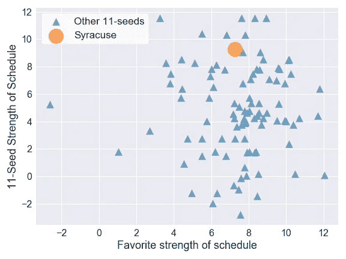
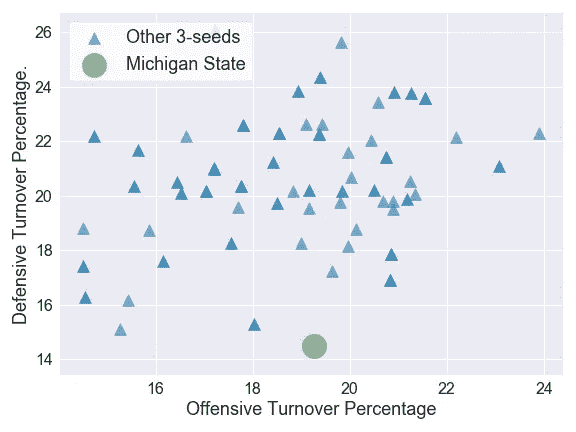
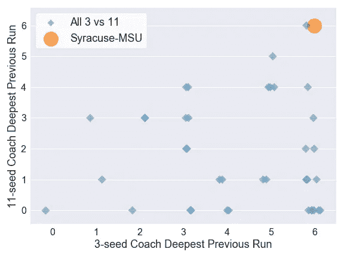

# 从前四到甜蜜的 16 岁:我如何预测锡拉丘兹将颠覆密歇根州立大学

> 原文：<https://towardsdatascience.com/from-first-four-to-sweet-16-how-i-predicted-syracuse-would-upset-michigan-state-32fc95c96fa4?source=collection_archive---------14----------------------->

正如其他人注意到的那样，NCAA 锦标赛的前两轮相当疯狂。用我自己对冷门的定义(一场被排名比对手低至少 4 位的弱队获胜)，仅在周日就有 4 场冷门。到目前为止，总共有 10 场冷门，已经超过了每场比赛 9 场的平均水平。还有 15 场比赛要打！

周日的所有冷门都令人震惊，但也许最令人震惊的是锡拉丘兹大学对密歇根州立大学的胜利。在周日最受欢迎的北卡罗来纳、泽维尔、辛辛那提和密歇根州之间，[斯巴达有最大的分差](http://www.scoresandodds.com/grid_20180318.html?sort=rot)8 分，这意味着密歇根州有 80%的胜算。与大多数年份一样，汤姆·伊佐的队伍是一个深入发展的威胁，他们确实被许多专家选为进入最后 4 强的[。](http://www.espn.com/mens-college-basketball/story/_/id/22738692/espn-experts-make-final-four-national-champion-predictions-2018-ncaa-tournament)

但是你不会在我的范围内找到第二轮之后的密歇根州立大学，因为我的不安预测模型预见到了这一点。我的模型使用[机器学习来检测冷门](/predicting-upsets-in-the-ncaa-tournament-with-machine-learning-816fecf41f01)让锡拉丘兹有 81%的机会击败密歇根州立大学，进入甜蜜的 16 强。

老实说，我很震惊地看到这场比赛的爆冷概率如此之高。对密歇根州立大学的热爱不仅限于公众和专家；甚至先进的评级系统也将密歇根州立大学列为全国最好的球队之一。

今天，我仔细观察这两个团队，以理解为什么我的模型正确地预测了这场混乱。

# 冷门评论:雪城超过密歇根州立大学

是什么因素让这款游戏进入冷门警戒？我将着眼于这场比赛的三个突出特点。

## 锡拉丘兹大学的赛程对 11 号种子选手来说异常艰难

锡拉丘兹大学参加了 ACC，这是一个汇集了通常被认为是全国最好的发电站项目的会议。今年橘子有一个残酷的会议名单，包括北卡罗莱纳州两次，弗吉尼亚两次，杜克大学和克莱姆森，扔在一个非会议游戏对堪萨斯的好措施。关于锡拉丘兹的整体记录的问题让他们在锦标赛上泡沫，但在他们的 13 场比赛中，9 场输给了 NCAA 锦标赛球队。Sports-reference.com 将他们的赛程排在全国第 19 位，相比之下密西根州排在第 56 位。

11 种子球队通常都这么难打赛程吗？答案是响亮的不。

Syracuse played a much tougher schedule than typical 11-seeds

在左侧，我显示了 2003 年至 2017 年所有 11 号种子的赛程评级强度，以及他们的锦标赛对手的赛程强度。在所有 11 个种子队中，只有 7 支球队今年的赛程比锡拉丘兹更艰难。

橙衣军团今年面临特别好的进攻，因为他们的对手平均进攻效率[在全国排名第十](https://kenpom.com/index.php?s=RankSOSO)。虽然 4 场对抗 10 大进攻(杜克，北卡 2x，堪萨斯)的比赛确实产生了 4 场失利，但防守精英进攻的经验可能有助于橙衣军团遏制斯巴达的强大进攻。密歇根州立大学在这个赛季平均每场比赛得 80 分。对锡拉丘兹，他们得了 53 分。

## 对于一个 3 号种子来说，密歇根州立大学在保护球方面表现平平，在历史上也不擅长制造失误。

1-3 号种子队通常是平衡的队伍，在球场两端都很强。密歇根州立大学队也不例外，他们的进攻效率排名第 13，防守排名第 11。但是在所有的三号种子队中，密歇根州立大学在比赛的一个方面一直很糟糕:制造失误。

营业额百分比衡量的是在营业额中所占的百分比，并根据球队的进攻和防守分别计算。下面我展示了自 2003 年以来所有三号种子队的防守失误率和进攻失误率。

Michigan State had the lowest defensive turnover rate among all 3-seeds since 2003

在整个赛季中，斯巴达人的防守只迫使对手 14%的失误。这是自 2003 年以来三号种子选手的最低水平。而且，密歇根州立大学没有平衡这种低防守失误率和进攻中特殊的控球保护，因为他们 19%的财产都以失误告终。这是三粒种子的中间位置。

赢得篮球比赛是不是一定要赢得翻身仗？不总是这样，特别是对于像密歇根州立大学这样的精英得分球队。但是更好的控球保护通常会有所帮助，随着锡拉丘兹大学周日以 14 比 12 赢得了翻盘战，并且仅以 2 分之差获胜，我相信密歇根州立大学会很乐意有几个这样的球员回来。

## 这场 3 对 11 的比赛有着极其罕见的精英教练对决

毫无疑问，密歇根州立大学的汤姆·伊佐和锡拉丘兹大学的吉姆·伯海姆都是教练精英，在比赛中名列前茅。在他们两人之间，他们拥有 2 次全国冠军，12 次四强出场，16 次常规赛冠军。他们都已经在名人堂了。这是一些严重的硬件。

在最初几轮比赛中，顶级锦标赛球队的教练通常会面对简历不如自己丰富的教练，但在这里肯定不是这样。3 号种子教练在第二轮面对这样的精英教练比赛的几率有多大？几乎没有。

This 3 vs 11 game was an extremely rare match-up of elite coaches

对于自 1985 年以来的所有 3 对 11 比赛，我显示了两位教练的比赛经验，用数字表示他们曾经走过的最远回合(添加了一些水平“噪声”以查看数据点)。通常情况下，3 号种子教练面对 11 号种子教练，他们没有深入的比赛。事实上，54%的情况下，3 号种子教练面对的是一个从未赢过锦标赛的 11 号种子教练。

在这种情况下，两位教练之前都参加过(并赢得了)全国决赛。自 1985 年锦标赛扩大到 64 支球队以来，这种情况只发生过一次，而且即使是这一次也有资格赛。2013 年，11 号种子明尼苏达队的教练是 Tubby Smith，他早在 1998 年就在肯塔基州赢得了戒指。

这里的重点不一定是博海姆是一个比伊佐更好的教练。只是当 3 号种子在第二轮面对 11 号种子时，3 号种子教练通常不必与名人堂成员决斗。在这一次，策略无疑发挥了作用。当落后 3 分时，博海姆明智地拒绝了密歇根州立大学任何扳平 3 分的机会，而是选择故意犯规并放弃 2 次罚球。密歇根州立大学赢得或平的唯一机会是在最后一秒绝望的半场投球。它失败了，彻底颠覆了。

# 结束语

这一分析强调了这两个团队之间一些真正有趣的趋势，但我不能肯定地说，这些是预测这场比赛的主要因素。我的模型使用每个团队的许多特征来预测沮丧的可能性，而这些只是导致沮丧的等式的一部分。

我希望你喜欢我沮丧的预测。谁会是下一个成为冷门牺牲品的队伍？点击 [**@** 在 Medium 或 Twitter 上关注我，了解更多信息！](https://twitter.com/bracket_vision)