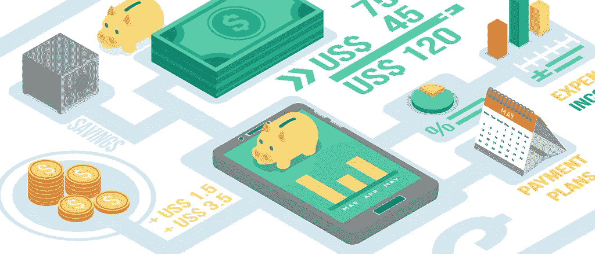

# 从游戏到金融科技:我的 DS 之旅

> 原文：<https://towardsdatascience.com/from-games-to-fintech-my-ds-journey-b7169f08b6ad?source=collection_archive---------5----------------------->

Source: Tech in Asia, https://www.techinasia.com

作为一名分析师和数据科学家(DS)在游戏行业工作了五年后，我决定过渡到创业生活，加入一家金融技术部门的公司。虽然这是一个新的领域，有新类型的问题需要解决，但我在游戏行业发展的许多技能仍然与我的新角色相关。这篇文章的目标是展示如何在一个领域学习数据科学技能可以转移到新的意想不到的机会。

我的新角色的一个关键区别是从企业对消费者(B2C)到企业对企业(B2B)的转变。我现在不是对数百万消费者进行分析，而是构建数据产品，帮助数百家非营利组织和营利性公司。对产品分析的关注也越来越少，而是更多地关注为我们的最终用户提供准确的数据。我现在不是探索来自视频游戏和视频流媒体服务的跟踪数据，而是研究来自各种不同数据源的数据，包括房地产销售和政治捐款。

我在新职位的主要目标是建立预测模型，为美国富裕家庭提供准确的资产净值估算。数据源是不同的，我们的客户是企业而不是消费者，但是数据科学的许多关键功能可以很好地跨越这些领域。以下是我在这个新角色中运用到的一些技能。

**探索性数据分析(EDA)** 能够挖掘数据集对于任何领域都很重要。数据科学家应该能够可视化数据的分布，识别异常值，并找到数据中的相关性。

探索性分析的目标通常是确定数据中是否有预测结果的信号。例如，在游戏行业中，一个常见的目标是识别用户是否会流失或在游戏中失败。这可以表示为一个分类问题，但通常提供汇总统计数据，如漏斗分析，就足以为游戏团队提供反馈。在我的金融科技角色中，一个共同的目标是识别与净值相关的特征，并确定我们是否可以设计出额外的特征来提高我们对净值估计的准确性。

以下是我在这些领域中调查的问题类型:

*   **游戏:**新的订阅模式会蚕食销售额吗？
*   **FinTech:** 政治献金和净资产有关联吗？

我使用了类似的方法来探索这些类型的问题，包括用于数据管理的 SQL 和用于可视化和相关性分析的 R。

**实验** Twitch 的核心原则之一是[实验决定](https://venturebeat.com/2016/05/24/twitch-ceo-describes-values-to-drive-the-company-onward/)，数据科学团队使用 A/B 测试和[分阶段推出](https://blog.twitch.tv/a-b-testing-using-googles-staged-rollouts-ea860727f8b2)的组合来实现这一目标。实验的一个重要元素是能够衡量变化的结果，并确定变化是否对用户行为产生了重大影响。在我目前的角色中，我们经常需要确定营销活动是否对我们的客户产生了可衡量的影响，类似的方法可以用于这类任务。在这两种情况下，我都使用 bootstrapping 来测量实验中治疗组和抵制组之间的差异，并测试统计显著性。

以下是这些不同领域的实验例子:

*   **游戏:**一款应用的重新设计是否提高了移动用户的留存率？
*   金融科技:营销活动推动了收入增长吗？

类似的方法可以用来衡量这些实验的影响，即使这些领域是非常不同的。

**预测建模** 大多数数据科学角色的另一项重要技能是构建预测模型。在游戏行业，这通常涉及到建立模型来预测可能购买游戏或游戏失败的用户。如果您可以检测出哪些用户最有可能执行这些操作，您可以推动用户采取所需的操作，例如发送电子邮件让玩家登录并领取游戏内奖励。预测模型的另一个用途是评估特征的重要性，以便指导游戏设计。例如，在电子艺界，我建立了一个[回归模型](https://www.aaai.org/ocs/index.php/IAAI/IAAI-11/paper/view/3526),该模型确定，探索更多剧本的用户通常比专注于优化少数特定剧本的玩家拥有更低的保留率。

当改变领域时，我必须做出的改变之一是使用新的度量来评估预测模型的性能。对游戏行业分类任务有用的指标，如 F1 得分和 ROC，并不能很好地转化为金融科技领域的任务，如预测房屋的价值。对于此回归任务，您可以使用相对误差、相关系数或其他误差指标，如平均对数误差。

以下是我为这些领域建立的预测模型的例子:

*   **游戏:**哪些用户最有可能购买订阅？
*   **金融科技:**哪些家庭最有可能向非营利组织捐款？

与 EDA 类似，相同的工具可以用于构建跨这些领域的预测模型，我在这两个领域中都使用了 R 来构建原型模型。

**数据产品** 除了原型预测模型之外，数据科学家还应该有一个适当的流程来扩展模型以进行部署。在游戏行业，这通常涉及将模型规范交给工程团队，而在我目前的职位上，我更多地参与模型的产品化。在这两个领域中，您可以使用一种中间模型格式，比如 [PMML](/productizing-ml-models-with-dataflow-99a224ce9f19) 来分离模型训练和模型部署任务。

在这两个领域中，我构建了批处理模式的数据产品，每周计算数百万条记录的值:

*   **游戏:**计算订阅转换分数。
*   **FinTech:** 为房地产创建估价。

我执行这些任务的工具集在角色之间发生了变化。我以前与工程团队一起构建定制解决方案，现在已经转向使用开放工具，如 PMML 和 Apache Beam，来生产模型。

**结论** 在我的数据科学职业生涯中，我从游戏行业转向了金融科技，并在新的岗位上使用了许多不同的数据源，但我在游戏中开发的许多技能都得到了很好的转化。探索性分析、实验、预测性建模和构建数据产品对所有数据科学家来说都是有用的技能，与他们所应用的领域无关。

我的日常工作重心也发生了变化，但这是因为角色类型和领域的变化。我已经从专注于产品分析的角色转变为更专注于机器学习的角色。我花更少的时间构建仪表板，花更多的时间编写代码和提交 PRs。

[本·韦伯](https://www.linkedin.com/in/ben-weber-3b87482/)是[意外收获数据](https://angel.co/windfall-data)的首席数据科学家，我们的任务是确定世界上每个家庭的净资产。

如果你今年参加 GDC，请随时在 twitter 上给我发消息。