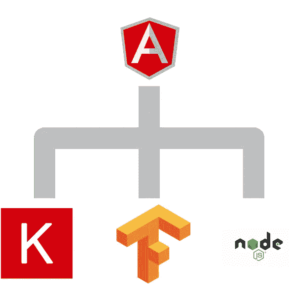
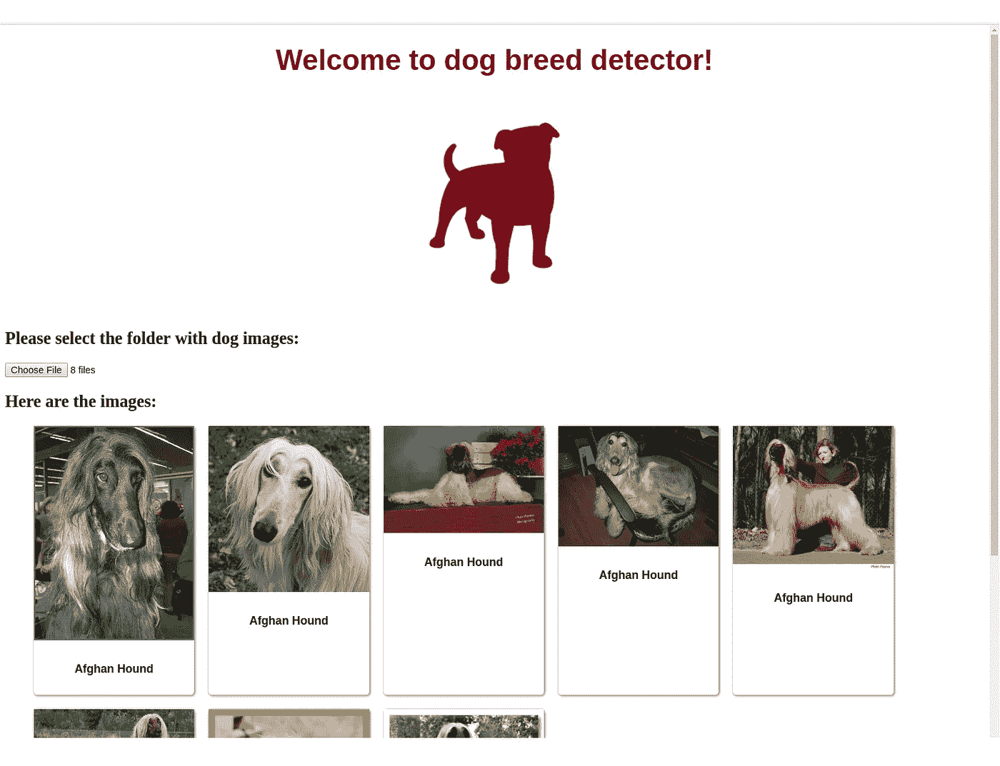

# 从 Keras 模型到角度应用

> 原文：<https://towardsdatascience.com/from-keras-model-to-angular-application-491d3f6c4455?source=collection_archive---------10----------------------->



# 介绍

[与 TensorFlow 合作服务](/how-to-deploy-machine-learning-models-with-tensorflow-part-1-make-your-model-ready-for-serving-776a14ec3198)我想，如果也能为 Keras 模特服务，那就太棒了。 [Keras](https://keras.io/) 的优势是显而易见的——它大大简化了模型开发，并允许比纯 TensorFlow 框架更快地尝试模型。

另一个动机是，我想让客户端独立于庞大的 TensorFlow 框架，并使用非常有限的一部分服务功能。当然，我想直观地显示结果，而不需要通过枯燥的 JSON 输出:-)

## 用 TensorFlow 服务 Keras 模型

Keras 提供高级神经网络 API，能够在 [TensorFlow](https://github.com/tensorflow/tensorflow) 、 [CNTK](https://github.com/Microsoft/cntk) 或 [Theano](https://github.com/Theano/Theano) 之上运行。基本上，它抽象了那些框架，更容易理解和学习，并且允许你用更少的代码做更多的事情。

[TensorFlow Serving](https://github.com/tensorflow/serving) 是一款用于托管机器学习模型的软件。它的主要用途—高性能生产服务。它是用 C++编写的，使用了客户端用于计算的 [Servables](https://www.tensorflow.org/serving/architecture_overview) 的概念。

## 如何与 TensorFlow 服务器对话

TensorFlow Serving 提供 [gRPC API](https://github.com/tensorflow/serving/blob/master/tensorflow_serving/apis/prediction_service.proto) 用于执行回归、预测和推理任务。这种 gRPC API 比 HTTP 协议上的 REST API 具有更好的性能，但是不能被 Web 应用程序简单地使用。因此，在我看来，gRPC 是内部客户的完美选择，但是它应该被一个向外部世界提供 REST API 的服务所包装。

# 犬种检测器

对于我的示例应用程序，我使用了一个[狗品种检测器](https://github.com/Vetal1977/aind2-dog-project)，它是我在 Udacity 纳米学位课程期间实现的。我们想要解决的问题是给定一幅狗的图像进行品种检测。该模型利用了卷积神经网络(CNN)架构，并在 [ImageNet 数据集](http://www.image-net.org/)模型上进行预训练(我选择了 [DenseNet 201](https://arxiv.org/abs/1608.06993) )。该模型是用 Keras 库实现的。

应用的第二部分是一个 [Node.js](https://nodejs.org/en/) 服务，包装 TensorFlow 服务的 gRPC API，对外提供 REST API。该服务尽可能少地依赖 TensorFlow 它使用修改过的 [protobufs](https://developers.google.com/protocol-buffers/) 文件和 [gRPC 库](https://www.npmjs.com/package/grpc)来处理服务器请求。因此，我们不需要在这里安装任何巨大的 TensorFlow 包。

最后一部分是一个非常简单(也不太好)的 [Angular](https://angular.io/) 应用程序，它允许选择狗的图像，向我们的包装服务发送请求，并显示品种。

代码可以在我的 [GitHub repo](https://github.com/Vetal1977/tf_serving_keras) 中找到。如果你觉得有用，可以随意复制、修改和使用:-)

# 从模型到应用

让我们深入研究一下实现细节。这里有 3 个主要部分:

*   使用 Keras 创建和训练模型，并为 TensorFlow 服务做准备
*   实现一个向外界提供 REST API 的包装器服务
*   创建一个简单的狗品种预测和结果显示的应用程序

## 犬种检测器模型

我不想用很多代码把文章弄乱。相反，我将提供实现的链接，并解释我遇到的主要挑战。

我创建模型的方法相当简单(你可以在[*dog _ breed _ detector _ trainer . py*](https://github.com/Vetal1977/tf_serving_keras/blob/master/model_serving/dog_breed_detector_trainer.py)中遵循它)，Francois Chollet 在 [Keras 博客](https://blog.keras.io/building-powerful-image-classification-models-using-very-little-data.html)中对此做了很好的解释。这些步骤是:

*   用权重加载预训练的 DenseNet 201，不加载顶层，并从预训练的网络中提取所谓的瓶颈特征。我已经在[*data _ extractor . py*](https://github.com/Vetal1977/tf_serving_keras/blob/master/model_serving/data_extractor.py)中实现了这个。
*   创建一个简单的顶层模型，该模型使用提取的要素作为输入，并且只有全局平均池和完全连接的图层。模型本身在[*dog _ breed _ detector _ model . py*](https://github.com/Vetal1977/tf_serving_keras/blob/master/model_serving/dog_breed_detector_model.py)中实现。
*   训练顶级模特并保存检查点。这里 可以找到 [*。*](https://github.com/Vetal1977/tf_serving_keras/blob/56150effa31b6c9483d5abd36f8e2727eb082984/model_serving/dog_breed_detector_trainer.py#L77)
*   创建“连接”预训练的 DenseNet 201 和训练的顶部模型的最终模型。这在[*final _ model . py*](https://github.com/Vetal1977/tf_serving_keras/blob/master/model_serving/final_model.py)中实现。
*   为 TensorFlow 服务准备并保存最终模型。你可以在这里 找到 [*。*](https://github.com/Vetal1977/tf_serving_keras/blob/56150effa31b6c9483d5abd36f8e2727eb082984/model_serving/dog_breed_detector_trainer.py#L61)

主要挑战是找到一种合适的方法将 Keras 模型转换为 TensorFlow，并为 TensorFlow 服务做准备。基本上，我们这里有两个任务:将 Keras 模型转换为 [TF 估计器](https://www.tensorflow.org/programmers_guide/estimators)，并将估计器导出为 TensorFlow 服务。

从[版本 1.4](https://developers.googleblog.com/2017/11/announcing-tensorflow-r14.html) 开始，我们可以将 Keras 模型转换为 TF 估计量——只需调用 [model_to_estimator()](https://www.tensorflow.org/api_docs/python/tf/keras/estimator/model_to_estimator) 函数，就大功告成了！

```
tf_estimator = model_to_estimator(keras_model=model)
```

现在，我们可以保存估计器，用于这里描述的。这只是一个对 [export_savedmodel()](https://www.tensorflow.org/api_docs/python/tf/estimator/BaselineClassifier#export_savedmodel) 函数的调用，带有一个用于服务的[接收器函数。这样一个函数在最终模型之上创建了一个附加层，并负责输入解析。在我们的例子中，它将输入的 JPEG 图像转换成一个 3D 张量，可以被模型使用。](https://github.com/Vetal1977/tf_serving_keras/blob/56150effa31b6c9483d5abd36f8e2727eb082984/model_serving/dog_breed_detector_trainer.py#L42)

```
tf_estimator.export_savedmodel(export_dir,
    serving_input_receiver_fn,
    strip_default_attrs=True)
```

为了创建、训练和准备服务模型，首先安装 *unzip* (用于解压缩下载的带有狗图像的档案):

```
sudo apt-get update
sudo apt-get install unzip
```

然后克隆存储库，切换到模型服务目录，下载并解压缩狗图像，并训练模型:

```
git clone [https://github.com/Vetal1977/tf_serving_keras.git](https://github.com/Vetal1977/tf_serving_keras.git)cd tf_serving_keras/model_servingcurl [https://s3-us-west-1.amazonaws.com/udacity-aind/dog-project/dogImages.zip](https://s3-us-west-1.amazonaws.com/udacity-aind/dog-project/dogImages.zip) --output dogImages.zipunzip dogImages.zip
mv dogImages dog_images
rm dogImages.zippython dog_breed_detector_trainer.py
```

我的环境包括:

*   康达 4.3.14
*   Python 3.5.4
*   TensorFlow 1.8 的 GPU 版本
*   Keras 2.1.6

## Node.js 包装服务

第二个组件是一个[包装器服务](https://github.com/Vetal1977/tf_serving_keras/tree/master/detector-api)，它向外界提供 RESTful API，并将 gRPC 与 TensorFlow 服务器对话。附加要求—尽可能减少对 TensorFlow 的依赖。我为服务实现选择了 Node.js 和 Typescript。

第一步是准备 proto bufs——我把它们从[官方仓库](https://github.com/tensorflow/serving/tree/master/tensorflow_serving/apis)中拿出来，扔掉所有我不需要的东西。你可以在这里修改我的版本。我动态加载 protobufs，即在运行时，然后创建一个预测服务，如下所示:

```
this.tfServing = grpc.load(this.PROTO_PATH).tensorflow.serving;
this.client = new this.tfServing.PredictionService(
    this.tfServerUrl, grpc.credentials.createInsecure());
```

动态加载的优点是——您不需要通过每次修改 protobufs 来重新生成 Typescript 代码。缺点是性能下降。因为我只加载了一次 protobufs，所以这个缺点并不严重。

现在，当通过 REST 接口调用服务时，我们获取输入数据(图像作为 base64 编码的字符串)并向 TensorFlow 服务器创建 gRPC 请求—请在[源](https://github.com/Vetal1977/tf_serving_keras/blob/56150effa31b6c9483d5abd36f8e2727eb082984/detector-api/src/services/tf.serving.client.ts#L48)中找到详细信息。

包装器服务是一个 [Node.js express](https://expressjs.com/) 应用程序，使用[*inverisfy*](https://github.com/inversify/InversifyJS)进行依赖注入，使用 [*inverisfy express 实用程序*](https://github.com/inversify/inversify-express-utils) 进行 REST API 实现。

我的服务的 API 基本路径是 */api/v1* ，我的控制器实现了唯一的端点 */predict_breed* ，它允许图片上传并在 TensorFlow 服务器上调用狗的品种预测。要构建一个项目，请执行以下命令(我假设您已经克隆了 repo):

```
cd tf_serving_keras/detector-api
npm install
npm build
```

我的环境包括节点 8.11.3 和 npm 6.1.0。

## 角度应用

最后一部分是一个简单的[角度应用](https://github.com/Vetal1977/tf_serving_keras/tree/master/detector-app)，带有一个按钮来选择一个图像目录和一个区域，用于显示带有预测品种名称的图像。这里没有什么新奇的东西——我使用[这个指南](https://angular.io/guide/quickstart)创建了一个新的 Angular 项目，并根据我的需要扩展了代码。

与包装器服务对话的客户端在[*detector . service . API . client . ts*](https://github.com/Vetal1977/tf_serving_keras/blob/master/detector-app/src/app/services/detector.service.api.client.ts)中实现。实现的注意事项——我有一个[抽象类](https://github.com/Vetal1977/tf_serving_keras/blob/master/detector-app/src/app/services/detector.service.client.ts),它声明了一个预测方法和它的两个实现——上面提到了其中一个，第二个是我尝试使用一个全新的[tensor flow Serving RESTful API](https://www.tensorflow.org/serving/api_rest)。稍后我会提供一些评论。

我们需要注意 [CORS](https://developer.mozilla.org/en-US/docs/Web/HTTP/CORS) 机制。 [Angular HttpClient](https://angular.io/guide/http) 依赖于 [XMLHttpRequest](https://developer.mozilla.org/en-US/docs/Web/API/XMLHttpRequest) ，我不得不将[的后续头](https://github.com/Vetal1977/tf_serving_keras/blob/b5b88be4988ebbc15e254822a83d859f9b5ec382/detector-api/src/api/detector.controller.ts#L43)添加到我的 *Node.js 包装服务*中，以获得应用程序中的响应:

```
'Access-Control-Allow-Origin': '*'
```

这是一个典型的应用程序屏幕，上面有狗的图像和预测的品种:



要构建一个项目，执行以下命令(我假设您已经克隆了 repo):

```
cd tf_serving_keras/detector-app
npm install
npm build
```

# 使用 Docker 进行本地测试

老实说，我懒得分别启动和运行所有 3 个组件:-) [Docker](https://docs.docker.com/) 和 [Docker Compose](https://docs.docker.com/compose/) 让我的生活更轻松。我需要 3 个 Docker 容器——一个用于托管我的模型的 TensorFlow 服务，一个用于包装服务，一个用于我的应用程序。我安装了以下版本:Docker 18.03.1-ce 和 Docker Compose 1.21.2。

## TensorFlow 服务的 Docker 图像

在创建 Docker 映像之前，您必须有一个为 TensorFlow 服务的导出模型——请参见上文如何操作。[上次](/how-to-deploy-machine-learning-models-with-tensorflow-part-2-containerize-it-db0ad7ca35a7)为 TensorFlow 服务创建 Docker 容器花费了很多精力。从那以后事情发生了变化，现在我们可以用 *apt-get* 安装服务组件，而不需要克隆存储库和自己构建服务器。

```
echo "deb [arch=amd64] http://storage.googleapis.com/tensorflow-serving-apt stable tensorflow-model-server tensorflow-model-server-universal" | sudo tee /etc/apt/sources.list.d/tensorflow-serving.listcurl https://storage.googleapis.com/tensorflow-serving-apt/tensorflow-serving.release.pub.gpg | sudo apt-key add -sudo apt-get update && sudo apt-get install tensorflow-model-server
```

我创建了一个 [Dockerfile](https://github.com/Vetal1977/tf_serving_keras/blob/master/model_serving/Dockerfile) ，在这里我执行了那些命令，复制了为服务模型准备的内容并启动了服务器。如果要创建 Docker 映像，请执行以下命令:

```
cd tf_serving_keras/model_serving
<activate your Python environment>
python dog_breed_detector_trainer.py
docker build -t model-serving:latest -f Dockerfile .
```

## Node.js 包装服务的 Docker 图像

包装器服务的 [Dockerfile](https://github.com/Vetal1977/tf_serving_keras/blob/master/detector-api/Dockerfile) 基于节点 8.11.3 镜像。它将源文件复制到映像，构建它们并启动服务。没什么特别的，都是标准的。

## 角度应用的 Docker 图像

我的应用程序的 [Dockerfile](https://github.com/Vetal1977/tf_serving_keras/blob/master/detector-app/Dockerfile) 使用了[多阶段构建](https://docs.docker.com/develop/develop-images/multistage-build/)。首先，我们使用 Node 8.11.3 image 构建应用程序，然后使用 Nginx image 将其隐藏在 Nginx 服务器后面，这在生产环境中很有意义。

## 将它们组合在一起

我们不会也不应该一个接一个地创建 3 个 Docker 容器。相反，我们将它们组合在一起，并用 Docker Compose 使它们彼此可见。在 [docker-compose](https://github.com/Vetal1977/tf_serving_keras/blob/master/docker.compose.yaml) 文件中，我有 3 个服务，属于同一个网络。应用依赖于包装器服务，包装器服务依赖于 TensorFlow 服务。这些服务公开了容器端口，并且可以通过它们的名称相互通信。

要运行完整的应用程序，请执行唯一的命令

```
cd tf_serving_keras
docker-compose -f docker.compose.yaml up
```

打开浏览器，进入*本地主机*。您应该能够看到应用程序，选择图像并看到结果。不要忘记关闭容器

```
docker-compose -f docker.compose.yaml down
```

# 尝试 TensorFlow Serving 1.8 及其 RESTful API

当我准备好我的实现时，我发现从 1.8 版本开始 TensorFlow 服务也提供了 RESTful API。这是一个相当新的功能，我想尝试一下。

不幸的是，它有一些问题。首先，对于 CORS 机制，您必须有一种特殊的代理，因为您不能更改服务器代码。最受欢迎的是 [cors-anywhere](https://github.com/Rob--W/cors-anywhere) 。我创建了一个[小包装器](https://github.com/Vetal1977/tf_serving_keras/tree/master/cors-anywhere)并将其打包到 Docker 容器中。如前所述，我在应用程序中实现了一个[客户端](https://github.com/Vetal1977/tf_serving_keras/blob/master/detector-app/src/app/services/detector.service.tf.client.ts)，它通过 REST 直接与 TensorFlow 服务器对话。

其次，应该将图像数据包含在发送给服务器的 JSON 对象中。对于大图像，这不是一个正确的方法，我总是倾向于使用*多部分/形式数据*来实现这个目的。

如果您想尝试，请查看客户端源代码，并使用

```
docker-compose -f docker.compose.cors.yaml up
```

# GPU 支持

如果你有一台装有 NVidia 显卡的电脑，并且安装了 CUDA 和 CUDnn 库，那么我们也可以在 Docker 中使用它们。但是我们需要做一些准备:

*   确保 Docker Compose 的版本至少是 1.19.0
*   [安装 NVidia 容器运行时](https://github.com/nvidia/nvidia-container-runtime)。我使用了以下命令:

```
curl -s -L https://nvidia.github.io/nvidia-container-runtime/gpgkey | \
  sudo apt-key add -distribution**=$(**. /etc/os-release;echo $ID$VERSION_ID**)**curl -s -L https://nvidia.github.io/nvidia-container-runtime/$distribution/nvidia-container-runtime.list | \
  sudo tee /etc/apt/sources.list.d/nvidia-container-runtime.listsudo apt-get updatesudo apt-get install nvidia-container-runtime
```

*   [通过 Docker](https://github.com/nvidia/nvidia-container-runtime#docker-engine-setup) 注册该运行时。我对守护程序配置文件使用了该方法:

```
sudo tee /etc/docker/daemon.json <<EOF
{
    "runtimes": {
        "nvidia": {
            "path": "/usr/bin/nvidia-container-runtime",
            "runtimeArgs": []
        }
    }
}
EOF
sudo pkill -SIGHUP dockerd
```

现在快跑

```
docker-compose -f docker.compose.gpu.yaml up
```

你应该得到一个 GPU 驱动的应用程序版本。你可以在资源库中找到支持 GPU 的 [Dockerfile](https://github.com/Vetal1977/tf_serving_keras/blob/master/model_serving/Dockerfile.gpu) 和 [Docker-compose](https://github.com/Vetal1977/tf_serving_keras/blob/master/docker.compose.gpu.yaml) 文件。

**注意**:可能需要几个小时才能看到系统启动并运行。原因是——我们仍然需要编译 TensorFlow 的 GPU 版本来创建一个合适的 Docker 图像。

# 结论

对我来说，实现从 Keras 模型到 UI 的完整深度学习应用程序是一次很好的体验。我尝试和使用了一些新的东西，并且为了在本地运行和测试所有东西，我需要解决一些挑战。我希望这对您的目的也有用:-)