# 从范数到正交性:带有直观例子的机器学习基础数学第 2/3 部分

> 原文：<https://towardsdatascience.com/from-norm-to-orthogonality-fundamental-mathematics-for-machine-learning-with-intuitive-examples-57bb898e69f2?source=collection_archive---------9----------------------->

为了理解机器学习算法的数学，特别是深度学习算法，从基础到更高级建立数学概念是必不可少的。不幸的是，数学理论在许多情况下太难/抽象/枯燥，难以消化。想象你正在吃一个比萨饼，喝一杯可乐总是更容易和更有趣。

这篇文章的目的是**为基础数学理论提供直观的例子**使学习体验更加愉快和难忘，那就是鸡翅配啤酒，薯条配番茄酱，里脊配葡萄酒。

包含 3 门课程的机器学习基础数学课程组织如下:

[**从标量到张量**:带有直观例子的机器学习基础数学**第 1/3 部分**](https://medium.com/@alina.li.zhang/from-scalar-to-tensor-fundamental-mathematics-for-machine-learning-with-intuitive-examples-part-163727dfea8d)

*   什么是标量、矢量、矩阵和张量？
*   标量、向量和矩阵之间的加法
*   标量、向量和矩阵之间的乘法
*   单位矩阵和逆矩阵
*   对角矩阵和对称矩阵

**从范数到正交**:带有直观示例的机器学习基础数学**第 2/3 部分**

*   向量的 1-范数，2-范数，最大范数
*   正交和标准正交向量
*   正交矩阵

[**从特征分解到行列式**:带有直观例子的机器学习基础数学**第 3/3 部分**](https://medium.com/@alina.li.zhang/from-eigendecomposition-to-determinant-fundamental-mathematics-for-machine-learning-with-1b6b449a82c6)

*   矩阵的特征分解:特征值和特征向量
*   跟踪运算符
*   方阵的行列式

在本文中，我们将通过直观的例子，从范数到正交性讨论第 2/3 部分**。**

## 向量的 1-范数，2-范数，最大范数

如何度量一个矢量的大小？一种方法是使用范数函数:

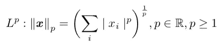

*   1-范数:在机器学习应用中，当 0 和非 0 元素之间的差异很重要时，通常使用 1-范数。

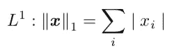

例如，向量 ***v*** 的 1 范数可以计算为:

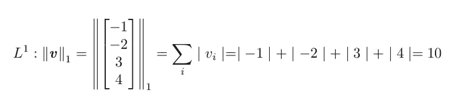

*   **2-范数**:通称欧氏范数，是原点到向量 ***x*** 所标识的点的欧氏距离。

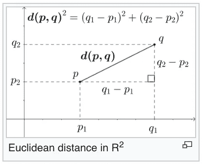

Photo credit to [wikipedia](https://en.wikipedia.org/wiki/Euclidean_distance)

通常使用平方 2-范数而不是 2-范数本身来度量向量的大小。原因是平方 2 范数可以计算为:

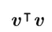

这比计算 2-范数本身更方便。下面的例子说明了如何计算向量 ***v:*** 的 2-范数

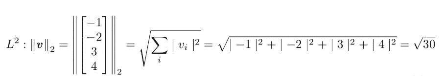

*   **最大范数**:向量中元素的最大绝对值，可以写成:

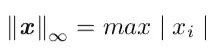

下面的例子显示了向量 ***v:*** 的最大范数的计算

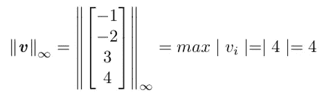

## 正交和标准正交向量

向量 ***u*** 和向量 ***v*** 彼此正交**当且仅当它们的点积为 0:**

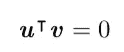

例如，在三维欧几里得空间中，

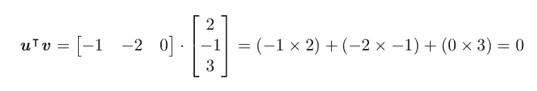

在几何学中，两个正交向量在欧几里得空间中相互垂直:

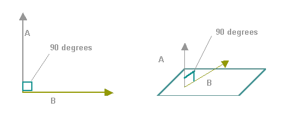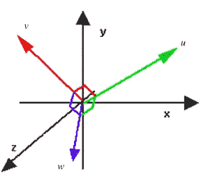

Photo credit to [ubisafe](https://ubisafe.org/orthogonal-vector.html)

向量 u 和向量 v 是一对**正交的**向量的意思是:

它可以扩展到 3-D 欧几里得空间中的下列方程:

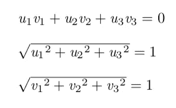

举个例子，

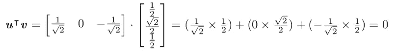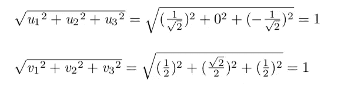

因此，我们说，向量 ***u*** 和向量 ***v*** 是正交的。

## 正交矩阵

正交矩阵是行和列正交的正方形矩阵:

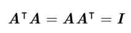

例如，以下矩阵是正交的，因为:

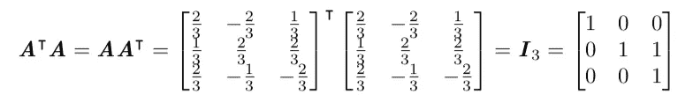

这意味着如果一个矩阵的转置等于其逆矩阵，则该矩阵是正交的:

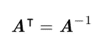

因此，正交矩阵是机器学习中感兴趣的，因为矩阵的逆的计算非常便宜。我们需要注意的是，正交矩阵中的行和列不仅是正交的，而且是正交的。

恭喜你！你已经用直观的例子完成了机器学习基础数学的三分之二。你能做到的！

## 下一步: [**从特征分解到行列式**:带有直观例子的机器学习基础数学**第 3/3 部分**](https://medium.com/@alina.li.zhang/from-eigendecomposition-to-determinant-fundamental-mathematics-for-machine-learning-with-1b6b449a82c6)