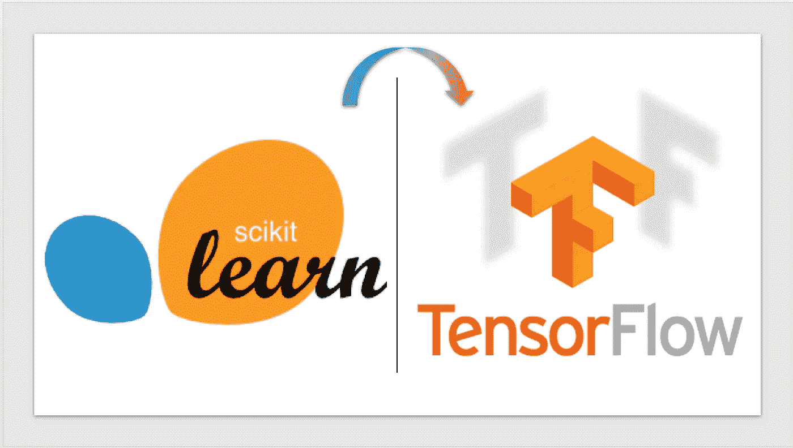
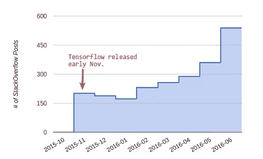

# 从 Scikit-学习到 TensorFlow:第 1 部分

> 原文：<https://towardsdatascience.com/from-scikit-learn-to-tensorflow-part-1-9ee0b96d4c85?source=collection_archive---------1----------------------->

# 介绍

在过去的一年半时间里， [TensorFlow](https://www.tensorflow.org/) 无论是在[采用率](http://deliprao.com/archives/168)还是在[计算速度](https://www.tensorflow.org/performance/benchmarks)方面都以惊人的速度增长。



Image Source: Unreasonable Popularity of TensorFlow [[http://deliprao.com/archives/168](http://deliprao.com/archives/168)]

TensorFlow 已经成为最受欢迎的机器学习(ML)算法开发库。然而，它似乎也把自己建立成了一个库，需要对会话和图形进行定义，这是相当乏味和耗时的。虽然它在有效计算梯度以训练[CNN](https://en.wikipedia.org/wiki/Convolutional_neural_network)、 [RNNs](https://en.wikipedia.org/wiki/Recurrent_neural_network) 和[lstm](https://en.wikipedia.org/wiki/Long_short-term_memory)方面做得很好，但这还不是全部。

在这一系列帖子中，我想讨论如何将 TensorFlow 用作通用 ML 库。更具体地说，我们将讨论它如何类似于 [scikit-learn](http://scikit-learn.org/) ，另一个在数据科学家和开发人员中非常流行的 ML 库。

# 转向 TensorFlow 的理由

虽然 scikit-learn 拥有高度优化的算法，但在面对大量数据点时，它缺乏扩展能力。然而，TensorFlow 提供了许多优于 scikit-learn 的优势:

*   高性能 ML 模块
*   可定制性
*   纵向扩展以满足大数据点的需求
*   能够利用 GPU 并在地理上分散的 GPU 设备之间进行培训
*   设备无关计算
*   利用 [Google Cloud](https://cloud.google.com/ml-engine/) 在训练好的 ML 模型上进行推理
*   高度灵活的 [Apache 2.0 许可](https://github.com/tensorflow/tensorflow/blob/master/LICENSE)而 scikit-learn 是基于 [BSD 许可](http://scikit-learn.org/stable/)(虽然两者都是商业可用的，但是 Apache 2.0 不太容易出现专利诉讼)

# 目标

*   了解 scikit-learn 和 TensorFlow 之间的相似功能，这些功能将允许 scikit-learn 用户无缝使用 TensorFlow。
*   使用 scikit-learn 和 TensorFlow 开发一个程序来对来自[鸢尾花](http://archive.ics.uci.edu/ml/datasets/Iris?ref=datanews.io)数据集的花卉品种进行分类，以了解构建这样一个系统所需的工作。
*   展示 TensorFlow 如何简单地实现新想法的原型。

# 功能级相似性

scikit-learn 受欢迎的原因之一是由于它的简单

```
classifier.fit() / classifier.predict() 
```

对于所使用的任何分类器都保持不变的方法。这种简单的用户体验使开发人员能够专注于算法及其参数，而不是担心需要调用哪些 API 来完成手头的任务。

另一方面，我们在 TensorFlow 中有受 scikit-learn 启发的高级 API 。TensorFlow 中的这些函数的工作方式与 scikit-learn 非常相似，具有类似的 *fit* 和 *predict* 方法以及允许进一步微调的其他功能。

在我们深入研究使用 TensorFlow 的高级 API 调用开发我们的分类框架之前，让我们讨论一下 TensorFlow 的低级计算框架。TensorFlow 使用[计算图](https://www.tensorflow.org/versions/r0.10/get_started/basic_usage)来执行所有计算。计算被表示为`tf.Graph`对象的实例，其中数据被表示为`tf.Tensor`对象，并且使用`tf.Operation`对象对这些张量对象进行操作。然后使用`tf.Session`对象在会话中执行该图。很明显，使用 TensorFlow 的低级 API 创建一个分类框架需要测试一个简单的 ML 原型。这也是我们讨论 TensorFlow 的高级 API 与 scikit-learn 的 API 进行对比的原因之一。我们将在以后的文章中讨论低级 API 及其用法。

# 示例代码

我们使用 scikit-learn 的 [SVM](http://scikit-learn.org/stable/modules/svm.html) 模块和 TensorFlow 的高级 API 构建了一个分类器，根据花的特征对花进行分类。在这种情况下，数据集提供了 4 个不同的特征，如*萼片宽度*、*萼片长度*、*花瓣宽度*和*花瓣长度*，以将花分类为三个花卉品种之一(*鸢尾、杂色鸢尾*和*海滨鸢尾*)。)

这个项目的代码可以在我的 GitHub 页面上找到。


Image source: TensorFlow Quickstart [[https://www.tensorflow.org/get_started/tflearn](https://www.tensorflow.org/get_started/tflearn)]

如果我们看看上面 GitHub 链接上的笔记本，我们可以看到数据加载和拆分功能是由两个框架共享的。我们在 scikit-learn 中定义了一个 SVM 分类器，如下所示:

```
*# ------------------------------------------*
*# Scikit Learn Implementation*
*# ------------------------------------------*
*# Use support vector classification*
classifier_sk = svm.SVC()*# Use the train data to train this classifier*
classifier_sk.fit(x_train, y_train)*# Use the trained model to predict on the test data*
predictions = classifier_sk.predict(x_test)
score = metrics.accuracy_score(y_test, predictions)
```

在上面的代码片段中，我们简单地定义了一个支持向量分类器 *svm。SVC()* ，其对象用于训练和预测。使用 *fit()* 实现训练，而使用 *predict()* 方法调用实现预测。我们最后计算这个四行代码片段最后一行的精度值。

另一方面，在 TensorFlow 中，我们可以使用深度神经网络(DNN)分类器来完成相同的任务。我们使用 TensorFlow 的 *contrib* 模块下的 [DNNClassifier](https://www.tensorflow.org/api_docs/python/tf/contrib/learn/DNNClassifier) 如下:

```
*# ------------------------------------------*
*# TensorFlow Implementation*
*# ------------------------------------------**# Extract the features from the training data*
feats = tf.contrib.learn.infer_real_valued_columns_from_input(x_train)*# Building a 3-layer DNN with 50 units each.*
classifier_tf = tf.contrib.learn.DNNClassifier(feature_columns=feats, 
                                               hidden_units=[50, 50, 50], 
                                               n_classes=3)*# Use the train data to train this classifier*
classifier_tf.fit(x_train, y_train, steps=5000)*# Use the trained model to predict on the test data*
predictions = list(classifier_tf.predict(x_test, as_iterable=True))
score = metrics.accuracy_score(y_test, predictions)
```

在上面的代码片段中，我们可以看到如何为几乎相同数量的行(*构建 DNN，除了用于将输入数据转换为要素的附加行。*)这一额外的行完成了将输入数据转换成密集的、固定长度的浮点值的任务。

# 向张量流迁移的路径

虽然从一个框架转移到另一个框架的任务通常令人畏惧，有时令人沮丧，但 TensorFlow 似乎有一座桥梁，允许开发人员从一个不同的框架平稳过渡。 *contrib.learn* 模块提供了这样一个桥梁，允许从 scikit-learn 或 [Keras](https://keras.io/) 到 TensorFlow 的熟悉路径。

TensorFlow 还具有足够的适应性，可以包含针对生产质量使用进行了高度优化的[阅读器](https://www.tensorflow.org/programmers_guide/reading_data)，同时支持 ML 社区使用的大多数文件格式。这使得开发人员可以避免依赖其他框架，如[熊猫](http://pandas.pydata.org/)(它完成了读取文件的繁重工作，但仍然需要手动将数据输入 ML 框架。)在今年早些时候举行的 [TensorFlow 开发峰会](https://www.youtube.com/watch?v=t64ortpgS-E)上，TensorFlow 阅读器也表现出了高性能。

# 摘要

在这篇文章中，我们开始探索使用 scikit-learn 和 TensorFlow 开发一个分类器来完成一个简单的任务。我们讨论了高级 TensorFlow API 如何类似于 scikit-learn 的 API。你可以在我的 [GitHub](http://bit.ly/sklearn-tf-notebook) 页面访问这篇博客中讨论的代码。

在下一篇文章中，我打算介绍更多的 scikit 模块及其 TensorFlow 对应模块。你有什么特别的想法吗？给我发推特 [@krtk](http://bit.ly/twitter-krtk) 或者在 [LinkedIn](https://www.linkedin.com/in/karthikmuthuswamy/) 上联系我。