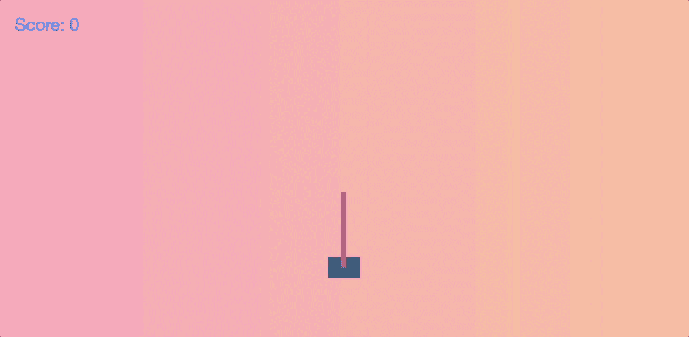
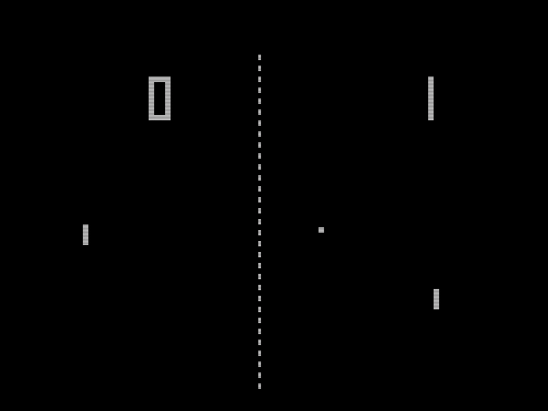
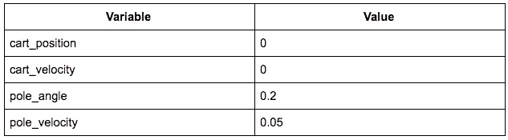
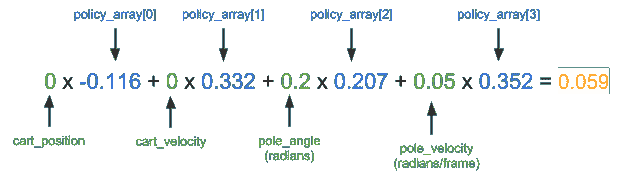
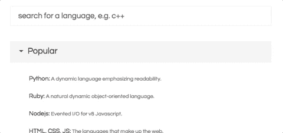
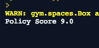
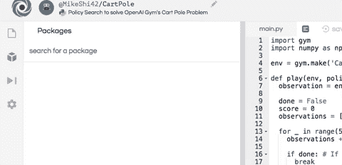
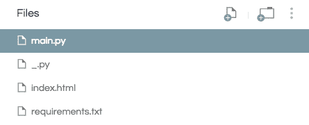

# 从无到有:50 行 Python 中的人工智能平衡术

> 原文：<https://towardsdatascience.com/from-scratch-ai-balancing-act-in-50-lines-of-python-7ea67ef717?source=collection_archive---------3----------------------->

Ours will do a little bit better than this in the end :)

大家好！今天我想展示如何用 50 行 Python 语言教会一台机器平衡一根杆子！我们将使用标准的 [OpenAI Gym](https://gym.openai.com/) 作为我们的测试环境，并且只用 numpy 创建我们的代理。

手推车杆子问题是我们必须左右推动手推车来平衡上面的杆子。这类似于在我们的指尖垂直平衡一支铅笔，除了一维(相当有挑战性！)

在我们开始之前，你可以在 repl.it 查看[的最终演示。](https://repl.it/@MikeShi42/CartPole)

# RL 速成班

如果这是你第一次学习机器学习或强化学习，我会在这里介绍一些基础知识，这样你就会对我们在这里使用的术语有所了解:)。如果这不是你的第一次，你可以继续往下跳，制定我们的政策！

**强化学习**

强化学习(RL)是一个研究领域，致力于教导代理(我们的算法/机器)执行某些任务/动作，而不明确告诉它如何做。把它想象成一个婴儿，随意地移动它的腿；幸运的是，如果婴儿站直了，我们会给它一颗糖/奖励。同样，代理人的目标将是在其一生中最大化总报酬，我们将决定与我们想要完成的任务相一致的报酬。对于站立的例子，当直立时奖励 1，否则奖励 0。

一个 RL 代理的例子是 AlphaGo，代理已经学会了如何玩围棋来最大化它的奖励(赢得比赛)。在本教程中，我们将创建一个代理，它可以通过向左或向右推手推车来解决平衡手推车上的杆子的问题。

**状态**

What a game of pong looks like, in case you need a refresher

一个**状态**就是游戏目前的样子。我们通常处理游戏的数字表示。在乒乓游戏中，可能是每个球拍的垂直位置和 x，y 坐标+球的速度。在小车杆的情况下，我们的状态由 4 个数字组成:小车的位置，小车的速度，杆的位置(作为一个角度)和杆的角速度。这 4 个数字作为一个数组(或向量)提供给我们。这很重要；理解状态是一组数字意味着我们可以对它做一些数学运算，以决定我们想要根据状态采取什么行动。

**政策**

策略是一个函数，它可以获取游戏的状态(例如棋盘棋子的位置，或者手推车和杆子的位置)并输出代理在该位置应该采取的动作(例如移动骑士，或者把车推到左边)。在代理采取我们选择的行动后，游戏将更新下一个状态，我们将再次将它输入策略以做出决定。这种情况一直持续到游戏以某种方式结束。政策非常重要，也是我们所寻求的，因为它是代理背后的决策能力。

**点积**

两个数组(向量)之间的点积就是将第一个数组的每个元素乘以第二个数组的相应元素，然后将所有元素相加。假设我们想要找到数组 A 和 B 的点积，它将简单地是 A[0]*B[0] + A[1]*B[1]…我们将使用此操作将状态(这是一个数组)乘以另一个数组(这将是我们的策略)。我们将在下一节中看到这一点。

# 发展我们的政策

为了解决我们的车杆游戏，我们希望让我们的机器学习一种策略或政策来赢得游戏或最大化我们的奖励。

对于我们今天要开发的代理，我们将把我们的策略表示为一个由 4 个数字组成的数组，这些数字表示状态的每个组成部分有多“重要”(手推车位置、杆子位置等)。)然后我们将策略数组与状态进行点积，以输出一个数字。根据数字是正数还是负数，我们将向左或向右推手推车。

如果这听起来有点抽象，让我们挑选一个具体的例子，看看会发生什么。

假设手推车在游戏中处于中心位置，并且静止不动，杆子向右倾斜，并且也向右倾斜。它看起来会像这样:

关联的状态可能如下所示:

那么状态数组将是[0，0，0.2，0.05]。

现在，凭直觉，我们会想通过向右推手推车，把杆子拉直。我从一次训练中获得了一个好的策略，它的策略数组是:[-0.116，0.332，0.207 0.352]。让我们手动快速计算一下，看看这个策略作为这个州的一个动作会输出什么。

这里我们将点积状态数组[0，0，0.2，0.05]和策略数组(粘贴在上面)。如果数字是正数，我们向右推，如果数字是负数，我们向左推。

结果是肯定的，这意味着在这种情况下，政策也会把车推到右边，这正是我们想要的结果。

现在这一切都很好，很明显，我们需要的是 4 个像上面这样的神奇数字来帮助解决这个问题。现在，我们如何得到这些数字？如果我们只是随机挑选呢？效果如何？让我们找出答案，并开始挖掘代码！

# 启动你的编辑器！

让我们在 [repl.it](https://repl.it/) 上打开一个 Python 实例。它允许您快速调用大量不同编程环境的云实例，并在一个强大的云 IDE 中编辑代码，该 IDE 在任何地方都可以访问！

# 安装软件包

我们将从安装这个项目所需的两个包开始:numpy 帮助进行数值计算，OpenAI Gym 作为我们代理的模拟器。

只需在编辑器左侧的包搜索工具中键入`gym`和`numpy`，然后单击加号按钮安装包。

# 奠定基础

让我们首先将刚刚安装的两个依赖项导入到我们的`main.py`脚本中，并设置一个新的健身房环境:

接下来，我们将定义一个名为“play”的函数，它将被给予一个环境和一个策略数组，并将在该环境中播放该策略数组并返回分数，以及在每个时间步长的游戏快照(观察)。我们将使用分数来告诉我们该策略的执行情况，并使用快照来观察该策略在单个游戏中的表现。这样我们可以测试不同的政策，看看他们在游戏中表现如何！

让我们从函数定义开始，并将游戏重置为开始状态。

接下来，我们将初始化一些变量来跟踪游戏是否已经结束，策略的总得分，以及游戏过程中每一步的快照(观察)。

现在我们将简单地玩游戏很多时间步骤，直到健身房告诉我们游戏结束。

上面的大部分代码主要只是在玩游戏和记录结果。我们政策的实际代码只有这两行:

我们在这里做的只是策略数组和状态(观察)数组之间的点积运算，就像我们在前面的具体例子中展示的那样。然后我们根据结果是积极的还是消极的来选择 1 或 0(左或右)的行动。

到目前为止我们的`main.py`应该是这样的:

现在我们要开始玩一些游戏，找到我们的最优策略！

# 玩第一个游戏

现在我们有一个函数来玩这个游戏，并告诉我们的策略有多好，我们将希望开始生成一些策略，并看看它们做得有多好。

如果我们一开始只是尝试插入一些随机策略会怎么样？我们能走多远？让我们使用`numpy`来生成我们的策略，这是一个 4 元素数组或 1x4 矩阵。它将在 0 和 1 之间选择 4 个数字作为我们的策略。

有了这个策略，以及我们在上面创建的环境，我们可以让他们参与进来并获得分数。

只需点击 run 来运行我们的脚本。它应该输出我们的策略得到的分数。

这个游戏的最高分数是 500，很有可能你的政策并不顺利。如果你的有，恭喜你！今天一定是你的幸运日！虽然仅仅看到一个数字并不是很有价值，但是如果我们能想象我们的代理如何玩游戏，那就太好了，下一步我们将设置它！

# 监视我们的特工

为了观察我们的代理，我们将使用 [Flask](http://flask.pocoo.org/) 来设置一个轻量级服务器，这样我们就可以在浏览器中看到代理的表现。Flask 是一个轻量级的 Python HTTP 服务器框架，可以服务于我们的 HTML UI 和数据。我将保持这一部分的简短，因为渲染和 HTTP 服务器背后的细节对于培训我们的代理并不重要。

我们首先要将`Flask`安装成一个 Python 包，就像我们在前面几节中安装`gym`和`numpy`一样。

接下来，在脚本的底部，我们将创建一个 flask 服务器。它将在`/data`端点上公开游戏的每一帧记录，并在`/`上托管 UI。

此外，我们需要添加两个文件。一个是项目的空白 Python 文件。这是 repl.it 如何检测 repl 是处于[评估模式还是项目模式](https://repl.it/site/docs/repls/files)的技术问题。只需使用“新建文件”按钮添加一个空白 Python 脚本。

之后，我们还想创建一个`index.html`来托管渲染 UI。这里就不深究细节了，只是简单的**把这个**[**index.html**](https://gist.github.com/MikeShi42/7b5ff55e2320e41228b5c25ad1113321)**上传到你的 repl.it 项目**。

您现在应该有一个如下所示的项目目录:

现在有了这两个新文件，当我们运行 repl 时，它应该也能回放我们的策略是如何执行的。有了这些，让我们试着找到一个最优策略！

# 策略搜索

在第一遍中，我们简单地随机选择了一个策略，但是如果我们选择了几个策略，并且只保留了做得最好的一个，那会怎么样呢？

让我们回到播放策略的那一部分，我们不只是生成一个策略，而是编写一个循环来生成几个策略，并跟踪每个策略的表现，只保存最佳策略。

我们将首先创建一个名为`max`的元组，它将存储目前为止我们看到的最佳策略的分数、观察值和策略数组。

接下来，我们将生成并评估 10 个策略，并将最佳策略保存在 max 中。

我们还必须告诉我们的`/data`端点返回最佳策略的回放。

此端点:

应改为:

你的 main.py 看起来应该类似于 [this now](https://gist.github.com/MikeShi42/3c270ce2d13f2709ef2d5983492a1693) :

如果我们现在运行 repl，我们应该得到 500 的最高分，如果不是，尝试再运行一次 repl！我们也可以看到政策平衡的极点完美无缺！哇，太简单了！

# 没那么快

也可能不是。在第一部分中，我们在几个方面做了些手脚。首先，我们只在 0 到 1 的范围内随机创建策略数组。这只是发生了工作，但是如果我们把大于操作符反过来，我们会看到代理将会灾难性地失败。要亲自尝试，请将`action = 1 if outcome > 0 else 0`更改为`action = 1 if outcome < 0 else 0`。

这似乎不太可靠，因为如果我们只是碰巧选择了小于而不是大于，我们就永远找不到可以解决这个游戏的策略。为了缓解这种情况，我们实际上也应该生成带有负数的策略。这将使找到一个好的政策变得更加困难(因为许多负面的政策都不是好的)，但是我们不再通过将我们的特定算法适用于这个特定的游戏来“作弊”。如果我们试图在 OpenAI 健身房的其他环境中这样做，我们的算法肯定会失败。

为了做到这一点，而不是有`policy = np.random.rand(1,4)`，我们将改变为`policy = np.random.rand(1,4) - 0.5`。这样，我们策略中的每个数字将介于-0.5 和 0.5 之间，而不是 0 到 1。但是因为这更困难，我们还想搜索更多的策略。在上面的 for 循环中，我们不遍历 10 个策略，而是通过将代码改为`for _ in range(100):`来尝试 100 个策略。我也鼓励你先尝试遍历 10 个策略，看看现在用负数得到好的策略有多难。

现在我们的 main.py 应该看起来像这样:

如果你现在运行 repl，不管我们使用的是大于还是小于，我们仍然可以为游戏找到一个好的策略。

# 没那么快 Pt。2

但是等等，还有呢！即使我们的政策可能能够在一次运行中达到最高 500 分，它能每次都做到吗？当我们生成了 100 个策略，并选择在单次运行中表现最好的策略时，该策略可能只是非常幸运，也可能是非常糟糕的策略，只是碰巧表现非常好。这是因为游戏本身具有随机性(每次的起始位置都不同)，所以一项政策可能只在一个起始位置有效，而在其他位置无效。

因此，为了解决这个问题，我们需要评估一项政策在多次试验中的表现。现在，让我们采用之前发现的最佳策略，看看它在 100 次试验中表现如何。

在这里，我们玩 100 次最佳策略(`max`的索引 2)，并记录每次的分数。然后，我们使用`numpy`计算平均分数，并将其打印到我们的终端。“已解决”没有明确的定义，但应该只比 500 差几分。你可能会注意到，有时候最好的政策实际上可能是不合格的。但是，我将把修复工作留给您来决定！

# 完成=真

*祝贺你！*🎉我们已经成功地创造了一个人工智能，可以非常有效地解决 cart pole，而且相当高效。现在有很大的改进空间，这将是后续系列文章的一部分。有些事情我们可以深入调查:

*   找到一个“真正的”最优策略(将在 100 个单独的行动中表现良好)
*   优化我们必须搜索以找到最佳策略的次数(“样本效率”)
*   对保单进行适当的搜索，而不是随意挑选。
*   解决[其他环境](https://gym.openai.com/envs/#classic_control)。

如果您有兴趣在您的下一个项目中使用预训练模型和开箱即用的工作代码来尝试更多的 ML，请查看 [ModelDepot](https://modeldepot.io) ！