# 从零开始:贝叶斯推理，马尔可夫链蒙特卡罗和大都会黑斯廷斯，用 python 编写

> 原文：<https://towardsdatascience.com/from-scratch-bayesian-inference-markov-chain-monte-carlo-and-metropolis-hastings-in-python-ef21a29e25a?source=collection_archive---------0----------------------->

Credit: Adi coco [unsplash](https://unsplash.com/photos/kQW7xY7ponQ)

你好，欢迎阅读“从零开始”系列的第一篇文章，在这里我解释并实现/构建任何从零开始的东西。

我为什么要这么做？因为在目前的情况下，我们拥有如此强大的库和工具，可以为我们做很多工作。大多数有经验的作者都很清楚实现这些工具的复杂性。因此，他们利用它们为来自不同背景的用户提供简短、易懂和切题的阅读。在我阅读的许多文章中，我无法理解这个或那个算法在实践中是如何实现的。它们的局限性是什么？为什么要发明它们？什么时候应该使用它们？

正如[希拉里·梅森](https://medium.com/u/e96a7113dcad?source=post_page-----ef21a29e25a--------------------------------)所说:

> “当你想使用一种你并不深刻理解的新算法时，最好的方法是自己实现它，以了解它是如何工作的，然后使用一个库来受益于健壮的代码。”

这就是为什么，我提议从零开始解释和实现:贝叶斯推理(有点简略)，马尔可夫链蒙特卡罗和 Metropolis Hastings，用 Python。

笔记本和 pdf 版本可以在我的知识库中找到: [joseph94m](https://github.com/Joseph94m/MCMC/blob/master/MCMC.ipynb)

**先决条件**:基本概率、微积分、Python。

# 1-简介

在我的许多阅读中，我遇到了一种叫做马尔可夫链蒙特卡罗的技术，或者更通常的说法，MCMC。对这种方法的描述大致如下:MCMC 是一类从概率分布中取样的技术，可用于估计给定一组观察值的参数分布。

当时，我并没有多想。我想，“哦，这只是另一种采样技术”，我决定在我实际需要的时候读读它。这种需要从未出现过，或者它出现了，而我错误地使用了其他东西来解决我的问题。

## 1.1-那么为什么现在有兴趣呢？

最近，我看到了一些关于 MCMC 及其一些实现的讨论，特别是 Metropolis-Hastings 算法和 PyMC3 库。**Markov Chain Monte Carlo in Python 一个完整的现实世界实现，**是最吸引我注意的文章。在这篇文章中，William Koehrsen 解释了他是如何通过将该方法应用于现实世界的问题来学习该方法的:估计代表其睡眠模式的逻辑函数的参数。

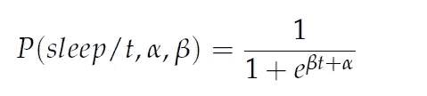

The assumed model

Koehrsen 先生使用 Metropolis-Hastings 算法的 PyMC3 实现来计算α和β的分布空间，从而推导出最可能的逻辑模型。

## 1.2-那我为什么要说这些呢？

在本文中，我打算从头实现 Metropolis-Hastings 算法，为一个虚拟数据示例和一个真实世界的问题寻找参数分布。

我想如果我把手弄脏了，我也许最终能理解它。我只会用 numpy 来实现算法，用 matplotlib 来画漂亮的东西。或者，scipy 可以用来计算密度函数(我将在后面讨论)，但我也将展示如何使用 numpy 实现它们。

## 1.3-文章的流程

在第 1 部分，我将介绍贝叶斯推理，MCMC-MH 及其数学组成部分。在第 2 部分中，我将解释使用虚拟数据的 MH 算法。最后，第 3 部分将提供 MCMC-MH 的一个实际应用。

# 第 1 部分:贝叶斯推理，马尔可夫链蒙特卡罗，和大都会黑斯廷斯

## 2.1-概率哲学的鸟瞰图

为了讨论贝叶斯推理和 MCMC，我将首先解释什么是概率的贝叶斯观点，并把它放在它的历史背景中。

**2.1.1-频率主义者 vs 贝叶斯思维**

概率有两种主要的解释:**贝叶斯**和**频率主义者**。

从频率主义者的角度来看，概率代表事件发生的长期频率。一个频繁投资者可以说，从长远来看，掷硬币得到反面的概率等于 0.5。每一个新的实验，都可以被认为是同一实验的无限可能重复序列中的一个。主要观点是，不相信一个频繁主义者的概率观点。事件 *x* 在 *n* 次试验中发生的概率大致如下:

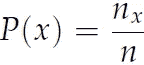

并且当 *n* — > ∞时达到真概率。常客永远不会说“我 45%(0.45%)确定今天午餐有千层面”，因为从长远来看这不会发生。通常，频率主义方法被称为*目标*方法，因为其中没有信念和/或先前事件的表达。

另一方面，在**贝叶斯**思维中，概率被视为**信念**的表达。因此，贝叶斯理论完全有理由说“我 50%(0.5%)确定今天午餐有千层面”。通过结合**先验**信念和当前事件**证据**，人们可以计算出**后验**，即今天有千层面的概率。贝叶斯思维背后的想法是，随着更多证据的提供，不断更新信念。因为这种方法处理的是信念，所以它通常被称为关于概率的主观观点。

**2.1.2-贝叶斯推理**

在决策哲学中，贝叶斯推理与贝叶斯概率观密切相关，它操纵**先验**、**证据**和**可能性**来计算**后验**。给定某个事件 B，事件 A 发生的概率是多少？这可以用贝叶斯的著名公式来回答:

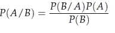

使用:

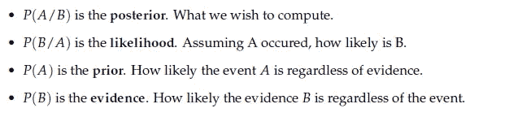

在我们的例子中，我们最感兴趣的是贝叶斯公式的具体表述:

也就是说，我们希望找到θ的最可能分布，即解释数据的模型参数 d。

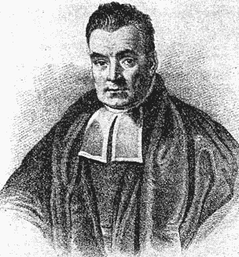

A supposed portrait of Thomas Bayes, an English statistician, philosopher, and theologian. Image Credit: [Wikipedia Commons](https://en.wikipedia.org/wiki/Thomas_Bayes#/media/File:Thomas_Bayes.gif)

计算这些概率中的一些可能是乏味的，尤其是证据 P(D)。此外，还会出现其他问题，比如确保**共轭**的问题，我不会在本文中深入探讨。幸运的是，一些技术，即 MCMC，允许我们从后验样本中进行采样，并绘制参数分布，而不必担心计算证据，也不必担心共轭性。

**2.1.3-马尔可夫链蒙特卡罗**

MCMC 允许我们从分布中抽取样本，即使我们不能计算它。它可用于从参数的后验分布(我们希望知道的)中取样。它已经在许多应用中取得了成功，例如在给定一组观测值和一些先验信念的情况下计算参数的分布，以及在物理和数字通信中计算高维积分。

底线:**它可以用来计算给定一组观察值和先验信念的参数分布。**

2.1.4-大都会-黑斯廷斯

MCMC 是一类方法。Metropolis-Hastings 是 MCMC 的具体实现。与吉布斯采样和拒绝采样相反，它在高维空间中工作得很好。

这项技术需要一个简单的分布，称为建议分布(我喜欢称之为转移模型)Q(θ′/θ)，以帮助从一个棘手的后验分布 P(θ=θ/D)中抽取样本。

Metropolis-Hastings 使用 Q 在分布空间中随机行走，根据样本的可能性接受或拒绝跳转到新位置。这种“无记忆”随机游走是 MCMC 的“马尔可夫链”部分。

每个新样本的“可能性”由函数 *f* 决定。这就是为什么 *f* 必须与我们要采样的后验概率成正比。 *f* 通常被选择为表达该比例的概率密度函数。

要获得参数的新位置，只需取我们当前的θ，并提出一个新的θ’，这是从 Q(θ’/θ)中抽取的随机样本。通常这是一种对称分布。例如，具有平均值θ和一些标准偏差σ的正态分布:Q(θ′/θ)= N(θ，σ)

为了决定是否接受或拒绝θ’，必须为每个新提出的θ’计算以下比率:

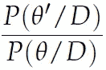

使用贝叶斯公式，这可以很容易地重新制定为:

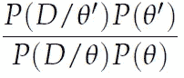

The evidence P(D) is simply crossed out during the division

这也相当于:

Where f is the proportional function mentioned previously.

接受的规则可以表述为:

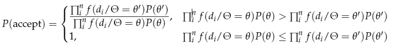

Note: The prior components are often crossed if there is no preference or restrictions on the parameters.

这意味着如果一个θ'比当前的θ更有可能，那么我们总是接受θ'。如果它比当前的θ更不可能，那么我们可能接受它或以递减的概率随机拒绝它，可能性越小。

简而言之，Metropolis-Hastings 算法执行以下操作:

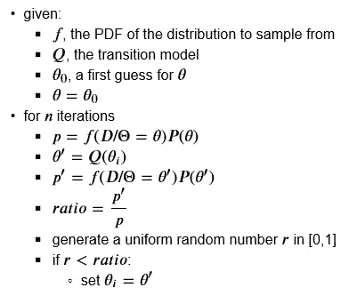

Metropolis-Hastings algorithm

# 第 2 部分:虚拟数据示例

## 3.1-步骤 1:数据生成

我们从均值μ= 10、标准差σ= 3 的正态分布中生成 30，000 个样本，但我们只能从中观察到 1000 个随机样本。

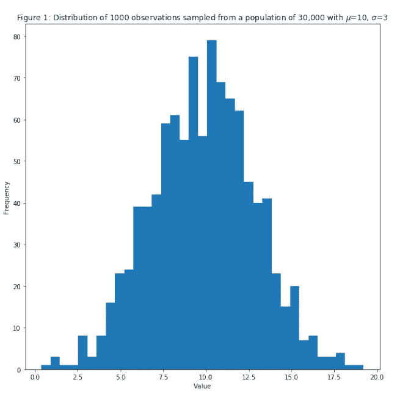

## 3.2-第二步:我们想要什么？

我们希望使用 1000 个观察样本找到σ{观察值}的分布。你们当中那些狂热的数学家会说，有一个计算σ的公式:

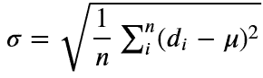

为什么我们要取样什么的？这只是一个虚拟数据的例子，真正的问题在第 3 部分，这里很难直接计算参数。另外，在这里，我们不是试图找到σ的值，而是试图计算σ的概率分布。

## 3.3-步骤 3:定义 PDF 和过渡模型

从图 1 中，我们可以看到数据是正态分布的。通过取 1000 个样本值的平均值，可以很容易地计算出平均值。通过这样做，我们得到μ{observed} = 9.8(尽管附带说明，我们也可以假设μ未知，并对其进行采样，就像我们对σ进行采样一样。然而，我想让这个开始的例子简单一些。)

**3.3.1-对于过渡模型/方案分配**

我心中没有具体的分布，所以我会选择一个简单的:正态分布！

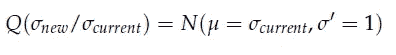

*注意σ′与σ{new}和σ{current}无关。它只是指定了参数空间的标准偏差。它可以是任何需要的值。影响算法的收敛时间和样本之间的相关性，我后面会讲到。*

**3.3.2-用于 PDF**

由于 *f* 应该与后验*、*成正比，我们选择 *f* 为下面的概率密度函数(PDF)，对于数据集 D *中的每个数据点 di:*

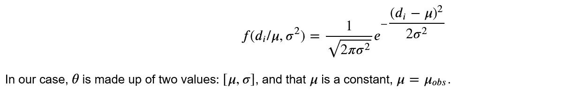

Since μ is constant, we can practically consider that σ is equivalent to θ

## 3.4-步骤 4:定义我们何时接受或拒绝σ{new}

**3.4.1-验收公式**

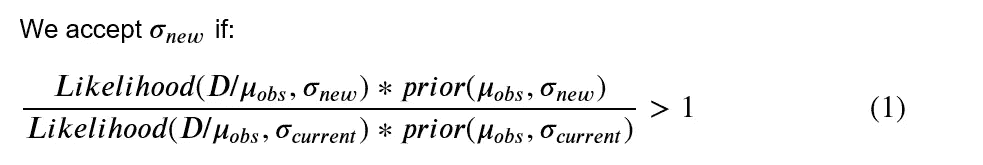

如果这个比值不大于 1，那么我们将其与闭集[0，1]中的一个均匀生成的随机数进行比较。如果比值大于随机数，我们接受σ{new}，否则拒绝。这确保了即使一个样本比当前的可能性小，我们可能仍然想要尝试它。(类似于模拟退火的概念)

**3.4.2-可能性**

一组观察值 D 的总可能性是:

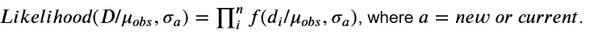

This must be computed for both new and current sigma in order to compute the ratio in equation (1)

**3.4.3-先验 P( μ，σ)**

对于σ{new}和σ{current}可以采用的值，我们没有任何偏好。唯一值得注意的是，它们应该是积极的。为什么？直观地说，标准差衡量的是离差。离差是一个距离，距离不能是负数。

数学上:

而且一个数的平方根不能是负的，所以σ总是正的。我们在事前严格执行这一点。

**3.4.4-最终验收表**

在我们的例子中，我们将记录先验和似然函数。为什么要日志？仅仅是因为它有助于数值的稳定性，即乘以数千个小值(概率、可能性等..)会导致系统内存下溢，log 是一个完美的解决方案，因为它将乘法转换为加法，并将小正数转换为非小负数。

我们从等式(1)得到的接受条件变为:

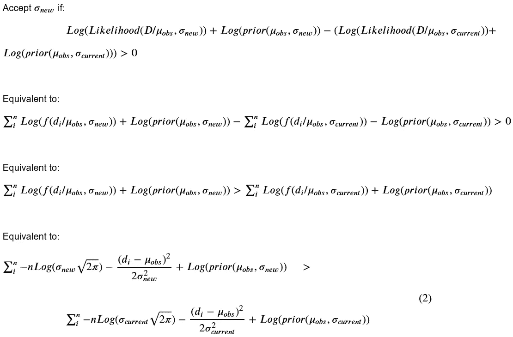

这种形式可以通过从对数中取出平方根和乘法来进一步简化，但是不要介意，现在已经有足够的数学了！

**3.4.5-那次咆哮的实施**

实现很简单，对吧？！

## 3.6-步骤 6:使用初始参数运行算法，并收集接受和拒绝的样本

该算法接受 8317 个样本(每次新运行时可能会有所不同)。最后 10 个样本包含以下σ值:

[2.87920187, 3.10388928, 2.94469786, 3.04094103, 2.95522153, 3.09328088, 3.07361275, 3.08588388, 3.12881964, 3.03651136]

让我们看看算法是如何得出这些值的:

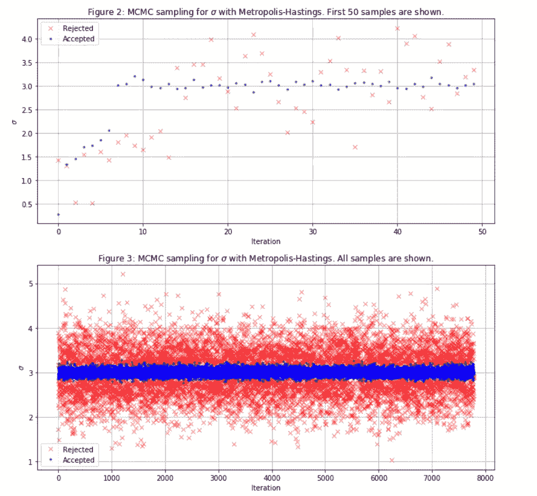

因此，从 0.1 的初始σ开始，算法很快收敛到预期值 3。也就是说，这只是 1D 空间中的采样…所以这并不奇怪。

尽管如此，我们仍将σ值的最初 25%视为“老化”,因此我们放弃它们。

**3.6.2-让我们可视化** σ **的轨迹和轨迹**的直方图

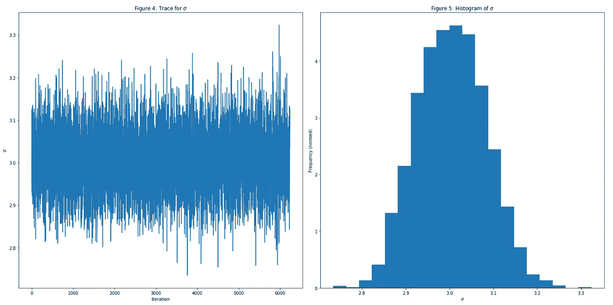

σ最可能的值约为 3.1。这比原始值 3.0 多了一点点。这种差异是由于我们只观察到原始人群的 3.33%(30，000 人中的 1，000 人)

**3.6.3-预测:我们的模型在预测最初的 30，000 人口时表现如何？**

首先，我们对σ的最后 75%的接受样本进行平均，我们从正态分布中生成 30，000 个随机个体，μ=9.8，σ=3.05(最后 75%的接受样本的平均值)，这实际上比最可能的值 3.1 更好。

瞧:

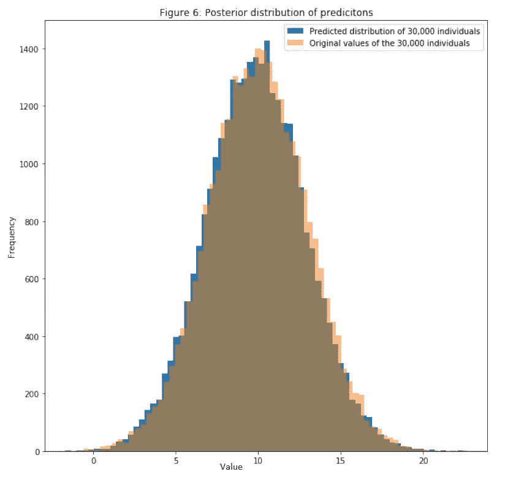

现在，进入正题！

# 4-第 3 部分:真实世界的例子

Sunspots. Credit [Wikipedia commons](https://en.wikipedia.org/wiki/File:Sunspot_TRACE.jpeg)

太阳黑子是太阳表面(光球)的一个区域，其特征是温度低于其周围环境。这些降低的温度是由磁场通量的集中引起的，它通过类似于[涡流制动器](https://en.wikipedia.org/wiki/Eddy_current)的效应抑制对流。太阳黑子通常成对出现，磁极相反。它们的数量根据大约 11 年的太阳周期而变化。

我们将研究的数据是“月平均太阳黑子总数”，从 1749 年 1 月到 2018 年 11 月的每个月。这些数据由[世界数据中心收集、整理并公开发布，用于制作、保存和传播国际太阳黑子数。](http://www.sidc.be/silso/home)

## 4.1-让我们绘制这些年的数据，看看分布情况可能是什么样的

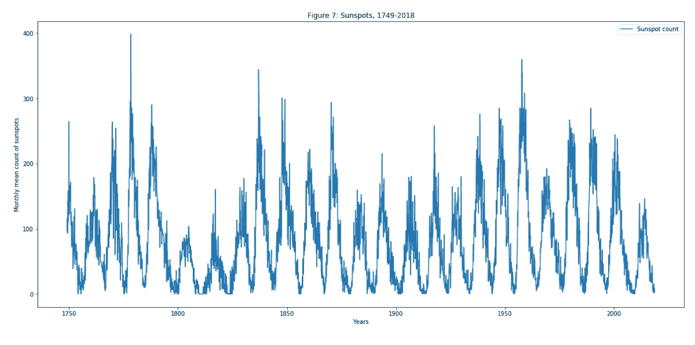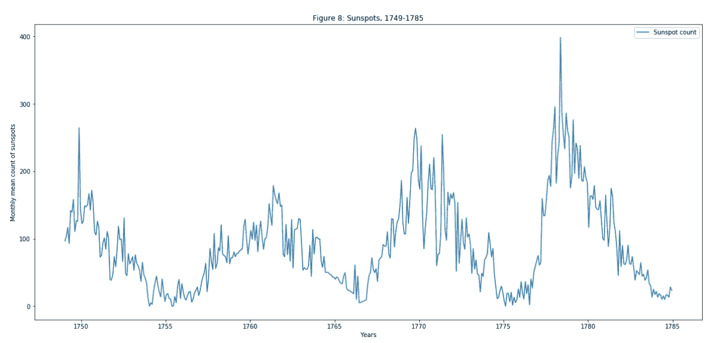

## 4.2-似乎我们可以用伽马分布来模拟这种现象，每 12 年有一个新的周期重置

γ分布γ是一族双参数的连续概率分布。参数是形状 A 和尺度 b。一个伽马分布的随机变量 *X* 记为 X ~γ(A，b)，在我们的例子中，X 是太阳黑子的数量。两个参数 a 和 b 是我们想要计算其分布的未知数。

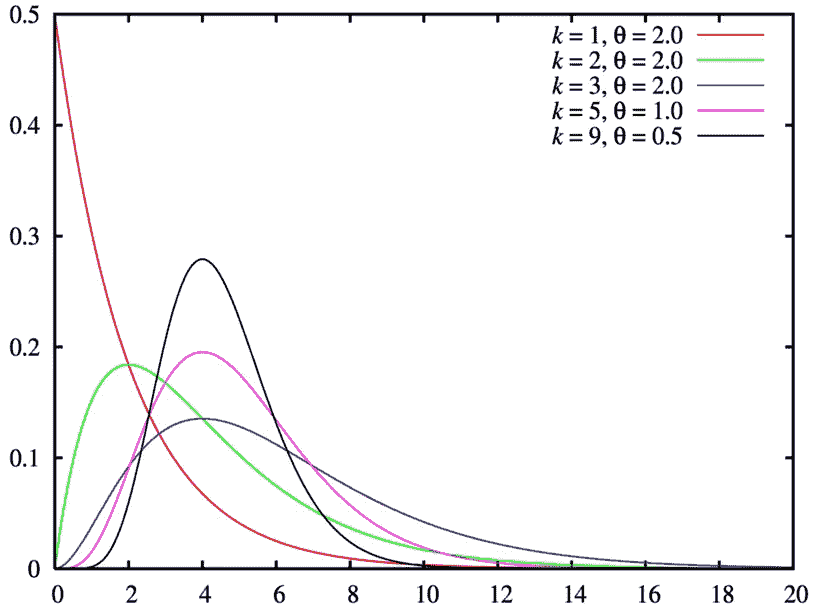

Gamma function with different parameters. Credit: Wikipedia Commons

例如，在第一个周期中，太阳黑子数从 1749 年底的 300 个左右的最高值开始，并在 6 年后的 1755 年下降到最低值。然后这个数字在 1761 年和 1762 年再次上升到最大值，然后在 1766 年再次下降，以此类推。。。

让我们通过绘制太阳黑子数直方图来确定:

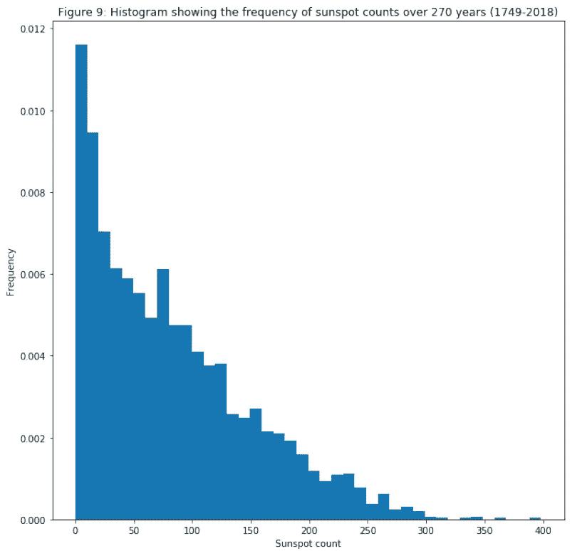

## 4.3-事实上，计数频率似乎确实遵循伽马分布

对于 PDF，f，γ分布为:

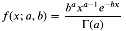

其中γ是γ函数:γ(a)=(a-1)！(不要与伽马分布混淆！)

按照与虚拟数据示例中相同的过程，我们可以从这个 pdf 中写下对数似然性(参见下面的代码)。或者，可以使用 scipy.stats.gamma，b)。pdf(x)函数来计算它。但是，请注意，scipy 的实现比我实现的要慢几个数量级。

因为 a 和 b 必须是严格正的，所以我们在前面的例子中强制这样做:

运行代码并收集样本:

从 a=4 和 b =10 开始，该算法接受了 8561 对样本，a 的最后一个值是 0.98848982，b 的最后一个值是 84.99360422，这与初始值相差甚远。

与虚拟数据示例一样，让我们看看算法是如何得出这些值的:

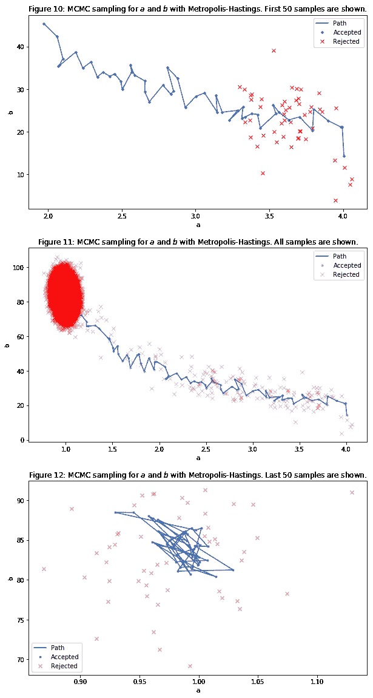

从图 10、11 和 12 可以看出，该算法很快收敛到[a=1，b=85]区域。

提示:当算法开始大量拒绝样本时，这意味着我们已经达到了可能性的饱和区。通常，这可以被解释为已经达到了我们可以从中采样的最佳参数空间，即，算法几乎没有理由接受新值。这在图 11 和 12 中有所标记，其中算法不再接受小范围之外的任何值。

**4.3.1-我们认为 a 和 b 值的最初 50%是“老化”,所以我们放弃它们。让我们来看一下 b 和 b 的轨迹以及轨迹的直方图。**

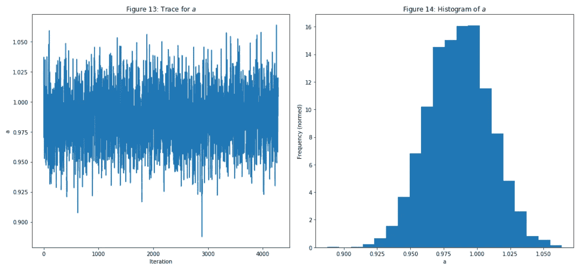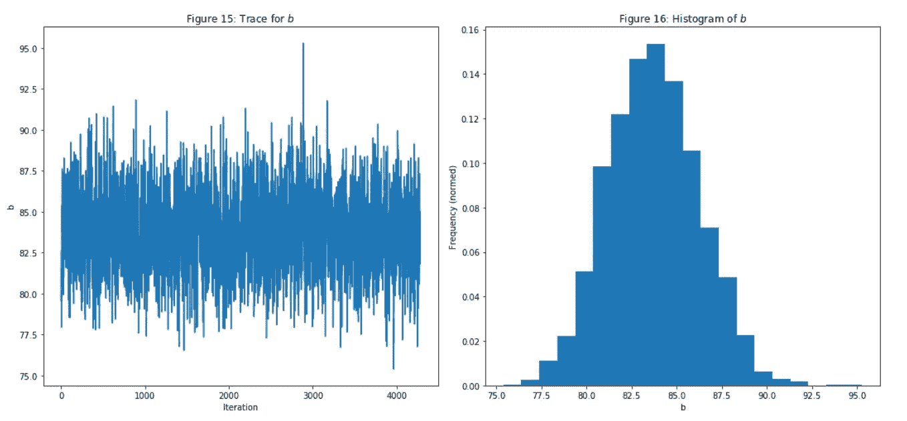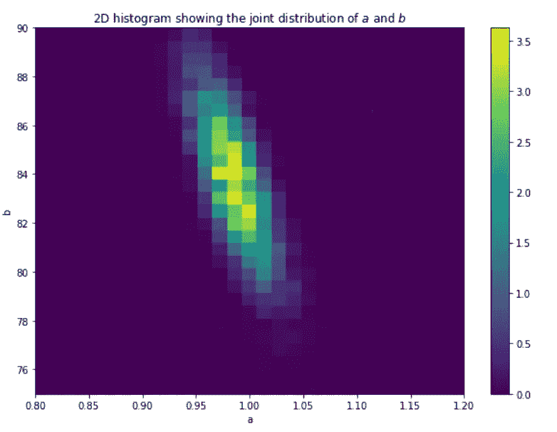

## 4.4-预测时间

首先，我们对 a 和 b 的最后 50%的接受样本进行平均，并从γ分布中生成随机个体。a{average}=0.9866200759935773，b { average } = 83.70749712447888。

预测是:

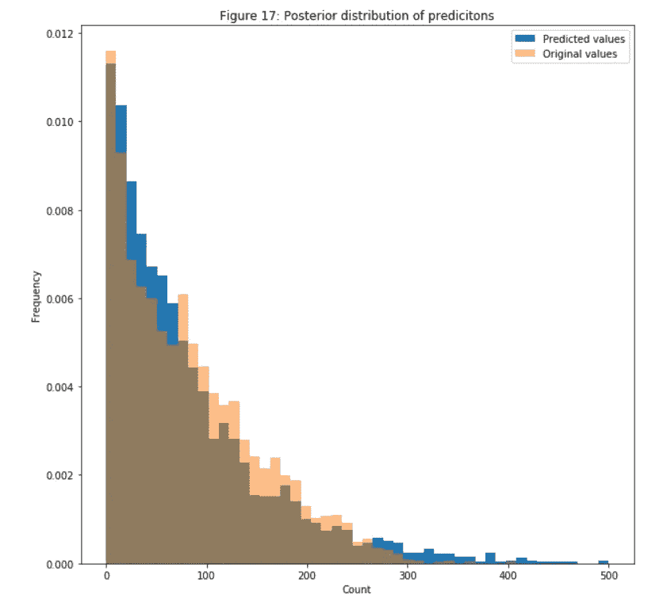

# 4-评估

## 4.1-建议书分发的评估

我们如何指定分布 Q 的参数？我们应该远离当前样本θ，还是保持相对接近？这些问题可以通过测量接受样本之间的自相关来回答。我们不希望遥远的样本过于相关，因为我们正在尝试实现马尔可夫链，即样本应仅依赖于其先前的样本，自相关图应显示样本 I 和 i-1、i-2、…i-k 之间的相关性快速呈指数下降

通过为每个滞后 k 计算以下函数来定义自相关:

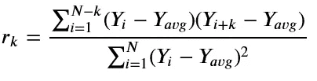

The lag *𝑘*, is basically the *range* ahead of sample *𝑌i* in which we would like to measure the correlation.

下图显示了从 1 到 100 的 a、b 和 k 的自相关性。k=0 的滞后意味着我们正在测量样本与其自身的相关性，因此我们期望它等于 1。k 值越高，相关性应该越低。

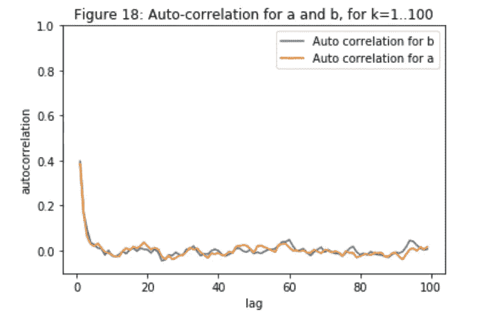

在我们的例子中，我们很幸运有足够低的相关性。一般来说，我们可能希望自动设置建议分布的参数 Q。常见的方法是不断调整提案参数，使 50%以上的提案被拒绝。或者，可以使用增强版的 MCMC，称为哈密顿蒙特卡罗，它减少了连续采样状态之间的相关性，并更快地达到稳定分布。

# 6-结论

虽然这种算法背后的抽象可能看起来难以理解，但实现实际上非常简单，并给出了令人惊叹的结果。事实上，概率编程的伟大之处在于，你只需要写下模型，然后运行它。不需要计算证据，或者确保一些约束性的数学属性。

我希望阅读这篇文章的每个人都觉得它很有趣，很有见地。如果有积极的反馈，将会有更多本系列的文章“从零开始”，在那里我从零开始解释和实现东西(显然！)，所以如果你喜欢的话，请一定要建议你接下来想让我讲的内容！

欢迎任何问题，我会尽我所能回答！反馈是非常受欢迎的，因为这是我的第一篇文章，我希望改进。

## 参考资料:

Peter Driscoll，“径向速度数据集的最小二乘法和贝叶斯拟合技术的比较”

Carson Chow，“MCMC 和数据拟合模型”

约翰·h·威廉姆森，“数据基础——概率”

西蒙·罗杰斯，“机器学习的第一课”

## 致谢:

另一位媒体作家， [Vera Chernova](https://medium.com/u/fd2fe2bc0784?source=post_page-----ef21a29e25a--------------------------------) ，写了一篇文章:“如何通过三个步骤将 Jupyter 笔记本嵌入媒体文章:1–2–3！”

朋友和数据科学家同事[马克·艾斯丘](https://medium.com/u/42c0ce1ed0d?source=post_page-----ef21a29e25a--------------------------------)和康斯坦丁诺斯·约安尼迪斯在本文发表前给予了反馈。