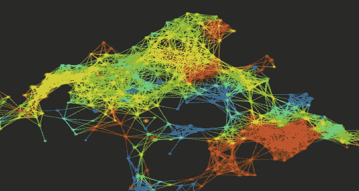
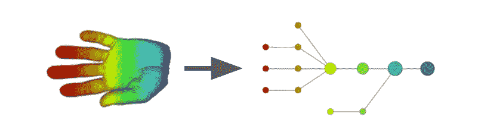
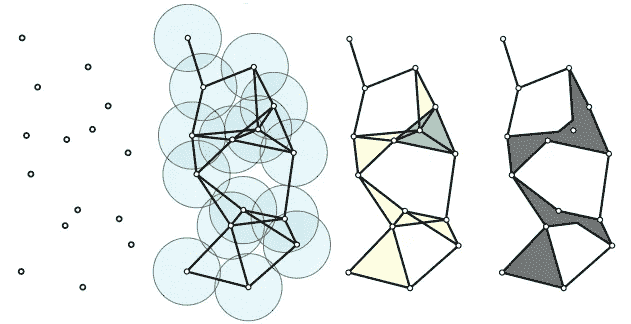
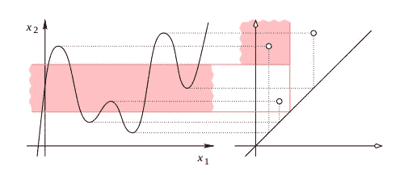
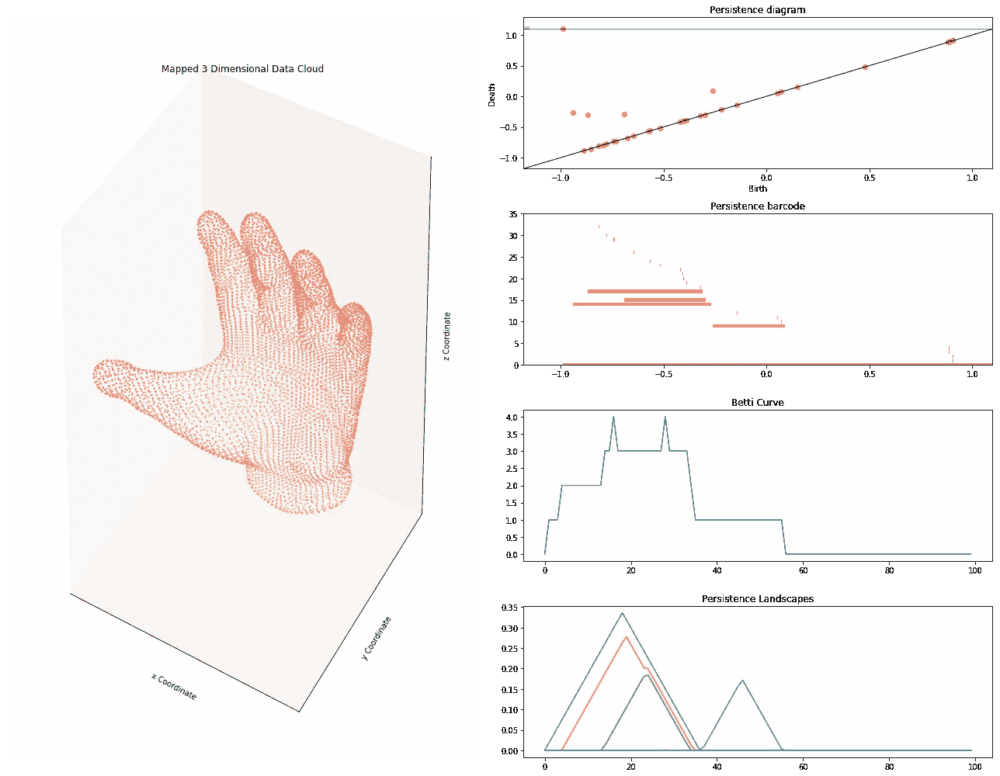

# 从拓扑数据分析到深度学习:不劳无获

> 原文：<https://towardsdatascience.com/from-tda-to-dl-d06f234f51d?source=collection_archive---------2----------------------->

[Source](https://www.datanami.com/2015/03/25/mapping-the-shape-of-complex-data-with-ayasdi/)

今天，我将尝试给出一些关于 TDA(用于**拓扑数据分析**)的见解，这是一个快速发展的数学领域，肯定会很快完全集成到机器/深度学习框架中。为了说明这一理论的威力，本文后面将给出一些用例。

# **快速历史**

拓扑数据分析，也缩写为 **TDA** ，是从应用拓扑学和计算几何的各种著作中出现的一个新领域。它的目的是提供良好的数学，统计和算法的方法来利用数据中的拓扑和潜在的几何结构。你通常会发现它适用于三维数据，但经验表明，TDA 揭示了在其他情况下也很有用，如时间序列。

Example of Mapper construction based on the height function

拓扑学定义的理论多种多样，在**机器学习**或者**深度学习**中的影响力也在不断增长。那些曾经对那些能够带来关于数据的意想不到的见解的开箱即用的理论感兴趣的人可能会对接下来的事情感兴趣！然而，关于这篇文章，我将把重点放在可视化的例子上，为了便于理解，我将自己限制在一维和二维空间。

# **持久性同源性**

在流传最广的理论中，有**持久性同源性**。这是一种旨在计算不同空间分辨率下空间的**拓扑特征**的方法。通过构建，这些特征更有可能代表潜在空间的真实特征(而不是采样、噪声或特定参数选择的假象)，因为它们与数据点的空间关系有着内在联系。为了计算一个空间的持续同调，它必须首先被表示为一个嵌套的**单纯复形**(基本上是一个由一组点和它们的关系组成的图，又名二维空间中的*线和三角形)。这个家族叫做**过滤**。一般来说，这种过滤的构造是基于距离函数的定义，其值用于索引族中的复合体。因此，这个距离的选择非常重要，并为那些对公制学习感兴趣的人提供了思考的食粮*

[Visual Construction of the Simplicial Complex](http://jeffe.cs.illinois.edu/pubs/rips.html)

持久性同调理论允许我们用一个**持久性** **条形码**或**持久性** **图**唯一地表示一个过滤的单纯复形的持久性同调。条形码图用一条水平线表示每个持久性发生器，水平线从它出现的第一个过滤级别开始，到它消失的过滤级别结束，而持久性图用其 x 坐标*出生时间*和其 y 坐标*死亡时间*为每个发生器绘制一个点(下面给出了示例)。视觉上，在二维中，你独立地考虑每个点:你围绕那些点画一个半径递增的圆，直到你找到一些交点(出生时间)。你继续绘制，直到你覆盖了一些点，破坏了一些先前创建的结构(死亡时间)。您最终得到组件(出生和死亡日期)，这些组件通过那些持久性图和条形码来表示。

# 持久性图表

为了更好地形象化这个理论，让我们考虑一维时间序列的例子，记为 *f* 。我们想通过下面的规则来关注 *f* 的**临界点:当引入一个新的组件时，我们说创建它的局部最小值代表该组件。当我们传递一个局部最大值并合并两个分量时，我们将最大值与代表这两个分量的两个局部最小值中较高的(较年轻的)值配对。另一个最小值现在是合并产生的组件的代表。当 *x* 和 *y* 通过这种方法配对时，我们定义这对的持久性为*f(y)——f(x)*。持久性在持久性图中通过将每一对映射到点( *f(x)，f(y)* )来表示，该点的坐标是相应的临界值，如下所示。**

Value-Based Persistence of a 1D Signal

# **矢量化和表示法**

太好了，但是下一步该怎么办呢？！？从持续图中提取的向量的不一致性问题是机器学习应用的真正缺点。为了在不深入研究新型神经网络的情况下解决这个问题，我们必须转换以前的持久性表示，以某种方式收集相同的信息，这可能是相当大的。对于机器学习来说，提取外围的持久点可以表示很好的特征，但是图表中包含的一些底层信息可能会在这个过程中丢失。

在这里，我将强调三种可能性:贝蒂曲线、T2 持续景观和 T4 持续图像。(整个计算都要归功于 [Gudhi](https://project.inria.fr/gudhi/) 包，它是由法国团队 DataShape 为 **INRIA** 开发的。)以下结构即将成为 **scikit-learn** 兼容产品。同时，我向你推荐我对应的 [Github](https://github.com/Coricos/TdaToolbox) 库的持久化构造，以及图表的表示。让我们通过下面的例子来想象一下。曾经梦想用算法计算你手上的手指数量的人会对即将到来的事情感到高兴…

TDA Representation of a 3D Object: Finger Characterization

我们从这个结果中得到什么。首先，您通过持久性图和条形码以图形方式观察到有 5 个突出显示的组件。不出所料，那是 5 根手指！然而，其中一个组件位于无穷大:这对应于在考虑过滤的上层时遇到的第一个点，自动给定一个无穷大的值。因此，你的持久性景观只清楚地代表了四个较小的手指。这是在应用 TDA 时要记住的事情！

> **贝蒂曲线**:让我们考虑一个**持久性条形码**，我们对其半径空间进行矢量化。条形码图的每个组成部分都被称为一个函数，在定义它的半径上取值为 1，在其他任何地方取值为 0。这些函数的总和定义了贝蒂曲线。
> 
> **暂留景观**:**暂留图**的每个组成部分都由一个三角函数引用(斜率为 1)。这些三角形函数的叠加给出了不同平面上的山脉的外观结构，我们迭代地从中提取上层景观。
> 
> **余辉图像**:**余辉图**的每个分量成为特定方差的二维高斯分布的中心。通过创建相应的分布叠加矩阵，就获得了图像。

人们应该注意到下面这一点:即使手指的数量清楚地出现(对应于远离对角线的点)，仍然存在拓扑噪声的概念(靠近对角线的点)。因此，持久性景观通常更好使用，因为它们或多或少对它保持健壮，因为它们更好地描述了数据集的大多数持久性对象。然而，拓扑噪声有时是有用的信息，特别是在处理标准偏差对分类非常重要的时间序列时…

# **深度学习管道**

一旦您为所有的示例构建了相应的持久性表示，您可能想知道如何使用它。贝蒂曲线有点容易馈入一个 **1D 卷积网络**，而持续图像适合一个 **2D 卷积网络**。

关于持久性景观，它变得有点棘手。对于那些想知道如何充分利用它而不手工制作自己的功能的人，这里有一个我构建的解决方案。基本上是联系到**持久性剪影**的思想，是从持久性图中得到的三角函数的加权和。新创建的层对应于这些持续景观的加权和，得到持续轮廓的移动平均结构作为输出。输出是一个一维信号，你可以把它输入一个 1D 卷积网络。我会在接下来的工作中进一步发展这个想法！:)

Credits: Gaijin et al.

这个理论有很多可能性，这些结果和深度学习之间的接口目前仍在开发中。许多想法将会出现，这使得这个话题变得非常热门和有趣！*敬请关注即将到来的文章，如果你想了解更多，别忘了给你鼓掌；)*！

# 参考

*   [***我的 GitHub 资源库***](https://github.com/Coricos/TdaToolbox)
*   [*持续理论:从颤动表象到数据分析*](https://g.co/kgs/vKCHcd) *是*
*   [***谷棣项目***](https://project.inria.fr/gudhi/)
*   [*同调与拓扑持续*](http://citeseerx.ist.psu.edu/viewdoc/download?doi=10.1.1.224.2050&rep=rep1&type=pdf)
*   [*几何和拓扑推论*](https://geometrica.saclay.inria.fr/team/Fred.Chazal/papers/CGLcourseNotes/main.pdf)