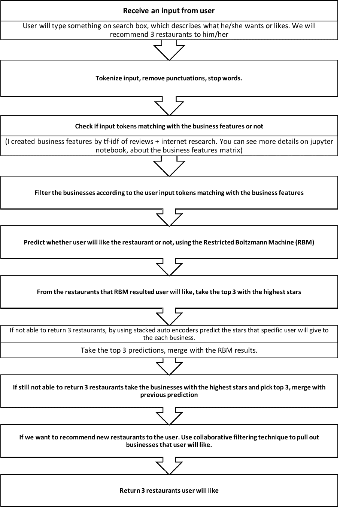
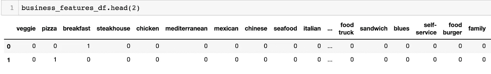

# 成熟的推荐系统

> 原文：<https://towardsdatascience.com/full-fledged-recommender-system-3bdf52b1eb69?source=collection_archive---------11----------------------->

人工智能应用的快速崛起，处理器和内存成本的降低，使得过去十年推荐系统取得了令人难以置信的进步。鉴于它们在零售业中日益上升的重要性，它们无疑是人工智能中更受欢迎的话题之一。

[http://thedatascientist.com/wp-content/uploads/2018/05/recommender_systems.png](http://thedatascientist.com/wp-content/uploads/2018/05/recommender_systems.png)

然而，创建一个成熟的、可投入生产的推荐系统可能是一项有点复杂的任务，需要非常系统的方法。在这篇文章中，我将一步一步地指导你如何创建一个推荐系统。

如果你参加过 AI 训练营和课程，你可能知道几乎每一个都包括开发一个基于评分/星级从 1 到 5 的推荐系统(是的，你知道那个有标准电影数据集的)。虽然这些都是很好的入门练习，但它们缺乏现实生活中的例子。当开发一个推荐系统时，你很可能也想参与"**用户评论**"，它包含了许多需要包含在模型中的重要特性。对于用户评论，准备好使用 NLP。

在本教程中，我们将使用来自 Yelp 网站的数据来表示一个餐馆推荐问题。数据集包含业务 id、用户 id、评分和评论。基于用户的搜索，任务是推荐三家餐馆。这个例子最好使用 Jupyter 笔记本(你可以在这里找到 j [upyter 笔记本和数据](https://github.com/yalcinmurat1986/full-fledged-recommender-system))。)

首先，我们需要创建我们的工作流程管道。我们的复杂模型就是从这个管道开始构建的。

管道:

现在，让我们按照管道开始构建我们的模型。

在第一步中，我们接收来自用户的输入，比如“素食比萨饼，便宜，有各种配料。”

第二步，我们对输入进行标记，得到:“蔬菜、披萨、便宜、多样、顶级。”

第三步，将这些令牌与业务功能相匹配。如何才能获得业务特征？这部分完全取决于我们的创造力和特征工程技能。我使用下面描述的特性创建了一个业务特性矩阵。行是业务类别，列是业务特征。如果某个功能在用户评论中，则分配“1”，如果某个功能不在评论中，则分配“0”在这种情况下，计算评论的词频-逆词频(tf-idf ),并手动选择与餐馆企业相关的词。接下来，找到与餐馆类型和菜单相关的单词(从餐馆在线找到)。最后，合并来自 tf-idf 和收集的 internet research & menu lookup 的两组特性。

以下是业务特征矩阵的示例快照:

Business Features Matrix

第四步，过滤出与用户输入相关的商家。我们如何做到这一点？以用户输入的第一个词为例:“蔬菜。”转到业务特征矩阵中的蔬菜一栏，在与蔬菜对应的业务中填入所有的 1。对其他特征(单词)重复相同的过程。

第五步，通过使用受限的波尔兹曼机器(RBM)，预测用户是否会喜欢商家提供的选择。这一步将创建一个单行，在列中包含企业。如果用户喜欢这些选择，相应索引中的元素将为 1，否则为 0。

在第六步中，从与用户搜索标准相关的餐馆的搜索结果中取出前三个选择。

在第七步中，考虑另一个场景，用户的搜索是边缘的，RBM 不能返回三个餐馆。尽管对于大型数据集来说，这种情况不太可能发生，但我们仍然应该考虑例外情况。在这种情况下，使用自动编码器来预测每个企业的评级。这将返回一个与 RBM 非常相似的数组，但是这次数组将包括从 1 到 5 的数字(等级),而不是 0 和 1

在第八步中，根据评级，取前三个预测，并将它们与 RBM 预测合并。

在第九步中，如果我们仍然不能为用户找到三家餐馆(此事件再次发生的概率非常低)，根据他们的**总体**评分选择前三家餐馆(请注意，此评分与第八步中的评分不同。不要混淆，自动编码器的预测也返回从 1 到 5 的等级)。

在第十步中，如果我们想向用户推荐新的餐馆，我们将使用协同过滤和基于内容的过滤技术来找到用户会喜欢的餐馆。这是如何工作的？

我们定义了企业和用户的相似度函数。例如，如果用户 A 和 B 的口味相似，推荐系统将向用户 A 推荐用户 B 也喜欢的餐馆，反之亦然。这就是协同过滤的主要思想。

另一方面，如果用户 A 喜欢素食场所，提供素食选择的商家也会彼此相似。将向用户推荐其他素食餐馆。这是基于内容的过滤。请看 jupyter 笔记本如何创建业务和用户相似性函数。

协同过滤和基于内容的过滤技术不能用于该数据集，因为该数据集对于推荐系统来说太小。皮尔逊相关的经验法则是 25。([https://www . research gate . net/post/What _ is _ the _ minimum _ sample _ size _ to _ run _ Pearsons _ R](https://www.researchgate.net/post/What_is_the_minimum_sample_size_to_run_Pearsons_R))，我们的数据集平均每个商家有 2 个评分。如果您使用较大的数据集，您可能希望使用这些技术，因为它们非常强大！

最后，在步骤十一，向用户推荐排名前三的餐厅。

我希望这篇教程能让你对推荐系统有更好的理解。你可以从这里访问[完整的代码和数据](https://github.com/yalcinmurat1986/full-fledged-recommender-system)。敬请关注“**如何部署推荐系统。**

谢谢你