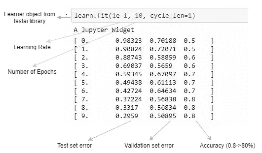
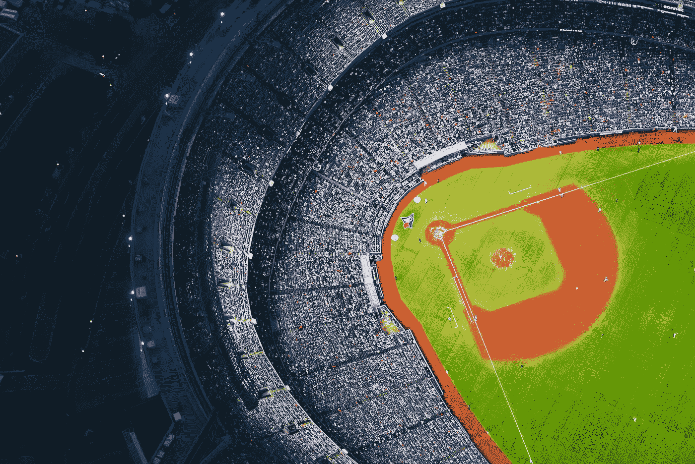
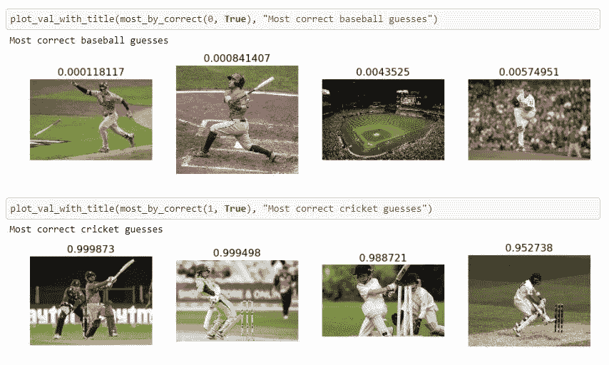
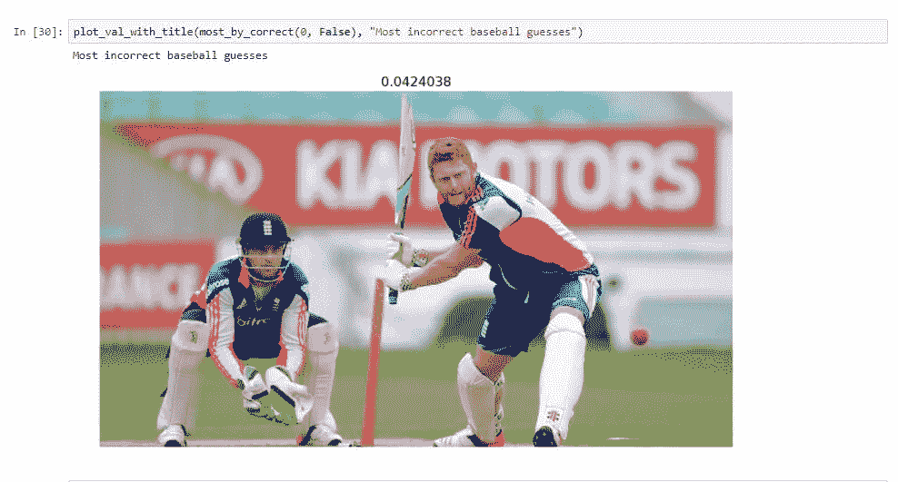
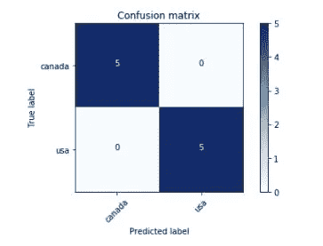

# 有趣的小图像数据集

> 原文：<https://towardsdatascience.com/fun-with-small-image-data-sets-8c83d95d0159?source=collection_archive---------1----------------------->

棒球还是板球？美元还是加元？

假设您想为自己的特定任务构建一个图像分类器。你可能认为你需要收集大量的数据。令人惊讶的是，少量的训练图像足以产生合理的准确率(90–100%)。我将在这里讨论两个案例研究:将图像中的运动分类为棒球或板球，并将钞票图像识别为美元或加拿大元。

我目前正在旧金山参加 Fastai [深度学习](https://www.usfca.edu/data-institute/certificates/deep-learning-part-one)课程。到目前为止非常有趣。我尝试的两个案例(板球对棒球和美元对加元)都是基于第一课。该课程使用预先训练的模型 resnet 34(Fastai 的一位同学[在此](http://teleported.in/posts/decoding-resnet-architecture/)提供了关于 resnet 模型的更多细节)作为起点。使用 fastai 框架非常简单快捷。下面是这个难题主要部分的一个例子——调用学习者数据对象的 fit 方法来训练模型。

第一课是深入研究使用卷积神经网络(CNN)模型来获得非常受欢迎的狗与猫 Kaggle 比赛的最新结果。我强烈建议你在这里看看[。课程是以 Jupyter 笔记本的形式，你需要有某种深度学习机器设置(流行的选择是 AWS，Paperspace 实例；或者定制的深度学习装备)。](https://github.com/fastai/fastai) [Crestle](https://www.crestle.com/) 是另一个选项，让您几乎无需任何设置即可开箱运行 Jupyter 笔记本。

**板球 vs 棒球**

板球和棒球是两项有着相似“特征”的运动，所以我试图区分它们。为了收集用于训练和测试的图像，我分别使用 Google Image 搜索了 Cricket 和 Baseball 这两个术语。我为每项运动下载了 20 张图片，并将它们分成训练( **15 张图片**)和测试( **5 张图片**)组。我能够用 15 幅训练图像获得 90%的合理准确度(9/10 的测试图像被正确分类)。这里有一些图片被分类的例子。预测分数越接近 0 表示棒球图像。

在玩了这个模型之后，我发现 0.1 的学习率给出了很好的结果。由于训练图像的数量很少，所以我使用试错法来找到一个好的学习率。下面是一张分类错误的图片。

通过多次运行该模型并改变超参数，时不时地得到 100%是可能的。我不确定 100%的准确率是否意味着太多，因为测试图像的数量很少。接下来，我想用大量的有效图片来尝试一下，看看这个模型是如何推广的。

**美元对加元**

这次我用美钞做了同样的实验，分别用 **7 张美元和加拿大元的图像**进行训练，用 **5 张图像**进行测试。这一次，分类器能够轻松达到 100%的准确率。以下是一些示例结果——预测得分越接近 0，意味着美元钞票是加拿大的。

另一种分析分类模型结果的常用方法是使用[混淆矩阵](http://www.dataschool.io/simple-guide-to-confusion-matrix-terminology/)，它沿着负 45°对角线显示正确分类的分类变量。在这种情况下，没有美元被错误分类，因此我们看到下面的[5，0][0，5]模式。

**结论**

许多领域都受到数据收集问题的困扰(生物医学图像、工业设置)。收集足够的图像数据可能很难或者非常昂贵。然而，我们不一定需要 1000 张图像来使用预先训练的模型构建我们自己的定制分类器。这对于原型制作和快速实验来说是个好消息。以下是一些值得进一步探索的方向:

1.  自动下载定制图像，以便构建更好、更定制的分类器
2.  确定更适合小型数据集的技术/实践。将它们应用于收集数据困难/昂贵的领域
3.  尝试一些有趣的例子:船 vs 潜艇？这个人戴没戴眼镜？

PS:这周我开始破解其中的一个问题。本系列的第二部分，阅读 [*人类是否戴着眼镜*](https://medium.com/@nikhil.b.k_13958/fun-with-small-image-data-sets-part-2-54d683ca8c96) ？