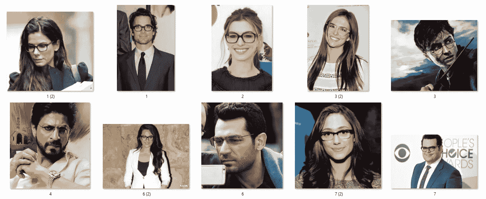
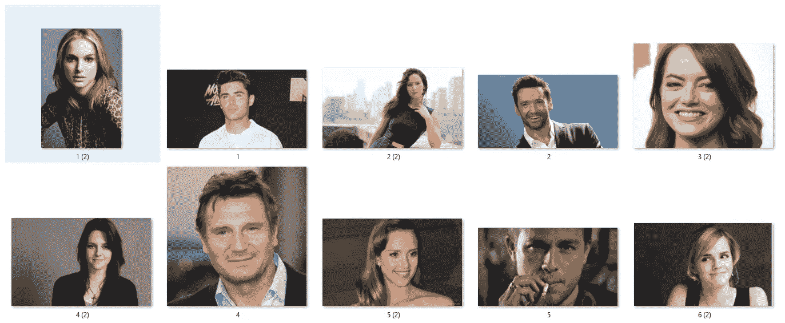
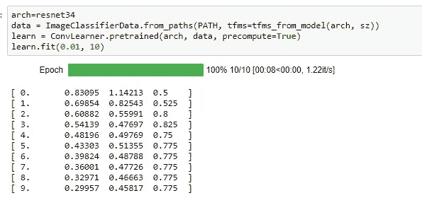
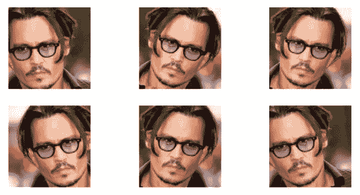
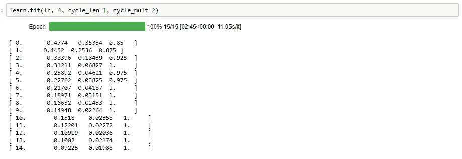
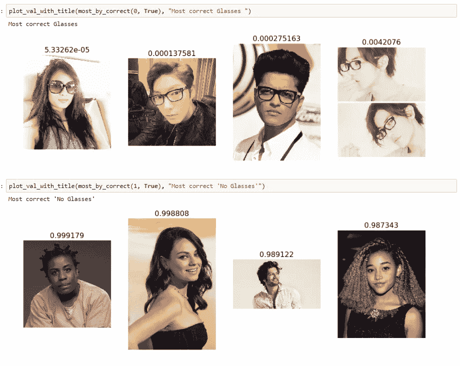

# 小图像数据集的乐趣(第 2 部分)

> 原文：<https://towardsdatascience.com/fun-with-small-image-data-sets-part-2-54d683ca8c96?source=collection_archive---------4----------------------->

***人类是戴眼镜的吗？*** 第一部[看这里](https://medium.com/@nikhil.b.k_13958/fun-with-small-image-data-sets-8c83d95d0159)。

在这篇博客中，我们将看到如何训练一个分类器来识别人是否戴着眼镜。我们从一个预先训练好的模型和从 Google 图片搜索下载的 260 张训练图片开始。像第一部分中的[一样，我们将使用](https://medium.com/@nikhil.b.k_13958/fun-with-small-image-data-sets-8c83d95d0159) [Fastai 课程的第一课 Jupyter](http://www.fast.ai/) [笔记本](https://github.com/fastai/fastai/tree/master/courses/dl1)的修改版本。

早先玩 10 张图片很有趣，但随着我们进入更严肃的乐趣，我们想处理 100 张甚至 1000 张图片。为此，我使用了 Hardikvasa 的一个漂亮的小脚本。这是一个 Python 程序，可以在谷歌图片上搜索关键字/关键词，并可以选择下载所有图片。

我首先为“戴眼镜”和“不戴眼镜”两种情况下载了 200 个演员(男/女)的图像。我手动扫描图像以删除有缺陷的图像(jpg 文件损坏、错误的图像等),然后将图像分为 135 幅训练图像和 20 幅验证图像——包括“戴眼镜”和“不戴眼镜”的情况。

**训练图像数量:135 x 2(带眼镜和不带眼镜)**

**Sample Training data-set (with glasses)**

**Sample training data-set (with no glasses)**

使用学习率为 0.01 的普通 resnet 模型，我能够获得合理的准确度 **77.5 %** (31/40 的测试图像被正确分类)

为了提高我们的模型的准确性，我们可以尝试几种技术，如增强、优化最佳学习速率、对不同层使用不同的学习速率以及测试时间增强等。我们将在这里介绍两种技术:

**(1)增强**是一种将神经网络暴露于我们从现有数据集创建的更多数据的方法。这是通过以不影响图像解释的方式随机改变图像来实现的，例如水平翻转、缩放和旋转。

**Applying augmentation transforms to a sample image (flipping, zooming in etc)**

增强主要是为了减少过度拟合(这意味着我们的模型正在学习识别训练集中的特定图像，但没有足够好地概括，因此我们在验证集上获得了良好的结果)。使用训练数据集的增强，我能够获得更好的准确性— **87.5 %** (35/40 的图像被正确分类)

**(2)不同的学习速率和解冻层:**我们在这里使用的 resnet 模型由几层组成。通常，早期的层识别基本特征，如线条、渐变等。每一层都逐步建立在前一层的基础上，因此，随着我们进入后面的层，所识别的“特征”的复杂性会增加。因此，我们预计后面的层对于新的数据集需要较少的微调。这里，我们将对不同的层使用不同的学习速率:前几层将处于 1e-4，中间层处于 1e-3，而我们的 FC 层将像以前一样处于 1e-2。如下图所示，使用增强和差异学习率的组合足以给我们的数据集带来 100%的准确率！重复实验几次，我注意到准确率大部分时间都徘徊在 97.5 到 100 %以上。

**结论:**我们的模型能够准确预测人是否戴眼镜。尽管训练图像数量如此之少，但看到这种深度学习模型的功效令人兴奋。在数据收集阶段，我不知道会发生什么，但我对结果感到惊喜。

