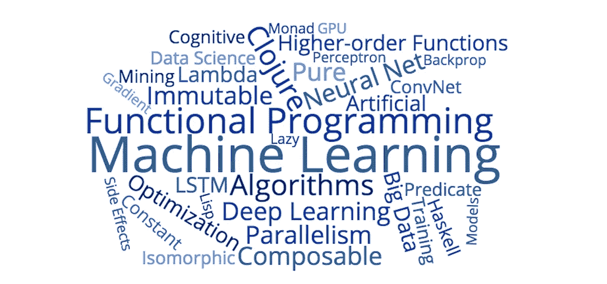
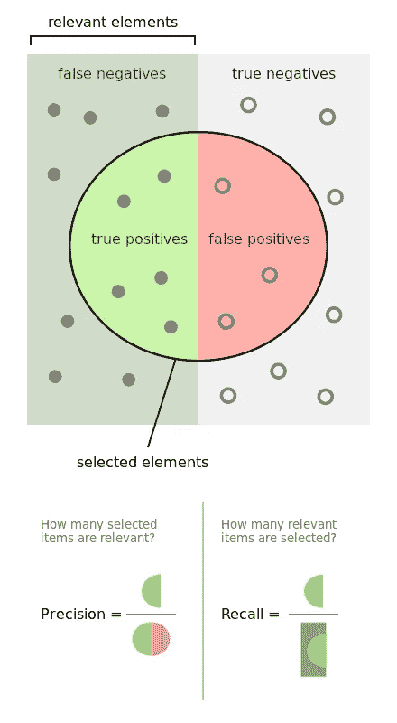
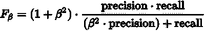

# 深度学习的函数式编程

> 原文：<https://towardsdatascience.com/functional-programming-for-deep-learning-bc7b80e347e9?source=collection_archive---------0----------------------->



在我开始在 [ThinkTopic](http://thinktopic.com/) 的最新工作之前，“函数式编程”和“机器学习”的概念完全属于两个不同的世界。一个是随着世界转向简单性、可组合性和不变性以维护复杂的扩展应用程序，编程范式[越来越受欢迎](http://blog.salsitasoft.com/why-now/)；另一个是教电脑[自动完成涂鸦](https://www.theverge.com/2017/6/26/15877020/google-ai-experiment-sketch-rnn-doodles-quick-draw)和[制作音乐](http://www.wired.co.uk/article/how-ai-and-machine-learning-are-shaping-the-future-of-music)的工具。重叠在哪里？

我与这两位合作得越多，就越开始意识到这种重叠既是实际的，也是理论上的。首先，机器学习不是一项独立的努力；它需要迅速融入工业中复杂的缩放应用。其次，机器学习——尤其是深度学习——在设计上是有功能的。给定正确的生态系统，以完全功能化的方式执行深度学习有几个令人信服的理由:

*   **深度学习模型是组合的。**函数式编程就是组合高阶函数链来操作简单的数据结构。神经网络以同样的方式设计，将一层到下一层的函数变换链接在一起，对输入数据的简单矩阵进行操作。事实上，深度学习的整个过程可以被视为优化一组组合函数，这意味着模型本身具有内在功能。
*   **深度学习组件是不可变的。**当函数对输入数据进行操作时，数据不会*改变*，一组新值被输出并传递。此外，当权重被更新时，它们不需要被“变异”——它们可以被新值替换。理论上，对权重的更新可以以任何顺序应用(即，它们不相互依赖)，因此不需要跟踪连续的可变状态。
*   **函数式编程提供了简单的并行性**。最重要的是，纯函数和可组合函数很容易并行化。并行意味着更快的速度和更强的计算能力。函数式编程为我们提供了基本上免费的并发性和并行性，使得在深度学习中使用大型分布式模型变得更加容易。

关于函数式编程和深度学习的结合，有许多理论和观点，从[数学论证](http://colah.github.io/posts/2015-09-NN-Types-FP/)到[实践概述](http://www.kdnuggets.com/2015/04/functional-programming-big-data-machine-learning.html)，但有时只有在实践中才能看到它，这才是最有说服力的(也是最有用的)。在 ThinkTopic，我们一直在开发一个叫做 [Cortex](https://github.com/thinktopic/cortex) 的开源机器学习库。在这篇文章的其余部分，我将介绍函数式编程背后的一些想法，并将它们用于异常检测的 Cortex 深度学习模型。

# Clojure 基础

在继续我们的 Cortex 教程之前，我想介绍一些 Clojure 的基础知识。Clojure 是一种函数式编程语言，它擅长两件事:**并发**和**数据处理**。对我们来说幸运的是，这两件事对机器学习都非常有用。事实上，我们使用 Clojure 进行机器学习的一个主要原因是，每天都要为训练准备数据集(数据操作、处理等)。)很容易超过实现算法的工作，特别是当我们有一个像 Cortex 这样的坚实的学习库时。使用 Clojure 和。edn(而不是 C++和 protobuf)，我们可以在 ML 项目上获得杠杆和速度。

要更深入地了解这门语言，请看这里的社区指南[。](http://clojure-doc.org/articles/tutorials/introduction.html)

从基础开始:Clojure 代码由一堆在运行时计算的*表达式*组成。这些表达式包含在括号中，通常被视为函数调用。

```
(+ 2 3)          ; => 5
(if false 1 0)   ; => 0
```

有 4 种基本的集合数据结构:向量、列表、散列映射和集合。逗号被视为空白，所以通常会被省略。

```
[1 2 3]            ; vector (ordered)
'(1 2 3)           ; list (ordered)
{:a 1 :b 2 :c 3}   ; hashmap or map (unordered)
#{1 2 3}           ; set (unordered, unique values)
```

列表前面的单引号只是防止它被当作表达式来计算。

Clojure 还附带了很多内置函数来操作这些数据结构。Clojure 的部分优点在于，它被设计为针对很少的数据类型提供很多函数，而不是针对很多数据类型中的每一种都提供一些专门的函数。作为一种 FP 语言，Clojure 支持高阶函数，这意味着函数可以作为参数传递给其他函数。

```
(count [a b c])              ; => 3(range 5)                    ; => (0 1 2 3 4)(take 2 (drop 5 (range 10))) ; => (5 6)(:b {:a 1 :b 2 :c 3})        ; use keyword as function => 2(map inc [1 2 3])            ; map and increment => (2 3 4)(filter even? (range 5))     ; filter collection based off predicate => (0 2 4)(reduce + [1 2 3 4])         ; apply + to first two elements, then apply + to that result and the 3rd element, and so forth => 10
```

当然，我们也可以用 Clojure 写自己的函数，用`defn`。Clojure 函数定义遵循形式`(defn fn-name [params*] expressions)`，它们总是返回主体中最后一个表达式的值。

```
(defn add2
  [x]
  (+ x 2))(add2 5)     ; => 7
```

`let`表达式在“let”的词法范围内创建和绑定变量。也就是说，在表达式`(let [a 4] (...))`中，变量“a”在内括号内(且仅在内括号内)取值为 4。这些变量被称为“局部变量”

```
(defn square-and-add
  [a b]
  (let [a-squared (* a a)
        b-squared (* b b)]
    (+ a-squared b-squared)))(square-and-add 3 4)       ; => 25
```

最后，有几种方法可以创建匿名函数，既可以赋给局部函数，也可以传递给高阶函数。

```
(fn [x] (* 5 x))          ; anonymous function#(* 5 %)                  ; equivalent anonymous function, where the % represents the function's argument(map #(* 5 %) [1 2 3])    ; => (5 10 15)
```

基本就是这样！现在我们已经学习了一些 Clojure，让我们把乐趣放在函数式编程上，回到一些 ML 上。

# 皮质

[Cortex](https://github.com/thinktopic/cortex) 是用 Clojure 编写的，是目前规模最大、发展最快的使用函数式编程语言的机器学习库之一。本文的其余部分将介绍如何在 Cortex 中构建最先进的分类模型，以及这样做所需的函数式编程范例和数据扩充技术。

## 数据预处理

我们的数据集将是由 Kaggle [在这里](https://www.kaggle.com/dalpozz/creditcardfraud)提供的信用卡欺诈检测数据。事实证明，这个数据集非常不平衡，在 284，807 个案例中，只包含 492 个正面欺诈案例。也就是 0.172%。这稍后会给我们带来问题，但首先让我们看看数据，看看这个模型做得如何。

为了确保个人数据的匿名性，除了“时间”和“数量”之外的所有原始特征都已经被转换成 PCA 成分(其中每个条目代表一个新变量，该变量包含来自原始数据的最相关的信息)。稍微研究一下数据就会发现，第一个“时间”变量相当不具信息性，所以我们在读取数据时会忽略它。下面是我们的初始代码:

皮层神经网络期望以图谱的形式输入数据，这样每个图谱代表一个单独的标记数据点。例如，一个分类数据集可能看起来像`[{:data [12 10 38] :label “cat”} {:data [20 39 3] :label “dog“} ... ]`。在我们的 create-dataset 函数中，我们读入 csv 数据文件，将除最后一列之外的所有列指定为“数据”(或特征)，并将最后一列指定为标签。在该过程中，我们基于分类类别将标签转变为独热向量(例如`[0 1 0 0]`)，因为我们的神经网络的最后一个 softmax 层返回类别概率的向量，而不是实际的标签。最后，我们从这两个变量创建一个映射，并将其作为数据集返回。

## 模型描述

在 Cortex 中创建模型相当简单。首先，我们将定义一个超参数图，供以后在训练中使用。然后，为了定义一个模型，我们简单地将这些层串在一起:

`network-description`是神经网络的矢量层。我们的模型包括:

*   输入层
*   具有 ReLU 激活功能的全连接(线性)层
*   辍学者
*   另一个全连接的 ReLU 层
*   通过 softmax 函数传递的大小为 2 的输出层。

在第一层和最后一层，我们都需要指定一个`:id`。这个 id 指的是我们的网络应该查看的数据图中的键。(回想一下资料图长得像`{:data [...] :label [...]}`)。对于我们的输入层，我们传入`:data` id 来告诉模型为它的前向传递获取训练数据。在我们最终的网络层中，我们提供了`:label`作为`:id`，因此模型可以使用真实标签来计算我们的误差。

## 培训和评估

这就是变得有点困难的地方。训练函数本身实际上并不复杂——Cortex 为训练提供了一个很好的高级调用，所以我们所要做的就是传入我们的参数(网络、训练和测试数据集等)。).唯一的警告是，系统期望一个有效的“无限”数据集用于训练，但 Cortex 提供了一个函数(`infinite-class-balanced-dataset`)来帮助我们转换它。

复杂的部分是`f1-test-fn`。事情是这样的:在训练期间，`train-n`函数期望被提供一个`:test-fn`,该函数评估模型的执行情况，并确定它是否应该被保存为“最佳网络”有一个默认的测试函数评估交叉熵损失，但这个损失值不是那么容易解释，它不太适合我们的不平衡数据集。为了解决这个问题，我们将编写自己的测试函数。

但是我们如何测试这个模型的性能呢？分类任务中的标准度量是准确性，但是在像我们这样不平衡的数据集中，准确性是一个相当无用的度量。因为正面(欺诈性)例子仅占我们数据集的 0.172%，即使是专门预测负面例子的模型也能达到 99.828%的准确率。99.828%是一个相当不错的准确率，但如果亚马逊真的使用了这种模式，我们可能会面临犯罪和信用卡欺诈。

谢天谢地，亚马逊没有使用这种模式，我们也不会。一组更能说明问题的指标是[精度、回忆](https://en.wikipedia.org/wiki/Precision_and_recall)和 [F1(或更一般的 F-beta)分数](https://en.wikipedia.org/wiki/F1_score)。



Precision and recall visualized. Source: [https://en.wikipedia.org/wiki/Precision_and_recall](https://en.wikipedia.org/wiki/Precision_and_recall)

通俗地说，precision 会问这样一个问题:“在我猜测的所有正面例子中，*实际上*是正面的占多大比例？”回忆提出了这样一个问题:“在所有实际上是积极的例子中，我正确地猜测为积极的占多大比例？”

F-beta 分数(传统 F1 分数的推广)是精确度和召回率的加权平均值，也是以 0 到 1 的范围来衡量的:



当 beta = 1 时，我们得到`2 * (precision * recall) / (precision + recall)`的标准 F1 度量。一般来说，beta 代表*召回应该比 precision* 重要多少倍。对于我们的欺诈检测模型，我们将使用 F1 分数作为我们的最高分数来跟踪，但我们也将记录精确度和召回分数来检查平衡。这是我们的`f1-test-fn`:

该函数在测试集上运行当前网络，计算 F1 分数，并相应地更新/保存网络。它还打印出我们在每个时期的评估指标。如果我们现在在 REPL 中运行`(train)`，我们会得到一个高分，它看起来像这样:

```
Epoch: 30
Precision: 0.2515923566878981
Recall: 0.9186046511627907
F1: 0.395
```

哈哈。这太糟糕了。

## 数据扩充

问题来了。还记得我说过我们高度不平衡的数据集会给我们带来问题吗？该模型目前没有足够多的正面例子可供借鉴。当我们在 train 函数中调用`experiment-util/infinite-class-balanced-dataset`时，我们实际上创建了每个正面训练实例的数百个副本来平衡数据集。结果，该模型有效地记忆了那些特征值，而不是实际学习类别之间的区别。

解决这个问题的一种方法是通过*数据扩充*，在这个过程中，我们根据已经有的例子生成额外的人工数据。为了创建真实的正面训练示例，我们将向每个现有正面示例的特征向量添加随机数量的噪声。我们添加的噪声量将取决于正类中每个特征的*方差*，因此方差大的特征将被大量噪声增强，反之亦然。

以下是我们的数据扩充代码:

`augment-train-ds` 获取我们的原始训练数据集，计算必须达到 50/50 类别平衡的扩充数量，并通过基于允许的方差(`get-scaled-variances`)添加随机噪声向量(`add-rand-variance`)将这些扩充应用于我们现有的样本。最后，我们将扩充的示例连接回原始数据集，并返回平衡的数据集。

在训练期间，模型将会看到大量不切实际的正面例子，而测试集仍然只有 0.172%的正面例子。因此，虽然模型可能能够更好地了解两个类之间的差异，但它会在测试过程中过度预测正面的例子。为了解决这个问题，我们可以要求一个更高的确定性阈值来预测测试期间的“肯定”。换句话说，我们可以要求模型至少有 70%的把握，而不是要求模型至少有 50%的把握来对一个例子进行分类。经过一些测试，我发现最佳值设置为 90%。这个代码可以在源代码的`vec->label`函数中找到，并在`f1-test-fn`的第 31 行被调用。

使用新的、增强的数据集进行训练，我们的高分看起来像这样:

```
Epoch: 25
Precision: 0.8658536585365854
Recall: 0.8255813953488372
F1: 0.8452380952380953
```

好多了！

# 结论

一如既往，该模型仍可改进。以下是后续步骤的一些想法:

*   所有的 PCA 特征都是信息性的吗？查看正例与反例的值在特征中的分布，并删除任何无助于区分这两个类别的特征。
*   有没有其他的神经网络架构，激活函数等。表现更好？
*   有没有不同的数据扩充技术可以表现得更好？
*   与 Keras/Tensorflow/Theano/Caffe 相比，Cortex 中的模型性能如何？

该项目的源代码可以在[这里](https://github.com/joycex99/fraud-detection)找到。我鼓励你尝试这些后续步骤，测试新的数据集，并探索不同的网络架构(我们在 conv 网上有一个很棒的[图像分类示例](https://github.com/thinktopic/cortex/tree/master/examples/mnist-classification)供参考)。Cortex 正在[向它的 1.0 版本](http://thinktopic.com/blog/toward-cortex-1-dot-0)推进，所以如果你有任何想法、建议或反馈，一定要让我们知道。黑客快乐！