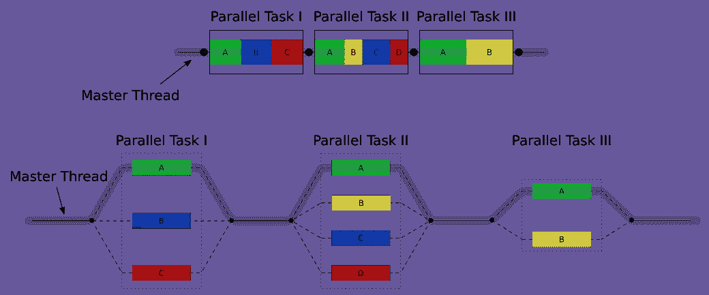
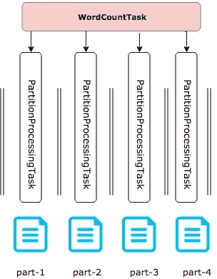
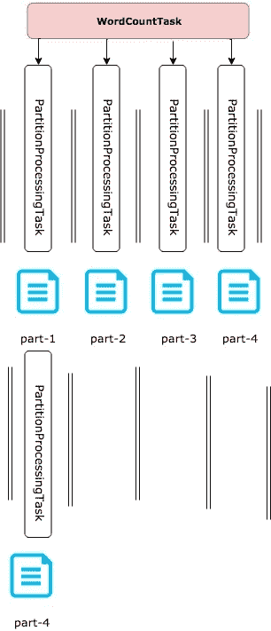
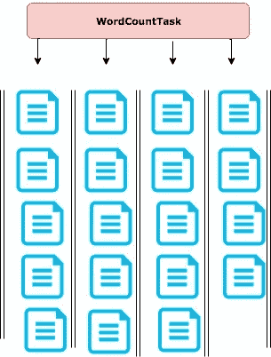

# 科幻极客的数据处理基础——第二部分——走向 RDD

> 原文：<https://towardsdatascience.com/fundamentals-of-data-processing-for-scifi-geeks-part-ii-apache-spark-rdd-3d4b2c6f39f?source=collection_archive---------3----------------------->

在阅读本文之前，请阅读第一部分。这个博客有一个代码库，里面有可运行的例子:https://github.com/actions/dp_fundamentals

在[第一部分](https://medium.com/@szelvenskiy/fundamentals-of-data-processing-part-i-f6a6914e1fec)中，我们在科幻多维扩展概念和数据处理系统之间做了一个类比。我们引入了*迭代器*作为一种以转换形式构建数据处理计划的方式，以及执行这些转换并产生结果的动作。
在本系列的这一部分，我们将扩展到第二维空间，并开始通过多个内核和系统同时处理我们的数据。

就像布料是由许多线缝合在一起构成的一样，我们向第二维数据处理的扩展将需要多个迭代器。数据处理将利用可用的 CPU 内核在多个计算线程上同时工作。

# 分割

就像你不能不用一根线来做一件衣服一样，我们也不能并行处理一大堆数据。为了处理数据，我们必须对数据进行分区。上次我们处理了《威廉莎士比亚全集》。我们已经知道如何计算整个文件的字数。为什么我们不试着扩大加工规模。为此，我们需要将它分成多个部分。我能想到许多分裂的方法。我们可以按页拆分，有几千个小文件；我们可以按故事拆分，有几个大小不同的有意义的文件；我们可以简单地把这个大文件切成几个相等的部分。哪种方法效果最好？最长的答案是——“视情况而定”。

## 数据分区的快速经验法则是—使用固定数量的大小相等的分区。

稍后我们将研究不同的方法，并逐渐得出结论。

## 现实生活中分区是如何形成的。

事实上，我们很少对巨大(或不巨大)的文件进行分区。通常，这些数据来自连续不断的点击量、消息、IOT 报告指标或威廉·莎士比亚写的文本行。当数据到达时，形成分区。在接下来的部分中，我们将讨论如何使用我们将要构建的机器来处理连续流。

现在我们假设我们的数据已经被分区了。关于分区的进一步讨论可以在本文的附录中找到。

# 并行数据处理

现在，我们建立了开始讨论并行处理的基础。
多线程的想法总是会引发很多问题:
-我需要多少个线程？
-我怎么做同步？
-我如何获得我的计算结果？

## Fork-join 公共线程池

分叉连接模型正是我们需要开始的。这有助于将工作分成更小的任务。每个任务串行工作，而多个任务并行执行。执行整个作业的主线程将等待任务完成并收集结果。
Fork-join 比喻是这样的:
-当任务开始执行时，它分叉成单独的线程。
-当任务完成后，它加入主线程并返回结果。



source: wikipedia:Fork–join_model

为了更容易想象，可以把一个公共线程池看作一条有几条车道的高速公路。每条车道都是一个运行线程，而每个任务都是一辆在其中一条车道上行驶的汽车。当汽车行驶时，CPU 正在处理我们的数据迭代器的元素。当迭代器被清空时，这辆车退出高速公路。

池中的线程数量或高速公路中的线路数量等于 CPU 中的核心数量。我目前使用的笔记本电脑有两个超线程内核，所以总共有 4 个内核。我的公共 fork-join 池有 4 个线程——每个内核一个。我们并不真的需要更多，线程越少，一些内核就越空闲。定义良好的数据处理程序持续利用所有内核。

在 java 中，对公共池的访问是使用 ForkJoinPool 完成的。[*common pool*](https://docs.oracle.com/javase/8/docs/api/java/util/concurrent/ForkJoinPool.html#commonPool--)()API 调用。

## 处理一个分区

这里我们定义了我们的任务，它将处理一个分区并返回部分字数。我们将使用我们在第一部分中构建的字数统计函数。

## 将这一切结合在一起

让我们创建另一个任务，它将启动分区的并行处理，并将结果汇总在一起。

在任务的构造函数中，我们迭代我们的分区。我们为每个分区创建一个处理任务，并立即开始在一个可用的线程上运行它。我们使用方法 [ForkJoinTask::fork](https://docs.oracle.com/javase/8/docs/api/java/util/concurrent/ForkJoinTask.html#fork--) 。在*计算*方法中，我们将任务结合在一起，并将分区计数汇总成最终计数。

运行作业剩下的工作就是将我们的任务提交给池:

## 基本计算图



如果我们要可视化我们的代码，我们可以看到我们刚刚构建了一个非常简单的计算图，其中一个 *WordCountTask* 派生出多个任务进行并行处理并协调结果。当我们为更复杂的处理建立机器时，计算图的概念将是重要的。

# 走向 RDD

看着上面我们的并行化代码并不能让我满意。Fork Join 模型为在线程上运行任务提供了很好的抽象，但它并不真正符合我们对数据处理的推理方式。直接处理线程池和调度任务可能会变得很麻烦并且容易出错。只是一个简单的代码洗牌的小例子，它可以改变行为。
下面是 WordCountTask 的版本，看起来很工整。

虽然代码看起来是在做同样的事情，但重要的区别是它将串行执行。一个分区将在另一个分区之后被处理，而我们所做的只是放错了 join 调用的位置。很难发现这种差异，问题也不会变得明显，直到我们将它部署到生产中，并意识到任务需要 4 倍的时间才能完成。

我们需要更好的并行数据处理模型。希望是为我们安排任务的那个。

在第一部分中，我们将迭代器作为一种机器来构建一个作为转换链的执行计划，然后使用一个动作来执行该计划。

让我们看看代码的组成部分，并尝试构建一个抽象，这将有助于我们将数据处理扩展到二维空间，并将其并行化，以充分利用我们的计算能力。

我们的第一个类正在处理一个*分区。*仔细看看我们的代码，我们需要知道的只是分区号 *partitionId* 。我们能够从 *partitionId 构建处理链。然而，我们以后可能需要更多的信息。*

接下来，我们使用 wordCount 方法处理一个分区。然而，wordCount 方法做了很多事情。查看内部，执行以下操作:

1 从一个分区文件构建了一个迭代器。

2.在这个迭代器上附加了一个转换链。

3.准备运行操作以获取分区级别的结果。

接下来我们使用 *WordCountTask 来*

4.构建一个计算图，并在我们的计算线程池中执行。

5.合并部分结果(另一个动作)。

现在让我们想象一下新的结构，它包装了一组分区迭代器。这种结构会像迭代器一样为我们构建处理链，我们将能够运行我们的操作，而无需考虑多线程和任务调度。这几乎就是 Apache Spark 背后的团队所做的。他们的基本想法被称为 RDD——弹性分布式数据集。虽然我们不会在这个模块中重新构建 Apache Spark，但是我们将研究这个机制背后的基本思想。

这是第一步。我们的抽象 RDD:

*   知道它的分区，
*   有能力访问分区数据的*计算*方法
*   意识到它的依赖性，以便能够建立一个计算图。
*   有权访问 ForkJoinPool 来运行作业。

在我们过于简化的 RDD 中，我们将 ForkJoinPool 等同于 *sparkContext* ，我们稍后将解决这个问题。

让我们看看它是如何为我们工作的，并在分区文件上创建一个 RDD:

1.  FilePartition 是分区的自定义实现，它引用数据所在的实际文件。
2.  我们实现了 RDD，它允许我们通过从分区构建迭代器来访问分区文件数据。

接下来，我们需要做的就是将方法从文件添加到我们的 RDD 类中。

```
**static** RDD<String> fromFile(Path directoryPath){
    **return new** PartitionedFileRDD(directoryPath);
}
```

## **地图分区**

在我们的并行字数统计代码中，我们学习了如何处理一个分区，然后同时处理我们的分区。地图分区法有助于我们概括这一过程。我们将通过将一个 RDD 的分区迭代器映射到另一个 RDD 的分区迭代器来转换我们的 RDD。

首先，我们需要认识到，很多时候，我们会有一个依赖项，所以围绕这个特定的情况编写一些助手方法会有所帮助。

```
**public** RDD(RDD parent) {
    **this**.**sparkContext** = parent.getSparkContext();
    **this**.**dependencies** = Arrays.*asList*(**new** Dependency() {
        @Override
        **public** RDD rdd() {
            **return** parent;
        }
    });
}

**public** <P> RDD<P> getParent(){
    **return** (RDD<P>)**this**.**dependencies**.get(0).rdd();
}
```

现在我们准备建造我们的混凝土 RDD:

```
**private class** MapPartitionsRDD<T,O> **extends** RDD<O>{

    Function<Iterator<T>, Iterator<O>> **converter**;

    **public** MapPartitionsRDD(RDD parent, Function<Iterator<T>, Iterator<O>> converter) {
        **super**(parent);
        **this**.**converter** = converter;
    }

    @Override
    **protected** List<Partition> getPartitions() {
        **return** getParent().getPartitions();
    }

    @Override
    **protected** Iterator<O> compute(Partition partitionId) {
        Iterator<T> preComputed = (Iterator<T>)getParent().compute(partitionId);
        **return converter** .apply(preComputed);
    }
}
```

最终为 RDD 找到了新方法:

```
**public** <O> RDD<O> mapPartitions(Function<Iterator<T>, Iterator<O>> converter){
    **return new** MapPartitionsRDD<T, O>(**this**, converter);
}
```

让我们准备使用 RDDs 重写我们的 wordCount 方法。这是它看起来的样子。

我们现在有一个简单的方法来处理分区。我们使用的函数调用非常类似于我们处理迭代器时的函数调用。然而代码看起来还是有点乱。MapPartitions 要求我们使用分区迭代器。

让我们介绍几个熟悉的方法，使我们的 RDD 更干净。这些方法将帮助我们停止考虑分区，让我们像处理迭代器一样处理分布式数据集。

## 平面地图

```
**public** <O> RDD<O> flatMap(Function<T, Iterator<O>> splitter){
    **return this**.mapPartitions(pi->pi.flatMap(splitter));
}
```

## 地图

```
**public** <O> RDD<O> map(Function<T, O> mapper){
    **return this**.mapPartitions(pi->pi.map(mapper));
}
```

现在缺少的是我们的*动作*，它将从迭代器中收集结果。我们需要一些模拟的*减少*RDD 的方法。在 RDDs 的世界中，它被称为“*聚合*”。

## 总计

让我们首先设计这个方法应该如何工作。如果我们看一下并行字数统计的原始实现，您会发现我们调用了两次 reduce 方法。作为作为我们的***PartitionProcessingTask***的一部分执行的串行字数统计方法的一部分，对每个分区进行了一次缩减。第二次 reduce 是为了将分区结果放在一起，作为 ***WordCountTask 的一部分。*** 现在我们有了处理分区的机制，我们可以将这两个调用放在一个方法中:

我们定义了分区缩减器，就像在串行字数统计方法中一样。它计算我们在每个分区的字数。接下来，我们定义了结果聚集器，它将来自每个分区的结果聚集在一起。我们使用熟悉的代码，这些代码我们已经在代码的不同部分使用过了。

现在我们有了启动事物的方法 aggregate。好的一面是，当我们讨论并行数据处理时，我们几乎已经建立了它。

我们的方法 *aggregate* 只是概括了我们在构建第一个并行字数统计方法时所做的工作。它很好地结合了 RDD 和 ForkJoinPool 来包装分区迭代器的处理以及结果的聚合。我们来讨论一下这是怎么回事。

1.  我们必须为*开始*参数选择一个供应商。我们正在处理一个迭代器上对 reduce 的多次调用。我们需要能够在每次进行缩减时获得 start 参数的新副本。因此，我们需要根据请求提供新起点的能力。
2.  分区聚合器是分区迭代器的 reduce 方法的组成部分。不像迭代器 reduce，我们还没有完成。
3.  组合器组合我们从处理每个分区中得到的结果。

新代码还不错。我们不必处理任务调度或考虑并行处理。我们在那里所做的就是写下我们的逻辑，并让 RDD 机器来处理。

# 附录

# 什么分区方案最好？

既然我们已经了解了并行处理是如何工作的，我们可以考虑划分模式了。


如果我们有相同大小的分区，并且分区的数量等于核心的数量，那么一切看起来都很好。它看起来就像上面的图表。
不幸的是，这个世界并不理想。假设我们有 5 个分区和 4 个内核。



我们的总处理时间会立即翻倍，而数据量只会增加 25%。

现在，让我们想象一下，我们将文本按页面分割，并有数千个分区。这个方案非常灵活，但是我们会有与调度这么多任务和处理这么多文件相关的开销。



最终没有完美的答案。划分方案需要考虑底层技术和处理要求。

## 分区代码

这是我们的复合文件的分区代码:[https://github . com/actions/DP _ fundamentals/blob/master/src/main/Java/fundamentals/ll processing/data splitting . Java](https://github.com/actions/dp_fundamentals/blob/master/src/main/java/fundamentals/llprocessing/DataSplitting.java)