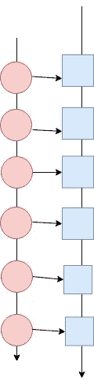
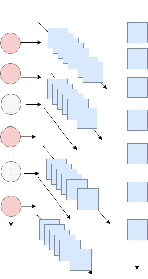

# 科幻极客的数据处理基础——第一部分

> 原文：<https://towardsdatascience.com/fundamentals-of-data-processing-part-i-f6a6914e1fec?source=collection_archive---------8----------------------->

如果你对科幻感兴趣，你可能读过《三体问题》三部曲。我强烈推荐你去读一读，以防你没有看到这本书。

作者[刘](https://en.wikipedia.org/wiki/Liu_Cixin)提出的一个最引人入胜的想法是质子多维膨胀的想法。他将[质子](https://en.wikipedia.org/wiki/Proton)描述为高度复杂的 11 维结构，看起来很小(0.8418±0.0007fm。)因为它的维度是坍缩的。一个先进的文明可以通过扩大质子的坍缩维度来获得巨大的能量。三体世界的居民能够在二维空间中扩展一个质子，以建造一个跨越半个星球的巨大球面镜。这面镜子是用来在长时间黑暗中控制白天光线的。

我们还不能扩大质子的维度，但小的东西可以变大，大的东西可以变小的想法是数据处理的基础。

让我们从我们的“*质子*”开始，我们将要展开它。在数据处理领域，我们从一个*记录*开始。记录可以是巨大点击流中的一次点击，可以是用户上传的一张图片，可以是 IOT 设备的一次测量，可以是一次医疗测试结果……记录是您的基石。现在让我们试着对你的记录进行多维扩展，看看能做些什么。

这个博客有一个代码库，里面有可运行的例子:[https://github.com/actions/dp_fundamentals](https://github.com/actions/dp_fundamentals)

## 维度 1 —迭代器

迭代器可能是最简单也是最吸引人的数据结构。你可能有最强大的数据结构，比如多维树或很酷的散列，这些都不能做迭代器能做的。一个迭代器可以遍历一个数据集，你甚至无法想象它能适合你的内存，它所需要的只是一个常量内存来容纳一条记录。真正的迭代器是你的一维扩展工具。让我们更详细地看一下。

```
**public interface** Iterator<E> { **boolean** hasNext(); E next();}
```

迭代器给了你获取数据的潜力。请注意，hasNext 方法不需要每次都返回 true。迭代器可以扩展非常大的数据集，甚至是永无止境的数据流。

迭代器允许你在执行这些计算之前建立一个计算链。让我们让迭代器更强大:

```
**abstract class** Iterator<I>{

    .....

    */**
     * map function apply an operation to every element of the
     * iterator at the moment of iteration
     ** ***@param mapper*** *mapper function
     ** ***@param <O>*** *Returning type
     ** ***@return*** *new iterator over processed data
     */* <O> Iterator<O> map(Function<I, O> mapper) {

        Iterator<I> origin = **this**;

        **return new** Iterator<O>() {
            @Override
            **boolean** hasNext() {
                **return** origin.hasNext();
            }

            @Override
            O next() {
                **return** mapper.apply(origin.next());
            }
        };
    }
    .....

}
```



我们介绍的第一种方法是 *map* 。方法*映射*在我们迭代时处理数据。我们一次处理一条记录。当我们调用 map 时，我们还没有处理数据。我们刚刚构建了一个以迭代器形式处理数据的计划。随着数据的到来，我们可以一次处理一个。

## 在实际执行处理之前构建执行计划的能力是构建数据处理管道的基础。执行规划可带来优化、容量规划、弹性、可扩展性和其他必要特性，从而实现持续可靠的数据处理。

## 平面地图

```
**abstract class** Iterator<I>{

....
<O> Iterator<O> flatMap(Function<I, Iterator<O>> splitter) {

        Iterator<I> origin = **this**;

        **return new** Iterator<O>() {

            *//initialize current iterator as empty iterator* Iterator<O> **current** = Iterators.*empty*();

            @Override
            **boolean** hasNext() {
                **if** (**current**.hasNext()){
                   **return true**;
                }
                **if**(origin.hasNext()){
                    **current** = splitter.apply(origin.next());
                    **return** hasNext();
                } **else** {
                    **return false**;
                }
            }

            @Override
            O next() {
                **return current**.next();
            }
        };
    }

....
}
```

让我们试着理解一下 flatMap 实际上是做什么的，为什么它是数据处理中最重要的功能。



如果您可以将数据集的每个元素转换为其他元素的迭代器，那么 flatmap 将产生一个迭代器，它将迭代所有结果迭代器的所有元素。同样，请注意，除了存储一行所需的内存之外，我们没有使用更多的内存。出于多种原因，Flatmap 的确不同凡响。它可以一次完成变形和过滤。注意，原始迭代器的一些元素可以转换成空迭代器，因此在输出中不存在。从技术上来说，可以用 Flatmap 写出很多有帮助的数据处理方法。

我们将看到如何使用 flatMap 来处理和过滤数据。

在这个例子中，我们迭代一个相当大的文件的行，并将这个迭代器转换成文件中有意义的单词的迭代器。

# 迭代一个数据文件。

下面是我们如何在一个文件上构建一个迭代器。请注意，我们不是将整个文件读入内存，而是只获取我们立即需要的内容。

现在我们开发了一个强大的机器来转换迭代器，让我们看看如何从迭代器中得到结果。

```
**abstract class** Iterator<I>{...
    **abstract boolean** hasNext();

    **abstract** I next();

    <O> O reduce(O start, BiFunction<O, I, O> aggregator){
        O current = start;
        **while**(hasNext()){
            current = aggregator.apply(current, next());
        }
        **return** current;
    }...
}
```

Reduce 是一个简单的方法，它将迭代器折叠成最终结果。我们需要的是将两个元素折叠成一个，然后随着迭代不断折叠的能力。

# 例子

## 顶级元素

```
Integer[] data = {**10**,**20,30**,**40**,**50**,**60**,**71**,**80**,**90**,**91**};

**int** k = 3;
PriorityQueue<Integer> top = Iterators.*overArray*(data)
        .reduce(**new** PriorityQueue<Integer>(k), (topn, el)->{
            **if**(topn.size()<k){
                topn.offer(el);
            } **else**{
             **if**(topn.peek()<el){
                 topn.poll();
                 topn.offer(el);
             }
            }
            **return** topn;
        });
```

## 字数

这是一个例子，所有的东西都聚集在一起。我们阅读了一个大文件——[莎士比亚全集](http://www.gutenberg.org/files/100/100-0.txt)。FlatMap 帮助我们将每一行拆分成单词，并一次性过滤掉无意义的行。Reduce 将计数聚集在一起。

*作业——改进行处理，更好地提取有意义的单词。结合两个例子，得出前三个最受欢迎的词。*

# 转换与行动

如果我们仔细看看我们的例子，我们可以用迭代器做两种类型的活动。这些可以分为两种类型——转换和动作。

像*贴图*、*平面贴图*、*滤镜*或 *linesFromFile* 、*、*这样的变换并不能真正做什么。他们只是建立了一个步骤链，这将发生在结果迭代器被遍历的时候。您可以构建最复杂的转换链，但是在有人对结果迭代器调用 *next* 之前，实际上不会发生任何计算。

像 *reduce* 这样的动作实际上是遍历一个迭代器来调用转换并产生结果。


## 扩大企业

现在我们知道了迭代器的基础知识以及如何使用它们。是时候添加更多的转换和操作了。

[*filter*](https://github.com/actions/dp_fundamentals/blob/master/src/main/java/fundamentals/iterators/Iterator.java#L80) —更容易使用的方法来对过滤后的数据产生新的迭代器。如果你注意的话，我们已经用它从单词列表中删除了空字符串。

[](https://github.com/actions/dp_fundamentals/blob/master/src/main/java/fundamentals/iterators/Iterator.java#L112)*—当我们想知道元素在迭代器中的位置时会有帮助。我们只需在现有的迭代器中添加 counter。*

*[*取*](https://github.com/actions/dp_fundamentals/blob/master/src/main/java/fundamentals/iterators/Iterator.java#L155)*——*在第一个迭代器的前 n 个元素上产生一个迭代器。您将看到它如何限制作为 wordCount 输出一部分的打印字数。*

*[*forEach*](https://github.com/actions/dp_fundamentals/blob/master/src/main/java/fundamentals/iterators/Iterator.java#L136)*—*是一个动作，它遍历迭代器，对每个值应用一个函数。它不返回任何内容。如果我们必须将转换的结果保存到文件、数据库或其他存储中，这是非常有用的。*

*[*收藏*](https://github.com/actions/dp_fundamentals/blob/master/src/main/java/fundamentals/iterators/Iterator.java#L174)*——*是一个动作。它遍历迭代器并将数据收集到 java list 中。*

*[*范围*](https://github.com/actions/dp_fundamentals/blob/master/src/main/java/fundamentals/iterators/Iterators.java#L51) *—* 在一个数字范围内迭代。将其视为 i 结构的*的替代品。基本上只是一个围绕 reduce 的简单包装。**

*[*over array*](https://github.com/actions/dp_fundamentals/blob/master/src/main/java/fundamentals/iterators/Iterators.java#L33)*—*遍历数组中的元素*

*[*from Java*](https://github.com/actions/dp_fundamentals/blob/master/src/main/java/fundamentals/iterators/Iterators.java#L107)*——*将 Java 迭代器，没有我们有用的方法，转换成支持转换和动作的迭代器。*

# *结论*

*这里描述的迭代器是一个简单的工具，它帮助您在实际处理数据之前建立数据处理计划。它可以帮助处理看似无穷无尽的数据，只使用有限的内存。迭代器可以被想象成一维数据扩展，为扩展到“更高维度”打下基础。特别是在内核、机器和数据中心之间并行处理。*

## *拍手，喜欢，分享是你想了解更多关于多维数据扩展的知识。*

*阅读[第二部分](https://medium.com/@szelvenskiy/fundamentals-of-data-processing-for-scifi-geeks-part-ii-apache-spark-rdd-3d4b2c6f39f)学习如何扩展到第二维度。*

# *放弃*

**注意:该实现仅为演示目的而特意简化。生产就绪实现稍微复杂一些。**