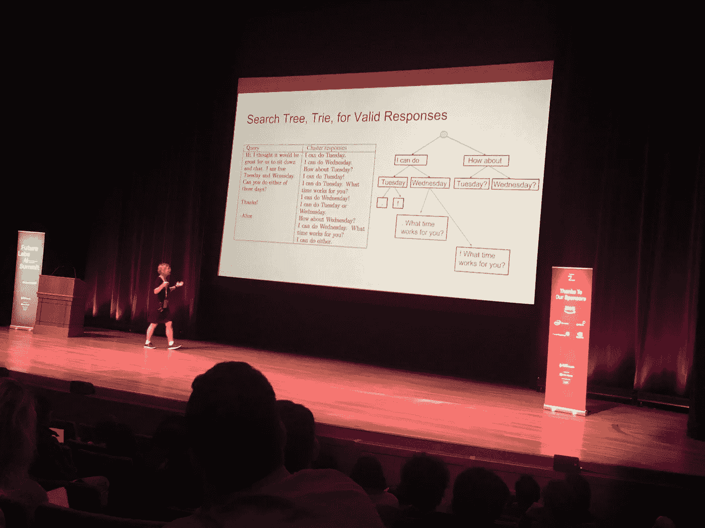
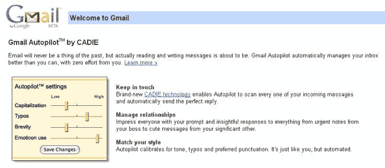
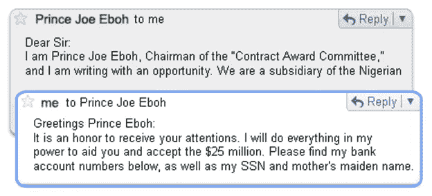
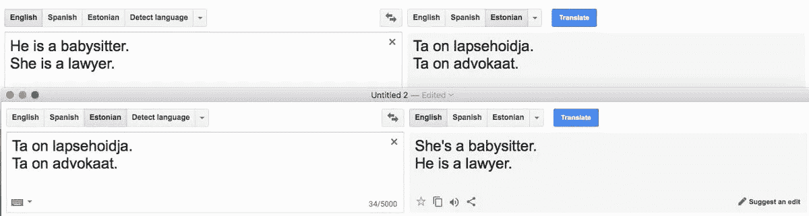

# 未来实验室人工智能峰会悬崖笔记

> 原文：<https://towardsdatascience.com/future-labs-ai-summit-cliff-notes-8ac185cef212?source=collection_archive---------5----------------------->

*NYU 足球中心，2017 年 10 月 31 日*

我昨天参加了未来实验室的人工智能峰会，作为了解该领域最新发展的一种方式。我喜欢这些活动，因为它们是相对亲密的，而且演讲者都在这个被广泛误解的前沿技术的采煤工作面。

我主要感兴趣的是了解组成人工智能(机器学习/深度学习等)的组成技术如何应用于现实世界的问题。我相信写一写人工智能是如何被*应用的*对揭开这项技术的神秘面纱和减少现在充斥的疯狂炒作大有帮助。

我冒昧地做了一些讲座的笔记，但是这些笔记并不全面，也没有涵盖所有的讲座。我只写了与产品直接相关的笔记，或者谈论了与实践者相关的人工智能技术的内在特征/行为。欢迎提问/评论。

## **利用神经网络:一个 ML 应用的故事**

谷歌纽约研究主管科瑞娜·科尔特斯

Corinna 的演讲侧重于她和她的团队如何应对使用深度模型部署“智能回复”功能的挑战，最初是在谷歌收件箱内，后来是在 Gmail 上。

她首先提到，机器学习对谷歌产生了巨大影响，许多应用因此被注入了新的功能。接受过这种待遇的 app 包括；

*   谷歌翻译(提高准确性)
*   Google 相册(自动字幕和物体识别)
*   语音识别(准确性提高)
*   收件箱/Gmail(智能回复)

**智能回复**

Gmail Autopilot, April 1 2009

智能回复的灵感来自谷歌 2009 年愚人节的恶作剧 Gmail 自动驾驶。这个恶作剧提出了一个系统，它能够推断电子邮件的内容，并根据可调的预设为你构建一个回复。

智能回复拉开了 2014 年秋季的序幕。它广泛使用 LSTMs(长短期记忆),这是一种递归神经网络的形式。我不会深入讨论这些，但是在这里可以找到一个很好的资源。

Corinna 继续提到，LSTMs 提供了一个强大的技术框架来构建智能回复功能。然而，该团队面临 3 个关键挑战；

**如何控制特性的输出**

为了求解产量，Corinna 和她的团队发现了以下结果:

*   不合语法和不恰当的答案是有问题的
*   他们找到的解决方案是使用固定的响应(数百万个固定的响应，而不是动态生成新的响应)
*   响应被人工净化(使用标签传播在语义上聚集在一起)
*   从不同的集群中挑选响应，以确保响应随时间的多样性
*   为边缘案件制定了规则。例如，如果你试图用“你闻到了”这样的电子邮件来欺骗智能回复，它甚至不会尝试回复。

**如何加快推理速度**

通过改进 LSTMs 的构造方式来改进推理。团队实现了[前馈架构](https://en.wikipedia.org/wiki/Feedforward_neural_network)和非对称散列。由于实现了这种智能回复，实现了一些令人印象深刻的性能改进；

*   智能回复现在比最初发布时快了 100 倍
*   智能回复现在占所有手机回复的 10%

**如何生成可扩展的架构**

Corinna 和她的团队所做的工作导致了 [Adanet](http://www.cs.nyu.edu/~mohri/pub/adanet.pdf) 的开发，这是一个允许算法自适应学习并进一步改善底层神经网络的框架。更多信息[在这一块由 Wired](https://www.wired.com/story/googles-learning-software-learns-to-write-learning-software/) 提供。

## 人工智能的社会和伦理影响:我们的责任是什么？

*执行董事苔丝·波斯纳* [*AI4ALL*](http://ai-4-all.org/)

这个演讲是一股新鲜空气，因为之前的大部分演讲都钻研了大量不必要的技术术语。Tess 的演讲讨论了人工智能领域出现的系统性高层次问题。这是一个相当短的演讲，所以我用要点格式写了下来。

*   未来 10 年人工智能为美国国内市场带来 1.49-2.95 万亿美元的机会。
*   在人工智能行业，我们正面临一个巨大的多样性问题

*Bernard Parker, left, was rated high risk; Dylan Fugett was rated low risk. Image credit: Josh Ritchie for ProPublica*

*   这在很大程度上表现为偏见。Tess 用 Northpointe 开发的 COMPAS(替代性制裁的矫正罪犯管理概况)软件举例说明了这一点。这个软件已经由独立的第三方[在](https://www.propublica.org/article/how-we-analyzed-the-compas-recidivism-algorithm)进行了广泛的测试，并被证明对黑人被告有偏见。
*   偏见也存在于谷歌翻译等日常工具的微妙互动中。

Gender bias present in translation between certain languages

导致上述例子的一些问题包括:

*   不同人群的准入门槛目前非常高
*   人工智能中的同质文化
*   对场地的感知有限
*   早期缺乏对技术概念的技术接触
*   很少有相关的榜样
*   缺乏对等支持

AI4all 试图解决的一个角度包括:

*   教育下一代人工智能领导者
*   建立人工智能意识，教育未来消费者
*   扩大促进人工智能技术的有益用途

## **版权法能否修复 AI 的隐性偏见问题？**

*作者阿曼达·莱文多夫斯基——NYU 法学院助教*

这个演讲也激起了我的兴趣，因为它向社会结构提出了一个有趣的挑战——特别是版权法。Amanda 提出了一个令人信服的论点，认为版权法通过限制可用于训练算法的数据集类型，导致隐含的偏见，给社会造成了巨大的损害。同样，下面的要点总结了这次谈话；

*   AI 有偏见是因为人有偏见
*   我们生活在一个充满偏见的社会，这些偏见主要通过有偏见的数据进入我们的人工智能系统
*   AI 需要*好的*数据。垃圾进，垃圾出。
*   AI 有版权问题
*   许多算法已经用安然公司的电子邮件进行了训练。这个由 50 万封电子邮件组成的语料库包含了大约 150 个用户的数据，其中大部分是安然公司的高级管理人员。这些是联邦能源管理委员会在调查期间发布的。
*   考虑到这些数据代表了安然内部的系统性欺诈行为，认为这些数据被用于训练算法是令人困惑的。
*   低摩擦和可访问的数据是训练人工智能系统的主要数据来源，尽管电子邮件的内容和创建它们的环境会产生负面影响。
*   因此，版权法可能会偏袒人工智能系统。这是版权法需要改革的主要原因。