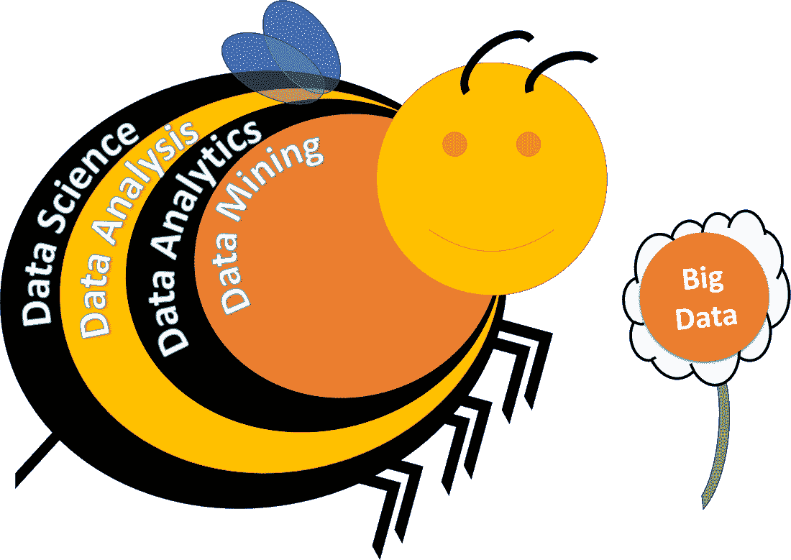
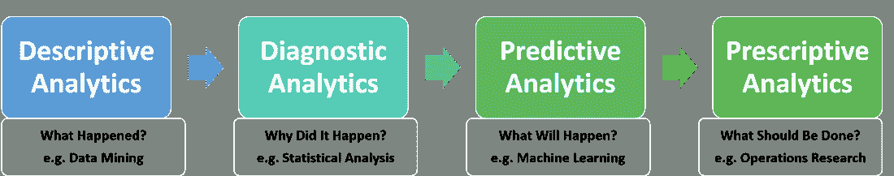

# 模糊流行:找出数据科学中流行词汇的“模糊逻辑”

> 原文：<https://towardsdatascience.com/fuzzy-buzzy-sussing-out-the-fuzzy-logic-of-buzzwords-in-data-science-d790b41c5a9e?source=collection_archive---------12----------------------->

“bee perched on sunflower” by [Christoph Polatzky](https://unsplash.com/@chrisdubai?utm_source=medium&utm_medium=referral) on [Unsplash](https://unsplash.com?utm_source=medium&utm_medium=referral)

*声明:本帖不涉及实际* [*模糊逻辑*](https://en.wikipedia.org/wiki/Fuzzy_logic) *。这个词原本只是一个双关语，但我后来意识到，它也表明了流行语的不当使用可能会产生误导。对于造成的任何困惑，我深表歉意。*

随着数据科学越来越受欢迎，许多流行语被随意地抛来抛去，却没有正确理解它们的真正含义。其中一些流行语包括数据分析、大数据、人工智能和机器学习等术语。但是不同于在 [ANCOVA](https://learncuriously.wordpress.com/2018/09/22/ancova/) 、 [Moderation](https://learncuriously.wordpress.com/2018/09/29/moderation-and-mediation/) 和 [The Confusion Matrix](https://learncuriously.wordpress.com/2018/10/21/confused-by-the-confusion-matrix/) 的帖子中提到的术语，数据科学中的许多术语实际上是不可互换的。这篇帖子试图解释这些流行语的细微差异，以便我们都能说一种不那么令人困惑的共同语言。

# 介绍数据科学模糊 Buzzy

尽管有最近的趋势，数据科学实际上并不是一个新领域。如果我们将数据科学重新表述为“数据科学”，那么很明显 [**数据科学**](https://en.wikipedia.org/wiki/Data_science) 就是所有与数据相关的事物的形式化。但是执行数据科学不仅仅包括分析数据；收集、清理和准备数据都是数据科学的重要子学科，其中每一个都可以成为一个独立的专业领域。换句话说，数据科学家的广义定义应该包括任何与数据打交道的人，甚至包括那些只使用电子表格来管理数据和进行简单计算的人(尽管这种联系可能会被更自负的更复杂的数据科学家所反对:P)。

The Data Science Fuzzy Buzzy.

现在，让我们把数据科学中的术语层次想象成一个模糊的嗡嗡声(实际上这只是一个可爱的维恩图)，从最外圈的最广泛到最内圈的最具体。这也是一个很好的类比，可以将数据科学想象成一个模糊的概念，使用不同的技术从数据花中收集花粉和花蜜，然后将它们转化为蜂蜜洞察力！为了简化问题，我们将只关注数据科学中的数据分析领域。

有些人可能想知道，数据分析和数据分析之间到底有什么区别？ [**数据分析**](https://en.wikipedia.org/wiki/Data_analysis) 是一个通用术语，用来描述为了获得某种洞察力而检查数据的过程。因为数据可以是定性的也可以是定量的，所以数据分析也可以以不同的方式进行。定性分析旨在通过解释技术了解无形因素，如潜在原因和动机；而定量分析旨在使用计算技术(如数据分析)进行可量化的测量。换句话说， [**数据分析**](https://en.wikipedia.org/wiki/Analytics) 是允许数据分析定量进行的技术集合。

这使得 [**数据挖掘**](https://en.wikipedia.org/wiki/Data_mining) 成为数据分析中使用的许多技术之一，其他众所周知的技术包括 [**机器学习**](https://en.wikipedia.org/wiki/Machine_learning) 和 [**统计分析**](https://en.wikipedia.org/wiki/Statistical_inference) 。虽然这三种技术看似相似并有重叠，但它们的最终目标却大不相同。数据挖掘仅仅关注于在数据中寻找模式；机器学习更关心利用数据中的信息做出准确的预测；统计分析最感兴趣的是从数据中得出推论。将这些技术用于他们自己之外的目的是不合适的，但是研究人员和分析人员仍然经常犯这样的错误，导致错误的结论。这方面的更多内容将在后面的部分中讨论。

你可能会问，那么人工智能在哪里？[**【AI】**](https://en.wikipedia.org/wiki/Artificial_intelligence)人工智能(Artificial Intelligence)是以“学习”和“解决问题”的形式模仿人类智能的过程的一般描述(不是说人类智能是智能的缩影，但我们将不得不与它一起工作)。人工智能已经存在很多年了，最常见的形式是电脑游戏中不可玩的角色。但大多数人工智能都是使用 if-else 条件硬编程的，这不是对人类认知的准确描述。然而，近年来，机器学习的进步，特别是在[强化学习](https://en.wikipedia.org/wiki/Reinforcement_learning)(例如 AlphaGo 击败职业围棋选手)方面，已经让 AI 更接近人类处理信息的方式。因此，当我们在数据科学中谈论人工智能时，我们实际上是指使用看似智能的算法来处理和分析数据，而机器学习通常是实现这一目标的最常见方法。

这很好地总结了数据科学模糊 Buzzy 的结构，并澄清了人工智能实际上是通过机器学习实现的，而不是真正的技术本身。但是等等！大数据呢？ [**大数据**](https://en.wikipedia.org/wiki/Big_data) 仅仅是如此庞大的数据集，需要专门的技术来处理和分析它们。除此之外，它们就像任何其他数据花一样，等待数据科学 Fuzzy Buzzy 从它们身上采集花粉和花蜜。

# 我们真的需要在这个问题上吹毛求疵吗？

有些人可能想知道是否真的有必要在条款上变得如此专业。除了被那些不理解其含义而随意使用这些术语的人弄糊涂之外，更重要的是澄清这些术语，因为它们通常是为非常不同的目的而设计的。数据分析中的各种技术并不等同，可能具有不同级别的可解释性和准确性。一般来说，更复杂的技术往往对它们被训练过的数据集有更好的准确性，但往往以[过度拟合](https://en.wikipedia.org/wiki/Overfitting)而告终，并且在推广到新场景方面表现不佳。因此，随着预测精度的提高，模型的可解释性往往会受到影响(参见下面的权衡图)。

Interpretability vs Accuracy Trade-off.

根据数据的类型和分析的目的，选择使用的技术应该是不同的。例如，如果重点是使用具有许多变量的大型数据集进行预测，机器学习通常是可行的方法。然而，如果目的是对一个只有几个变量的小数据集进行推断，用一个适当的假设进行统计分析是一个必要的过程。没有明确假设的数据挖掘行为无异于[*【p】*——黑客](https://en.wikipedia.org/wiki/Data_dredging)，这也是众多学科中[复制危机](/bayesian-analysis-the-replication-crisis-a-laypersons-perspective-241f9d4f73db)的部分原因。一些研究人员还犯了使用机器学习进行推理的错误。像[深度学习](https://en.wikipedia.org/wiki/Deep_learning)这样的机器学习技术不仅因为是难以解释的黑盒而臭名昭著，试图根据输入和输出解释数据也类似于将[相关性视为因果关系](https://en.wikipedia.org/wiki/Correlation_does_not_imply_causation)。

本质上，我们应该首先确定我们试图回答的问题，然后才能决定要使用的分析类型。基于 Gartner 分析优势模型，如果单纯想知道“发生了什么”，数据挖掘等描述性分析就足够了；但是如果我们想问“为什么会发生”的问题，诊断分析如统计分析对于解释是必要的；然而，如果我们想预测“将会发生什么”，机器学习等预测分析是更合适的方法；最后，如果需要知道“应该做什么”,将需要说明性的分析，如[运筹学](https://en.wikipedia.org/wiki/Modeling_and_simulation)[中的](https://en.wikipedia.org/wiki/Operations_research)建模和模拟,以建议最佳行动方案。

Gartner Analytic Ascendancy Model.

* * * * * * * * * *

诚然，这些各种各样的流行词汇和技术术语之间的界限可能比我所描绘的更加模糊。但是，我不认为这些术语是可以互换的，而是希望这个模糊的嗡嗡声的简单说明有助于区分它们。这将有助于更好地理解它们的用途，从而使它们的使用更加精确。

**参考文献&延伸阅读:**

 [## 数据分析、数据分析、数据挖掘、数据科学、机器之间的区别是什么

### 数据分析，数据分析，数据挖掘，数据科学，机器学习，大数据和…

www.mo-data.com](https://www.mo-data.com/what-is-the-difference-between-data-analytics-data-analysis-data-mining-data-science-machine-learning-big-data-and-predictive-analytics/)  [## 机器学习与统计学:何时使用每种方法

### 机器学习和统计学哪个好？希望这个问题的措辞突出了它的…

医疗保健. ai](https://healthcare.ai/machine-learning-versus-statistics-use/)  [## 机器学习与统计学——硅谷数据科学

### 两位作者，一位机器学习实践者和一位长期合作的专业统计学家，解开了…

www.svds.com](https://www.svds.com/machine-learning-vs-statistics/)  [## 意义点:统计学与机器学习

### 本月

www.nature.com](https://www.nature.com/articles/nmeth.4642)  [## 机器学习、数据科学、运筹学——有什么区别？

### 机器学习、数据科学和运筹学是在不同行业中被大量使用的术语。

revenueanalytics.com](https://revenueanalytics.com/machine-learning-data-science-and-operations-research-whats-the-difference/)  [## 为什么统计学、机器学习和运筹学作为独立的实体脱颖而出

### 似乎现在从事统计、机器学习和运营研究的人都认为…

stats.stackexchange.com](https://stats.stackexchange.com/questions/234863/why-do-statistics-machine-learning-and-operations-research-stand-out-as-separat)  [## 机器学习在运筹学中是如何使用的？

### 机器学习(ML)可以在运筹学(OR)中使用。ML 可以用来调优特定于域的…

www.quora.com](https://www.quora.com/How-is-machine-learning-used-in-operations-research) 

*最初发布于:*[*https://learn curily . WordPress . com/2018/11/04/fuzzy-buzzwords-in-data-science*](https://learncuriously.wordpress.com/2018/11/04/fuzzy-buzzwords-in-data-science/)