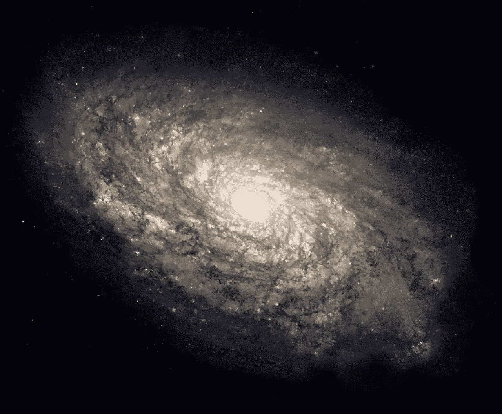
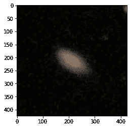
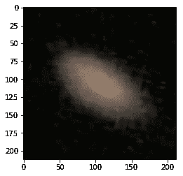
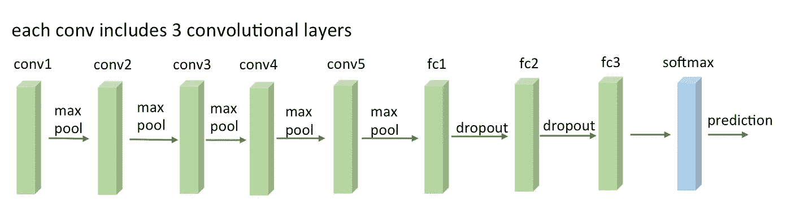
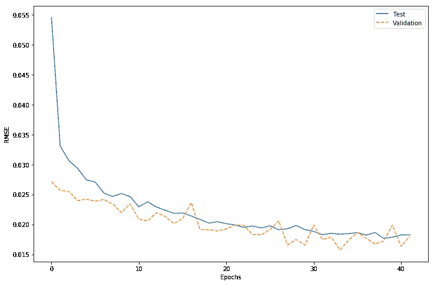

# 用 Keras 对银河动物园进行分类

> 原文：<https://towardsdatascience.com/galaxy-zoo-classification-with-keras-219184aff581?source=collection_archive---------2----------------------->

A typical [spiral galaxy](https://en.wikipedia.org/wiki/Spiral_galaxy), we’re going to build a convolutional neural network to classify these guys. Taken from wikipedia.

*完整的代码可以在我的 Github 上的*[*【https://github.com/jameslawlor/kaggle_galaxy_zoo】*](https://github.com/jameslawlor/kaggle_galaxy_zoo)*找到。*

我最近参加了几周的关于实用深度学习的[杰瑞米·霍华德](https://medium.com/u/34ab754f8c5e?source=post_page-----219184aff581--------------------------------)和[瑞秋·托马斯](https://medium.com/u/ee56d0bac1b7?source=post_page-----219184aff581--------------------------------)优秀 *fast.ai* MOOC。我过去学过几门神经网络课程，虽然我理解数学和理论，但我没有太多使用常用工具的实践经验，比如 TensorFlow 和 keras。这个课程用一种“自顶向下，代码优先”的方法完美地填补了我的知识空白，非常令人耳目一新。

所以直接进入正题:本课程第二课的作业是为我们选择的数据集创建一个深度学习模型。我选择 [Kaggle 银河动物园竞赛](https://www.kaggle.com/c/galaxy-zoo-the-galaxy-challenge)是因为太空相当酷。比赛是大约 4 年前直播的，所以我来参加派对有点晚了！在这篇文章中，我将介绍我的解决方案，它的 RMSE 得分为 0.12875，这将使我处于排行榜的上半部分。对于几个小时的工作来说还不错。当然还有很多需要改进和试验的地方，我将在最后谈到，但我对结果很满意，因为我现在对 *keras 更加熟悉和熟悉了。*我在谷歌的前几页没有找到任何关于银河动物园与 *keras* 比赛的代码或演练，也许是因为比赛已经有 4 年了，而 keras 是两年前才发布的，所以希望这对试图解决这个问题的人有用。

# 数据准备

在训练集中有大约 60，000 幅图像，在测试集中有 80，000 幅图像，每幅图像都是 424x424 彩色 JPEG。通过检查图像，您可以看到只有图像的中心部分是有用的。我决定围绕中心裁剪为 212x212，并向下采样到一半分辨率，以减少我们必须调整的参数数量。

Left — An example from the training data. We only really care about the centre of each image, so crop and downsample to get the image on the right.

完成此操作的代码如下:

另一个考虑是，我们有大量的训练和测试数据，太多了，无法加载到 GPU 内存中。我编写了一些*批处理生成器*来顺序抓取一批图像，通过图像处理代码运行它们，然后将它们的解码数据传递给卷积神经网络(CNN)。下面是批处理生成器代码的一个例子

# 模型架构

Similar to my model architecture. Taken from [http://blog.christianperone.com](http://blog.christianperone.com)

我决定采用类似 VGG16 的 CNN 架构——这是一堆卷积/Max 池层，后面是一些大型 FC 块和最后一个 37 级 sigmoidal 激活层，用于预测星系级概率。我选择这种架构是因为众所周知 VGG16 在图像问题上做得非常好，网上的共识似乎是它在易于实现、训练时间和体面的结果之间取得了良好的平衡。有一种方法可以通过简单的导入在 keras 中加载预训练的 VGG16，然后您可以通过微调来适应您的问题，但我选择通过从头构建和训练来做一些困难的事情。所以你不会认为我在 GPU 时间上浪费金钱是完全疯狂的，我的动机是我想看看一个“新鲜”的神经网络在问题中会如何表现。我的理由是，因为我们希望我们的网络在星系数据集中检测和识别的功能和类别与 ImageNet 相比并不庞大，ImageNet 是“真正的”可预加载 VGG16 经过数周训练的，包含来自狗或牙齿或战舰的对象。因此，我们不应该需要长时间的训练来获得好的结果，因为输入之间的差异不是很大。我会试着想象一些模型过滤器来测试这个想法，并在我有时间的时候编辑它。这是我心中的一个很好的例子[https://blog . keras . io/how-convolutionary-neural-networks-see-the-world . html](https://blog.keras.io/how-convolutional-neural-networks-see-the-world.html)。

基于模型简单的想法，如果我们移除或减少一些层，看看我的模型如何工作会很有趣。我有一种预感，完整的 VGG16 架构对这个问题来说可能是大材小用，但 YOLO 正如古语所说。

下面是实现该架构的代码:

我用的是 RMSProp 优化器，学习率 1.0e-6。这是训练的样子，我从训练集中拿出 4000 张图片放在一个单独的文件夹中进行验证。

在具有 1/2 K80 GPU 的 Azure NV6 机器上，训练进行了大约 90 分钟，进行了 42 个周期(提前停止)。

# 摘要

这个模型获得了 0.12875 的 RMSE 分数，从开始编码到提交 Kaggle 只需几个小时，这将使我处于排行榜的上半部分。有很多方法可以改进模型，我可能会回来，特别是数字预测——这些不是典型的概率，而是不同类别之间的加权。37 个类中的每一个的简单的 sigmoid 是天真的，没有捕捉到这个条件。我还想尝试更简单的架构、改进的图像处理等等。我可能会在某个时候回来，因为我确实很喜欢它，但现在我专注于完成 *fast.ai* 课程。

如果你对改编我的方法感兴趣，代码在我的 Github 上，在 https://github.com/jameslawlor/kaggle_galaxy_zoo。同样值得一提的是竞赛获胜者 Sander Dieleman 的评论，可以在他们位于 http://benanne.github.io/2014/04/05/galaxy-zoo.htmlT2 的博客上找到。