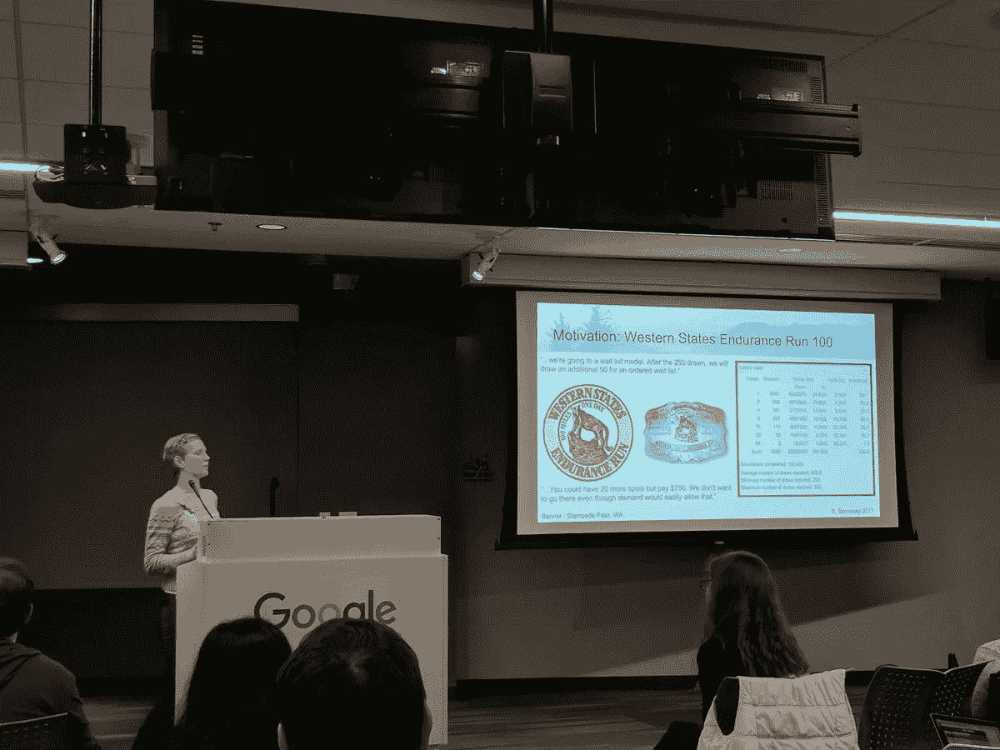

# “激发”我的技能

> 原文：<https://towardsdatascience.com/galvanizing-my-skills-a4b4d1175cb4?source=collection_archive---------5----------------------->

在我旅程的第一集，我描述了为什么地球科学家会成为伟大的数据科学家。我们有“硬”东西的工作知识，在商业环境中处理真实的数据和随之而来的一切。然而，在获得数据科学领域的机会之前，我们许多人都必须填补一些空白。

这些差距中最大的是正式的编码经验。我们中的许多人在我们的地球科学职业生涯中创建了相当复杂的模型，然而，在我们的生活中只编写了一两行代码(除了无处不在的“Hello，World！”).总的来说，我们的模型是由隐藏在可爱的用户界面下的复杂程序(Petrel，EarthVision 等)促成的。)使用地质统计学方法，我们对“黑匣子”中发生的事情有了基本的了解。

另一个缺口是我喜欢称之为“经典”统计。我们的优势之一是*应用*概率和统计，然而，当谈到学术环境中的经典统计时，我们可能会有所欠缺。我们肯定在日常生活中应用了概率和统计，但是正式的术语和如何与统计学家交谈可能是缺乏的。

为了填补这些空白，我四处寻找能够帮助像我这样的职业生涯中期的专业人士填补成为正式数据科学家所需的空白的项目。

我不会深入讨论过多的“训练营”项目的复杂利弊(例如，激励、Metis、数据孵化器、Insight 等)。).然而，我会用我的逻辑来选择训练营而不是传统的学术项目。

这实质上归结为 ***三个*** 重大原因:

1.  学位要求——我已经有了一个基于论文的研究生学位。许多数据科学职位的最低要求是科学/定量学科的硕士或博士学位。回去找一个专业的全职 MS 看起来有点矫枉过正，而且时间:花费:支出比率也不理想。另一方面，训练营允许更快的周转时间来更快地进入市场。
2.  时机——许多专业的微软项目要么是兼职的，要么要求在放弃薪水的情况下搬到不切实际的地方。兼职项目对于职业人士来说很好，但是对于我们这些需要休息的人来说，就不太实际了。“训练营”项目，如“激励”(我选择了其中的一个)，平均 12-16 周，对促进职业转型更容易接受。
3.  课程——作为地球科学家，我们已经有了很多“软”技能。深入研究经典概率和统计的编码和复习正是我们所需要的。这正是[激励](https://www.galvanize.com/seattle/data-science)项目所提供的，也是我选择参加的原因。

我可以详细讲述一下*我从《激励计划》中学到了什么，数学，建模和职业发展，但这最好留给另一个系列。在这里，我将简单地强调一下 ***我是如何利用这个项目为自己的数据科学职业定位的。****

经过大量研究后，我计划中的第一个目标是，不仅要让自己获得激励，更重要的是，在入学时取得成功。对我来说，这需要在我已经掌握的最基本水平之外学习 Python(“你好，世界！”).

Early adopter of computing and always learning… (circa 1986)

我花了几个月的时间吸收了我能从初级和中级 Python 的 [Coursera](https://www.coursera.org/specializations/python) 、 [Udacity](https://www.udacity.com/course/data-analysis-with-r--ud651) 、 [MITedX](https://www.edx.org/course/introduction-computer-science-mitx-6-00-1x-11) 等网站上找到的所有在线课程和内容。请注意，您可以找到很多资源来直接进入 Python 和 R 的机器学习包，但是我发现从长远来看，首先学习编程基础要好得多。

如果没有这些编程基础，您将无法掌握必要的技能:

1.  与软件工程师进行智能交流。数据科学并不总是仅仅操纵数据和对数据建模。在许多公司，您需要与软件工程师一起工作，以确保您的模型部署顺利进行。在地球科学中，这类似于与油藏和钻井工程师一起工作。优秀的地球科学家需要具备工作知识，了解将我们的地质模型升级到油藏模型比例的含义。同样的原理，不同的领域。我们现在需要知道我们的代码对更大的产品的影响。如果我们孤立地存在，集成到一个无缝的(没有错误的)产品中会困难得多。
2.  快速学习新语言。目前，大多数数据科学家都在结合使用 Python、R 和 SQL。然而，这种情况将来可能会改变。这不像在地球物理学中，非常复杂的地震处理算法仍然是用 Fortran 或 C++编写的。数据科学家需要充满活力，能够灵活应对技术的变化。学习编程的基础知识将使你为这些变化做好准备。
3.  面试成功。不管你喜不喜欢，白板面试仍然是数据科学中的王者。许多数据科学家都有软件工程背景。作为地球科学家，我们可能在面试的解释和商业方面有优势。然而，在一天结束的时候，人们会根据我们在白板上解决常见(和不常见)算法谜语的能力来评判我们。在不使用图书馆的情况下，了解计算机编程的基础知识是在科技世界的面试环境中必备的技能。

学习可能需要一点时间和投入，但是一点点就足以获得第一个“官方”数据科学职位。

在熟悉了基础知识之后，我准备申请 getting。

在 While 项目中，我学习了我所知道和喜爱的机器学习算法的数学基础。我在项目的“休息时间”练习编程技能，这样我就能更快地识别面试中的谜语模式。和许多人一样，白板面试不是我的强项，我很早就发现了这一点，并稳步提高自己的技能，向未来的雇主证明我有编码能力。

在此期间，我还不得不撕毁我的简历。

它始于这样一个问题:作为一名数据科学家，我如何有效地沟通和推销自己？但它比这更深入:

1.  作为一名地球科学家，我如何有效地传达我的成就和所做的事情实际上是数据科学？
2.  在一个不披露信息和受 SEC 影响的世界里，我如何量化自己在石油和天然气领域的成就？
3.  我如何强调快速掌握新的语言和概念，并满足公司的编码/技术要求？

你看,“科技”公司倾向于对候选人有一个大而全面的“愿望清单”。他们希望员工能够用有限的数字和 KPI 有效地传达他们的成就。在石油和天然气行业，对我来说，我拥有的最切实的 KPI 是，我们的评价井计划在撤资之前减少了对另一口约 3 . 5 亿美元井的需求(真实故事)。

使用 KPI 简明扼要地突出我们的成就需要创造力。这里面有很多要解开的，具体来说就是 ***两个*** 的问题:

1.  行业之间的知识差距。就地球科学家而言，石油和天然气与科技。
2.  地球科学家和数据科学家的角色和职责之间的知识差距

我通过创造性地从科技行业的角色和责任的角度撰写简历，完成了第二个目标。然而，第一个更难得到。

这就是我不断扩大的人际网络发挥作用的地方。**联网 ！**

为了我的项目，我搬到了西雅图，所以这给了我一个极好的机会，让我走出自己的舒适区，结交新朋友。我开始参加聚会，特别是[小狗](https://www.meetup.com/PSPPython/)(普吉特湾编程 Python)小组，该小组每月在科技公司轮流召开会议。

我不是最外向的人，我实际上渴望和平和安静来充电。定期去社交网络不在我的舒适区。然而，为了最大限度地提高我的成功概率，我需要建立网络来了解我在广阔的数据科学领域中的位置。

看，课程的实际内容并不像课程的结果那样吸引人(即使在数据科学领域，课程内容也是非常标准的)。你如何学习这门课程将会获得最高的投资回报率。

我接触 galilet 不仅是为了“激发”我的基本技能，更是为了促进我与公司和其他数据科学家的对话。

Presenting a personal project at Google for PuPPy Monthly MeetUp

请在未来几周继续关注，我将详细介绍我是如何获得数据科学工作的。

继续看[第三集](https://medium.com/@stefbernosky/framing-the-hunt-913f9a0eae6a)、[第四集](https://medium.com/towards-data-science/job-postings-a-riddle-86f77ac610d5)、[第五集](https://medium.com/towards-data-science/we-arent-in-kansas-anymore-interviewing-struggles-f036d4a9fc9a)、[第六集](https://medium.com/@stefbernosky/consulting-why-consulting-b8a22243ff89)、[第七集](https://medium.com/towards-data-science/consulting-trial-by-fire-c33a24e65a59)和[第八集](https://medium.com/@stefbernosky/diamonds-in-the-rough-call-to-action-90c01e0952ed)。