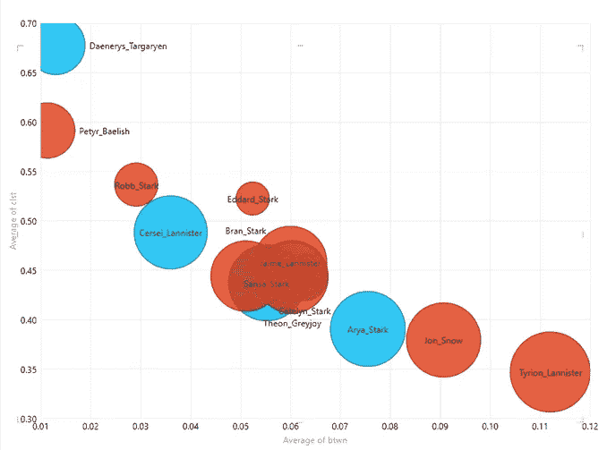
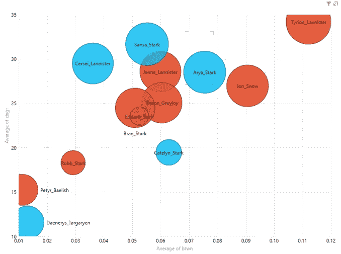
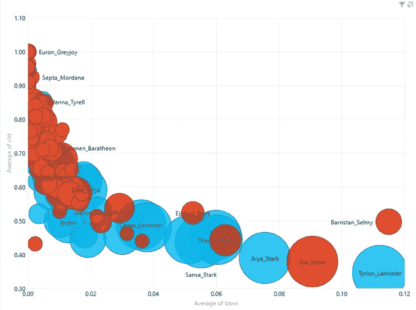
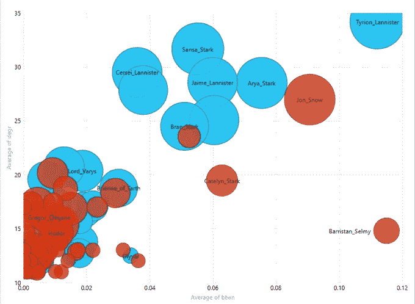
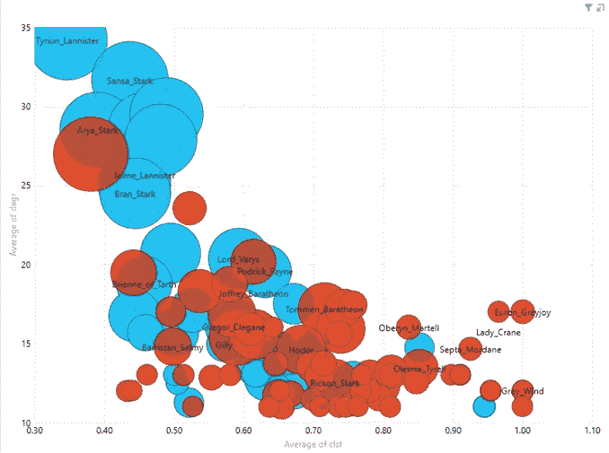

# 《权力的游戏》第 7.5 季第 3 集

> 原文：<https://towardsdatascience.com/game-of-thrones-season-7-5-episode-3-fcf1f35af7c0?source=collection_archive---------14----------------------->

## 字符网络的位置和优势

在[第 2 集](https://medium.com/@joel.a.c.baum/game-of-thrones-season-7-5-episode-2-dd518f6b03c)中，我们量化了[第 1 集](https://medium.com/@joel.a.c.baum/game-of-thrones-season-7-5-episode-1-27bdc906e6df)中介绍的人物同现网络图拓扑的关键特征，对其结构得出了更为确切的结论，为挖掘个体人物的网络位置和优势奠定了基础。

我们发现共现网络是高度模块化的，密集聚集的区域由穿过它们的纽带稀疏连接。我们还发现这个网络是高度倾斜的——大多数角色在角色之间只有很少的连接或最短的路径，而少数角色有很多连接和最短的路径。这种偏斜也意味着网络中的字符之间相对较少的步骤，我们确实发现了这一点。

最后，为了量化共现网络的“小世界性”，我们将它的聚类和路径长度与节点和边数相同的随机网络进行了比较。同现网络具有小世界的特征，它比随机网络更聚集，但路径长度相似。然而，我们也看到，小世界结构在第七季结束时崩溃了，因为主要人物建立了更广泛的联盟来面对白行者，网络折叠成一个单一的小团体。

唷。我们在[第二集](https://medium.com/@joel.a.c.baum/game-of-thrones-season-7-5-episode-2-dd518f6b03c)做了很多！

在第三集，我们将注意力转向主要角色——常规角色和循环角色——在角色共现网络中的位置。谁处于有利地位？谁有机会控制信息和资源的流动？谁能赢得信任和忠诚？

## 网络位置和优势

在我们深入角色的网络位置之前，我们需要知道要寻找什么；也就是说，什么样的立场可能是有利的。社交网络研究表明，网络位置可以影响其居住者的结果，并指出两种位置——密集和稀疏——可以为其居住者创造不同的优势和更好的结果。

紧密结构中的网络职位——由与已经联系在一起的其他人的关系组成的职位——通过促进互惠规范和制裁机制、信任和共同身份的发展而使其占有者受益，所有这些都促进了高水平的合作和协调，从而可以促进合作并限制机会主义。

稀疏结构中的网络职位——由与其他人*没有*已经链接的关系组成的职位——通过将他们置于原本不相连的群体之间，让他们接触并有机会控制网络中流动的各种信息和资源，使他们受益，所有这些都能够更好地预测问题并利用新的机会。

听起来熟悉吗？我当然希望如此！这些位置反映了小世界网络的两种定义结构，它们由*密集的*参与者集群组成，跨越这些集群的*稀疏的*连接穿过它们，通过短路径将本地集群的不同区域绑定到一个更大的网络中，并充当信息交换和控制的管道。小世界网络——像角色共同出现网络——因此为两种利益提供了机会。

小世界结构的重要性在于，通过结合密集和稀疏，它们创建了一种“混合”关系结构，该结构通过提供跨网络区域的不同信息的有效通道来增强信息扩散和处理属性，同时保持高度信任和信息共享的好处。

因此，虽然密集和稀疏网络位置通常被描述为竞争选项，迫使在信任、信息共享和协作的好处与信息和资源访问和控制的好处之间进行权衡，但是来自小世界网络的基本见解表明，它们是互补的好处，并且密集和稀疏的组合在网络位置中可能是有利的。

网络位置(如网络结构)可以通过减轻过度密度(如隔离和约束)和过度稀疏(如机会主义和不稳定性)的影响，并通过将本地集群内密度的信任和整合优势与跨集群的稀疏关系的信息访问和代理优势结合起来，获得优于纯密集或稀疏位置的优势。

## 字符网络位置——密集还是稀疏？

那好吧。那么《王座》的游戏主角们都为自己开拓了哪些网络阵地呢？

Figure 1\. Character Co-appearance Network Clustering and Betweenness

所有种类都出现了！图 1 显示了《权力的游戏》中 13 个关键角色的网络位置的密度(聚类)和稀疏性(介数)的混合特征。聚类和介数是跨集的平均值，节点大小反映了跨集的累积程度。女性角色的节点是蓝色的；对于男性，红色。人物的位置从密集(丹妮莉丝·坦格利安)到稀疏(提利昂·兰尼斯特)，混合两者来填充极端之间的连续体。其他 134 个常规和重复出现的字符主要在左上角添加观察结果；因此，关键字符往往表现出最高的介数(和最低的聚类)。

Figure 2\. Character Co-appearance Network Clustering and Betweenness Animation

图 2 显示了这些位置随时间的演变，绘制了集与集之间的时间路径。他们的地位相对稳定，但有几个角色发生了实质性的变化。其中，丹妮莉丝·坦格利安的中间值在第六季早期上升，聚类值下降。从第五季中期到第六季中期，提利昂·兰尼斯特的中间时段也出现了高峰。在下一集，我们将探究这些运动背后的共现模式的变化，以更好地理解这些网络位置是如何发展的，并考虑如何进行“网络运动”来改善它们。

在[第二集](https://medium.com/@joel.a.c.baum/game-of-thrones-season-7-5-episode-2-dd518f6b03c)中，度和介数分布的偏斜度表明，一小部分角色可能特别有影响力，因为他们有潜力控制网络上的信息流和资源——以及冰与火的土地。这些“歪斜的少数”是谁？

Figure 3\. Character Co-appearance Network Degree and Betweenness

图 3 描绘了同一组关键字符的度和介数。程度和中间性是跨集平均的。节点大小和颜色和以前一样。在这些关键人物中，提利昂·兰尼斯特的度和介度都是最高的；丹妮莉丝·坦格利安最低。一群角色——瑟曦和杰米·兰尼斯特、珊莎和艾莉亚·史塔克、琼恩·雪诺——平均学历很高，但中间程度各不相同。正如我们在[第二集](https://medium.com/@joel.a.c.baum/game-of-thrones-season-7-5-episode-2-dd518f6b03c)中看到的这些度量的分布，高中间性比高程度更罕见。剩余的 134 个常规和重复出现的字符主要将观察结果添加到图的左下方。因此，这些关键人物构成了“扭曲的少数”。

Figure 4\. Character Co-appearance Network Degree and Betweenness Animation

图 4 显示了它们在七个季节中的位置变化。除了第四季的后半段，提利昂·兰尼斯特占据着媒介度最高的网络位置。在前 5 个赛季中，琼恩·雪诺在两个维度上都有所上升，但随后在两个维度上都有所下降。艾莉亚、布兰和珊莎·史塔克都有 4-5 集的高间隔期，杰米(但不是瑟曦)兰尼斯特也是如此。这些关键角色的度和介数在第七季中有所收敛和下降。这反映了小世界的崩溃，我们在第一集第一集第一点看到了这个世界的崩溃，在第二集第三点 T2 中量化了这个世界的崩溃，这是这些角色在面对白色行者威胁时结成联盟的结果。如上所述，在下一集，我们将研究这些运动背后的变化共存，以更好地理解它们的发展，并考虑如何制定有益的运动。

## 人物网络优势——死了还是活着？

既然我们已经看到了关键人物在共现网络中占据的位置范围，我们是否也可以观察到与不同位置相关的不同结果？密集持仓有利吗？稀疏的？混血儿？那“倾斜的少数”呢？一个衡量网络位置好处的标准是评估它们与角色生存的关系。在 147 个经常出现的角色中，有 100 个死了(只有一个死于“自然”原因)。被杀的角色和幸存的角色是否占据了不同类型的网络阵地？

Figure 5\. Dead or Alive? Character Co-appearance Network Clustering and Betweenness

图 5 显示了聚类和介数的混合，它们表征了所有常规和重复出现的字符的网络位置。像以前一样，聚类和介数是跨集平均的，节点大小反映了跨集的累积程度。然而，在这个图中，幸存角色的节点是蓝色的；对于被杀的角色，红色。

这种模式似乎很清楚:群聚杀死，中间保护。除了少数例外，被杀死的角色具有高于 0.5 的聚类和低于 0.02 的介数。聚类在 0.7 以上的性状很少存活。除了奈德、凯特琳和罗柏·史塔克、巴利斯坦·赛尔弥，还有拉姆齐·波顿、瑞卡德·卡史塔克、杰诺斯·史林特和拉斯特。琼恩·雪诺的代号也是“被杀”，但他的复活符合他在网络中的地位。

混合位置似乎也是有益的，其位置具有聚类(0.4-0.6)和中间性(0.02-0.04)混合特征的角色存活率相对较高。

在冰与火的土地上，中间性提供的控制信息流和资源的力量似乎比集群带来的信任、合作和忠诚利益更重要。

Figure 6\. Dead or Alive? Character Co-appearance Network Degree and Betweenness

Figure 7\. Dead or Alive? Character Co-appearance Network Degree and Clustering

那么那些有高度和/或中间性的扭曲的少数字符呢？如图 6 所示，这种模式可能更加清晰。在 100 个被杀死的常规和重复出现的角色中，只有两个占据了平均度超过 20 且介数超过 0.02 的网络位置——奈德·史塔克和琼恩·雪诺，当然，他还活着回来。

为了完整起见，图 7 显示了度和聚类的模式。如图 5 所示，虽然聚类低于 0.5 的字符很少被删除，但低聚类比高介数提供的保护更有限。不过，唯一被杀的角色平均等级超过 20，聚集度低于 0.6 的还是奈德·史塔克和琼恩·雪诺。

因此，看起来网络位置确实对冰与火之地的生存至关重要——度和介数保存；群聚杀人。

## 即将上映:第四集——生还是死？

在下一集，我们将把注意力转向更详细的角色死亡建模，以及为第七季结束时还活着的主要角色生成生存预测。

## 同时…

**新来 GoT 第 7.5 季？在这里查看预告片******，以及剧集:****

**第 1 集— [描绘大局](https://medium.com/@joel.a.c.baum/game-of-thrones-season-7-5-episode-1-27bdc906e6df)**

**第 2 集— [冰与火的小世界](https://medium.com/@joel.a.c.baum/game-of-thrones-season-7-5-episode-2-dd518f6b03c)**

**第 3 集— [人物网络地位和优势](https://medium.com/@joel.a.c.baum/game-of-thrones-season-7-5-episode-3-fcf1f35af7c0)**

**第四集— [谁会熬过第八季？杀死](https://medium.com/@joel.a.c.baum/game-of-thrones-season-7-5-episode-4-abb12ee1e43d)的网络位置**

****对“应要求”这一集有什么想法？留下评论，我会看看我能做些什么…****