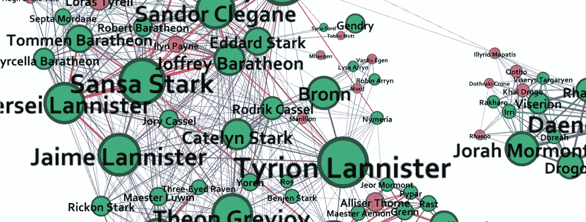
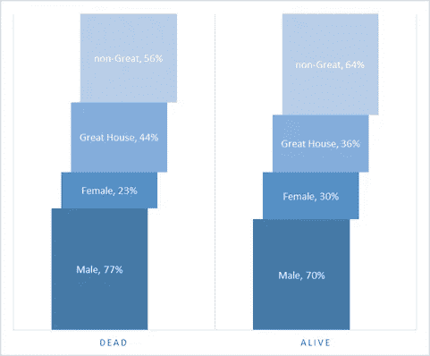
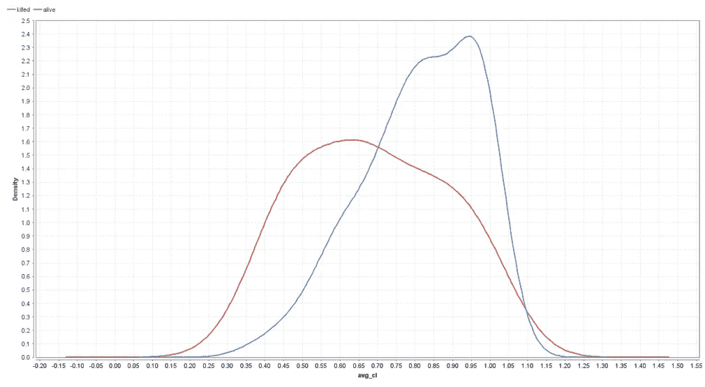
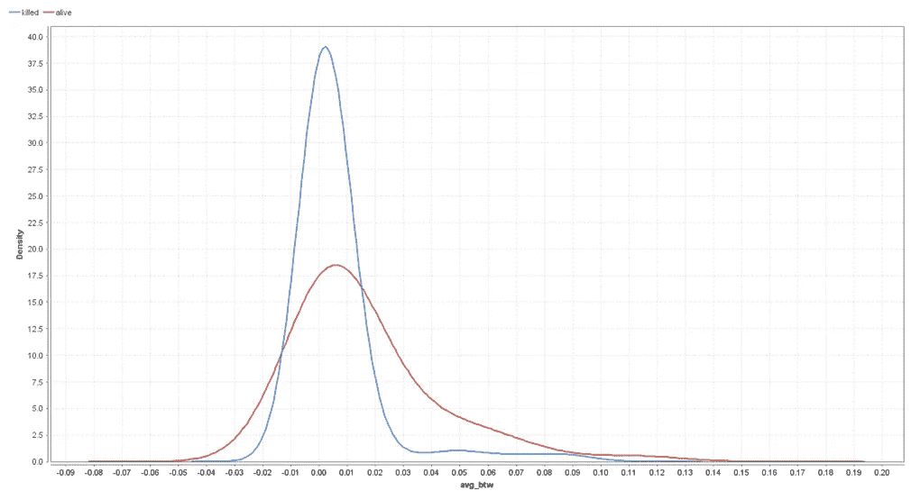
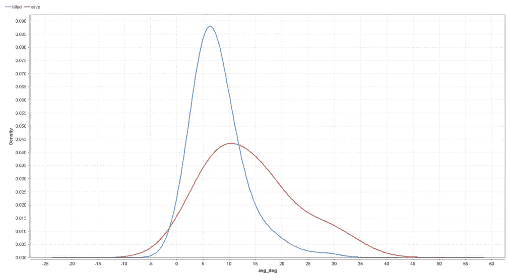
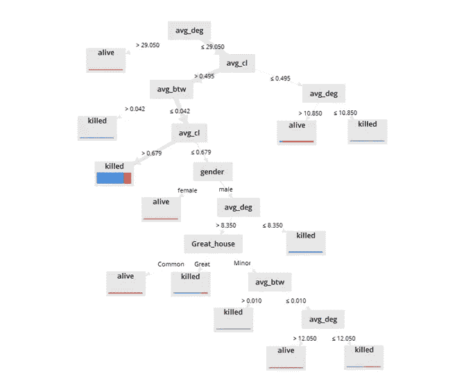
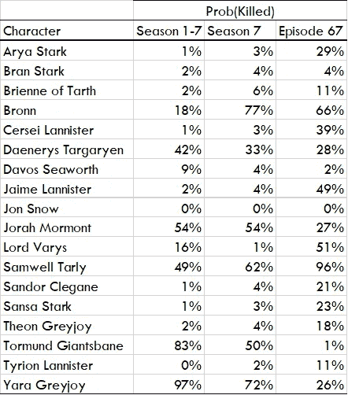

# 《权力的游戏》第 7.5 季第 4 集

> 原文：<https://towardsdatascience.com/game-of-thrones-season-7-5-episode-4-abb12ee1e43d?source=collection_archive---------10----------------------->

## 谁会在第八季中幸存？杀人的网络位置

在[第三集](https://medium.com/@joel.a.c.baum/game-of-thrones-season-7-5-episode-3-fcf1f35af7c0)中，我们描述了《权力的游戏》中关键人物的网络位置在密度和稀疏度方面的优势。

为了衡量角色的网络优势，我们比较了被杀和幸存角色的网络位置。模式很清楚:占据密集位置的角色更有可能死亡，那些占据稀疏位置的角色更有可能存活。在冰与火的土地上，基于中间性的信息和资源访问和控制似乎胜过了与集群相关的信任、忠诚和合作。“扭曲的少数人”——凭借对网络上信息和资源流动的潜在控制而获得影响力的高级角色——也更有可能在第七季结束时活着。

在第 7.5 季的这一集中，我们将注意力转向一个更详细的建模，即角色的生存如何受到他们在共同出现网络中的位置的影响。我们将使用两种机器学习分类器算法——[**N**朴素贝叶斯](https://en.wikipedia.org/wiki/Naive_Bayes_classifier)和[决策树](https://en.wikipedia.org/wiki/Decision_tree_learning)——根据每个主要(定期和反复出现的)角色的网络位置的关键特征(聚类、中间和程度)，以及他们的性别和家庭地位(伟大、次要、普通)，预测他们最有可能的结果——死亡或活着。然后，我们将应用这些预测来评估第八季中关键幸存角色的可能命运。

# 朴素贝叶斯分类器

朴素贝叶斯是一种简单的算法，作为概率分类器工作。它通过确定角色属性与死亡或活着相关联的概率来预测每个角色最有可能的结果(死亡或活着)，并将角色分配给具有给定属性的最大概率的结果。贝叶斯分类器表现很好，根据性别、家庭状况和网络位置，对第一至第七季 140 个角色中的 114 个(82.4%)角色的命运进行了正确分类。

## **性别和房屋**

让我们简单地开始，通过考虑男性和女性角色最可能的结果，以及那些大家族成员和那些小家族成员或平民的角色。

Figure 1\. Gender, House and Character Survival

图 1 显示了基于性别和房子的预测:来自大房子的男性最有可能被杀。

男性角色在死者中占了很大比例，占所有死亡人数的 77%，但占幸存者的 70%，因此大约有 10%的人死于非命。相比之下，女性在死者中的比例较低，占死亡人数的 23%，幸存者的 30%，因此死亡的可能性比活着的可能性低 30%。

大家族成员的角色也过多，占所有死亡的 44%,但占幸存者的 36%,因此大约有 20%的人死于非命。相比之下，较小家族的成员和平民在幸存者(64%)中所占的比例要高于死亡人数(56%)，因此死亡的可能性比活着的可能性低 15%。

给定这些分布，朴素贝叶斯分类器预测大家族的男性成员最可能的结果是被杀，而不是大家族成员的女性成员最可能的结果是活着。

## 网络位置

现在让我们看看基于角色网络位置关键属性的概率——它们的聚类、介数和度。

**聚类。**为了加强《T2》第三集中的图形分析，图 2 表明聚集*对你不好*。在图中，无论蓝线(死亡的密度)在红线(活着的密度)之上，朴素贝叶斯算法都预测最有可能的结果是死亡。

平均聚类系数大致大于. 7 的角色(即 70%的三和弦是闭合的，见[第 2 集](https://medium.com/@joel.a.c.baum/game-of-thrones-season-7-5-episode-2-dd518f6b03c))更有可能被杀死，而聚类系数较低的角色更有可能活着。请注意，差异非常大，聚类非常高的角色被杀死的可能性是两倍多，而聚类低的角色存活的可能性是三倍或更多。

Figure 2\. Clustering Coefficient and Character Survival

聚类与角色命运的关联表明，通过增加聚类，小世界结构的崩溃和网络在第七季结束时折叠成一个单一的小团体，这是为了面对白行者而建立的联盟(见[第 2 集](https://medium.com/@joel.a.c.baum/game-of-thrones-season-7-5-episode-2-dd518f6b03c))可能会降低许多角色的生存机会。

**介于两者之间。**图 3 显示了中间性的分类。再次强调《T2》第三集中的图形分析，介于*和*之间对你有好处。平均介数大于大约 0.02 的角色更有可能活着，而那些介数分数较低的角色更有可能被杀死。事实上，介数低于 0.02 的角色被杀的可能性是普通角色的两倍多，而介数较高的角色存活的可能性是普通角色的 10 倍。

Figure 3\. Betweenness and Character Survival.

正如第七季结尾小世界的崩溃增加了许多角色的聚集，这个网络过渡也降低了他们的介数。考虑到中间性与角色被杀的可能性之间的联系，联盟的融合很可能通过其对中间性和聚类的影响减少了许多角色的生存机会。

**度。最后，我们来看看学位的分类。比如中间性，再次加强第三集的图形分析，度数*对你有好处*。平均度数大于 12 左右的人物更有可能活着，而度数较低的人物更有可能被杀死。等级高于 12 的角色存活的可能性是 10 倍甚至更多，而等级较低的角色被杀的可能性是 2-3 倍。**

Figure 4\. Degree and Character Survival.

角色的等级和角色被杀或活着的概率之间的这种联系加强了我们在第三集的图形分析中看到的“少数偏斜者”的生存优势。

## 决策树分类器

决策树分类器构建了一个分割规则的层次结构，根据角色属性的值将结果(死亡或活着)分开。基于最大化信息增益来确定分裂规则。在每个阶段，所选择的分裂规则是导致最大信息增益的规则；也就是最同质的分支。

图 5 显示了基于角色性别、房屋状况和三个网络位置属性的决策树。

Figure 5\. Decision Tree — Killed or Alive?

在树的顶部，第一个分裂规则是字符的平均度数是大于还是小于 29.05。如果更大，则最有可能的结果是存活(在这种情况下，这是唯一的结果——终端节点上的条形指示存活(红色)/死亡(蓝色)结果的分布，以及通过其厚度指示结果的数量)。如果低于(或等于)这个值，最有可能的结果是更复杂。

第二个分裂是平均聚类是大于还是小于. 495。如果低于(或等于)该值，最可能的结果取决于进一步的分裂规则:如果平均度大于 10.85，则存活；如果低于(或等于)该值，则终止。同样，更高的学位与活着联系在一起。如果聚类大于. 495，最有可能的结果取决于介数是大于还是小于. 042。

如果大于这个值，最有可能的结果是被杀死——当伴随着高聚类时，高介数是无益的。如果介数低于(或等于). 042，最可能的结果取决于关于聚类的进一步规则。如果聚类非常高(> . 679)，最有可能的结果是被杀死。从末端节点的钢条厚度可以看出，这是大多数杀戮发生的条件。

如果聚类介于小于(或等于). 679(根据第二个规则，也大于. 495)之间，则性别开始起作用，最有可能的结果是女性角色活着，而男性角色进一步取决于程度、家庭地位和中间性。

## 预言

现在，让我们利用这些结果来做一些预测——对于幸存的主要角色来说，最有可能的结果是什么——死了还是活着？

朴素贝叶斯分类器假设特定属性的值独立于其他每个属性的值，但是我们可以将每个属性的概率相加，以获得不同属性组合的联合条件概率。

表 1 显示了 18 个重要角色被杀的概率。概率是用三种方法计算的。第一，基于角色在第 1-7 季出现的所有剧集的平均网络位置特征，第二，基于第 7 季所有剧集的平均网络位置，第三，基于第 7 季最后一集的网络位置。因此，这三种可能性使我们能够看到人物最有可能的命运的任何趋势。

Table 1\. Predicted Probability of Being Killed, Selected Characters

几个角色被杀的概率一直很低；例如，琼恩·雪诺和提利昂·兰尼斯特。贝叶斯模型以很高的可信度预测了他们的生存(以及琼恩·雪诺的复活)。另一些则显示出时间范围内的上升或下降趋势。例如，越来越有信心预测其灭亡的山姆威尔·塔利，以及相反生存变得越来越确定的丹妮莉丝·坦格利安。

对于几个角色来说，贝叶斯分类器预测第 1-7 季最有可能的结果是被杀，但在击败这些可能性后，他们在第 7 季结束时的前景有所改善。例如，Yara Greyjoy 的死亡被充满信心地预测——她几乎是——但她在第七季结束时的网络位置的变化极大地改善了她的未来前景。托蒙德·巨人贝恩的命运也发生了类似的逆转……如果事实证明他确实在柏林墙倒塌后幸存了下来。

兰尼斯特家的命运呈现出不同的轨迹。虽然瑟曦和詹姆的生还被充满信心地预测，但他们的命运在第七季结束时变得更加扑朔迷离，詹姆的命运实际上是一场掷硬币的游戏。瓦里斯勋爵的前景同样不确定，艾莉亚、珊莎·史塔克和席恩·葛雷乔伊的命运也和瑟曦一样。

显然，第七季结尾小世界网络崩溃的影响(见[第二集](https://medium.com/@joel.a.c.baum/game-of-thrones-season-7-5-episode-2-dd518f6b03c))以不同的方式改变了角色的网络位置，并因此将他们可能的命运带向不同的方向。事实上，通过提高聚集度和降低介数，这种网络转变降低了许多角色的生存机会——尽管对大多数人来说，还不足以推翻他们预测的命运……

最后一集的预测是，波隆和山姆威尔·塔利最有可能被杀死——山姆威尔有很高的信心。此外，如前所述，杰米·兰尼斯特和瓦里斯勋爵的命运很不确定。与此同时，瑟曦·兰尼斯特和史塔克姐妹最好仔细评估他们的网络位置——并战略性地改变它们，以便重新获得自信的预测。

## 即将推出:第 5 集——生存:网络生存策略

在下一集，我们将把注意力转向主角们为了决定他们自己和彼此的命运而可能采取的战略行动。

## 同时…

**第 7.5 季新？查看第四季** [**预告片**](https://medium.com/@joel.a.c.baum/game-of-thrones-season-7-5-trailer-5ea3d7c4f6b3) **及前几集:**

第 1 集— [描绘大局](https://medium.com/@joel.a.c.baum/game-of-thrones-season-7-5-episode-1-27bdc906e6df)

第 2 集— [冰与火的小世界](https://medium.com/@joel.a.c.baum/game-of-thrones-season-7-5-episode-2-dd518f6b03c)

第 3 集— [人物网络地位和优势](https://medium.com/@joel.a.c.baum/game-of-thrones-season-7-5-episode-3-fcf1f35af7c0)

对“应要求”这一集有什么想法？留下评论，我看看我能做些什么…