# 《权力的游戏》单词嵌入，R+L = J 吗？—第二部分

> 原文：<https://towardsdatascience.com/game-of-thrones-word-embeddings-does-r-l-j-part-2-30290b1c0b4b?source=collection_archive---------8----------------------->

> 我们能从 5 本《权力的游戏》书中的单词向量表示中学到什么吗？

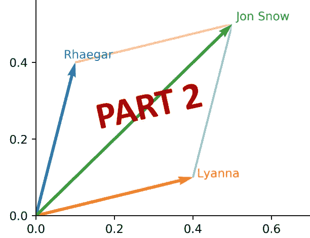

现在，事情变得严重了。让我们建立我们的向量，并质疑这个空间…

> 提醒一下，这是一个分为两部分的故事:
> 第一部分:[单词嵌入？什么？怎么做，为什么？](https://medium.com/@jctestud/game-of-thrones-word-embeddings-does-r-l-j-part-1-8ca70a8f1fad)
> 第二部分:权力的游戏嵌入的乐趣

# 构建嵌入王座的游戏

> 注意:我尝试的一切都可以在这个库中找到[以及训练过的向量。跳进去尝试新事物真的很容易(只是笔记本里的一些熊猫、numpy、matplotlib)。如果你发现一些很酷的东西，请告诉我！](https://github.com/jctestud/got-word-embeddings)

一切都将基于《权力的游戏》前 5 本书的 100 维手套单词向量表示。这个主体非常小，只需要一个小时就可以稳定下来。我们现在有 12000 个单词由 100 维密集向量表示:

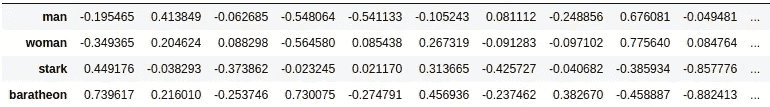

our 100-D GoT vectors in a dataframe

# 快速评估我们的矢量

GloVe 的构建使得相似单词的向量在空间中获得相似的方向(它试图最大化它们的点积)。测量方向相似性的一种方法是通过余弦相似性(向量之间的角度)。如果向量具有相同的幅度，则点积和余弦相似度是等价的。因此，要使所有东西都成为点积，第一步是标准化单词向量。

我们现在可以找到与一个已知单词相似的单词，或者我们可能产生的任何向量，就像回答类比问题的那些向量一样。为了检查在这个不寻常的数据集上创建单词嵌入是否完全无用，让我们看看我们的向量在我们之前提到的 Google word analogy 数据集上的表现([第 1 部分](https://medium.com/@jctestud/game-of-thrones-word-embeddings-does-r-l-j-part-1-8ca70a8f1fad))。是一套 19000+字的类比。结果如下:

```
questions: 4688 filtered out of 19558 (missing words)
accuracy = 9.94% (466/4688)
second-guess accuracy = 14.04% (658/4688)
```

许多类比是不可检验的，因为有些词不在词汇表中(书中没有提到巴黎或柏林，想想吧)。在其他方面，我们的向量达到了近 10%的精度。这显然很糟糕，但也表明这个向量空间并不是无用的。下面是一些“已解决”的类比:

```
'man' is to 'woman' as 'husband' is to 'wife'
'boy' is to 'girl' as 'uncle' is to 'aunt'
'falling' is to 'fell' as 'going' is to 'went'
```

> 一般注意:我会挑选很多。下面的例子(已经不是特别好了)是我在探索单词 vectors 时发现的最好的例子。

# 可视化《权力的游戏》单词向量

让我们从一些非常直观的东西开始。我们可以选择一些单词，并将相应的 100 维向量投影到一个更友好的 2 维空间进行绘图。让我们在节目的主要角色上做它。

> 注意:我不认为全名是单词，从算法的角度来看，琼恩·雪诺是一个 2 字序列(“乔恩”和“雪”)。改变这种行为的一个方法是在我们的文本中用“Jon_Snow”代替“琼恩·雪诺”。在上面的图中，姓氏是手动添加的。所以琼恩·雪诺的矢量可能因为琼恩·艾林而在空间漂移了…

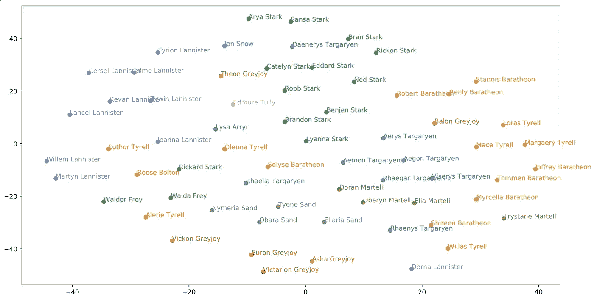

2-D T-SNE projection of the main characters (colored by House)

向量显然不是随机的。我们可以看到同一家族的人物聚集在一起。我们也看到情侣们亲密无间，英雄在上面(是的《GoT》里有英雄)。

我们也可以想象应该成对的单词的二维投影(就像我们在[第一部分](https://medium.com/@jctestud/game-of-thrones-word-embeddings-does-r-l-j-part-1-8ca70a8f1fad)中所做的)。下面是一个 GoT 房子和它的座位(通常是主城堡)之间关系的图示:

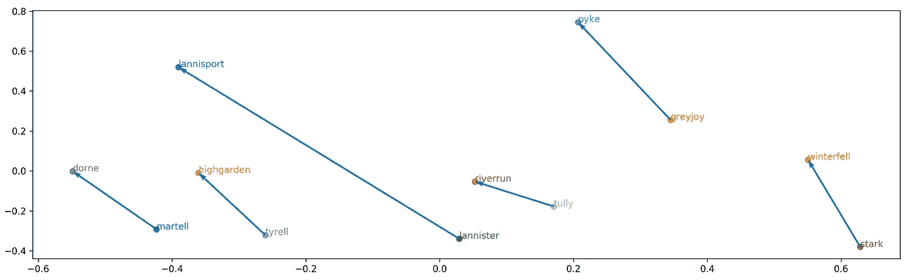

Game of Thrones house-to-seat regularities

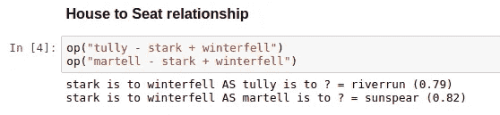

extract from my notebook

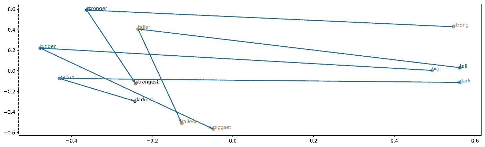

Bonus: Adjective — Comparative — Superlative regularities

我们还可以尝试另一种很酷的单词向量的二维可视化。我只在 [word2viz](https://github.com/lamyiowce/word2viz) 项目中见过，不知道它有没有名字。姑且称之为“word2viz”情节。它是这样工作的:

1.  你创造了两个有趣的单词向量差异，比如从“女人到男人”的路径和从“邪恶到善良”的路径
2.  你选择一些词(让我们以《GoT》的主要人物为例)
3.  对于每个单词，计算单词和这两个特殊向量之间的点积
4.  您从每个单词中获得的两个值成为二维图中的两个坐标

> 数学上，对于给定的字向量**w**:
> w。(**男** - **女** ) = **w** 。**男** - **女**。**女人**
> ~与“男人”相似——与“女人”相似
> 
> 这个标量值直观上就是“如何把一个词放在女人对男人的一个尺度上”。这给了我们 X 坐标。如果我们使用 Y 的第二个“概念”,我们将有一个自定义的二维空间，其中单词沿着两个差异轴展开。

这给了我们:

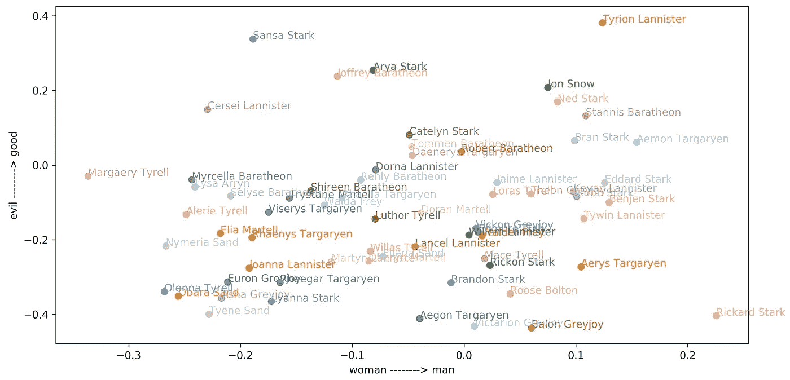

The evil-good axis is not working very well (Cersei and Joffrey #?!)

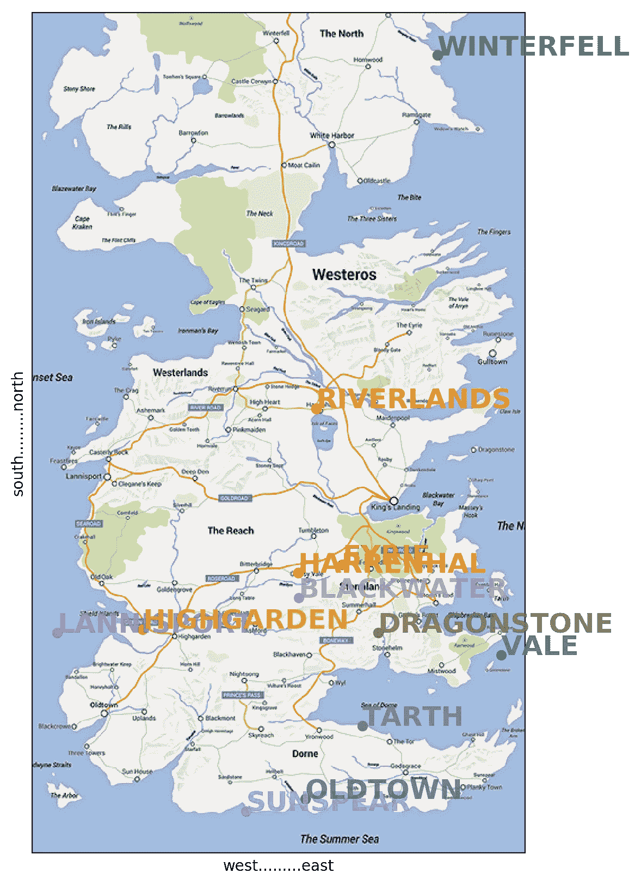

Westeros places through a 2-D projection on (east-west) and (north-south)

再比如……

我从《权力的游戏》中选取了一些重要的地方，并把相应的向量投射到一个南北向和一个东西向的“文字向量尺度”上。

令人惊讶的是，结果并非完全不一致。

图片来源于 reddit 用户 Selvag(完整地图[在此处](https://www.reddit.com/r/gameofthrones/comments/34tkek/no_spoilers_i_made_a_google_maps_version_of/)

# 找到乔恩的父母

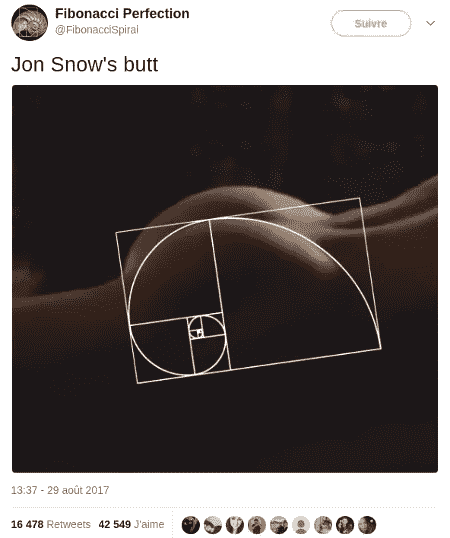

Last known sighting of Jon Snow

## 剧透回顾:

几年来，雷加·坦格利安(丹妮莉丝的哥哥)和莱安娜·史塔克(奈德的妹妹)可能是琼恩·雪诺的父母，这一直是讨论这一事实的非剧透方式。这个理论在电视剧第六季和第七季中得到了证实。我们现在甚至知道他的真名了！他是伊耿·坦格利安，铁王座的合法继承人，也是他自己孩子未来的第一代表亲！#神魂颠倒

很明显，实际的 R+L=J 向量方程不成立。首先，因为这不是向单词嵌入提问的好方法。它没有利用任何“规律性”。

我们可以选择一个更聪明的方式来提问，比如通过“父亲对儿子”的规律，试着从雷加到琼恩，比如使用从奈德到罗柏的路径。

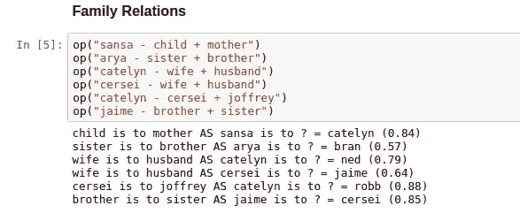

more clever ways to find family relations

但是，即使这样，它也不会起作用，因为基础材料(当谈论父母身份时，将乔恩放在他父亲附近的单词序列)在书中没有。如果数百万读者找不到它，一个演绎能力较弱的算法也不会做得更好。

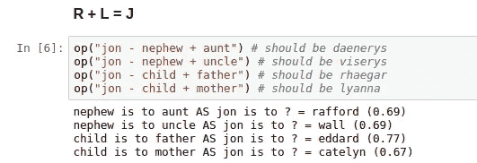

它工作的唯一方式是，如果 George R. R. Martin 已经建立了它的 5 本书(和相应的共现矩阵),知道有人会在 100d 训练的手套嵌入上问这个愚蠢的问题。我试过了，我可以确定他没有。

*第二部分到此结束。如果你喜欢，可以关注我的* [*中*](https://medium.com/@jctestud) *或* [*推特*](https://twitter.com/jctestud) *获取最新消息。此外，如果你看到一些错误，或者如果你有任何问题，请随时在下面发表评论。*

## 参考书目和推荐读物

*   [“深度学习、NLP 和表示法](http://colah.github.io/posts/2014-07-NLP-RNNs-Representations/)”，克里斯托弗·奥拉
*   [《论词语嵌入](http://ruder.io/word-embeddings-1/index.html)》，塞巴斯蒂安·鲁德
*   [《word 2 vec 教程](http://mccormickml.com/2016/04/19/word2vec-tutorial-the-skip-gram-model/)》，Chris McCormick
*   [“手套:单词表示的全局向量”](https://nlp.stanford.edu/projects/glove/)，杰弗里·潘宁顿，理查德·索彻，克里斯托弗·d·曼宁
*   [“word 2 viz](https://github.com/lamyiowce/word2viz)”、朱莉娅·巴兹恩斯卡和皮奥特·米格达