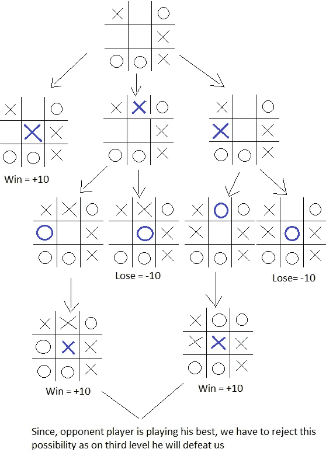
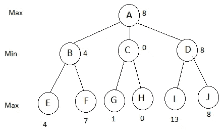

# 博弈

> 原文：<https://towardsdatascience.com/game-playing-1fc093da36d1?source=collection_archive---------7----------------------->

更多内容请关注[http://developercoding.com](http://developercoding.com)和[http://developercoding.com/AI/](http://developercoding.com/AI/)

> 让电脑和你一起玩吧。让我们玩玩人工智能吧。

## 人工智能中的极大极小算法

在玩游戏时，首先，让我们看看极大极小算法，它将帮助我们找到赢得游戏的最佳移动。在下一课中，我们将看看井字游戏，我们将使用极大极小算法来制作一个无与伦比的井字游戏。

考虑双人游戏，如井字游戏、国际象棋、跳棋等。现在，我们的目标或目的是预测一个将带领我们走向胜利的步骤。如果我们在玩游戏，那么很明显我们想尽可能地增加我们的得分和减少对手的得分，我们将应用这一原则或逻辑并预测移动。另一方面，当对手在比赛时，他会减少我们的得分，增加他的得分。所以这种类型的游戏，我们会在我们的代码中进行模拟，产生所有看似合理的移动，并从中选择一个将我们带到胜利状态的移动。好的，让我们用一个人类的思维过程来思考和比较。当人类玩耍时，他会像

1.  好，这是我的状态或情况
2.  如果我走这步棋，那么对手就可以走那一套棋，如果他走那一步棋，那么我可以依次走这步棋，我就能赢。
3.  人类重复步骤 2，直到他可以找到一个有助于获胜的步骤

基本上，这种思维过程我们想用电脑来刺激。
寻找最优移动的极大极小搜索过程是深度优先和深度受限的搜索过程。minimax 背后的想法是，我们将从当前位置开始，并使用合理移动生成器来生成一组可能的后续位置。

极大极小示例

我们用一个例子来了解一下
假设
一个赢的状态=+10
一个输的状态是-10
平局是 0

左边的棋会被选中，其余的会被丢弃。

具有一般树的极大极小算法的例子:-

