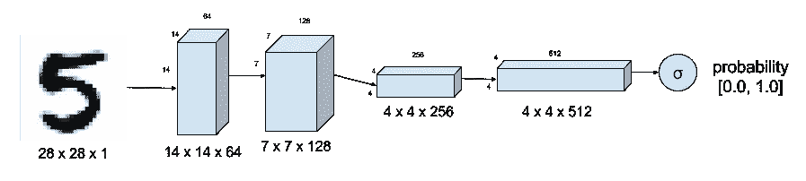
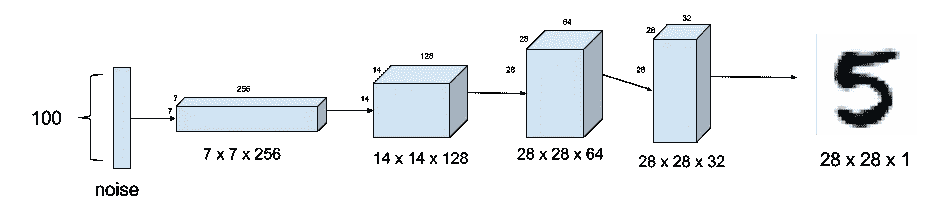
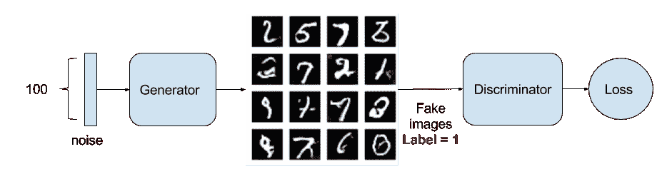
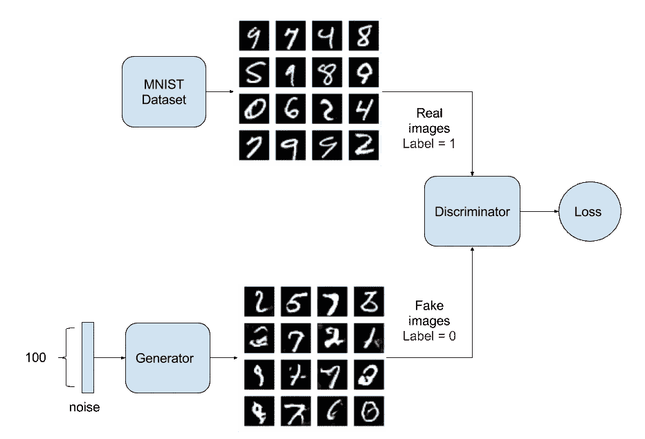
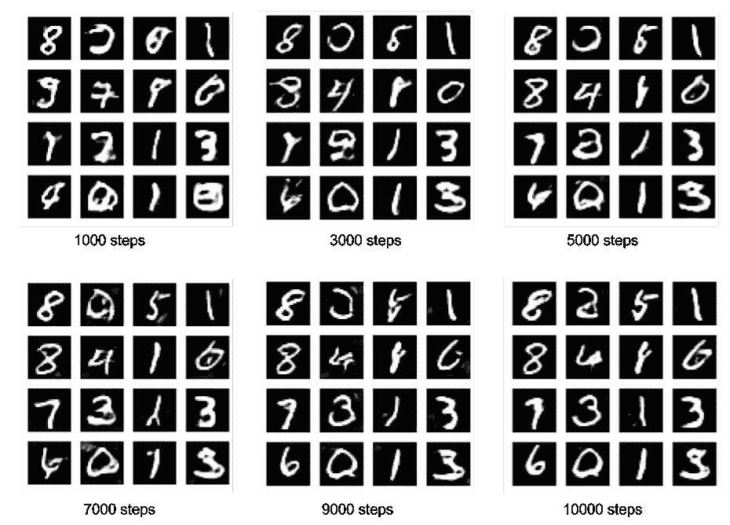

# 在 Tensorflow 后端使用 Keras 的 GAN 示例

> 原文：<https://towardsdatascience.com/gan-by-example-using-keras-on-tensorflow-backend-1a6d515a60d0?source=collection_archive---------0----------------------->

生成对抗网络(GAN)是深度学习领域最有前途的新发展之一。 [GAN](http://papers.nips.cc/paper/5423-generative-adversarial-nets.pdf) 由 Ian Goodfellow 于 2014 年提出，通过训练两个相互竞争和合作的深度网络(称为生成器和鉴别器)来解决无监督学习的问题。在训练过程中，两个网络最终都学会了如何执行它们的任务。

甘几乎总是被解释为伪造者(生殖)和警察(鉴别者)。最初，伪造者会向警察出示假币。警察说是假的。警察向造假者反馈为什么钱是假的。伪造者试图根据收到的反馈制造新的假币。警方表示，这些钱仍然是假的，并提供了一套新的反馈。伪造者试图根据最新的反馈制造新的假币。这种循环无限期地继续下去，直到警察被假钱所愚弄，因为它看起来像真的。

尽管 GAN 的想法在理论上很简单，但要建立一个可行的模型却非常困难。在 GAN 中，有两个耦合在一起的深层网络，使得梯度的反向传播具有两倍的挑战性。[深度卷积 GAN (DCGAN)](https://arxiv.org/pdf/1511.06434.pdf%C3%AF%C2%BC%E2%80%B0) 是演示如何构建实用 GAN 的模型之一，它能够自学如何合成新图像。

在本文中，我们将讨论如何在 Tensorflow 1.0 后端上使用 Keras 2.0 用不到 200 行代码构建一个有效的 DCGAN。我们将训练一只 DCGAN 学习如何书写手写数字，用 MNIST 的方式。

# **鉴别器**

辨别图像真实程度的鉴别器基本上是一个深度卷积神经网络(CNN ),如图 1 所示。对于 MNIST 数据集，输入是图像(28 像素 x 28 像素 x 1 通道)。sigmoid 输出是图像真实程度概率的标量值(0.0 肯定是假的，1.0 肯定是真实的，介于两者之间的任何值都是灰色区域)。与典型的 CNN 的区别在于层间没有最大池。相反，步长卷积用于下采样。在每个 CNN 层中使用的激活函数是一个泄漏 ReLU。层间 0.4 和 0.7 之间的压差防止过拟合和记忆。清单 1 展示了 Keras 中的实现。



Figure 1\. Discriminator of DCGAN tells how real an input image of a digit is. MNIST Dataset is used as ground truth for real images. Strided convolution instead of max-pooling down samples the image.

```
self.D = Sequential()depth = 64dropout = 0.4# In: 28 x 28 x 1, depth = 1# Out: 14 x 14 x 1, depth=64input_shape = (self.img_rows, self.img_cols, self.channel)self.D.add(Conv2D(depth*1, 5, strides=2, input_shape=input_shape,\padding='same', activation=LeakyReLU(alpha=0.2)))self.D.add(Dropout(dropout))self.D.add(Conv2D(depth*2, 5, strides=2, padding='same',\activation=LeakyReLU(alpha=0.2)))self.D.add(Dropout(dropout))self.D.add(Conv2D(depth*4, 5, strides=2, padding='same',\activation=LeakyReLU(alpha=0.2)))self.D.add(Dropout(dropout))self.D.add(Conv2D(depth*8, 5, strides=1, padding='same',\activation=LeakyReLU(alpha=0.2)))self.D.add(Dropout(dropout))# Out: 1-dim probabilityself.D.add(Flatten())self.D.add(Dense(1))self.D.add(Activation('sigmoid'))self.D.summary()
```

清单 1。图 1 中鉴别器的 Keras 代码。

# 发电机

生成器合成假图像。在图 2 中，假图像是使用卷积的逆运算(称为转置卷积)从 100 维噪声(均匀分布在-1.0 到 1.0 之间)生成的。使用前三层之间的上采样，而不是 DCGAN 中建议的分数步长卷积，因为它合成了更真实的手写图像。在各层之间，批量标准化稳定了学习。每一层之后的激活函数是一个 ReLU。最后一层的 sigmoid 的输出产生假图像。第一层 0.3 至 0.5 之间的压差可防止过度拟合。清单 2 展示了 Keras 中的实现。



Figure 2\. Generator model synthesizes fake MNIST images from noise. Upsampling is used instead of fractionally-strided transposed convolution.

```
self.G = Sequential()dropout = 0.4depth = 64+64+64+64dim = 7# In: 100# Out: dim x dim x depthself.G.add(Dense(dim*dim*depth, input_dim=100))self.G.add(BatchNormalization(momentum=0.9))self.G.add(Activation('relu'))self.G.add(Reshape((dim, dim, depth)))self.G.add(Dropout(dropout))# In: dim x dim x depth# Out: 2*dim x 2*dim x depth/2self.G.add(UpSampling2D())self.G.add(Conv2DTranspose(int(depth/2), 5, padding='same'))self.G.add(BatchNormalization(momentum=0.9))self.G.add(Activation('relu'))self.G.add(UpSampling2D())self.G.add(Conv2DTranspose(int(depth/4), 5, padding='same'))self.G.add(BatchNormalization(momentum=0.9))self.G.add(Activation('relu'))self.G.add(Conv2DTranspose(int(depth/8), 5, padding='same'))self.G.add(BatchNormalization(momentum=0.9))self.G.add(Activation('relu'))# Out: 28 x 28 x 1 grayscale image [0.0,1.0] per pixself.G.add(Conv2DTranspose(1, 5, padding='same'))self.G.add(Activation('sigmoid'))self.G.summary()return self.G
```

清单 2。图 2 中生成器的 Keras 代码。

# GAN 模型

到目前为止，还没有模型。是时候为训练建立模型了。我们需要两个模型:1)鉴别器模型(警察)和 2)对抗模型或生成器-鉴别器(伪造者向警察学习)。

# 鉴别器模型

清单 3 展示了鉴别器模型的 Keras 代码。它是上面描述的鉴别器，具有为训练定义的损失函数。由于鉴频器的输出是 sigmoid，我们使用二进制交叉熵来计算损耗。在这种情况下，RMSProp 作为优化器生成了比 Adam 更真实的假图像。学习率 0.0008。权重衰减和剪辑值在训练的后半部分稳定学习。你要调整学习率就要调整衰减。

```
optimizer = RMSprop(lr=0.0008, clipvalue=1.0, decay=6e-8)self.DM = Sequential()self.DM.add(self.discriminator())self.DM.compile(loss='binary_crossentropy', optimizer=optimizer,\metrics=['accuracy'])
```

清单 3。鉴别器模型在 Keras 中实现。

# 对抗模式

对抗模型只是如图 3 所示的生成器-鉴别器堆叠在一起。生成器部分试图欺骗鉴别器，同时从它的反馈中学习。清单 4 展示了使用 Keras 代码的实现。训练参数与鉴别器模型中的相同，除了降低的学习速率和相应的权重衰减。



Figure 3\. The Adversarial model is simply generator with its output connected to the input of the discriminator. Also shown is the training process wherein the Generator labels its fake image output with 1.0 trying to fool the Discriminator.

```
optimizer = RMSprop(lr=0.0004, clipvalue=1.0, decay=3e-8)self.AM = Sequential()self.AM.add(self.generator())self.AM.add(self.discriminator())self.AM.compile(loss='binary_crossentropy', optimizer=optimizer,\metrics=['accuracy'])
```

清单 4。在 Keras 中实现的对抗模型如图 3 所示。

# **训练**

训练是最难的部分。我们首先通过用真实和虚假图像单独训练鉴别器模型来确定鉴别器模型是否正确。然后，依次训练鉴别模型和对抗模型。图 4 显示了鉴别模型，而图 3 显示了训练期间的对抗模型。清单 5 展示了 Keras 中的训练代码。



Figure 4\. Discriminator model is trained to distinguish real from fake handwritten images.

```
images_train = self.x_train[np.random.randint(0,self.x_train.shape[0], size=batch_size), :, :, :]noise = np.random.uniform(-1.0, 1.0, size=[batch_size, 100])images_fake = self.generator.predict(noise)x = np.concatenate((images_train, images_fake))y = np.ones([2*batch_size, 1])y[batch_size:, :] = 0d_loss = self.discriminator.train_on_batch(x, y)y = np.ones([batch_size, 1])noise = np.random.uniform(-1.0, 1.0, size=[batch_size, 100])a_loss = self.adversarial.train_on_batch(noise, y)
```

清单 5。鉴别模型和对抗模型的序贯训练。超过 1000 步的训练会产生可观的输出。

训练 GAN 模型由于其深度需要很大的耐心。以下是一些提示:

1.  问题:生成的图像看起来像噪音。解决方案:在鉴频器和发生器上使用压差。低压差值(0.3 到 0.6)生成更真实的图像。
2.  问题:鉴别器损耗迅速收敛到零，从而阻止发电机学习。解决方案:不要预先训练鉴别器。而是使其学习率大于对抗模型的学习率。对生成器使用不同的训练噪声样本。
3.  问题:发生器图像看起来仍然像噪声。解决方案:检查激活、批处理规范化和删除是否按正确的顺序应用。
4.  问题:计算出正确的训练/模型参数。解决方案:从发表的论文和代码中的一些已知工作值开始，一次调整一个参数。在训练 2000 步或以上之前，观察 500 步或 1000 步左右参数值调整的效果。

# 样本输出

图 5 显示了训练期间输出图像的演变。观察图 5 很有趣。GAN 正在学习如何自己书写手写数字！



Figure 5\. DCGAN output images during 10,000 steps of training.

Keras 的完整代码可以在这里找到。