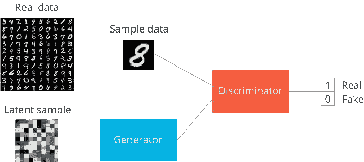
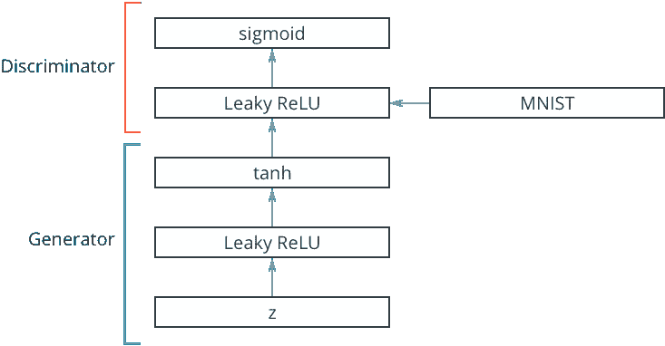

# GAN —简介和实现—第 1 部分:在 TF 中实现一个简单的 GAN，用于 MNIST 手写数字生成

> 原文：<https://towardsdatascience.com/gan-introduction-and-implementation-part1-implement-a-simple-gan-in-tf-for-mnist-handwritten-de00a759ae5c?source=collection_archive---------2----------------------->

GANs 背后的想法是，你有两个网络，一个生成器 GG 和一个鉴别器 DD，彼此竞争。生成器生成假数据传递给鉴别器。鉴别器也能看到真实数据，并预测它收到的数据是真是假。生成器被训练来欺骗鉴别器，它想要输出看起来尽可能接近真实数据的数据。鉴别器被训练来辨别哪些数据是真的，哪些是假的。最终发生的情况是，生成器学习生成与鉴别器的真实数据无法区分的数据。

> 这是平衡状态，期望值是鉴别器发出的真实和虚假数据的概率都是 0.5。



GAN 的一般结构如上图所示，使用 MNIST 图像作为数据。潜在样本是一个随机向量，生成器用它来构造假图像。当生成器通过训练学习时，它会想出如何将这些随机向量映射到可识别的图像，以欺骗鉴别器。

鉴别器的输出是 sigmoid 函数，其中 0 表示伪图像，1 表示真实图像。如果你只对生成新图像感兴趣，你可以在训练后扔掉鉴别器。

## 实施:

[https://github . com/mchablani/deep-learning/blob/master/gan _ mnist/Intro _ to _ GANs _ exercises . ipynb](https://github.com/mchablani/deep-learning/blob/master/gan_mnist/Intro_to_GANs_Exercises.ipynb)



> 我们使用一个泄漏的 ReLU 来允许梯度不受阻碍地流过这个层。TensorFlow 没有为 leaky ReLUs 提供操作，你可以只从一个线性全连接层中取出输出，然后把它们传递给`tf.maximum`。通常，参数`alpha`设置负值的输出幅度。因此，负输入(`x`)值的输出为`alpha*x`，正`x`的输出为`x`:
> 
> 对于发电机，我们将对其进行培训，同时在培训期间和培训结束后从其*取样*。鉴别器需要在伪输入图像和真实输入图像之间共享变量。因此，我们可以使用`tf.variable_scope`的`reuse`关键字来告诉 TensorFlow 重用变量，而不是在我们再次构建图时创建新的变量。
> 
> 已经发现，对于发电机输出，发电机与 tanh 一起表现最佳。这意味着我们必须将 MNIST 图像重新缩放到-1 和 1 之间，而不是 0 和 1 之间。

```
**def** generator(z, out_dim, n_units=128, reuse=**False**,  alpha=0.01):    
    **with** tf.variable_scope('generator', reuse=reuse):
        *# Hidden layer*
        h1 = tf.layers.dense(z, n_units, activation=**None**)
        *# Leaky ReLU*
        h1 = tf.maximum(h1, alpha*h1)

        *# Logits and tanh output*
        logits = tf.layers.dense(h1, out_dim, activation=**None**)
        out = tf.nn.tanh(logits)

        **return** out, logits
```

鉴频器网络与发生器网络几乎完全相同，只是我们使用的是 sigmoid 输出层。

```
**def** discriminator(x, n_units=128, reuse=**False**, alpha=0.01):
    **with** tf.variable_scope('discriminator', reuse=reuse):
        *# Hidden layer*
        h1 = tf.layers.dense(x, n_units, activation=**None**)
        *# Leaky ReLU*
        h1 = tf.maximum(h1, alpha*h1)

        logits = tf.layers.dense(h1, 1, activation=**None**)
        out = tf.nn.sigmoid(logits)

        **return** out, logits*#* Hyperparameters *# Size of input image to discriminator*
input_size = 784 *# 28x28 MNIST images flattened*
*# Size of latent vector to generator*
z_size = 100
*# Sizes of hidden layers in generator and discriminator*
g_hidden_size = 128
d_hidden_size = 128
*# Leak factor for leaky ReLU*
alpha = 0.01
*# Label smoothing* 
smooth = 0.1
```

# 构建网络

```
tf.reset_default_graph() 
*# Create our input placeholders* 
input_real, input_z = model_inputs(input_size, z_size)  
*# Generator network here* 
g_model, g_logits = generator(input_z, input_size, g_hidden_size, reuse=**False**,  alpha=alpha) 
*# g_model is the generator output* *# Disriminator network here* 
d_model_real, d_logits_real = discriminator(input_real, d_hidden_size, reuse=**False**, alpha=alpha) 
d_model_fake, d_logits_fake = discriminator(g_model, d_hidden_size, reuse=**True**, alpha=alpha)
```

# 鉴频器和发电机损耗

> 对于鉴别器，总损失是真实和伪造图像的损失之和，`d_loss = d_loss_real + d_loss_fake`。
> 
> 对于真实的图像逻辑，我们将使用从上面单元格中的鉴别器获得的`d_logits_real`。对于标签，我们希望它们都是 1，因为这些都是真实的图像。为了帮助鉴别器更好地归纳，标签从 1.0 减少到 0.9，例如，使用参数`smooth`。这被称为标签平滑，通常与分类器一起使用以提高性能。在 TensorFlow 中，它看起来有点像`labels = tf.ones_like(tensor) * (1 - smooth)`
> 
> 伪数据的鉴别器损耗是相似的。逻辑是`d_logits_fake`，它是我们通过将生成器输出传递给鉴别器得到的。这些假逻辑与全零标签一起使用。请记住，我们希望鉴频器为真实图像输出 1，为虚假图像输出 0，因此我们需要设置损耗来反映这一点。
> 
> 最后，发电机损耗使用`d_logits_fake`，假图像逻辑。但是，现在的标签都是一。生成器试图欺骗鉴别器，所以它希望鉴别器输出假图像。

```
*# Calculate losses*
d_labels_real = tf.ones_like(d_logits_real) * (1 - smooth)
d_labels_fake = tf.zeros_like(d_logits_fake)

d_loss_real = tf.nn.sigmoid_cross_entropy_with_logits(labels=d_labels_real, logits=d_logits_real)
d_loss_fake = tf.nn.sigmoid_cross_entropy_with_logits(labels=d_labels_fake, logits=d_logits_fake)

d_loss = tf.reduce_mean(d_loss_real + d_loss_fake)

g_loss = tf.reduce_mean(
    tf.nn.sigmoid_cross_entropy_with_logits(
        labels=tf.ones_like(d_logits_fake), 
        logits=d_logits_fake))
```

# 优化者

我们希望分别更新生成器和鉴别器变量。

请注意，当最小化 d_loss 时，我们希望优化器只更新鉴别器变量以及生成器的类似变量。

```
*# Optimizers*
learning_rate = 0.002

*# Get the trainable_variables, split into G and D parts*
t_vars = tf.trainable_variables()
g_vars = [var **for** var **in** t_vars **if** var.name.startswith("generator")]
d_vars = [var **for** var **in** t_vars **if** var.name.startswith("discriminator")]

d_train_opt = tf.train.AdamOptimizer().minimize(d_loss, var_list=d_vars)
g_train_opt = tf.train.AdamOptimizer().minimize(g_loss, var_list=g_vars)
```

# 培养

```
batch_size = 100
epochs = 100
samples = []
losses = []
saver = tf.train.Saver(var_list = g_vars)
**with** tf.Session() **as** sess:
    sess.run(tf.global_variables_initializer())
    **for** e **in** range(epochs):
        **for** ii **in** range(mnist.train.num_examples//batch_size):
            batch = mnist.train.next_batch(batch_size)

            *# Get images, reshape and rescale to pass to D*
            batch_images = batch[0].reshape((batch_size, 784))
            batch_images = batch_images*2 - 1

            *# Sample random noise for G*
            batch_z = np.random.uniform(-1, 1, size=(batch_size, z_size))

            *# Run optimizers*
            _ = sess.run(d_train_opt, feed_dict={input_real: batch_images, input_z: batch_z})
            _ = sess.run(g_train_opt, feed_dict={input_z: batch_z})

        *# At the end of each epoch, get the losses and print them out*
        train_loss_d = sess.run(d_loss, {input_z: batch_z, input_real: batch_images})
        train_loss_g = g_loss.eval({input_z: batch_z})

        print("Epoch **{}**/**{}**...".format(e+1, epochs),
              "Discriminator Loss: **{:.4f}**...".format(train_loss_d),
              "Generator Loss: **{:.4f}**".format(train_loss_g))    
        *# Save losses to view after training*
        losses.append((train_loss_d, train_loss_g))

        *# Sample from generator as we're training for viewing afterwards*
        sample_z = np.random.uniform(-1, 1, size=(16, z_size))
        gen_samples = sess.run(
                       generator(input_z, input_size, reuse=**True**),
                       feed_dict={input_z: sample_z})
        samples.append(gen_samples)
        saver.save(sess, './checkpoints/generator.ckpt')

*# Save training generator samples*
**with** open('train_samples.pkl', 'wb') **as** f:
    pkl.dump(samples, f)
```

学分:来自课堂讲稿:[https://classroom.udacity.com/nanodegrees/nd101/syllabus](https://classroom.udacity.com/nanodegrees/nd101/syllabus)