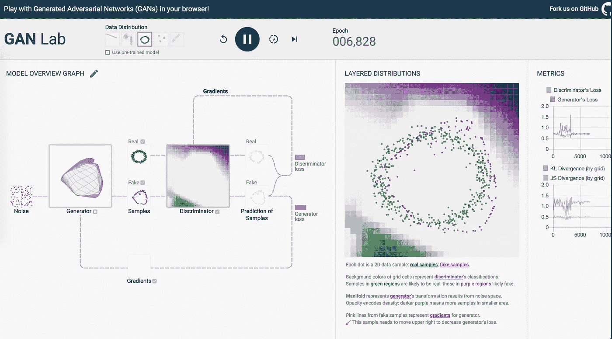

# 甘实验室:在浏览器中训练甘！

> 原文：<https://towardsdatascience.com/gan-lab-train-gans-in-the-browser-21a423585460?source=collection_archive---------15----------------------->

有许多浏览器可视化工具可以帮助机器学习学习者获得对神经网络训练概念的直觉，如 TensorFlow training playground 和 Perceptron Learning Applets:

 [## 张量流-神经网络游乐场

### 这是一种构建从数据中学习的计算机程序的技术。它非常松散地基于我们如何思考…

playground.tensorflow.org](https://playground.tensorflow.org/#activation=tanh&batchSize=10&dataset=circle&regDataset=reg-plane&learningRate=0.03&regularizationRate=0&noise=0&networkShape=4,2&seed=0.42342&showTestData=false&discretize=false&percTrainData=50&x=true&y=true&xTimesY=false&xSquared=false&ySquared=false&cosX=false&sinX=false&cosY=false&sinY=false&collectStats=false&problem=classification&initZero=false&hideText=false)  [## 感知器

### “学习率”框允许您设置一个介于 0 和 1 之间的学习率值(其他值将被忽略)。的…

www.cs.utexas.edu](https://www.cs.utexas.edu/~teammco/misc/perceptron/) 

这些浏览器可视化提供了一个很好的 UI 来可视化神经网络如何随着时间的推移而学习，包括它们学习的复杂函数的图。

这个可视化训练 GANs 的新工具对我理解生成性对抗网络的训练过程非常有帮助。我真的很喜欢区分真假样品的视觉效果。GUI 将显示样本如何随时间变化，以及鉴别器和发生器如何改变它们的参数。

有 5 种数据分布可供选择:一条直线、两个簇、一个圆、三个独立的圆和一条头部分离的线。

玩具数据集的不同复杂性会让你感觉到生成器和鉴别器通常需要多少个时期才能达到纳什均衡。

我认为这种可视化最有用的部分是简单地看到假样本是如何随着时间的推移而成型和变化的。通过浏览器界面一遍又一遍地观看这个过程对我初级水平的理解有很大帮助。玩了这个工具之后，Ian Goodfellow 的研究论文对我来说更有意义了。

您可以看到绿色/紫色图表，展示了鉴别器的性能，以便随着时间的推移分离生成的示例。这真的有助于你获得直觉，知道他们在训练中是如何合作的。

观察生成器的输出最终如何收敛到一组与真实数据点不完全相同的样本也很有趣。

这个工具的另一个非常好的特性是算法的顺序标记:

**鉴别器更新**

1.  生成器从噪声中获取样本
2.  鉴别器对样品进行分类(结合真假)
3.  计算鉴频器损耗
4.  计算机鉴别器梯度
5.  基于梯度更新鉴别器

**发电机更新**

1.  生成器从噪声中获取样本
2.  鉴别器只对假样本进行分类
3.  计算发电机损耗
4.  计算发电机梯度
5.  基于渐变更新生成器

我认为，除了样本和损耗图的 GUI 之外，可视化算法的步骤是理解 GAN 训练过程的一个非常好的工具。

最后，非常有趣的是，鉴频器和发电机的损耗在多个时期内收敛到相同的值。我认为这是最小最大对抗训练理论上所依据的纳什均衡的表现。

**结论**

我真的很高兴我发现这个工具有助于我对生成性对抗网络的理解，尤其是训练过程:请亲自检查一下！

 [## 甘实验室:在你的浏览器中玩生成性对抗网络！

### GAN 实验室使用的是浏览器内 GPU 加速的深度学习库 TensorFlow.js。一切，从模特培训到…

poloclub.github.io](https://poloclub.github.io/ganlab/) 

# [CShorten](https://medium.com/@connorshorten300)

Connor Shorten 是佛罗里达大西洋大学计算机科学专业的学生。对软件经济学、深度学习和软件工程感兴趣。