# GAN 目标函数:GAN 及其变体

> 原文：<https://towardsdatascience.com/gan-objective-functions-gans-and-their-variations-ad77340bce3c?source=collection_archive---------5----------------------->

## gan 有数百种类型。目标函数如何影响 GAN 的外观？

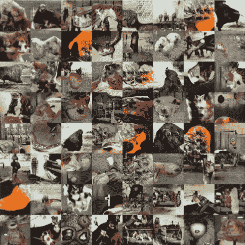

如果你还没有，你一定要读一读我的[上一篇关于 GAN 是什么的文章](http://hunterheidenreich.com/blog/what-is-a-gan/)(尤其是当你不知道我说 GAN 是什么意思的时候！).这篇文章应该给你一个深入 GANs 世界和他们如何工作的起点。对于任何关于 GANs 的文章来说，这都是一个坚实的基础，更不用说在这篇文章中，我们将讨论 GANs 的目标函数，以及目前存在的使用 twists 来定义不同结果的目标的 GANs 的其他变体。

没时间看完整本？这是 TL。速度三角形定位法(dead reckoning)

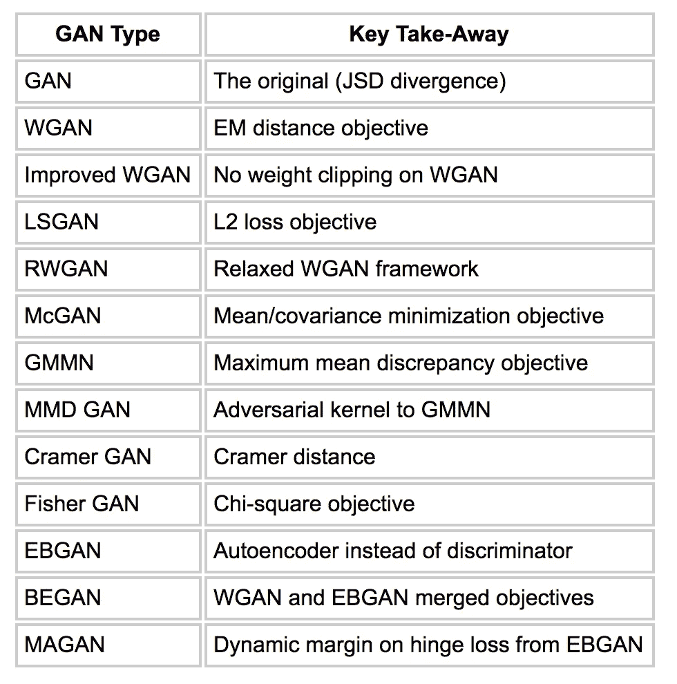

# 定义目标

在我们的介绍性文章中，我们谈到了生成模型。我们讨论了生成模型的目标是如何想出一种方法来将它们生成的分布与真实的数据分布相匹配。最小化两个分布之间的距离对于创建一个系统来说是至关重要的，该系统生成的内容看起来很好，很新，就像来自原始数据分布一样。

但是我们如何衡量我们生成的数据分布和我们原始的数据分布之间的差异呢？这就是我们所说的[目标函数](https://www.courses.psu.edu/for/for466w_mem14/Ch11/HTML/Sec1/ch11sec1_ObjFn.htm)，也是今天这篇文章的重点！我们将研究 gan 的一些变化，以了解我们如何改变生成的数据分布与实际分布之间的差异，以及这将产生的影响。

# 原甘

我们最初的 GAN 的目标函数本质上是最小化所谓的[詹森香农发散](https://en.wikipedia.org/wiki/Jensen%E2%80%93Shannon_divergence) (JSD)。具体来说是:

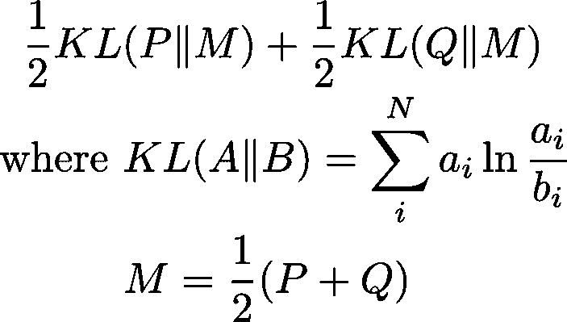

JSD 源自我们在上一篇文章中提到的库尔巴赫-利布勒背离(KLD)。

我们已经熟悉了我们的朋友，原来的甘。与其进一步讨论这个问题，不如让我们欣赏一下它辉煌的表现:

# 瓦瑟斯坦·甘

wasser stein GAN(WGAN)是一种你可能听说过的 GAN，因为它得到了很多关注。这样做有很多实际的原因(一般来说，当你训练一个 GAN 时，返回的损失值没有任何意义，除了 WGAN 以外)，但是是什么让 WGAN 与众不同呢？

WGAN 不使用 JSD 来测量散度，而是使用一种叫做[推土机(EM)距离](https://en.wikipedia.org/wiki/Earth_mover's_distance)(又名[瓦瑟斯坦距离](https://en.wikipedia.org/wiki/Wasserstein_metric))的东西。EM 距离定义为:

这是什么意思？

## 电磁距离

让我们试着理解 EM 距离背后的直觉。概率分布本质上是质量的集合，分布测量给定点的质量数量。我们给 EM 距离两个分布。因为将质量移动一定距离的成本等于质量和距离的乘积，所以 EM 距离基本上计算将一种概率分布转换成另一种概率分布的最小成本。这可以被视为所需的最小努力。

但是我们为什么要在乎呢？我们关心 EM 距离，因为它经常测量从一个分布到另一个分布的直线距离。这有助于优化梯度。更不用说，还有一组函数在用 KLD 或 JSD 之类的东西测量距离时不会收敛，但在 EM 距离上确实会收敛。

这是因为 EM 距离具有连续性和可微性的保证，而这正是像 KLD 和 JSD 这样的距离函数所缺乏的。我们需要这些损失函数的保证，使 EM 距离更适合我们的需要。不仅如此，所有在 JSD 或 KLD 下聚合的东西也会在 EM 距离下聚合。只是电磁距离包含了更多。

## 这是怎么用的？

抛开所有这些关于数学的想法，进入这类事情的实际应用，当我们不能直接计算时，我们如何使用这个新的距离？首先，我们采用一个参数化的 critic 函数，并训练它来逼近我们的数据分布和我们生成的分布之间的 EM 距离。当我们做到了这一点，我们就有了一个很好的 EM 距离近似值。在此基础上，我们优化我们的发电机功能，以减少这一电磁距离。

为了保证我们的函数位于一个紧凑的空间中(这有助于确保我们满足进行计算所需的理论保证)，我们剪切了参数化我们的评价函数 f 的权重。

只是一个旁注:我们的 critic 函数 f 被称为 critic，因为它不是一个显式的鉴别器。鉴别器会将其输入分类为真或假。批评家不会这么做。critic 函数只是近似距离分数。然而，它在传统的 GAN 框架中扮演着鉴别者的角色，因此值得强调一下它的相似之处和不同之处。

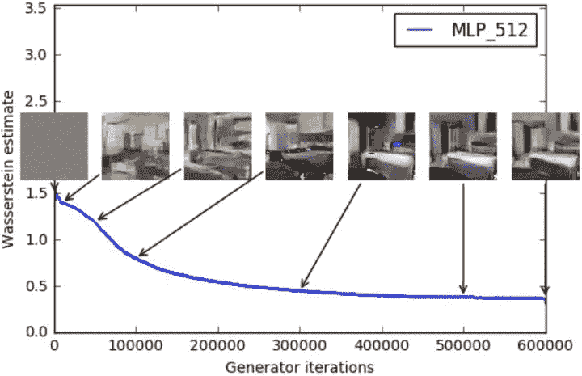

## 关键要点

*   有意义损失函数
*   更容易调试
*   更简单的超参数搜索
*   提高稳定性
*   更少的模式崩溃(当一个生成器只是一遍又一遍地生成一个东西的时候……稍后会有更多的介绍)
*   理论优化保证

# 改进的 WGAN

用 WGAN 提出了那么多好的东西，还有什么需要改进的？嗯，对瓦瑟斯坦·甘斯的改进训练凸显了这一点。

WGAN 得到了很多关注，人们开始使用它，好处就在那里。但是人们开始注意到，尽管 WGAN 带来了所有的东西，但它仍然无法收敛或产生非常糟糕的样本。改进的 WGAN 给出的理由是重量削减是一个问题。在某些情况下，它弊大于利。我们注意到，我们对 clip 进行加权的原因与保持 critic 函数的理论保证有关。但在实践中，剪辑实际上是鼓励非常简单的批评功能被推到其边界的极端。这可不好。

相反，改进的 WGAN 提出的是，不削减权重，而是在 critic 函数的梯度范数中添加一个惩罚项。他们发现，这可以产生更好的结果，当插入一堆不同的 GAN 架构时，可以产生稳定的训练。

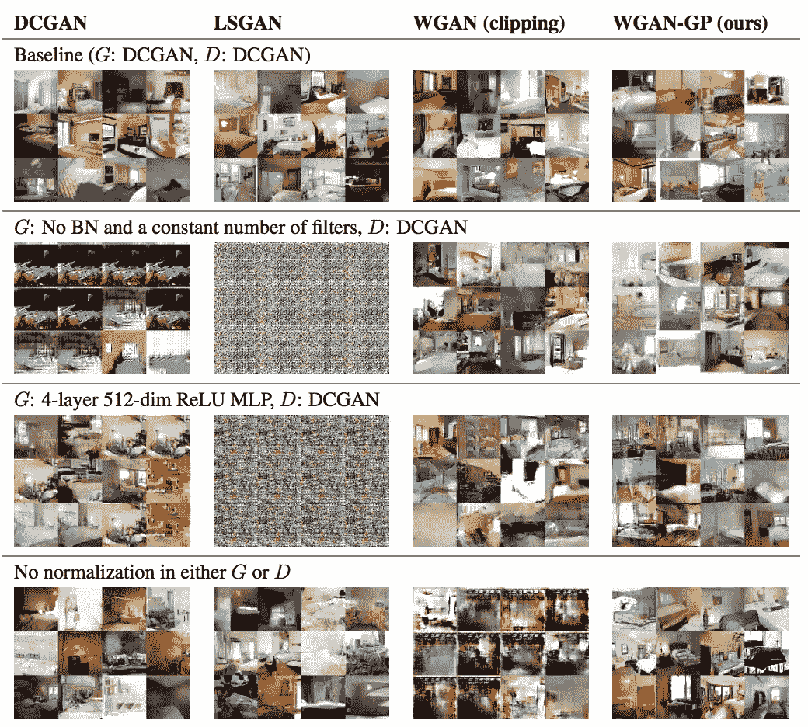

## 关键要点

*   完全 WGAN，除了没有重量剪辑
*   加权正则项鼓励理论保证

# 最小平方甘

[LSGAN](https://arxiv.org/pdf/1611.04076.pdf) 的设置类似于 WGAN。然而，LSGAN 不是学习一个批判函数，而是学习一个损失函数。真样品的损失应低于假样品的损失。这使得 LSGAN 可以高度关注利润非常高的假样本。

像 WGAN 一样，LSGAN 试图限制它们的功能域。他们采取不同的方法，而不是剪辑。他们以权重衰减的形式引入正则化，鼓励其函数的权重位于保证理论需求的有界区域内。

另一点需要注意的是，损失函数的设置与原始 GAN 更相似，但原始 GAN 使用对数损失，LSGAN 使用 [L2 损失](https://en.wikipedia.org/wiki/Mean_squared_error)(相当于最小化皮尔逊 X 散度)。其原因与以下事实有关:对数损失基本上只关心样品标记是否正确。它不会基于所述样本与正确分类的距离而受到严重惩罚。如果一个标签是正确的，它不会进一步担心它。相比之下，L2 损失不在乎距离。远离它应该在的地方的数据将按比例被扣分。LSGAN 认为这产生了更多的信息梯度。

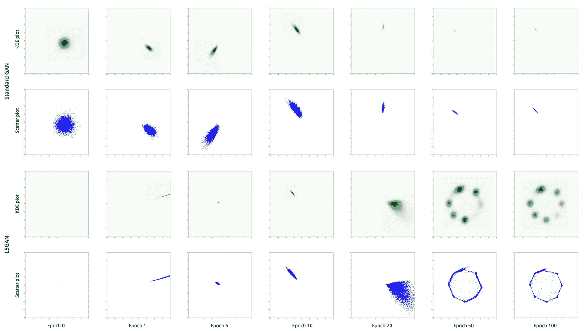

## 关键要点

*   损失函数而不是批评家
*   有界损失函数的权重衰减正则化
*   比例惩罚的 L2 损失而不是对数损失

# 放松的 Wasserstein GAN

或者简称为 [RWGAN](https://arxiv.org/pdf/1705.07164.pdf) 是 WGAN 论文的另一种变体。他们将他们的 RWGAN 描述为 WGAN 和改进的 WGAN(他们在论文中引用的 WGAN-GP)之间的快乐媒介。RWGAN 采用非对称箝位策略，而不是对称箝位(如 WGAN)或梯度惩罚(如针对改进的 WGAN 提出的)。

除了他们提出的特定 GAN 架构之外，他们还描述了他们所谓的统计类别的偏差(称为宽松 Wasserstein 偏差或 RW 偏差)。RW 散度从 WGAN 论文中提取了 Wasserstein 散度，并使其更具一般性，概述了一些关键的概率性质，这些性质是为了保持我们的 GAN 的一些理论保证所需要的。

他们特别表明，用 KL 散度参数化的 RWGAN 相对于其他最先进的 GAN 极具竞争力，但甚至比常规 WGAN 具有更好的收敛特性。他们还开放了他们的框架，以定义新的损失函数，从而为设计 GAN 方案定义新的成本函数。

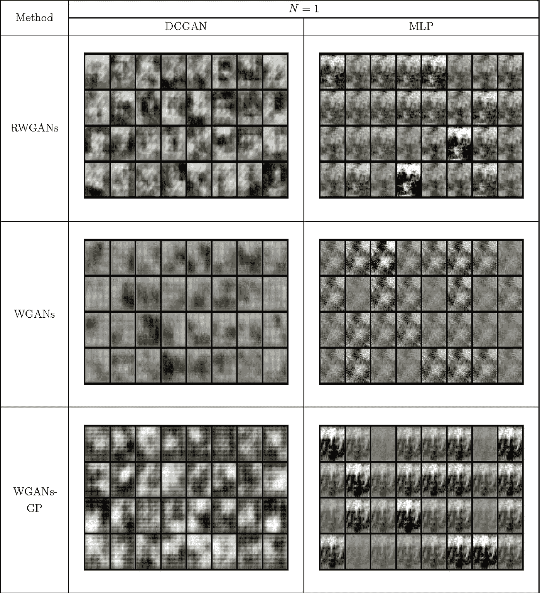

## 关键要点

*   重量不对称夹紧
*   通用 RW 散度框架，非常适合设计新的 GAN 模式、成本和损失函数

# 麦根

与 GAN (McGAN)匹配的[均值和协方差特征属于与 WGAN 相同的 GAN 家族。这个家族被称为积分概率度量(IPM)家族。这些 gan 是那些使用批判架构而不是显式鉴别器的。](https://arxiv.org/pdf/1702.08398.pdf)

McGAN 的 critic 函数与测量生成数据分布和目标数据分布的均值或协方差特征有关。从名字上看，这似乎也很简单。他们定义了创建 critic 函数的两种不同方法，一种用于均值，一种用于协方差，并演示了如何实际使用它们。像 WGAN 一样，他们也在他们的模型上使用裁剪，这最终限制了模型的容量。这篇论文没有得出什么重大的结论。

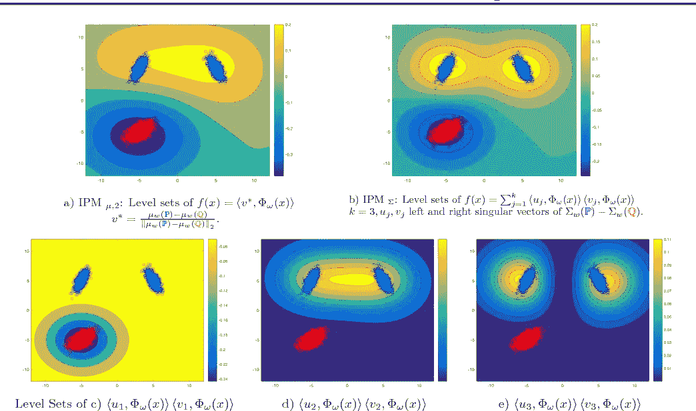

## 关键要点

*   临界函数距离的均值和协方差测度

# 生成矩匹配网络

[生成矩匹配网络](https://arxiv.org/pdf/1502.02761.pdf) (GMMN)专注于最小化所谓的[最大平均差异](http://alex.smola.org/teaching/iconip2006/iconip_3.pdf) (MMD)。MMD 本质上是两个分布的嵌入空间的平均值，我们在这里试图最小化两个平均值之间的差异。我们可以使用一种叫做[内核技巧](https://en.wikipedia.org/wiki/Kernel_method)的东西，它允许我们作弊并使用高斯内核来计算这个距离。

他们认为，这允许一个简单的目标，可以很容易地用反向传播进行训练，并产生与标准 GAN 竞争的结果。他们还展示了如何将自动编码器添加到这个 GAN 的架构中，以减少精确估计 MMD 所需的训练量。

补充说明:虽然他们声称有竞争性的结果，但从我在别处读到的来看，他们的实证结果似乎经常是缺乏的。此外，这个模型的计算量相当大，所以在我看来，计算资源和性能的权衡似乎并不存在。

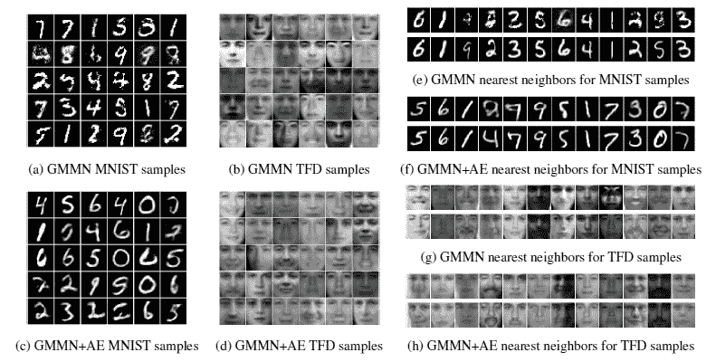

## 关键要点

*   使用最大平均偏差(MMD)作为距离/目标函数
*   没有鉴别器，只是测量样本之间的距离
*   添加自动编码器来帮助测量 MMD

# 甘

最大均值差异 GAN 或 MMD GAN，你猜对了，是 GMMN 的改进。他们的主要贡献在于没有使用静态高斯核来计算 MMD，而是使用对抗技术来学习核。它结合了最初 GAN 和 GMMN 论文的思想，创建了两者思想的混合体。它声称的好处是性能和运行时间的提高。

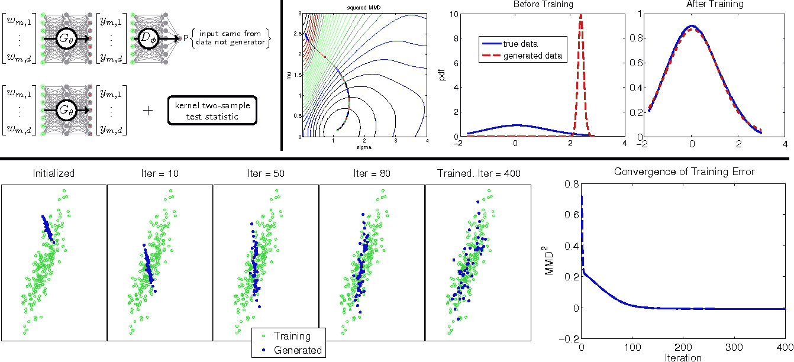

## 关键要点

*   GMMN 上的迭代:估计 MMD 的对立学习核

# 克拉默·甘

[Cramer GAN](https://arxiv.org/pdf/1705.10743.pdf) 首先概述了流行的 WGAN 的一个问题。它声称概率散度应该满足三个性质:

*   和不变性
*   标度灵敏度
*   无偏样本梯度

在这些性质中，他们认为沃瑟斯坦距离缺少最后一个性质，不像 KLD 或 JSD 都有。他们证明这实际上是一个实际问题，并提出了一个新的距离:克莱姆距离。

## 克莱姆距离

现在如果我们看看克莱姆距离，我们可以看到它看起来有点类似于 EM 距离。然而，由于其数学差异，它实际上不会像 EM 距离那样遭受有偏差的样本梯度。如果你真的想深入研究它的数学原理，论文中已经证明了这一点。

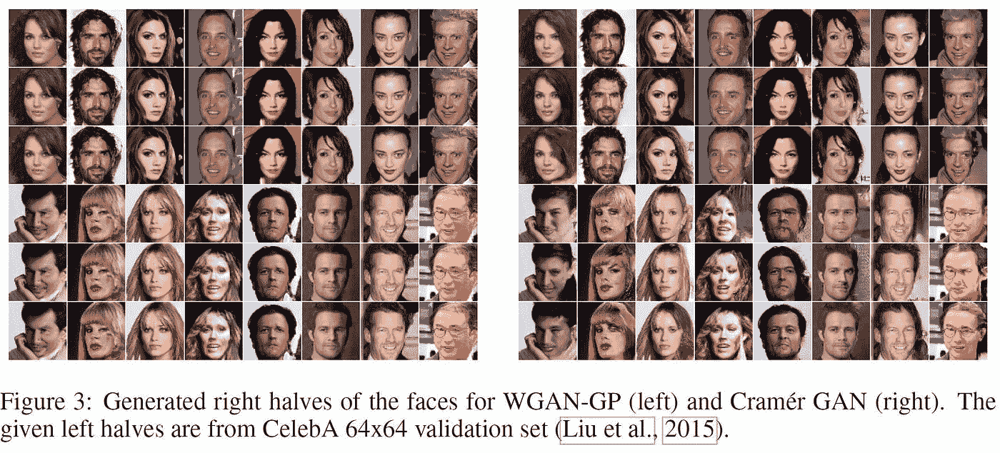

## 关键要点

*   克莱姆距离而不是电磁距离
*   对 WGAN 的改进:无偏样本梯度

# 费希尔·甘

在 IPM GAN 声称在许多方面超过 McGAN、WGAN 和改进的 WGAN 的基础上， [Fisher GAN](https://arxiv.org/pdf/1705.09675.pdf) 又是一次迭代。它所做的是设置其目标函数，使其具有一个对其二阶矩(也称为方差)具有数据相关约束的评论家。

基于这一目标，Fisher GAN 拥有以下优势:

*   训练稳定性
*   无约束容量
*   高效计算

是什么让费希尔·甘的《远方》与众不同？事实上，它本质上是测量所谓的 [Mahalanobis 距离](http://www.statisticshowto.com/mahalanobis-distance/)，简单来说，就是具有相关变量的两点之间相对于质心的距离，质心被认为是多元数据分布的平均值。这实际上保证了生成器和批评家会像我们期望的那样被绑定。当参数化的 critic 接近无限容量时，它实际上估计了卡方距离。

## 关键要点

*   对 WGAN 和其他 IPM GANs 的改进
*   拥有训练稳定性、不受约束的容量和高效的计算时间
*   卡方距离物镜

# 基于能源的氮化镓

[基于能源的 GAN](https://arxiv.org/pdf/1609.03126.pdf) (EBGAN)是我们今天收集的 GAN 中有趣的一种。它不像最初的 GAN 那样使用鉴别器，而是使用自动编码器来估计重建损失。设置的步骤如下:

*   根据原始数据训练自动编码器
*   现在通过这个自动编码器运行生成的图像
*   生成不好的图像会有可怕的重建损失，因此这现在成为一个很好的措施

这是一种非常酷的设置 GAN 的方法，通过正确的调整来防止模式崩溃(生成器只是一遍又一遍地产生相同的样本)，它看起来相当不错。

那为什么还要这么做呢？经验表明，以这种方式使用自动编码器实际上会产生快速、稳定且对参数变化具有鲁棒性的 GAN。更重要的是，没有必要尝试和拉一堆技巧来平衡鉴别器和生成器的训练。

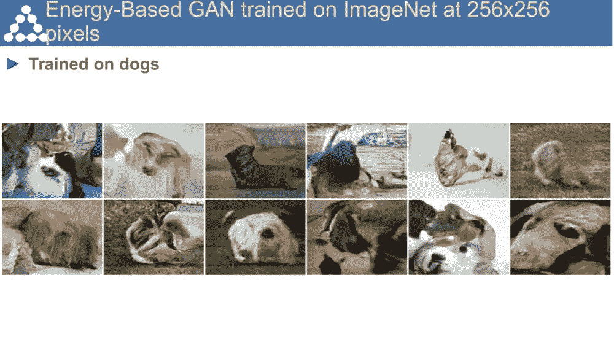

## 关键要点

*   自动编码器作为鉴别器
*   重建损耗用作成本，设置类似于原始 GAN 成本
*   快速、稳定和强大

# 边界平衡 GAN

[边界平衡 GAN](https://arxiv.org/pdf/1703.10717.pdf)(begined)是在 EBGAN 上的迭代。相反，它以类似于 WGAN 损失函数的方式使用自动编码器重建损失。

为了做到这一点，需要引入一个参数来平衡鉴别器和发生器的训练。该参数被加权为样本的移动平均值，在改进的两个一半之间的边界上跳舞(因此它得名:“边界平衡”)。

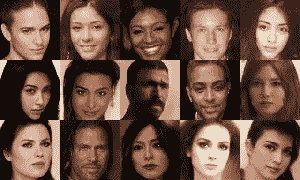

## 关键要点

*   EBGAN 的迭代
*   成本函数与 WGAN 的表面相似性

# 边缘适应 GAN

【缘改编】甘(马江)最后一个上榜。这是艾根的另一个变种。作为损失函数的一部分，EBGAN 有一个余量来产生铰链损失。MAGAN 所做的是随着时间的推移单调减少这一差额，而不是保持不变。这样做的结果是鉴别器将更好地自动编码真实样本。

我们关心的结果是:更好的样本和更稳定的训练。

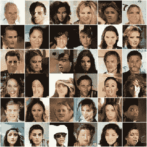

## 关键要点

*   EBGAN 上的迭代
*   铰链损耗的自适应余量
*   更稳定，质量更好

# 包扎

那是许多不同的甘斯！而且内容很多！我认为，为了让我们更有条理，有必要在表格中总结一下:

咻…拍拍自己的背，那是很多甘的内容。

如果我错过了什么或误解了什么，请纠正我！

如果你喜欢这篇文章，或者觉得它有任何帮助，如果你给我一个长长的[一两美元](https://www.gofundme.com/hunter-heidenreich-research-fund)来资助我的机器学习教育和研究，我会永远爱你！每一美元都让我离成功更近一步，我永远心存感激。

敬请关注近期更多 GAN 博客！

*原载于*[*hunterheidenreich.com*](http://hunterheidenreich.com/blog/what-is-a-gan/)*。*