# 氮化镓——提高氮化镓性能的方法

> 原文：<https://towardsdatascience.com/gan-ways-to-improve-gan-performance-acf37f9f59b?source=collection_archive---------1----------------------->


Photo by [Andy Beales](https://unsplash.com/@andybeales?utm_source=medium&utm_medium=referral)

与其他深度网络相比，GAN 模型在以下方面可能会受到严重影响。

*   [**不收敛**](https://medium.com/@jonathan_hui/gan-why-it-is-so-hard-to-train-generative-advisory-networks-819a86b3750b#e633) :模型不收敛，更糟的是变得不稳定。
*   [**模式崩溃**](https://medium.com/@jonathan_hui/gan-why-it-is-so-hard-to-train-generative-advisory-networks-819a86b3750b#4987) :发电机产生有限的模式，并且
*   **慢速训练:**训练发电机的梯度消失了。

作为 GAN 系列的一部分，本文探讨了如何改进 GAN 的方法。特别是，

*   为了更好的优化目标，改变成本函数。
*   向成本函数添加额外的惩罚以加强约束。
*   避免过度自信和过度适应。
*   优化模型的更好方法。
*   添加标签。

但是请注意，这是一个动态的话题，因为研究仍然非常活跃。

# 特征匹配

生成器试图找到最佳图像来欺骗鉴别器。当两个网络都对抗他们的对手时,“最佳”形象不断变化。但是，优化可能会变得过于贪婪，从而陷入一场永无休止的猫捉老鼠的游戏。这是[场景](https://medium.com/@jonathan_hui/gan-why-it-is-so-hard-to-train-generative-advisory-networks-819a86b3750b#1d4a)之一，模型不收敛，模式崩溃。

特征匹配改变生成器的成本函数，以最小化真实图像和生成图像的特征之间的统计差异。通常，我们测量它们的特征向量的平均值之间的 L2 距离。因此，特征匹配将目标从击败对手扩展到真实图像中的特征匹配。这是新的目标函数:

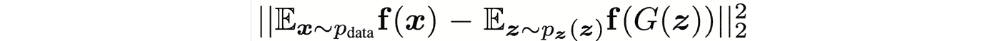

其中**f(x)*是鉴别器在即时层中提取的特征向量。*

*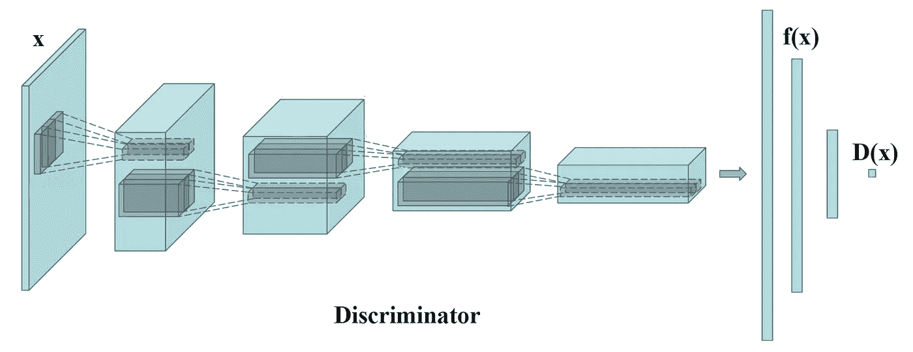*

*计算每个小批量的真实图像特征的平均值，该平均值在每个批量上波动。这是减轻模式崩溃的好消息。它引入了随机性，使得鉴别器更难过拟合。*

> *当 GAN 模型在训练期间不稳定时，特征匹配是有效的。*

# ***迷你批次鉴别***

*当模式崩溃时，所有创建的图像看起来都相似。为了缓解这个问题，我们将真实图像和生成图像分批次分别输入鉴别器，并计算图像 *x* 与同批次图像的相似度。我们将相似度 ***o(x)*** 附加在鉴别器中的一个稠密层中，来分类这个图像是真实的还是生成的。*

*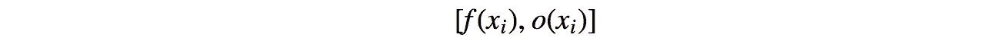**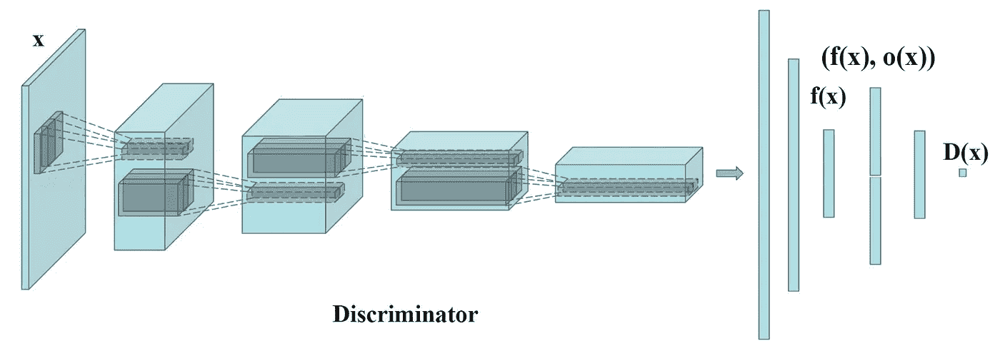*

*如果模式开始崩溃，生成图像的相似性会增加。鉴别器可以使用该分数来检测生成的图像，并且如果模式崩溃，则惩罚生成器。*

*通过变换矩阵*计算图像*与同批其他图像之间的相似度 ***o(xi)*** 。方程式有点难追踪，但是概念很简单。但是，如果您愿意，可以随意跳到下一部分。***

**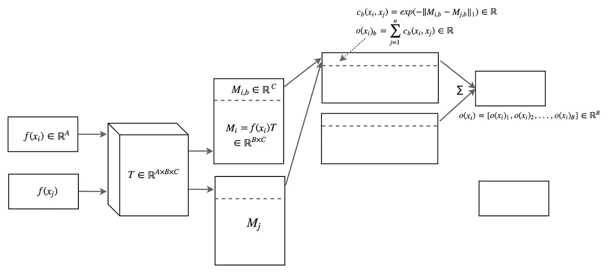**

**在上图中，*为输入图像， ***xj*** 为同一批次的其余图像。我们用一个变换矩阵 ***T*** 将特征*变换为 ***Mi*** 这是一个 B×C 矩阵。****

**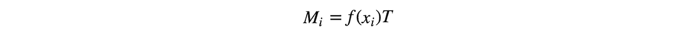**

**我们使用 L1 范数和下面的等式导出图像 ***i*** 和 ***j*** 之间的相似度 ***c(xi，xj)*** 。**

**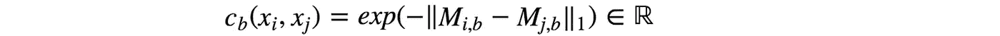**

**图像*与批中其余图像之间的相似度 ***o(xi)*** 为***

**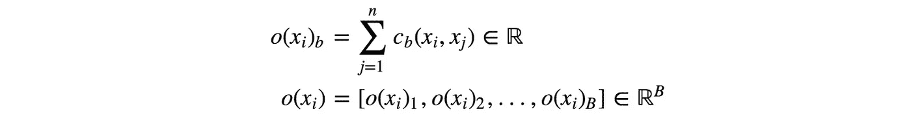**

**以下是概要:**

**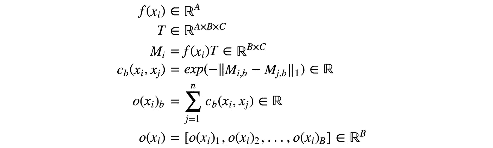**

**引用“训练 GANs 的改进技术”一文中的话**

> **微型批次鉴别使我们能够非常快速地生成视觉上吸引人的样品，在这方面，它优于特征匹配。**

# *****单面标签平滑*****

**深层网络可能会因过度自信而受损。例如，它使用很少的特征来分类一个对象。为了缓解这个问题，深度学习使用监管和辍学来避免过度自信。**

**在 GAN 中，如果鉴别器依赖于一小组特征来检测真实图像，则生成器可能仅产生这些特征来利用鉴别器。优化可能会变得过于贪婪，并且不会产生长期效益。在甘看来，过度自信伤害很大。为了避免这个问题，当任何真实图像的预测超过 0.9 时，我们惩罚鉴别器( *D(真实图像)> 0.9* )。这是通过将我们的目标标签值设置为 0.9 而不是 1.0 来实现的。下面是伪代码:**

```
**p = tf.placeholder(tf.float32, shape=[None, 10])# Use 0.9 instead of 1.0.
feed_dict = {
  p: [[0, 0, 0, 0.9, 0, 0, 0, 0, 0, 0]] # Image with label "3"
}# logits_real_image is the logits calculated by 
# the discriminator for real images.
d_real_loss = tf.nn.sigmoid_cross_entropy_with_logits(
                    labels=p, logits=logits_real_image)**
```

# **历史平均**

**在历史平均中，我们跟踪最近 ***t*** 模型的模型参数。或者，如果我们需要保持一个长的模型序列，我们更新模型参数的运行平均值。**

**我们将下面的 L2 成本添加到成本函数中，以惩罚不同于历史平均值的模型。**

**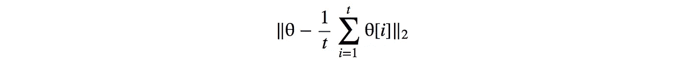**

**对于具有非凸目标函数的 GANs，历史平均可以阻止模型围绕平衡点旋转，并作为阻尼力来收敛模型。**

# ***体验回放***

**模型优化可能过于贪婪，会破坏生成器当前正在生成的内容。为了解决这个问题，experience replay 保留了从过去的优化迭代中最近生成的图像。不是仅用当前生成的图像来拟合模型，我们还将所有最近生成的图像馈送给鉴别器。因此，对于生成器的特定时间实例，鉴别器不会过拟合。**

# **使用标签(CGAN)**

**许多数据集带有其样本对象类型的标签。训练甘已经很难了。因此，在指导 GAN 训练方面的任何额外帮助都可以大大提高性能。添加标签作为潜在空间 ***z*** 的一部分有助于 GAN 训练。下面是在 [CGAN](https://medium.com/@jonathan_hui/gan-cgan-infogan-using-labels-to-improve-gan-8ba4de5f9c3d) 中使用的数据流，以利用样本中的标签。**

**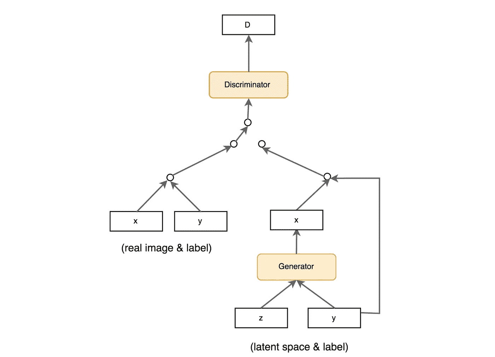**

# **成本函数**

**成本函数重要吗？否则所有的研究努力都会白费。但如果你听说了一篇 2017 年的谷歌大脑论文，你肯定会产生怀疑。但是推画质还是重中之重。很可能，我们会看到研究人员尝试不同的成本函数，然后我们才有一个明确的答案。**

**下图列出了一些常见 GAN 模型的成本函数。**

**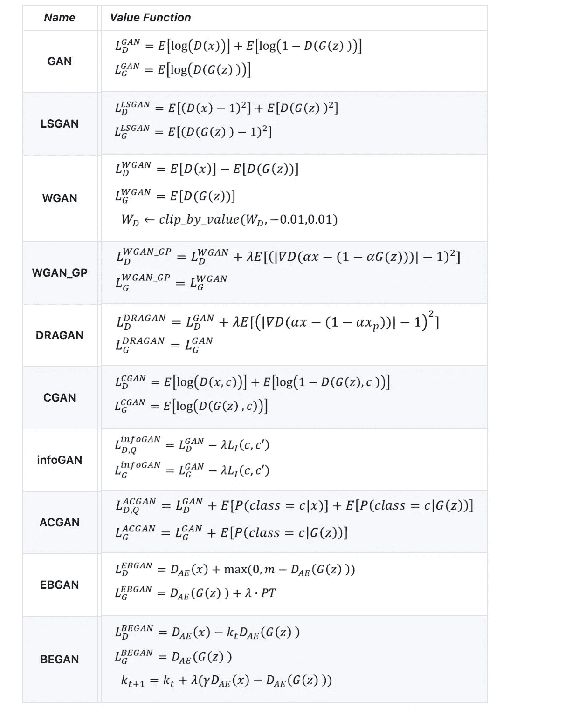**

**Table modified from [here](https://github.com/hwalsuklee/tensorflow-generative-model-collections).**

**我们决定不在本文中详述这些成本函数。下面是详细介绍一些常用代价函数的文章: [WGAN/WGAN-GP](https://medium.com/@jonathan_hui/gan-wasserstein-gan-wgan-gp-6a1a2aa1b490) ，[EBGAN/begin](https://medium.com/@jonathan_hui/gan-energy-based-gan-ebgan-boundary-equilibrium-gan-began-4662cceb7824)， [LSGAN](https://medium.com/@jonathan_hui/gan-lsgan-how-to-be-a-good-helper-62ff52dd3578) ， [RGAN 和 RaGAN](https://medium.com/@jonathan_hui/gan-rsgan-ragan-a-new-generation-of-cost-function-84c5374d3c6e) 。在本文的最后，我们列出了一篇更详细地研究所有这些成本函数的文章。由于成本函数是 GAN 的一个主要研究领域，我们鼓励您稍后阅读该文章。**

**这里是一些数据集的 FID 分数(越低越好)。这是一个参考点，但需要注意的是，现在就得出什么样的成本函数表现最好的结论还为时过早。事实上，还没有一个成本函数在所有不同的数据集中表现得最好。**

**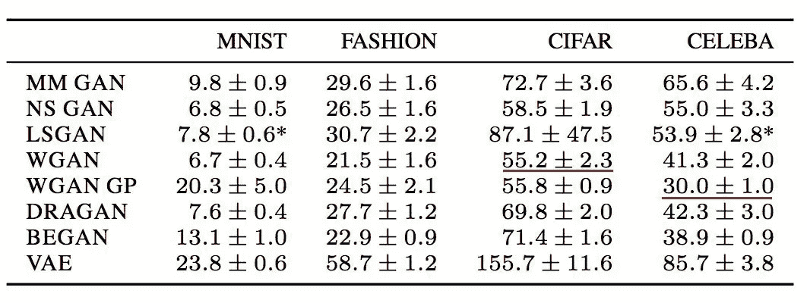**

**[Source](https://arxiv.org/pdf/1711.10337.pdf)**

**(MM GAN 是原论文中的 GAN 代价函数。NS GAN 是在同一篇论文中解决消失梯度的替代成本函数。)**

**但是如果没有好的超参数，任何模型都不会表现良好，而且调整 gan 需要时间。在随机测试不同的成本函数之前，对超参数优化要有耐心。一些研究人员提出，调整超参数可能比改变成本函数获得更好的回报。一个仔细调整的学习率可能会减轻一些严重的甘问题，如模式崩溃。具体来说，当模式崩溃发生时，降低学习速率并重新进行训练。**

**我们还可以为生成器和鉴别器试验不同的学习速率。例如，下图在 WGAN-GP 训练中对鉴别器使用 0.0003 的学习率，对生成器使用 0.0001 的学习率。**

**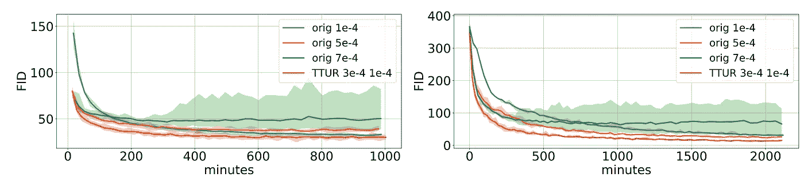**

**[Source](https://arxiv.org/pdf/1706.08500.pdf)**

# **实施技巧**

*   **在-1 和 1 之间缩放图像像素值。使用 tanh 作为发生器的输出层。**
*   **高斯分布的实验采样 ***z*** 。**
*   **批量标准化通常可以稳定训练。**
*   **使用 PixelShuffle 和转置卷积进行上采样。**
*   **避免缩减采样的最大池化。使用卷积步幅。**
*   **Adam optimizer 通常比其他方法效果更好。**
*   **在将真实图像和生成的图像输入鉴别器之前，向它们添加噪声。**

**GAN 模型的动力学还没有被很好地理解。因此，一些提示只是建议，里程可能会有所不同。例如，LSGAN 的论文报告了 RMSProp 在他们的实验中有更稳定的训练。这种情况很少见，但证明了提出一般性建议的挑战。**

**鉴别器和生成器不断地与他人竞争。做好成本函数值可能上下波动的准备。不要过早地停止培训，即使成本可能会上升。直观地监控结果，以验证培训的进度。**

# **虚拟批量标准化(VBN)**

**批量规范化 BM 成为许多深度网络设计中事实上的标准。BM 的平均值和方差来自当前的小批量。然而，它在样本之间产生了依赖性。生成的图像不是相互独立的。**

**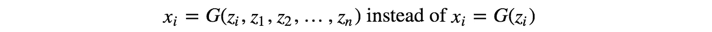**

**这反映在实验中，实验产生的图像显示同一批中的色调。**

**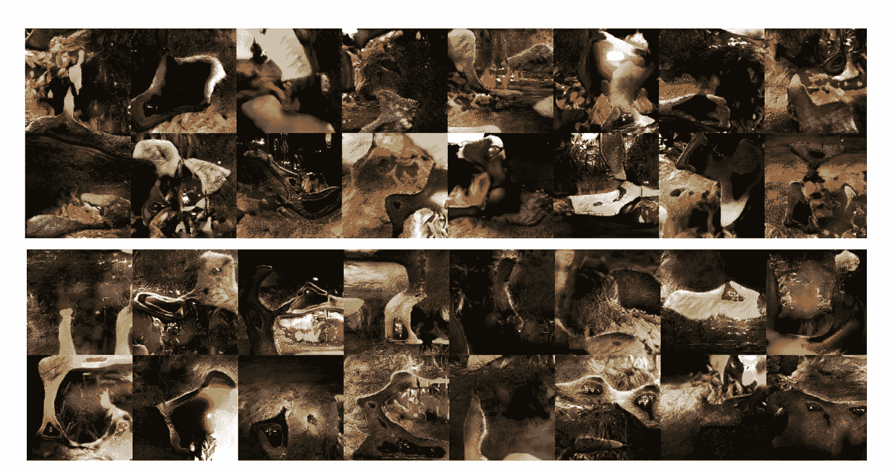**

**Orange tone on the top batch and greenish tone on the second. [Source](https://arxiv.org/pdf/1701.00160v3.pdf)**

**最初，我们从随机分布中抽取 ***z*** 的样本，这给了我们独立的样本。然而，批量标准化产生的偏差压倒了 ***z*** 的随机性。**

**虚拟批次标准化(VBN)在训练前对参考批次进行采样。在正向传递中，我们可以预先选择一个参考批次来计算 BN 的归一化参数( *μ* 和σ)。但是，我们将使用该参考批次过度拟合模型，因为我们在整个训练中使用相同的批次。为了减轻这种情况，我们可以将参考批次与当前批次结合起来计算归一化参数。**

# **随机种子**

**用于初始化模型参数的随机种子影响 GAN 的性能。如下所示，在 50 次单独运行(训练)中，用于测量 GAN 性能的 FID 分数有所不同。但是范围相对较小，并且可能仅在稍后的微调中完成。**

**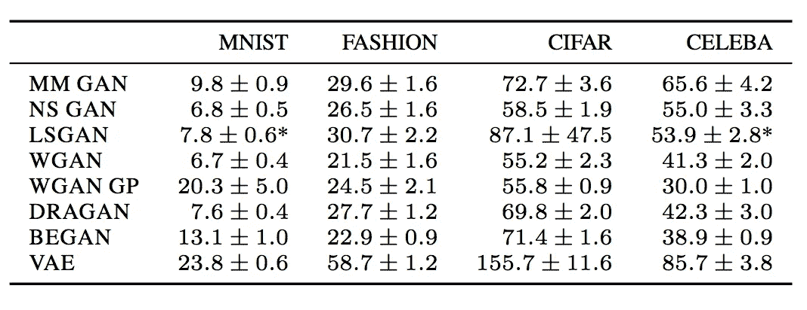**

**[Source](https://arxiv.org/pdf/1711.10337.pdf)**

**谷歌大脑的一篇论文指出，LSGAN 偶尔会在一些数据集中失败或崩溃，需要用另一个随机种子重新开始训练。**

# **批量标准化**

**DGCAN 强烈建议在网络设计中加入 BM。BM 的使用也成为许多深度网络模型中的普遍做法。然而，也会有例外。下图展示了 BN 对不同数据集的影响。y 轴是 FID 分数，越低越好。正如 WGAN-GP 论文所建议的，BN 在使用时应该是关闭的。我们建议读者在 BN 上检查所使用的成本函数和相应的 FID 性能，并通过实验验证设置。**

**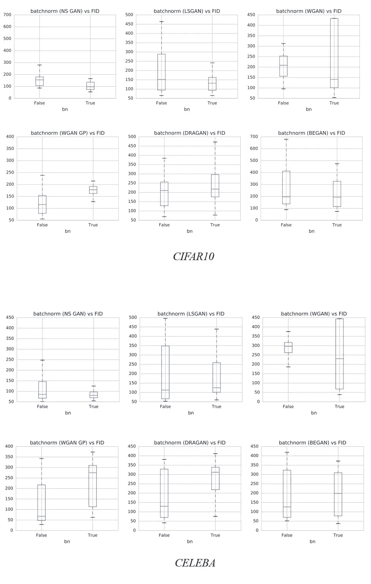**

**Modified from [source](https://arxiv.org/pdf/1711.10337.pdf).**

# **光谱归一化**

**[频谱归一化](https://medium.com/@jonathan_hui/gan-spectral-normalization-893b6a4e8f53)是一种权重归一化，稳定了鉴别器的训练。它控制鉴别器的 Lipschitz 常数以减轻爆炸梯度问题和模式崩溃问题。这个概念在很大程度上基于数学，但从概念上讲，它限制了每次迭代中的权重变化，而不是过度依赖于鉴别器在区分图像时的一小组特征。与 WGAN-GP 相比，这种方法计算量小，并实现了困扰许多 GAN 方法的良好模式覆盖。**

# **多个 GANs**

**模式崩溃也许并不全是坏事。当模式崩溃时，图像质量通常会提高。事实上，我们可以收集每个模式的最佳模型，并使用它们来重新创建不同模式的图像。**

**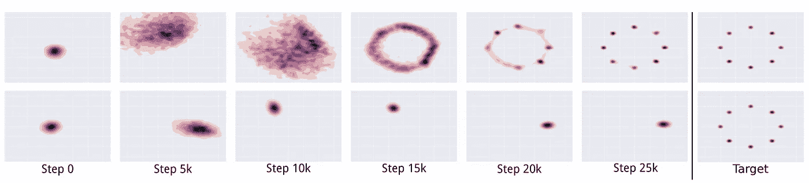**

**[Source](https://arxiv.org/pdf/1611.02163.pdf)**

# **鉴别器和发生器之间的平衡**

**鉴别者和生成者总是在进行一场互相削弱的拉锯战。模式崩溃和梯度递减通常被解释为鉴别器和发生器之间的不平衡。我们可以通过将注意力转向平衡发生器和鉴频器之间的损耗来改进 GAN。不幸的是，解决方案似乎难以捉摸。我们可以在鉴别器和生成器上保持梯度下降迭代次数之间的静态比率。即使这看起来很吸引人，但许多人怀疑它的好处。通常，我们保持一比一的比例。但是一些研究人员也测试了每次生成器更新 5 次鉴别器迭代的比率。还提出了用动态机制平衡两个网络。但直到最近几年，我们才开始关注它。**

**另一方面，一些研究人员质疑平衡这些网络的可行性和可取性。一个训练有素的鉴别器无论如何都会给生成器提供质量反馈。还有，训练发电机总是追上鉴别器也不容易。相反，我们可以把注意力转移到寻找一个成本函数，当发电机表现不好时，该成本函数不具有接近零的梯度。**

**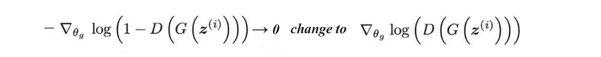**

**然而，问题依然存在。提出了许多成本函数的建议，但关于什么是最好的建议的争论仍然存在。**

# **鉴别器和发电机网络容量**

**鉴别器的模型通常比发生器更复杂(更多过滤器和更多层),好的鉴别器提供高质量的信息。在许多 GAN 应用中，我们可能会遇到瓶颈，即增加发电机容量并不能提高质量。在我们发现瓶颈并解决它们之前，增加发电机容量似乎不是许多分区商的首要任务。**

# **比根**

**BigGAN 于 2018 年出版，目标是为 GAN 收集当时生成最佳图像的一些实践。在本节中，我们将研究一些尚未涉及的实践。**

****批量更大****

**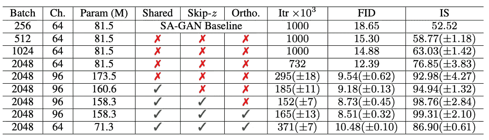**

**[Source](https://arxiv.org/pdf/1809.11096.pdf) (The smaller the FID score, the better)**

**如上所示，增加批量会使 FID 显著下降。批量越大，覆盖的模式就越多，并为两个网络学习提供更好的梯度。但是，BigGAN 报告说，该模型在更少的迭代中达到了更好的性能，但之后变得不稳定，甚至崩溃。所以，不断保存模型。**

****截断绝招****

**潜在空间中的低概率密度区域 *z* 可能没有足够的训练数据来准确学习。所以在生成图像时，我们可以避开那些区域，以变差为代价来提高图像质量。即图像的质量将会提高，但是那些生成的图像在风格上具有较低的变化。截断输入潜在空间 *z* 有不同的技术。一般原则是，当值落在范围之外时，它将被重新采样或挤压到更高概率的区域。**

****增加型号容量****

**在调整过程中，考虑增加模型的容量，尤其是对于具有高空间分辨率的图层。许多型号在将当时使用的传统容量增加一倍后，性能有所提高。但是在没有首先对模型设计和实现进行校对的情况下，不要做得太早。**

****发电机重量的移动平均值****

**生成器使用的权重是根据生成器权重的指数移动平均值计算的。**

****正交正则化****

**权重矩阵的条件是一个重要的研究课题。这是一项关于函数输出对其输入变化的敏感程度的研究。对训练稳定性影响较大。矩阵 *Q* 是正交的，如果**

**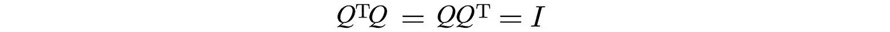**

**如果我们用一个正交矩阵乘以 *x* ，那么 *x* 的变化就不会被放大。这种行为对于保持数值稳定性是非常理想的。**

**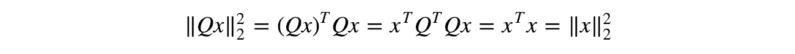**

**对于其他属性，保持权重矩阵的正交属性在深度学习中可能是有吸引力的。我们可以添加一个正交正则化，以鼓励在训练过程中这样的属性。如果 Q 偏离正交矩阵，它会对系统不利。**

**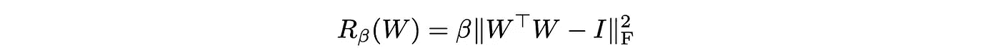**

**然而，这是众所周知的太局限，因此比根使用了一个修改的术语:**

**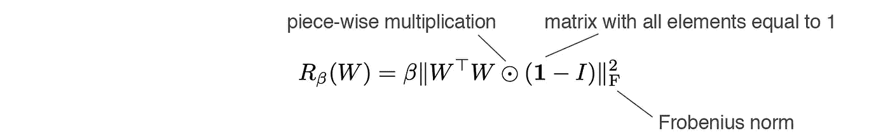**

**正交正则化还允许截断技巧在不同的模型中更加成功。**

****正交权重初始化****

**模型权重被初始化为随机正交矩阵。**

****跳 z 连接****

**在普通 GAN 中，潜在因子 *z* 仅输入到第一层。使用 skip-z 连接，潜在因素 *z* 的直接跳过连接(skip-z)连接到发电机的多个层，而不仅仅是第一层。**

# **进一步阅读**

**在本文中，我们不通过成本函数来详述改进。这是一个重要的话题，我们建议读者阅读下面的文章:**

**[](https://medium.com/@jonathan_hui/gan-a-comprehensive-review-into-the-gangsters-of-gans-part-2-73233a670d19) [## 甘——甘黑帮综论(下)

### 本文研究了 GAN 研究的动机和改进方向。通过在一个…

medium.com](https://medium.com/@jonathan_hui/gan-a-comprehensive-review-into-the-gangsters-of-gans-part-2-73233a670d19) 

了解更多 GANs 的酷炫应用:

[](https://medium.com/@jonathan_hui/gan-some-cool-applications-of-gans-4c9ecca35900) [## GAN——GAN 的一些酷应用。

### 在 GAN 开发的最初几年，我们取得了令人瞩目的进展。再也没有邮票大小的面部照片了…

medium.com](https://medium.com/@jonathan_hui/gan-some-cool-applications-of-gans-4c9ecca35900) 

本系列的所有文章。

[](https://medium.com/@jonathan_hui/gan-gan-series-2d279f906e7b) [## GAN — GAN 系列(从头到尾)

### 我们文章的完整列表涵盖了 GAN 的应用、问题和解决方案。

medium.com](https://medium.com/@jonathan_hui/gan-gan-series-2d279f906e7b) 

# 参考

[训练 GANs 的改进技术](https://arxiv.org/pdf/1606.03498.pdf)**