# 甘斯·恩罗斯

> 原文：<https://towardsdatascience.com/gans-n-roses-c6652d513260?source=collection_archive---------1----------------------->

*“本文假设读者熟悉神经网络和 Tensorflow 的使用。如果没有，我们会要求您阅读迈克尔·尼尔森关于深度学习的* [*这篇*](http://neuralnetworksanddeeplearning.com/) *文章，并熟悉如何使用*[*tensor flow*](https://www.tensorflow.org/get_started/)*。”*

想象有一天，我们有了一个神经网络，它可以看电影并生成自己的电影，或者听歌并创作新的电影。这个网络会从所见所闻中学习，而不需要你明确地告诉它。这种让神经网络学习的方式被称为无监督学习。

在过去的三年里，事实上以无人监督的方式训练的 GANs(生成对抗网络)获得了很多关注，现在被认为是人工智能领域最热门的话题之一。这是《脸书 AI》的导演 Yann LeCun 对他们的看法:

> 生成对抗网络是近十年来机器学习中最有趣的思想。

gan 是做梦的神经网络，在观看其中一些图像后生成图像。嗯，这个可以用来做什么？为什么这很重要？

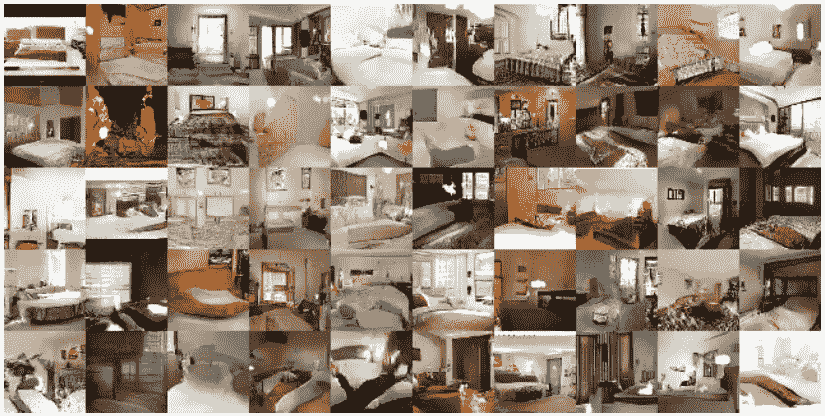

Generated bedroom images. Source: [https://arxiv.org/abs/1511.06434v2](https://arxiv.org/abs/1511.06434v2)

直到最近，神经网络(特别是卷积神经网络)只擅长分类任务，例如在猫和狗或者飞机和汽车之间进行分类。但是现在它们可以用来生成猫或狗的图片(尽管它们看起来很奇怪)，这告诉我们它们已经学会了特征。这向我们表明，他们能够理解一个物体本身的特征。

GANs 的这种非凡能力可用于许多令人惊叹的应用，例如:

*   给定文本描述生成图像。查看[此](https://arxiv.org/pdf/1612.03242v1.pdf)链接:

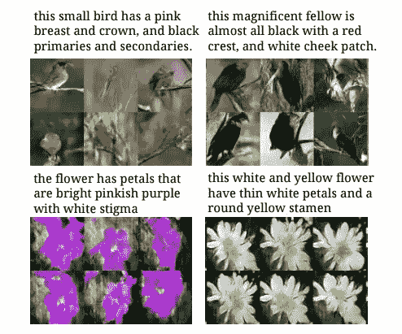

Text to Image. Source: [https://arxiv.org/pdf/1605.05396v2.pdf](https://arxiv.org/pdf/1605.05396v2.pdf)

 [## 2016 年深度学习的主要进展- Tryolabs 博客

### 过去几年，深度学习一直是机器学习社区的核心话题，2016 年并不是…

tryolabs.com](https://tryolabs.com/blog/2016/12/06/major-advancements-deep-learning-2016/) 

*   图像到图像的翻译:

这可能是迄今为止 GAN 最酷的应用。图像到图像转换可用于从草图生成逼真的图像，将白天拍摄的照片转换为夜间图像，甚至将灰度图像转换为彩色图像。

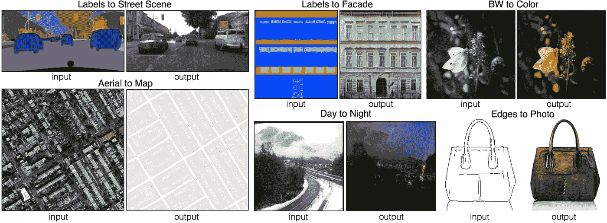

Image to Image Translation. Source: [https://phillipi.github.io/pix2pix/](https://phillipi.github.io/pix2pix/)

请点击此链接了解更多详情:

 [## 基于条件对抗网络的图像到图像翻译

### 基于条件对抗网络的图像到图像翻译

phillipi.github.io](https://phillipi.github.io/pix2pix/) 

了解了 GAN 的能力之后，让我们一起登上宣传列车，实现一个简单的 GAN 来生成玫瑰的图像。好吧，等等，但是为什么是玫瑰？

> "*我们不想用一个故事来烦你，但只能说这篇文章是在听了枪炮玫瑰乐队的一首歌后得到的灵感(现在知道标题了吧？？)*”

# **让我们看看甘到底是什么:**

在我们开始构建 GAN 之前，让我们了解它是如何工作的。生成式对抗网络包含两个神经网络:鉴别器和生成器。鉴别器是卷积神经网络(不知道 CNN 是什么？看看[这篇](http://neuralnetworksanddeeplearning.com/chap6.html)精彩的文章)学习区分真实和虚假的图片。真实的图像来自数据库，假的来自生成器。

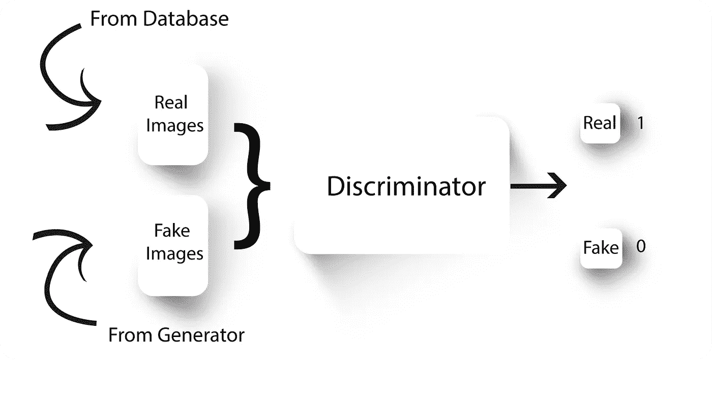

Discriminator

该生成器的工作方式类似于反向运行的 CNN，它将一个随机数向量作为输入，并在输出端生成一个图像。

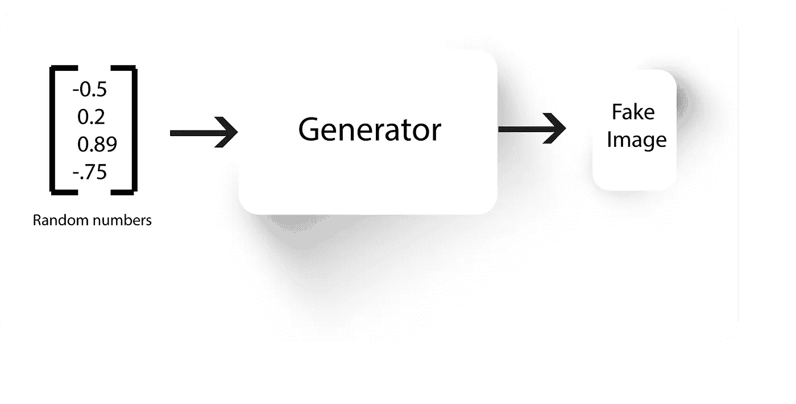

Generator

我们稍后将讨论生成器和鉴别器的工作和实现，但现在让我们看一个著名的例子来解释 GANs(解释大量借用了[滥用生成性对抗网络来制作 8 位像素艺术](https://medium.com/@ageitgey/abusing-generative-adversarial-networks-to-make-8-bit-pixel-art-e45d9b96cee7))。

让我们把生产者想象成一个伪造者，把鉴别者想象成一个必须辨别真假货币的警察。首先，让我们保证伪造者和警察的工作都一样糟糕。因此，伪造者首先产生一些随机的看起来有噪声的图像，因为它对货币的样子一无所知。

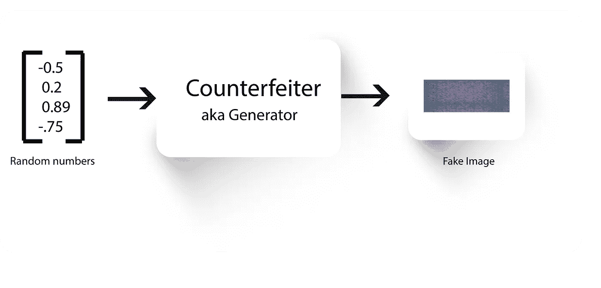

Noisy Image by the Counterfeiter

现在，警察被训练来区分伪造者制造的这些假图像和真货币。

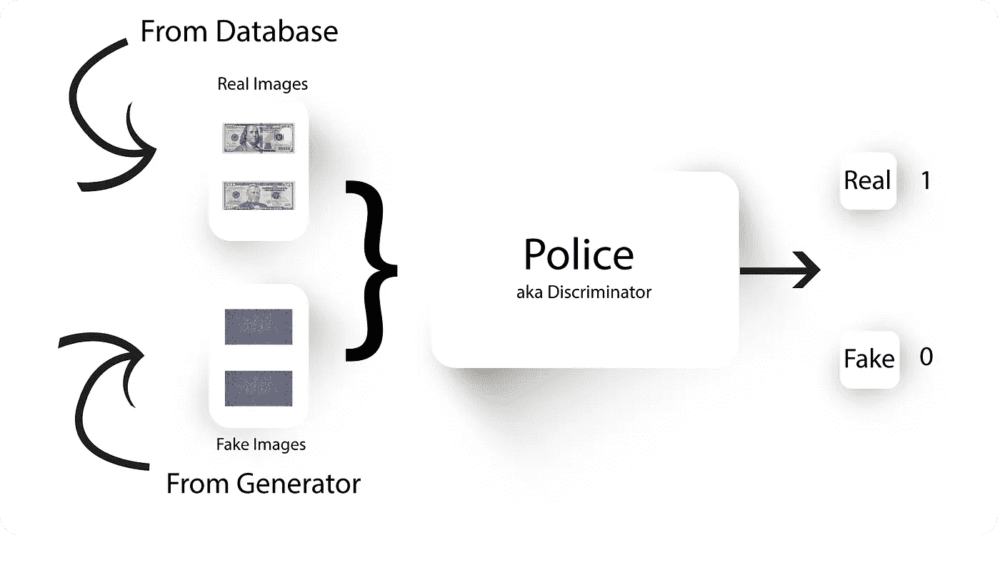

Train the Police Officer

伪造者现在知道其图像被归类为假的，并且警察正在寻找货币中的一些明显特征(例如颜色和图案)。伪造者现在知道了这些特征，并产生了具有这些特征的货币(在这种情况下是图像)。

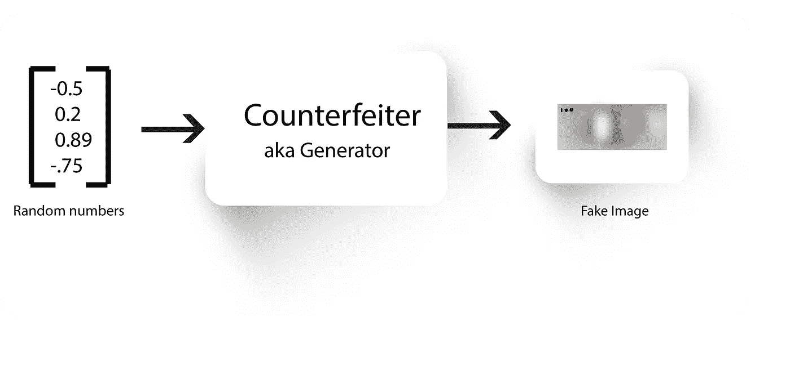

Training the Counterfeiter

现在，再次向警官展示来自数据集的真实货币和来自伪造者的新的改进(希望如此)图像，并要求对它们进行分类。因此，官员将会学到真实图像的更多特征(如货币上的脸)。

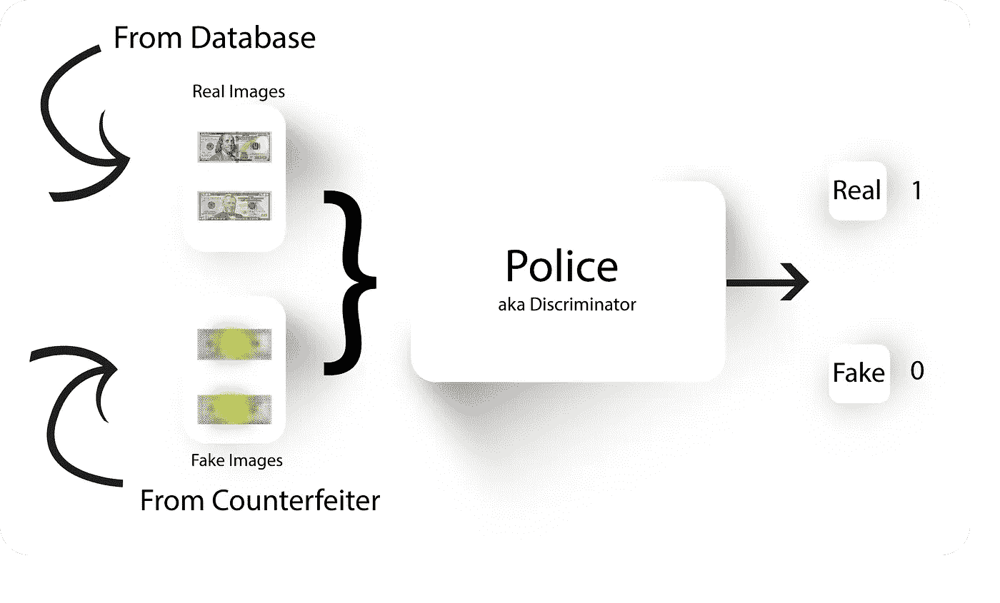

Train the Police with the new fake images

伪造者再次学习这些特征并产生更好看的假图像。

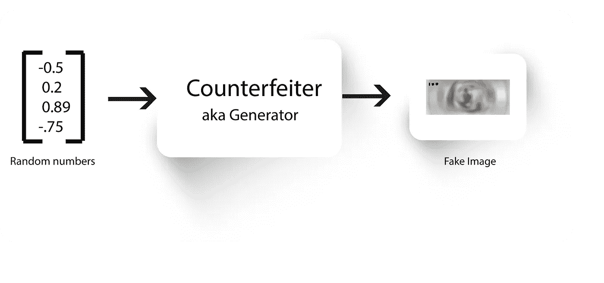

Train the counterfeiter again

伪造者和警察之间的这种持续的斗争一直持续到伪造者制造出看起来和真的一模一样的图像，而警察无法对它们进行分类。

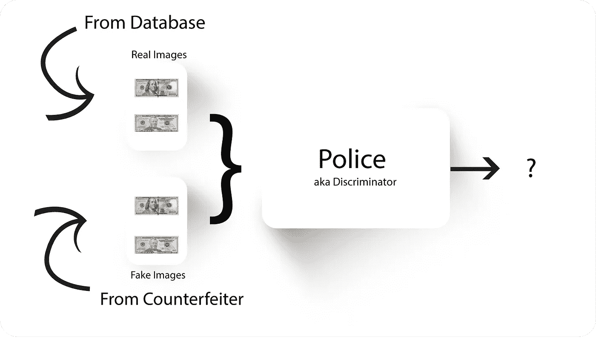

Real or Fake?

**GANs N ' Roses 在 Tensorflow 上的实现:**

让我们使用 tensorflow，不使用任何其他东西(除了 pillow)，构建一个简单的 DCGAN(深度卷积生成对抗网络)。

但是什么是 DCGAN 呢？

[DCGAN](https://arxiv.org/abs/1511.06434) 是 vanilla GAN 的修改版本，以解决 vanilla GAN 的一些困难，例如:使假图像看起来视觉上令人愉悦，在训练过程中提高稳定性，以便生成器不会通过重复输出符合鉴别器正在寻找的数据分布的图像来发现鉴别器中的缺陷，但与真实图像相差甚远。

这是我们试图构建的鉴别器架构:

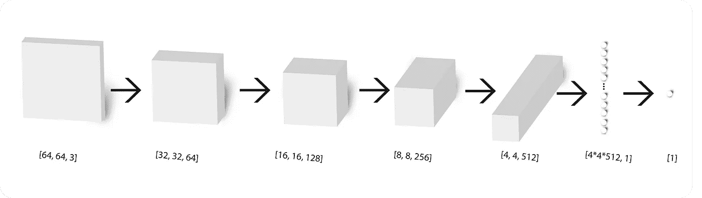

Discriminator Architecture

可以看出，它接受一个图像作为输入，并输出一个 logit (1 表示真类，0 表示假类)。

接下来，我们有生成器架构，它由 [conv 转置](https://www.tensorflow.org/api_docs/python/tf/nn/conv2d_transpose)层组成，接受一组随机数作为输入，并在输出端生成图像。

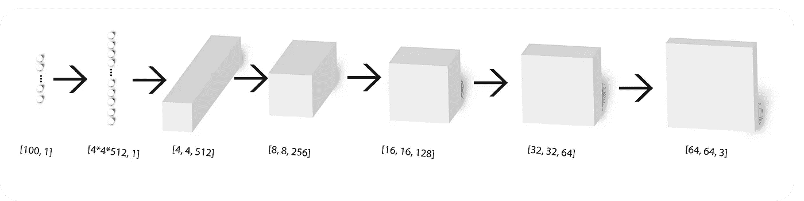

Generator Architecture

DCGANs 提出的修改直接取自[这份](https://arxiv.org/pdf/1511.06434.pdf)文件:

*   用步长卷积(鉴别器)和分数步长卷积(生成器)替换任何池层。
*   在发生器和鉴别器中使用 [batchnorm](https://standardfrancis.files.wordpress.com/2015/04/screenshot-from-2015-04-16-133436.png?w=1008) 。
*   为更深层次的架构移除完全连接的隐藏层。
*   在生成器中对所有层使用 ReLU 激活，但输出层除外，它使用 Tanh。
*   在所有层的鉴别器中使用 LeakyReLU 激活。

让我们从收集玫瑰的图像开始。一个简单的方法是在谷歌上搜索玫瑰图片，并通过使用 ImageSpark 等 chrome 插件下载搜索结果中的所有图片。

我们已经收集了 67 张图片(越多越好),可在[这里](https://drive.google.com/open?id=0B068a_0Gq8kYSGZ3UmdveFczM0U)找到。将这些图像提取到以下目录中:

<project folder="">/数据集/玫瑰花。</project>

可以通过在 Github 上克隆这个 repo 来获得代码和数据集。

 [## 纳雷斯 1318/甘斯玫瑰

### GANs_N_Roses -使用深度卷积生成敌对网络，通过 tensorflow 生成玫瑰图像。

github.com](https://github.com/Naresh1318/GANs_N_Roses) 

现在我们有了图像，下一步是预处理这些图像，将它们重新整形为 64 * 64，并将它们缩放到-1 到 1 之间的值。

我们将首先写出稍后可用于构建卷积、卷积转置、密集全连接层和 LeakyReLU 激活的函数(因为它在 Tensorflow 上尚不可用)。

Function to implement convolutional layer

我们使用`get_variable()`而不是通常的`Variable()`在 tensorflow 上创建一个变量，以便稍后在不同的函数调用之间共享权重和偏差。查看[这篇](https://www.tensorflow.org/versions/r0.12/how_tos/variable_scope/)的帖子，了解更多关于共享变量的信息。

Function to implement convolution transpose

Function to implement dense fully connected layer

Leaky ReLU

下一步是构建生成器和鉴别器。先从我们的主角，发电机说起。我们需要构建的生成器架构如下所示:

Again, the Generator Architecture we’re trying to implement

`generator()`函数构建了一个发电机(dah！)使用上图中的架构。已满足 DCGAN 要求，例如移除所有完全连接的层、仅在生成器中使用 ReLU 以及使用批量标准化。

类似地，鉴别器可以容易地构造如下:

所需的架构:

The Discriminator architecture

我们再次避免了密集的全连接层，在鉴别器处使用了泄漏 ReLU 和批量标准化。

**现在是有趣的部分，训练这些网络:**

鉴别器和发生器的损失函数如下所示:

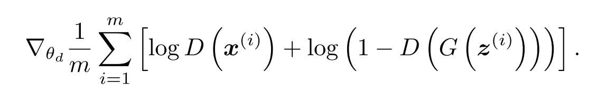

Discriminator loss (This must have a negative sign)

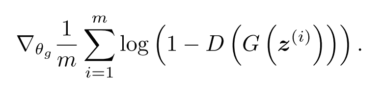

Generator loss

其中 x 代表实像，z 是输入发生器的噪声矢量。

我们将把随机输入传递给生成器，zin 的形状将是[BATCH_SIZE，Z_DIM]，生成器现在应该在其输出中给出 BATCH_SIZE 数量的假图像。生成器输出的大小现在将是[BATCH_SIZE，IMAGE_SIZE，IMAGE_SIZE，3]。这是损失函数中的 G(z)项。

D(x)是接受真实图像或虚假图像的鉴别器，并被训练来区分它们。为了在真实图像上训练鉴别器，我们将把真实图像批次传递给 D(x ),并将目标设置为 1。类似地，为了在假图像(来自生成器)上训练它，我们将使用 D(G(z))将生成器输出连接到鉴别器输入。

鉴频器的损耗通过 tensorflow 的内置函数实现:

接下来，我们需要训练生成器，使 D(G(z))将输出一个 1，也就是说，我们将固定鉴别器上的权重，并仅支持生成器权重，以便鉴别器总是输出一个 1。

因此，发电机的损失函数为:

接下来，我们将收集鉴别器和生成器的所有权重(稍后需要仅训练生成器或鉴别器):

我们使用 tensorflow 的 AdamOptimizer 来学习权重。下一步是将需要修改的权重分别传递给鉴别器和生成器优化器。

最后一步是运行会话，并将所需的图像批次传递给优化器。我们将训练模型 30000 次迭代，并定期显示鉴别器和发电机损耗。

为了使超参数的调整更容易，并保存每次运行的结果，我们实现了 form_results 函数并创建了一个名为`mission_control.py`的文件。

使用`mission_control.py`文件可以修改网络的所有超级参数，稍后运行`main.py`文件将自动为每次运行创建文件夹，并保存 tensorboard 文件和生成的图像。

我们可以通过打开 tensorboard 并将其指向在每个运行文件夹下创建的 Tensorboard 目录来查看训练期间每次迭代的鉴别器和发电机损耗(查看 [GitHub](https://github.com/Naresh1318/GANs_N_Roses) 链接以了解更多详细信息)。

Variation of Generator loss during training

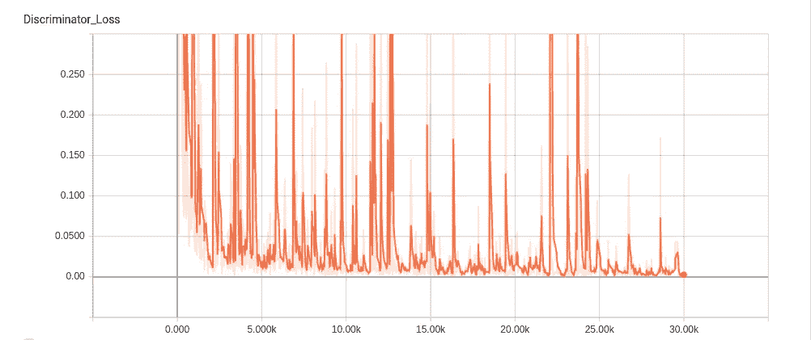

Variation of Discriminator loss during training

从这些图中可以看出，鉴别器和发生器损耗在训练阶段不断增加和减少，表明发生器和鉴别器都试图超越彼此。

该代码还保存每次运行生成的图像，其中一些图像如下所示:

在第 0 次迭代时:

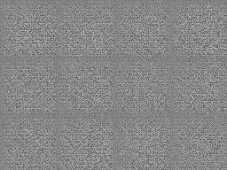

第 100 次迭代:

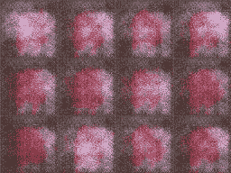

第 1000 次迭代:

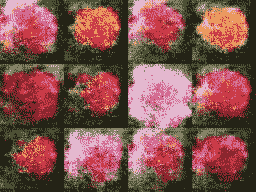

图像在第 30000 次迭代时被过度拟合:

训练阶段生成的图像如下所示:

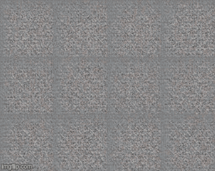

这些图像是有希望的，但是在大约 1000 次迭代之后，可以看到生成器只是从训练数据集中再现图像。我们可以使用更大的数据集，并针对更少的迭代次数对其进行训练，以减少过度拟合。

gan 易于实施，但如果没有正确的超参数和网络架构，则难以训练。我们写这篇文章的主要目的是帮助人们开始使用生成网络。

# **别人在干嘛:**

*   [用条件对抗网进行图像到图像的翻译](https://phillipi.github.io/pix2pix/)。
*   [瓦瑟斯坦甘](https://arxiv.org/abs/1701.07875)。
*   [Pytorch 实施 GANs](https://github.com/devnag/pytorch-generative-adversarial-networks) 。

感谢您阅读这篇相当长的中型文章。如果你觉得它有帮助，请考虑分享它。如对本文有任何疑问，请随时联系我们。