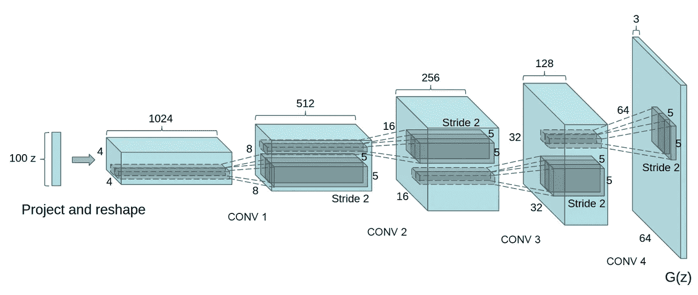

# GANS —第二部分:用于生成图像的深度卷积 GANS

> 原文：<https://towardsdatascience.com/gans-part2-dcgans-deep-convolution-gans-for-generating-images-c5d3c7c3510e?source=collection_archive---------1----------------------->

深度卷积 GAN 或 DCGAN 在生成器和鉴别器中使用卷积层。在的[论文中首次探讨了 DCGAN 架构。还需要使用批量标准化来训练卷积网络。](https://arxiv.org/pdf/1511.06434.pdf)

## 发电机

第一层是一个完全连接的层，它被重新塑造成一个又深又窄的层，有点像原始 DCGAN 纸中的 4x4x1024。然后我们使用批处理规范化和一个泄漏的 ReLU 激活。接下来是转置卷积，通常情况下，您会将前一层的深度减半，宽度和高度加倍。同样，我们使用批处理规范化和泄漏 ReLU。对于这些层中的每一层，一般的方案是卷积>批范数>泄漏 ReLU。

您继续像这样堆叠层，直到您获得形状为 32x32x3 的最终转置卷积层。下面是最初的 DCGAN 论文中使用的结构:



```
def conv_transpose_layer(prev_layer, filter, kernel_size, strides, is_training, alpha):
    x = tf.layers.conv2d_transpose(prev_layer, filter, kernel_size, strides, 'same')
    x = tf.layers.batch_normalization(x, training=is_training)
    x = tf.maximum(x, alpha*x)
    return xdef generator(z, output_dim, reuse=False, alpha=0.2, training=True):
    with tf.variable_scope('generator', reuse=reuse):

        # First fully connected layer
        x1 = tf.layers.dense(z, 4*4*512)
        # Reshape it to start the convolutional stack
        x1 = tf.reshape(x1, (-1, 4, 4, 512))
        x1 = tf.layers.batch_normalization(x1, training=training)
        x1 = tf.maximum(x1, alpha*x1)
        # 4x4x512 now x2 = conv_transpose_layer(x1, 256, 5, 2, training, alpha)
        # 8x8x256 now

        x3 = conv_transpose_layer(x2, 128, 5, 2, training, alpha)
        # 16x16x128 now

        # Output layer, 32x32x3
        logits = tf.layers.conv2d_transpose(x3, output_dim, 5, 2, 'same')
        # 32x32x3 now

        out = tf.tanh(logits)
        return out
```

## 鉴别器

鉴别器基本上只是一个卷积分类器。请注意，在 DCGAN 论文中，他们仅使用步长卷积层进行了所有下采样，没有使用最大池层。

在除第一卷积和输出层之外的每一层**上使用`tf.layers.batch_normalization`进行批量归一化。同样，每一层应该看起来像卷积>批处理规范>泄漏 ReLU。**

```
def conv_layer(prev_layer, filters, is_training, alpha, batch_norm=True):
    conv_layer = tf.layers.conv2d(prev_layer, filters, 5, 2, 'same', use_bias=False, activation=None)
    if batch_norm:
        conv_layer = tf.layers.batch_normalization(conv_layer, training=is_training)
    conv_layer = tf.maximum(conv_layer, alpha*conv_layer)
    return conv_layerdef discriminator(x, reuse=False, alpha=0.2):
    with tf.variable_scope('discriminator', reuse=reuse):
        # Input layer is 32x32x3
        x1 = conv_layer(x, 64, True, alpha, False)
        # 16x16x64 x2 = conv_layer(x1, 128, True, alpha, True)
        # 8x8x128 x3 = conv_layer(x2, 256, True, alpha, True)
        # 4x4x256 flat = tf.reshape(x3, (-1, 4*4*256)) logits = tf.layers.dense(flat, 1)
        out = tf.sigmoid(logits)

        return out, logits
```

> gan 对超参数非常敏感。为了找到最佳的超参数，进行了大量的实验，以使发生器和鉴别器不会相互干扰。

```
real_size = (32,32,3)
z_size = 100
learning_rate = 0.0002
batch_size = 128
epochs = 25
alpha = 0.2
beta1 = 0.5
```

[https://github . com/mchablani/deep-learning/blob/master/DCGAN-svhn/DCGAN _ exercises . ipynb](https://github.com/mchablani/deep-learning/blob/master/dcgan-svhn/DCGAN_Exercises.ipynb)

学分:来自课堂讲稿:[https://classroom.udacity.com/nanodegrees/nd101/syllabus](https://classroom.udacity.com/nanodegrees/nd101/syllabus)