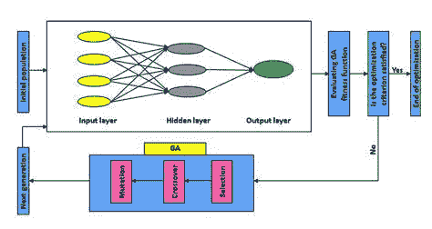

# 遗传算法+神经网络=两全其美

> 原文：<https://towardsdatascience.com/gas-and-nns-6a41f1e8146d?source=collection_archive---------2----------------------->

## 神经网络与遗传算法相结合确实可以加速解决某个问题的学习过程。

所有的大公司现在都在使用**神经网络(NNs)** 和**遗传算法(GAs)** 来帮助他们的 NNs 更好更有效地学习。在本文中，我将讨论耦合 NNs 和 GAs 的利弊，并分享我自己的一些想法。我还将描述这个过程中使用的基本算法。

我偶尔会写这些有些简短但内容丰富的文章，帮助你了解更多关于 AI 和机器学习的知识。你可以在 twitter 上关注我的或者在这里关注我的来了解我的最新文章。你也可以在 twitter 上问我问题，或者在这里发表评论。

希望这篇文章能教会你一些新的东西！我们开始吧。

遗传算法在神经网络之前非常流行。因为，NNs 需要大量数据，而 GAs 不需要。遗传算法主要用于模拟环境和群体中实体的行为。它们主要用于学习我们知道答案的问题的解决途径。

气体今天仍然被使用，但是机器学习(ML)已经大部分接管。

# 它们是如何工作的

根据维基百科气体:

> 在计算机科学和运筹学中，**遗传算法** ( **GA** )是一种元启发式算法，受自然选择过程的启发，属于进化算法(EA)的更大类别。遗传算法通常用于通过依赖诸如变异、交叉和选择之类的生物启发算子来生成优化和搜索问题的高质量解决方案。

如果这仍然不能理解，那么我确信丹尼尔·希夫曼的气体播放列表会有所帮助。它帮助我了解了天然气的工作原理，总体而言，希夫曼的视频非常好。尽管我建议加快速度。

# NNs 的问题是

NNs 帮我们解决了这么多问题。但是他们仍然有一个大问题。**超参数！这些是唯一不能学习的价值观…直到现在。**

> 注意:超参数是在给定问题的情况下，神经网络正确执行所需的值。

我们可以使用 GAs 来学习神经网络的最佳超参数！ ***这绝对牛逼！***

现在，我们不必担心“知道正确的超参数”，因为它们可以使用 g a 来学习。同样，我们也可以用它来学习神经网络的参数(权重)。

因为在遗传算法中，实体学习特定问题的最佳基因组，这里，每个神经网络的基因组将是其超参数集。

# 解决问题

要解决超参数问题，我们需要做以下工作:

*   创建几个神经网络的群体。
*   将随机(在一个范围内)超参数分配给所有神经网络。
*   对一定数量的迭代执行以下操作:

1.  同时或逐个训练所有神经网络。
2.  在他们都完成培训后，计算他们的培训成本。
3.  基于其成本计算每个神经网络的“适合度”(它在该迭代中做得有多好)。健身将被用来增加神经网络“繁殖”的机会适应度越高，它繁殖的机会就越大。然而，最好的神经网络将具有最低的成本。如果我们将那个神经网络的适应度设置为等于它的成本，那么最好的神经网络将有最少的机会被选择用于繁殖。我们可以把适应度指定为成本的倒数。因此，最低的成本，会有最高的适合度。有很多方法可以为适应度赋予更好的值，但这超出了本文的范围。
4.  找出群体中的最大适应度(步骤 5 所必需的，根据步骤 5 的实现可以忽略)。
5.  根据适合度的概率系统选择 2 个神经网络。我省略了对此的解释，因为这对某些人来说可能太复杂了。[这里有一个视频](https://www.youtube.com/watch?v=ETphJASzYes&index=8&list=PLRqwX-V7Uu6bJM3VgzjNV5YxVxUwzALHV)，解释这个话题。
6.  交叉两个神经网络的基因。这将创建一个“子”NN。这个神经网络应该具有第一个神经网络的一些性质和第二个神经网络的一些性质。这个过程也有许多不同的实现。
7.  突变孩子的基因。变异是为了在遗传算法中保持一定的随机性。
8.  对群体中的 NNs 数量执行步骤 5-7。您应该将创建的“子代”存储在新的总体中，并将新的总体赋给包含旧总体的变量。

> 注意:你应该创建一个你想学习其参数的神经网络类。然后，该群体最初应该包含同一个 NN 类的几个实例。还有，上面写的东西，都可以从希夫曼的播放列表中了解到。

执行上述所有步骤，在最新一代结束时，您的算法将找到包含具有最佳超参数的神经网络的群体。它将是种群中最健康的神经网络。下图试图解释这一过程。

Iterative process of fining hyper-parameters using GAs

# 另一个问题

这是一个学习你的超参数的好方法，但它也有自己的问题。最突出的两个问题是计算资源和时间。

同时或一个接一个地多次训练许多神经网络需要大量的时间和计算资源。这就限制了这种解决方案的实施，只有那些愿意投入资金和购买大量处理能力的人才能使用。

这也是它被大公司广泛使用的原因。

# 一个例子

不到一年前，OpenAIs Dota 2 bot 击败了一名职业 Dota 2 选手([文章](https://sea.pcmag.com/news/16981/elon-musks-openai-bot-beats-pro-dota-2-player)和 [YouTube 视频](https://www.youtube.com/watch?time_continue=2&v=l92J1UvHf6M))。玩家花了几年时间学习和掌握的东西，机器人只花了几个星期。在我在 YouTube 上看到的一个视频中，一名 OpenAI 工程师解释了他们如何训练机器人。

他们用遗传算法来训练他们的机器人。因为他们有必要的处理能力，他们能够同时运行 Dota 2 的多个实例，每个实例都有一个玩游戏的机器人实例。他们花了两周的时间来教机器人这个过程。

想象一下这需要多大的处理能力。

# 结论

在我看来，天然气是很好的教导神经网络，但他们不会是我的第一选择。相反，我将尝试寻找更好的方法来学习神经网络的超参数。如果有的话，那就是。

然而，如果将来我获得了大量的处理能力，我一定会尝试这种方法。

## 就这样，希望你学到了新的东西！

## 如果你觉得这篇文章有帮助，请鼓掌。[在 Twitter 上关注我](https://twitter.com/SuryanshTweets)和[这里](https://medium.com/@SuryanshWrites)关注我的最新帖子。如果你有任何问题，你可以发微博给我，或者通过评论让我知道。我很乐意回答这些问题。