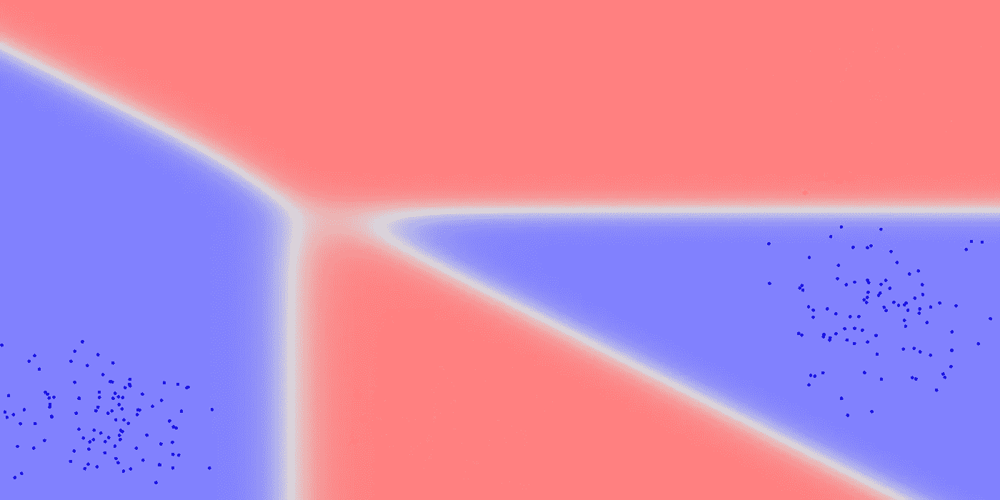
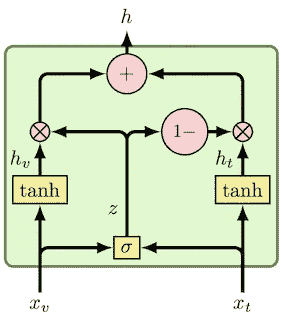
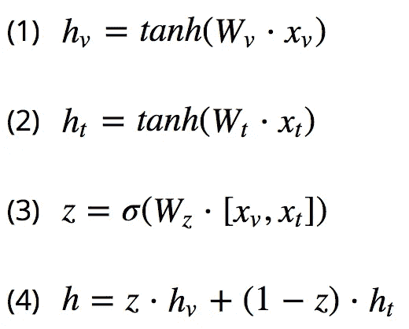
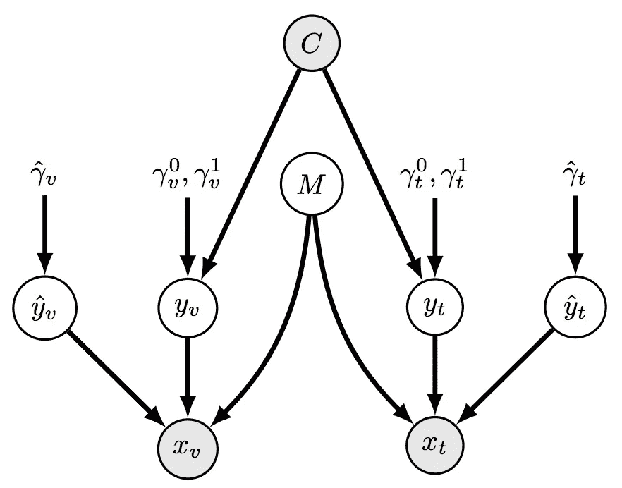
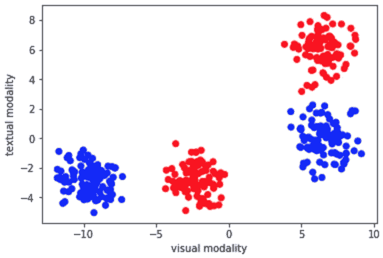
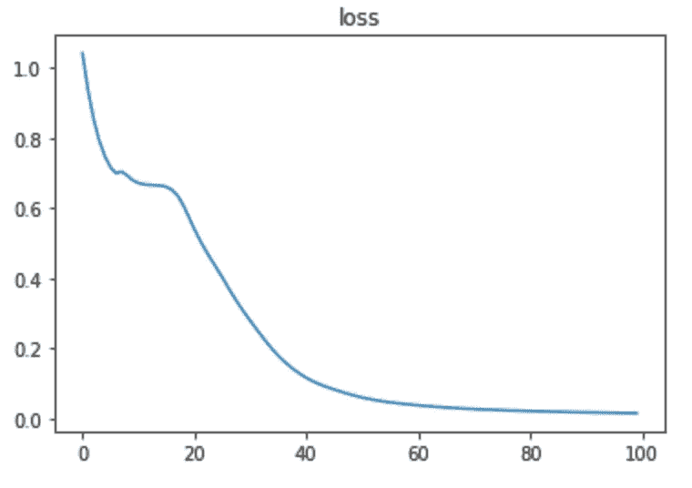
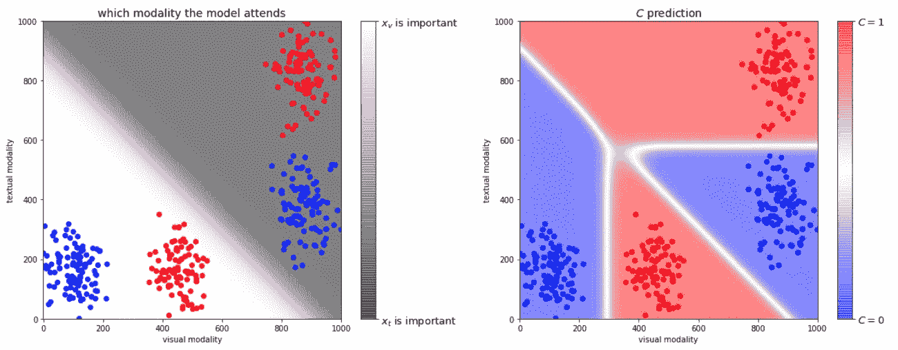

# 用于信息融合的门控多通道单元

> 原文：<https://towardsdatascience.com/gated-multimodal-units-for-information-fusion-966a9a2e1c54?source=collection_archive---------13----------------------->

The output of the GMU architecture

深度学习已经在许多领域证明了它的优越性，在各种各样的任务中，例如图像分类和文本生成。处理涉及来自多个模态的输入的任务是一个有趣的研究领域。

门控多模式单元(GMU)是由最近的一篇论文提出的一种新的构建模块，该论文在 2017 年 ICLR 世博会上以研讨会的形式展示。这个构建模块的目标是以一种智能的方式融合来自多个不同模态的信息。

在这篇文章中，我将描述 GMU，并说明它如何在玩具数据集上工作。

# 建筑

给定不同模态的两种表示，xᵛ和 xᵗ(例如视觉和文本模态)，GMU 块执行一种形式的自我注意

GMU architecture

描述 GMU 的方程相对简单:

(1) + (2)将表示转换成不同的表示，然后根据在(3)中计算的 *z* 在(4)中参与。因为 z 是 xᵛ和 xᵗ的函数，这意味着我们在处理自我关注机制。

GMU 背后的直觉是，它使用表示本身来理解哪个模态应该影响预测。考虑预测一个被拍照者的性别的任务，伴随着他的声音记录。如果给定示例的记录噪声太大，模型应该学会仅使用该示例中的图像。

# 综合数据

在论文中，他们描述了一个很好的合成数据集，展示了 GMU 是如何工作的。

在这里，我们将实现相同的数据集，并自己找出 GMU 是否真的有效(剧透:它有效)。

首先，让我们做导入:

# 生成数据

Data generating process

不要被这个图表吓到——稍后您会发现这个图表生成的数据的可视化。

基本上图中所说的是目标类 *C* 描述了模态 yᵛ和 yᵗ的值——当然带有一些随机性。

在下一步中，随机变量 *M* 决定忽略 yᵗyᵛ的哪个输入，而是使用 ŷᵗ.ŷᵛ的噪声源

最终，xᵛ和 xᵗ要么包含了能够描述目标类 *C* 的真实信息源，要么包含了随机噪声。

GMU 块的目标是成功地找出给定特定示例的哪个来源是信息来源，并对该来源给予全部关注。

Synthetic data. Color denotes the class C

# 创建模型

我将实现 GMU 的一个基本版本——只是为了让它更容易理解。

将代码一般化以处理两种以上的模态是很简单的。

# 训练模型

# 检查结果

损失看起来不错。

让我们看看 z 和预测是什么样子的。论文中还出现了以下可视化内容。

我们可以看到 *z* 的行为完全如我们所愿(左图)。它的好处在于，实际上只使用一种模态就可以预测远离边界线的点类。这意味着模型学会了何时忽略包含纯无预测噪声的模态。

# 为什么不用简单的 FF(前馈)？

如果我们忽略数据生成过程，只看数据点，显然有 4 个不同的集群。

这些集群不是线性可分的。虽然 GMU 为模型提供了容量以解释这种非线性行为，但人们可以改为向混合物中添加另一层，从而用简单的前馈(FF)网络解决问题。

> *普适逼近定理指出，一个包含有限个神经元的单隐层前馈网络，可以逼近连续函数……(*[*维基*](https://en.wikipedia.org/wiki/Universal_approximation_theorem) *)*

因此，实际上，对于这个人为的例子，一个简单的 FF 就可以完成这项工作。然而，引入新架构(在这种情况下是 GMU)的目的是引入归纳偏差，允许训练过程利用我们对问题的先验知识。

# 结论

对于涉及多模态的真实世界问题，作者声称 GMU 实现了优越的性能。他们使用基于情节和海报识别电影类型的任务来展示他们的方法。

GMU 很容易实现，如果您需要训练一个模型使用多种模态作为输入，将它放在您的工具箱中是值得的。为此，您可以为每个主机创建一个子网。子网络不必相同——例如，你可以用 CNN 做视觉模态，用 LSTM 做文本模态。重要的是每个子网络输出其模态的密集表示。然后，将这些表示送入 GMU 块，以便将信息融合成一个表示。融合的表示将被馈送到另一个子网络，其输出将是最终的预测。

*本帖原帖*[*www.anotherdatum.com*](http://www.anotherdatum.com)*。*