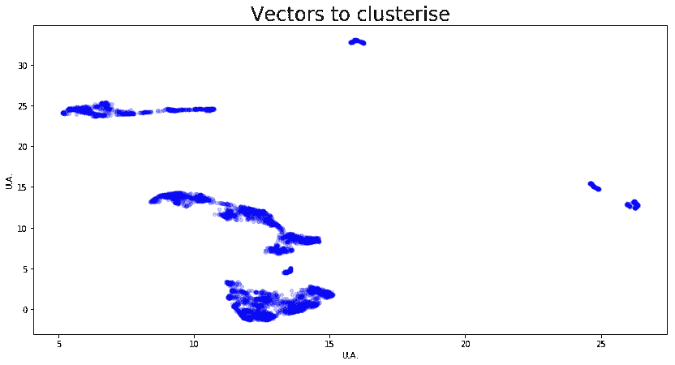
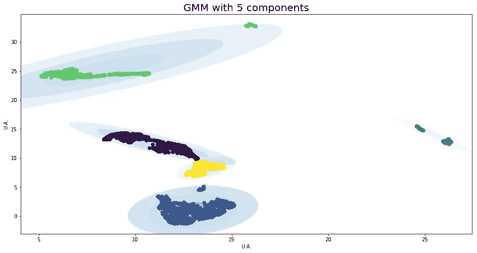
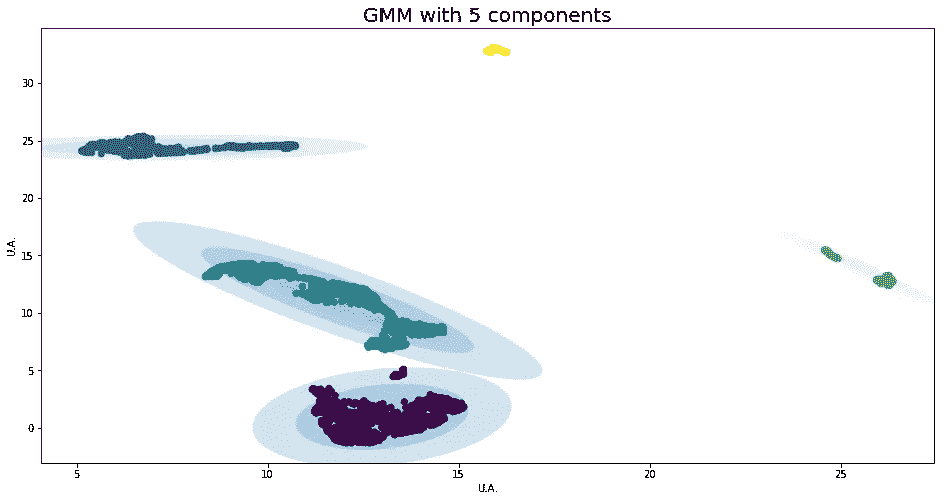
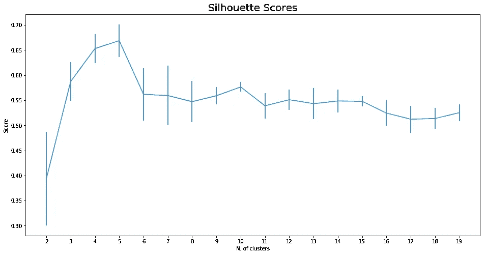
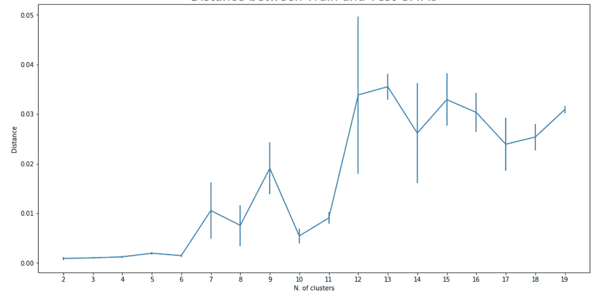
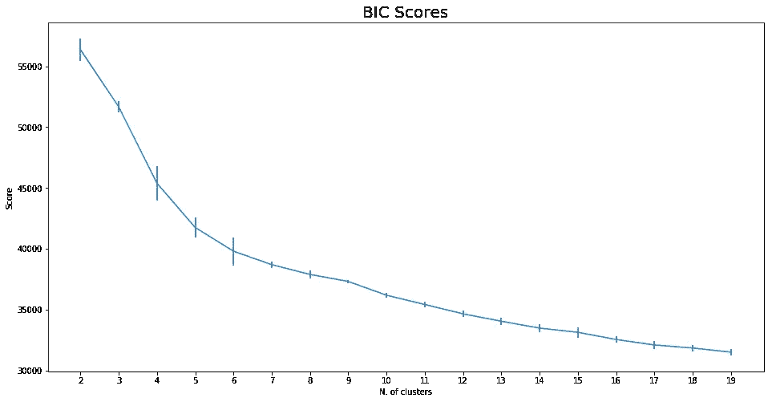
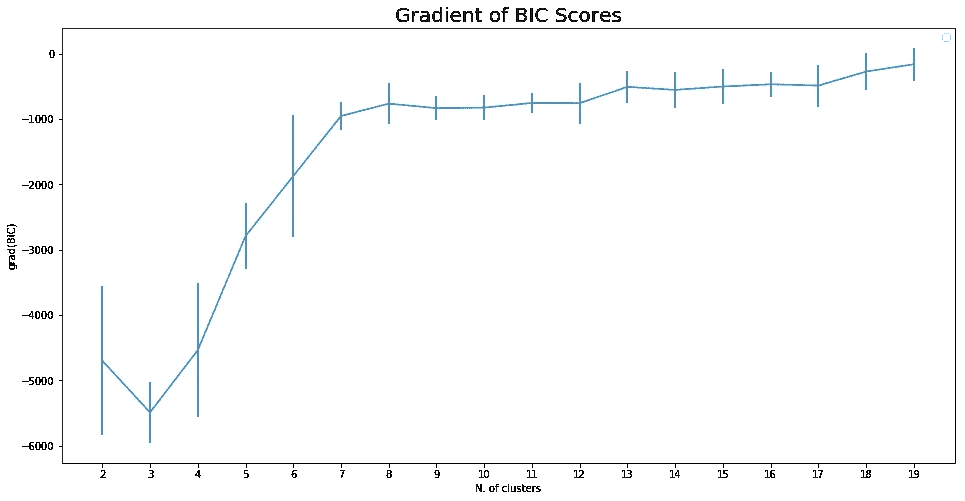
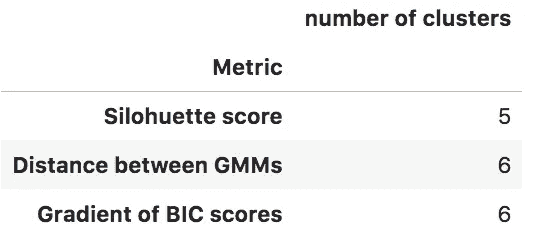
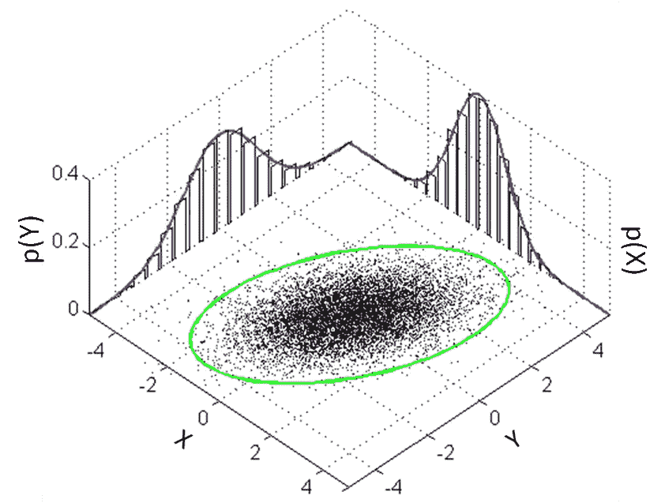

# 高斯混合模型聚类:如何选择分量(聚类)数

> 原文：<https://towardsdatascience.com/gaussian-mixture-model-clusterization-how-to-select-the-number-of-components-clusters-553bef45f6e4?source=collection_archive---------2----------------------->

如果你看到了这篇文章，你可能已经知道什么是高斯混合模型，所以我将避免对这种技术的一般性描述。

但是如果你不知道细节，你可以把 GMM 看作是一个 k-means，它能够形成拉伸的簇，就像你在图 2 中看到的那样。

这个帖子使用的所有代码都是这个笔记本中的[。在同一个](https://github.com/vlavorini/ClusterCardinality/blob/master/Cluster%20Cardinality.ipynb)[仓库](https://github.com/vlavorini/ClusterCardinality)中，你可以找到完全复制你所看到的绘制结果的数据。

现在:假设您处于图 1 中描述的情况，您想要辨别我们有多少个集群(或者，如果您喜欢，有多少高斯分量生成了数据)，并且您没有关于“基础事实”的信息。一个真实的例子，数据没有模拟数据表现的好。

**Figure 1:** The vecotrs we are going to cluster. The transparency on the points reflects the density.

乍一看，人们可能会大叫“三个主星系团加上两个副星系团！”。也许这是正确的，但是这里我们想要检查一个自动的方法来找到“正确的”集群数。

值得注意的是，这个“正确”的数字无论如何都是一个模糊的数字，因为每个问题的特殊性都可能导致人们决定克服自动算法的决定。

但是让我介绍一下我们刚刚宣布的配置(五个集群)的 GMM 结果。在下图(**图 2** )中，我们为我们的数据拟合了一个包含五个组件的 GMM。我们有第一个问题:同样的数据，同样的模型，但是不同的结果。

**Figure 2:** Clusters shapes: since the algorithm we rely on is not deterministic, we can have very different results!

这种行为的罪魁祸首是拟合过程:期望值最大化(EM)算法。这种算法只能保证我们到达一个局部最优点，但不能保证这个局部最优点也是全局最优点。因此，如果算法从不同的初始化点开始，通常会进入不同的配置。

虽然有其他方法适合 GMM，但我们想坚持使用这一种:其他方法更复杂，需要设置更多的超参数；这超过了这篇文章的目标。

那么，我们必须考虑我们的家伙的不确定性。

最简单的处理方法是多次运行拟合程序，并考虑每个配置的平均值和标准偏差。简而言之:我们考虑了每次拟合的误差。

# 集群性能评估

因为我们不知道我们的聚类生成器的基本事实，即我们不知道生成数据的原始分布，所以我们关于聚类过程的性能评估的选择是有限的并且相当嘈杂。

尽管如此，我们将探索三种不同的技术。

## 剪影分数

这个分数，正如 SKLearn 的开发者所说，考虑了两个标准:

*   样本与同一聚类中所有其他点之间的平均距离。
*   样本与*下一个最近簇*中所有其他点之间的平均距离。

也就是说，它检查簇的紧密程度和分离程度。分数越接近 1，聚类越好。

因为我们已经知道拟合过程是不确定的，所以我们对每个聚类数运行二十次拟合，然后我们考虑最佳五次运行的平均值和标准偏差。结果在**图 3** 中。

**Figure 3:** Silhouette scores for our dataset

事实证明，我们用五个群集得到了最好的分数。如果我们考虑两种配置的标准偏差(“误差”)，我们还必须考虑四群集配置几乎同样好。所以，这个分数并没有给我们一个明确的结果。

## GMM 之间的距离

这里我们形成两个数据集，每个数据集有一半随机选择的数据量。然后，我们将检查对于每个配置，在这两个集合上训练的 GMM 有多少是相似的。

既然我们在讨论分布，相似性的概念就嵌入了[詹森-香农(JS)指标](https://en.wikipedia.org/wiki/Jensen%E2%80%93Shannon_divergence)。两个 GMM 之间的 JS 距离越小，GMM 就越同意如何拟合数据。

所有的功劳都在(漂亮！)计算詹森-香农度规的方法转到 [Dougal](http://www.gatsby.ucl.ac.uk/~dougals/) ，并转到它在 [StackOverflow](https://stackoverflow.com/questions/26079881/kl-divergence-of-two-gmms) 上的帖子。

Figure 4: Distance between half data GMMs

按照这种技术，具有三个集群的配置是最保守的；这并不一定意味着它是好的配置，因为我们只是在谈论两组结果的可重复性。

该图有趣的部分是我们在通过六个集群配置后看到的距离的突然变化:平均距离及其相关误差都显示出巨大的增加。

这意味着从七个聚类开始，两个集合的 GMM 差异更大(因为距离更大)，并且也更不稳定(因为误差带更大)。

我们可以说，考虑到所包含的信息量(=最大可能的聚类数)和拟合过程的稳定性(=最低可能的 GMMs 距离)的良好配置是考虑了**六个**聚类的配置。

## **贝叶斯信息准则** (BIC)

这个标准给了我们一个估计，在预测我们实际拥有的数据方面，GMM 有多好。BIC 越低，模型就越能准确预测我们拥有的数据，进而预测真实的未知分布。为了避免过度拟合，该技术对具有大量聚类的模型进行惩罚。

**Figure 5:** Bayesian information criterion scores as function of the number of normal components (clusters) forming the GMMs.

按照这个标准，聚类的数量越大，模型就应该越好。这意味着 BIC 标准对复杂模型的惩罚并没有使我们免于过度拟合。或者，用更通俗的话来说，这个分数糟透了。至少以这种基本形式。

但是在叫嚣和摒弃这项技术之前，我们可以注意到两件事。首先是曲线相当平滑和单调。第二，曲线的不同部分遵循不同的斜率。从这两个观察开始，检查 BIC 曲线变化斜率大的地方的诱惑就大了。所以我们来检查一下！

从技术上讲，我们必须计算 BIC 得分曲线的*梯度*。直观上，梯度的概念很简单:如果两个连续的点有相同的值，那么它们的梯度为零。如果它们具有不同的值，如果第二个点具有较低的值，则它们的梯度可以是负八分之一，否则是正八分之一。梯度的大小告诉我们这两个值相差多少。

Figure 6: plot of the gradients of the curve in **Figure 5**

正如所料，所有的梯度都有负值。但是我们更清楚地看到，从 7 个簇的大小开始，梯度变得几乎恒定，即原始函数具有更平缓的下降，即增加簇的数量没有太大的增益。简而言之，这项技术建议我们使用六个集群。

# 最终决定:改变模式

我们探索了三种不同的技术来选择可以在该数据集中辨别的正确的聚类数。结果如下表所示:

即使决策是相似的，也没有一个所有策略都认同的明确的价值观。在这种特定情况下，这意味着 GMM 不是对我们的数据进行聚类的好模型。

你可以捕捉到的另一个症状是，BIC 的轮廓和梯度都显示了第二个值，几乎与选择一个值一样好:4 几乎与 5 一样好的轮廓，5 几乎与 6 一样好的 BIC 分数的梯度。

有人可能会说只取五个(*在 medio stat virtus* 中)作为集群的正确数量，但这可能不是最佳选择。事实证明，这并不是针对我的具体问题。

这是因为星团没有显示出清晰的对称(类似椭圆形)形状，因此它们不能用一个二维高斯模型来近似，就像你在**图 7** 中看到的那样，而是对称的。

Figure 7: a bi-variate normal distribution.

我希望你喜欢阅读！