# 广义线性模型

> 原文：<https://towardsdatascience.com/generalized-linear-models-8738ae0fb97d?source=collection_archive---------0----------------------->

自从我写了第一篇面向所有人的机器学习文章以来，已经有很长时间了。从现在开始，我会试着更频繁地发表文章。

快速提示:不幸的是，Medium 不支持数学类型设置(Latex 等。)，所以我把数学公式作为图片放到文章中，我不知道方程在不同的设备中是否看起来很优雅。

今天的主题是广义线性模型，这是一堆用于监督学习问题的通用机器学习模型(用于回归和分类)。

让我们从线性回归模型开始。我想，每个人在大学期间都遇到过线性回归模型，以这样或那样的方式。线性回归模型的目标是找到观察到的特征和观察到的实际输出之间的线性映射，以便当我们看到新的实例时，我们可以预测输出。在本文中，我们接受有 N 个输出为 y 的观察值和 M 个特征 **x** 用于训练。

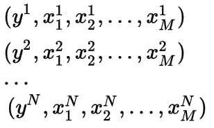

N observations with 1 output and M features for each.

我们定义一个 M 维向量 **w** 来表示将输入映射到输出的权重。我们也定义 N 乘 M 维矩阵 X 来表示所有的输入。 **y** 被定义为 N 维输出向量。

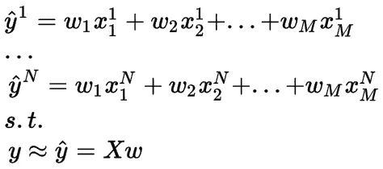

We try to approximate output vector with Xw

我们的目标是找到最佳的 **w** ，最小化实际输出向量 **y** 和近似值 X **w** 之间的欧几里德距离。为此，我们一般使用最小二乘误差和矩阵演算来使其最小化。这里我们用 L 来表示损失(误差)函数。

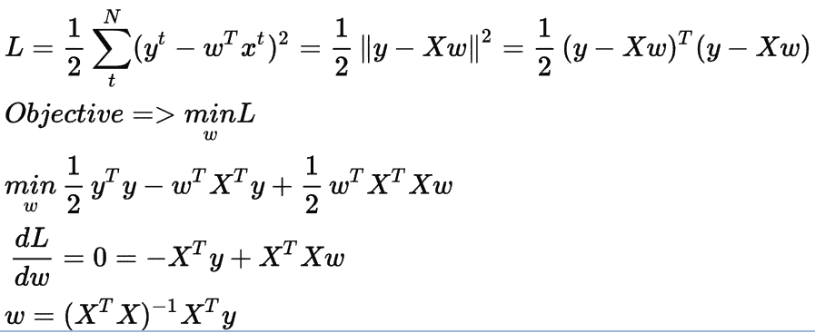

Optimum **w** for linear regression problem

这是问题的线性代数近似，但为了更好地理解问题，并将其扩展到不同的问题设置，我们将以更概率的方式处理它。

在开始，我们说输出是真实的。实际上，我们假设输出是从正态分布中采样的。让我们明确地定义它，将分布均值设置为 Xw，方差设置为 I(单位方差)。

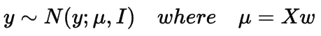

现在，我们的目标是找到最大化概率为 p( **y** |X， **w** )的 **w** 。上面我们定义 p( **y** |X， **w** )为正态分布，所以我们知道它的展开形式是正态分布的 pdf。

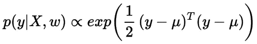

likelihood of y

很难直接使用似然函数，相反，我们将使用对数似然函数，它具有与似然函数相同的最大值和最小值。我们可以最大化对数似然或最小化负对数似然。我们选择第二个，称之为损失函数。

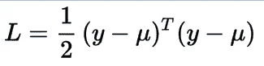

Loss function(-loglikelihood)

该损失函数与最小二乘误差函数完全相同。因此，我们从统计学角度解释了线性回归，这将对即将推出的模型非常有帮助。

## 地图解决方案

上面的解决方案被称为最大似然法，因为这正是我们所做的，最大化似然。我们可以将先验概率放在权重上，并最大化 **w** 的后验分布，而不是**y 的可能性。**

**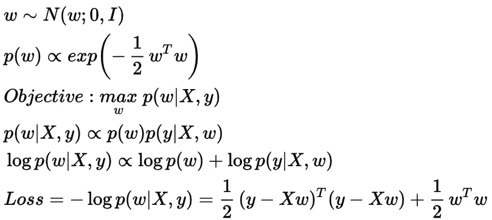**

**MAP solution**

**在上述方程中，我们定义了零均值、单位方差先验权重 **w** ，并利用负对数后验分布导出了损失函数。 **w** 的先验分布试图将权重值保持在其平均值附近，在这种情况下平均值为 0。这一过程被称为 L2 正则化(岭回归),它惩罚边际 **w** 值，因为它可以在损失函数中看到。**

**先验分布反映了我们对 **w** 值的信念，它不一定是正态分布。如果我们把拉普拉斯分布作为先验，正则项将是 **w** 的 1-范数(L1 正则化-Lasso)。**

**为了更好的说明正则化效果，我举个例子。假设我们有一个数据点，其特征为[2，1]，输出为 3。对于这个问题，有无限多种方法来设置权重，但其中，L2 正则化将首选[1，1]，L1 正则化将首选[1.5，0]，因为[1，1]的 2-范数和[1.5，0]的 1-范数是所有可能的解决方案中最小的一个。因此，我们看到 L2 正则化试图使所有权重值尽可能接近 0。另一方面，L1 正则化偏好稀疏解。**

# **泊松回归**

**我们对实值输出使用线性回归。更具体地说，如果输出值是计数，那么我们可以改变似然分布，并对这个新问题使用相同的设置。泊松分布是模拟计数数据的合适分布，我们将利用它。**

**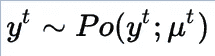**

**泊松分布的超参数不能取负值。所以我们稍微改变一下生成模型的定义，使用线性模型不像正态分布那样直接生成超参数，而是生成它的对数(实际上是自然对数 ln)。对数是广义线性模型中泊松分布的连接函数，我们再次使用负对数似然来寻找最大似然解。**

**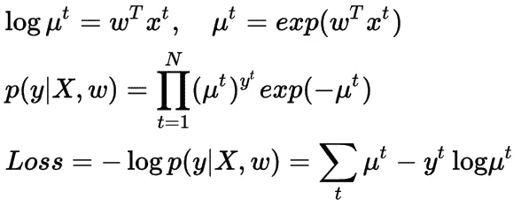**

**Loss function for Poisson Regression**

**我们取损失函数相对于 **w** 的导数，并使其等于 0。就我所见，它没有封闭形式的解，与线性回归相反。但是我们可以使用无约束最优化方法来寻找迭代解，下面我提供了梯度下降法。在梯度下降法中，我们通过损失梯度的负方向(因为这是损失相对于 **w** 减少的方向)逐渐更新权重并采取小步骤。**

**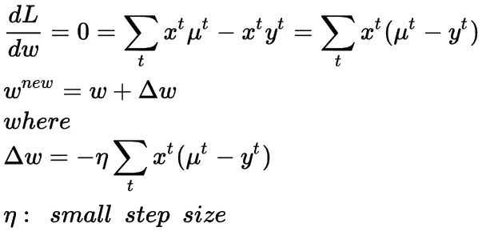**

**Iterative updates for weight**

# **逻辑回归**

**上面我介绍了回归问题的模型，但是广义线性模型也可以用于分类问题。在二类分类问题中，似然性由伯努利分布定义，即输出为 1 或 0。**

**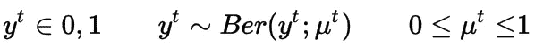**

**这次我们使用 sigmoid 函数将线性模型的输出映射到(0，1)的范围，因为伯努利平均值应该在这个范围内。**

****

**Sigmoid function**

**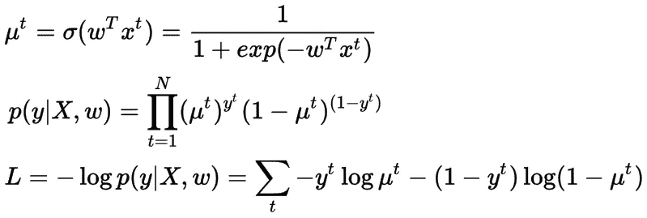**

**Cross-Entropy Loss Function**

**上面定义的损失函数被称为交叉熵损失函数，并广泛用于分类问题，我们从统计角度说明了使用它的原因。该解不存在封闭形式，我们将使用随机梯度下降法，它逐个处理实例并提供在线迭代更新机制。**

**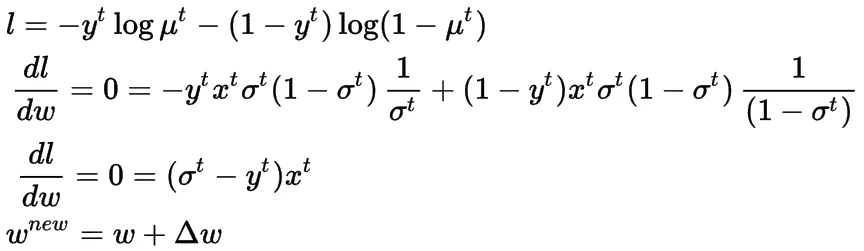**

**Stochastic Gradient Descent for Logistic Regression**

# **多项式逻辑回归**

**如果类别数大于 2，伯努利分布不足以描述数据。在这种情况下，我们更喜欢多项式分布。对于 K 类分类问题，我们用一热编码表示输出。在独热编码中，每个输出都用 K 维向量表示，除了取值为 1 并显示实例类的索引之外，所有向量都是 0。**

**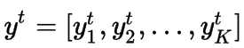**

**One-hot encoding**

**这一次，我们定义了 y 可以属于的 K 个不同的概率。每个类都有自己的概率和权重。因此，与上述模型不同，我们定义了 K 个不同的权重向量。**

**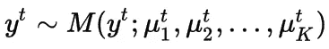**

**An output is sampled from Multinomial Distribution**

**每个类别的概率需要大于 0，因此我们可以像在泊松回归中一样采用线性映射的指数。但是这次有 K 个不同的概率，它们的和应该等于 1。因此，它需要被规范化，为此我们使用 softmax 函数。**

**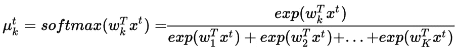**

**再次，我们使用负对数似然来定义损失函数，它被称为交叉熵损失函数。类似于泊松回归和逻辑回归，梯度下降优化器可以用来解决这个问题。**

**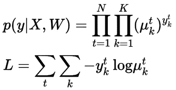**

**Cross-Entropy Loss Function for Multinomial Logistic Regression**

**在这篇文章中，我试图尽可能清楚。我们推导的方程很重要，因为它们构成了更复杂的机器学习模型的基础，比如神经网络。我希望你喜欢它。**