# 用人工神经网络生成数字和声音

> 原文：<https://towardsdatascience.com/generating-digits-and-sounds-with-artificial-neural-nets-ca1270d8445f?source=collection_archive---------1----------------------->

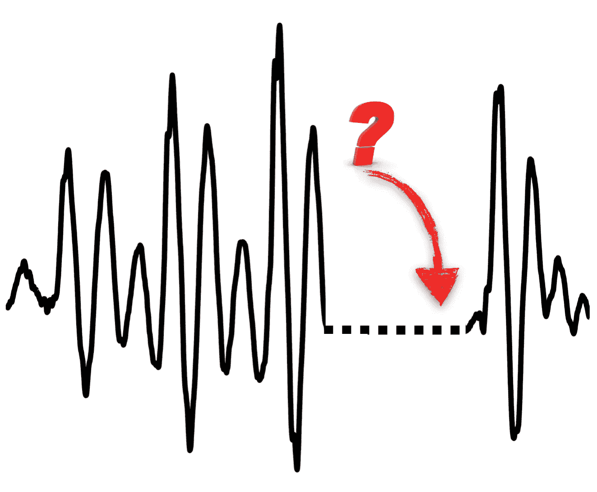

## 为乐趣而实验…

在 Cisco Emerge，我们喜欢尝试新旧工具和想法。最近，我们开始修补生成模型。
在 [GitHub](https://github.com/ciscoemerge/emergeX/tree/master/denoising-VAEs) 上查看这些实验的源代码

## 什么是生成模型？

生成模型是人工神经网络，能够创建人类从未见过的“假”数据，目标是使其与真实数据无法区分。

这里有一个例子，说明了一组特定的生成模型——称为生成对抗网络——在观察了成千上万张人脸图像后能够创造出什么:

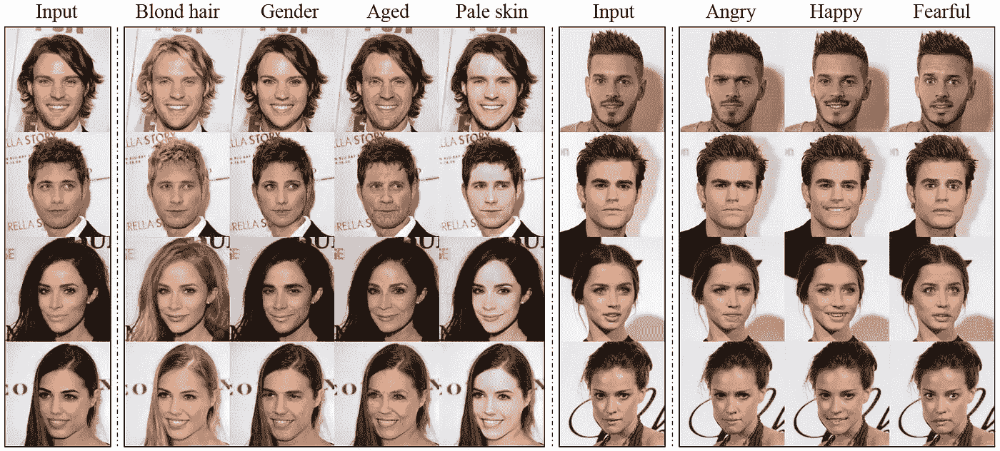

Source: [https://arxiv.org/pdf/1711.09020.pdf](https://arxiv.org/pdf/1711.09020.pdf)

这就好像神经网络学会了创造一个他们观察到的世界的替代现实。

## 我们探索了变型自动编码器

一组特殊的生成模型被称为变分自动编码器。
除了花哨的名字，这个概念非常简单，下图可以帮助解释我们可以用它们实现什么。

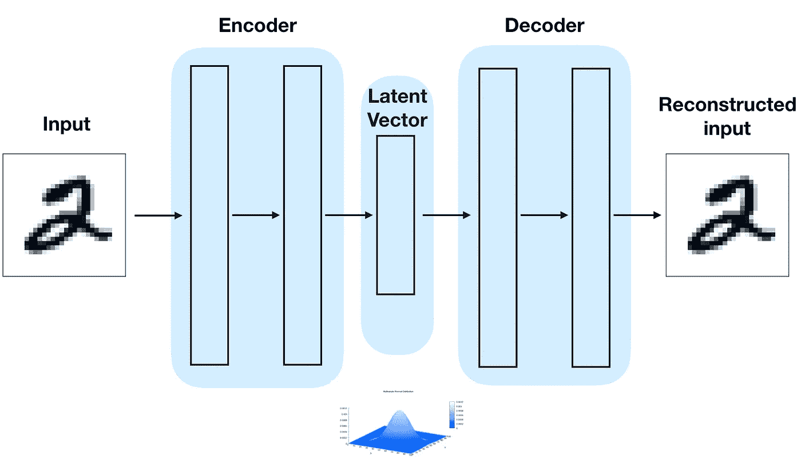

Variational Autoencoder

*   **编码器**:神经网络的第一部分(称为编码器)读取输入——在这个例子中是一个数字——并试图将信息压缩成一个比原始输入更小的向量。
*   潜在向量(Latent Vector):这个向量被“强制”匹配一个特定的概率分布——通常是高斯分布(Gaussian Distribution)[,但是实际上你可以选择任何东西。
    不赘述，之所以会这样，是因为我们希望能够从这个分布中采样一个向量，然后将其馈送到神经网络的第二部分，以生成新数据。](https://en.wikipedia.org/wiki/Multivariate_normal_distribution)
*   **解码器**:网络的第二部分，用来产生新数据，称为解码器。

在训练期间，编码器试图以“损失最小”的方式压缩输入，而解码器试图在只给定潜在向量作为输入的情况下尽可能地匹配原始输入。

## 损坏的数据

如果我们在编码器中输入损坏的输入，并要求解码器重建未损坏的输入，会发生什么情况？

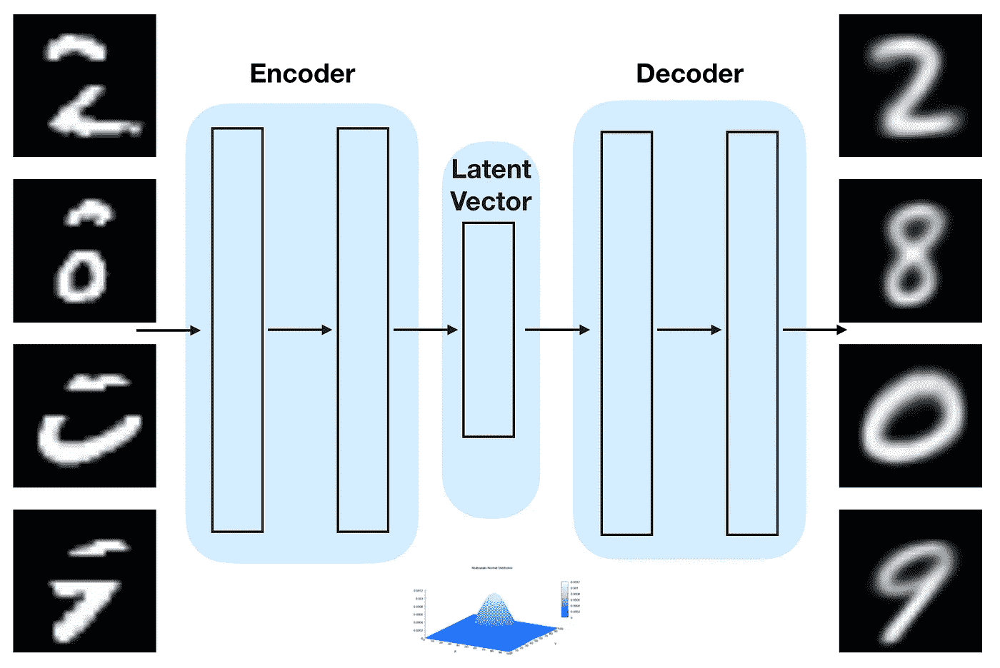

Denoising Variational Autoencoder

神奇的事情发生了:解码器的输出是一个完整的图像，整个数字被精确地绘制出来。
数字明显比原始数字更平滑，也更模糊，因为关于“缺陷”的信息没有通过网络传输。只有使数字成为数字的信息会保留下来。
这一切都意味着:

1.  编码器能够学习构建一个数字的表示，即使是在数字本身的一部分丢失(在上面的例子中是 20%)的情况下。
2.  解码器能够学习如何从编码器学习的表示中重建完整的图像。

## 让我们试试声音

人工神经网络非常通用:可以执行对象识别、语音生成、自然语言处理等

出于这个原因，我们保持了相同的神经网络结构，并尝试了相同的声音实验。

## 嘈杂的 c 大调音阶

我们没有使用 10 个不同的数字图像，而是使用了 7 个音符——c 大调音阶。更准确地说，它们是正弦曲线(因此它们听起来或多或少像笛子)加上了白噪声(因此它们听起来像笛子，演奏者使用了大量空气)。

Click to listen to the sound

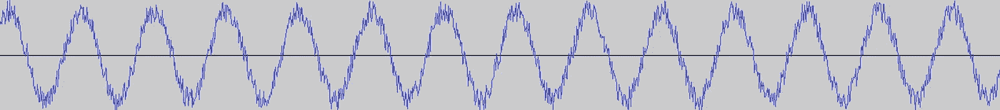

Sound1: Non corrupted noisy sinusoid

与我们之前的实验类似，我们向编码器输入斩波输入。

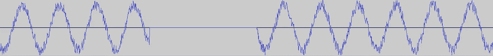

Sound2: This is the input of sounds we fed into the Encoder with, while the image “Sound1” is the reference that the Decoder tries to reconstruct

## 培养

*   **0 次迭代** 最初自动编码器只能产生随机噪声:

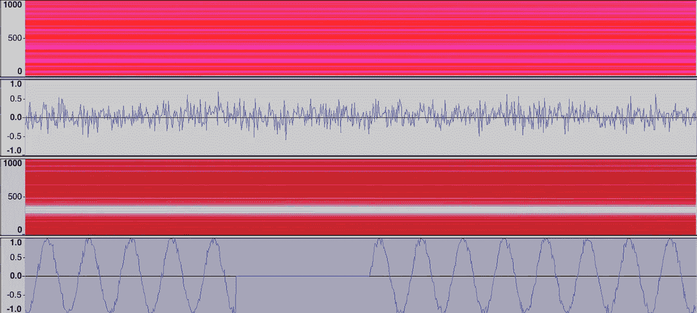

**0 iterations —** Line1: Spectogram of Reconstructed audio. Line 2: Waveform of Reconstructed Audio. Line 3: Spectogram of Chopped Audio fed into the Autoencoder. Line 4: Waveform of Chopped Audio

*   **100 次迭代**

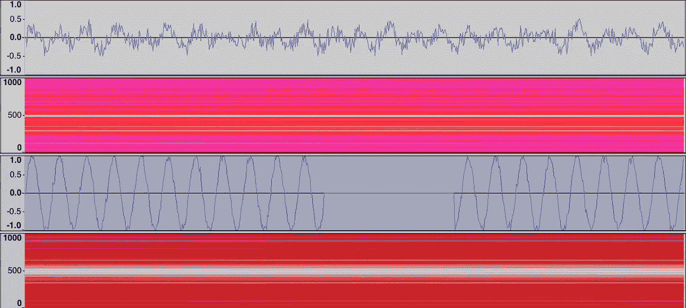

**100 iterations —** Line1: Spectogram of Reconstructed audio. Line 2: Waveform of Reconstructed Audio. Line 3: Spectogram of Chopped Audio fed into the Autoencoder. Line 4: Waveform of Chopped Audio

*   **200 次迭代** 

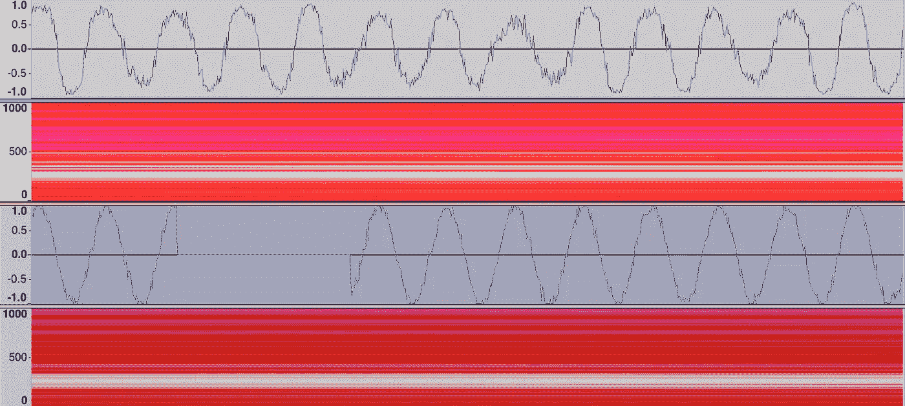

**200 iterations —** Line1: Spectogram of Reconstructed audio. Line 2: Waveform of Reconstructed Audio. Line 3: Spectogram of Chopped Audio fed into the Autoencoder. Line 4: Waveform of Chopped Audio

*   **400 次迭代
    这似乎类似于数字图像实验中发生的情况，输出是平滑和模糊的。
    声谱图还显示，除主频率外，所有其他频率的能量都较弱。**

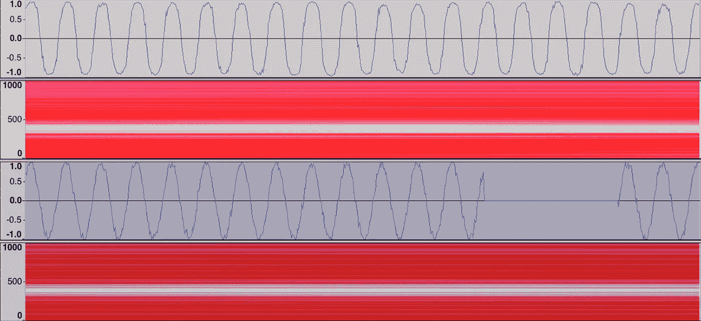

**400 iterations —** Line1: Spectogram of Reconstructed audio. Line 2: Waveform of Reconstructed Audio. Line 3: Spectogram of Chopped Audio fed into the Autoencoder. Line 4: Waveform of Chopped Audio

*   **800 次迭代:** 自动编码器学习重建完整信号，并忽略原始输入中添加的白噪声。

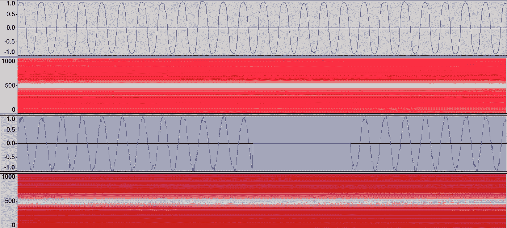

**800 iterations —** Line1: Spectogram of Reconstructed audio. Line 2: Waveform of Reconstructed Audio. Line 3: Spectogram of Chopped Audio fed into the Autoencoder. Line 4: Waveform of Chopped Audio

## 听起来是这样的

这是被破坏的输入的声音。请记住，神经网络是用一个只有一部分丢失的短输入来训练的，而完整的声音是一个有许多随机丢失部分的较长输入。

重建的输入听起来像这样:

## 用更复杂的输入自己尝试一下

你可以在这个 [GitHub repo](https://github.com/ciscoemerge/emergeX/tree/master/denoising-VAEs) 中找到我们用来运行这些实验并产生这些结果的所有源代码，这样你就可以尝试为数字、声音以及可能更复杂的输入复制它们。随意留下评论，叉回购。
您不需要任何特定的数据集或硬件，只需要安装一台计算机和 TensorFlow(MNIST 数据集附带 tensor flow)。
如果你得到了什么有趣的结果，请在评论中分享。

## 谷歌洋红色

你可能想看看谷歌的这个项目:[用 NSynth](https://magenta.tensorflow.org/nsynth-fastgen) 生成你自己的声音。
与我们刚刚展示的实验类似，他们建立了能够学习并直接生成原始音频样本的神经网络。

## 结论

正如上面提到的 Google Magenta 的项目，已经有人在努力用人工神经网络生成音频，他们取得的结果令人印象深刻。
我们试图让这个实验尽可能简单，这样任何人都可以在不需要庞大数据集和配备 GPU 的昂贵机器的情况下进行尝试，并深入了解可变自动编码器如何对图像和原始声音进行处理。