# 使用语言模型和 LSTMs 生成德雷克说唱歌词

> 原文：<https://towardsdatascience.com/generating-drake-rap-lyrics-using-language-models-and-lstms-8725d71b1b12?source=collection_archive---------4----------------------->

## 深入了解你的 MC-LSTM，即将在 iTunes 上发布

所有未来人工智能应用的一个主要部分是建立能够从一些数据集学习的网络，然后生成原创内容。这个想法已经被应用到自然语言处理(NLP)中，这就是人工智能社区如何开发出所谓的语言模型

> 语言模型的前提是了解句子是如何在文本中构建的，并使用这些知识来生成新的内容

就我而言，我想尝试将说唱一代作为一个有趣的附带项目，看看我是否能重现加拿大流行说唱歌手德雷克(又名# 6 上帝)的歌词

我还想分享一个通用的机器学习项目管道，因为我发现，如果你不知道从哪里开始，建立自己的东西往往是非常困难的。

# 1.获取数据

这一切都是从寻找德雷克所有歌曲的数据集开始的，我不想浪费太多时间，所以我自己构建了一个快速脚本，抓取一个叫做*metrolyrics.com*的流行网站的网页

我用一个众所周知的 Python 包 BeautifulSoup 来抓取页面，这是我从这个[由](https://medium.freecodecamp.org/how-to-scrape-websites-with-python-and-beautifulsoup-5946935d93fe) [Justin Yek](https://medium.com/u/bb0a08e70dc6?source=post_page-----8725d71b1b12--------------------------------) 写的的很棒的教程中用了大约 5 分钟学会的。注意，我实际上预先定义了我想从 *metrolyrics 中获取的歌曲，*这就是为什么你可能会注意到我在上面的代码中迭代了我的`songs` dataframe。

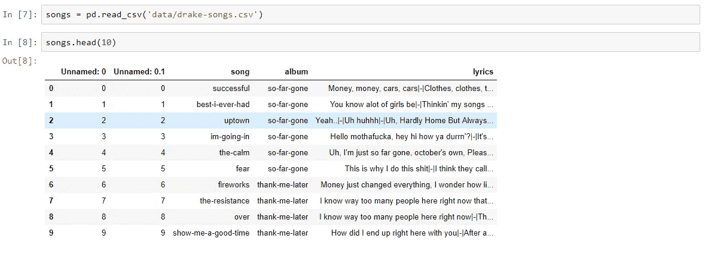

DataFrame storing all of the songs lyrics

运行剪贴簿后，我有我所有的歌词在适当的格式。csv 文件，并准备开始预处理数据和构建模型。

# 关于模型

现在，我们将讨论文本生成的模型，这才是你真正要做的，这是真正的酱油-生酱油。我将从讨论模型设计和一些使歌词生成成为可能的重要元素开始，然后，我们将开始讨论它的实现。

> 建立语言模型有两种主要方法:(1)字符级模型和(2)单词级模型。

每种模型的主要区别在于输入和输出是什么，我将在这里详细讨论每种模型的工作原理。

## 字符级模型

在字符级模型的情况下，你的输入是一系列字符`seed`，你的模型负责预测下一个字符`new_char`。然后你一起使用`seed + new_char`来生成下一个字符，以此类推。请注意，由于您的网络输入必须总是相同的形状，我们实际上会在此过程的每次迭代中从种子中丢失一个字符。这是一个简单的可视化:

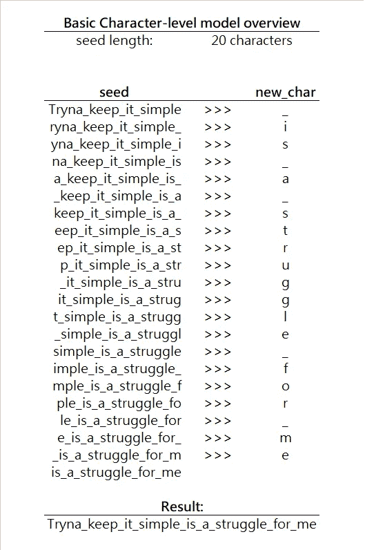

Fig. 2 Iterative process of word generation with Character-level Language Model

在每一次迭代中，该模型基本上是在给定种子字符的情况下预测下一个最可能的字符是什么，或者使用条件概率，这可以描述为寻找最大值`P(new_char|seed)`，其中`new_char`是字母表中的任何字符。在我们的例子中，字母表是一组全英文字母和一个空格字符。(注意，您的字母表可以非常不同，可以包含您想要的任何字符，这取决于您正在为其构建模型的语言)

## 单词级模型

单词级模型与字符级模型几乎相同，但它生成下一个单词而不是下一个字符。这里有一个简单的例子:

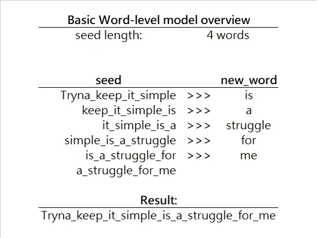

Fig. 3 Iterative process of word generation with Word-level Language Model

现在，在这个模型中，我们以一个单位向前看，但这次我们的单位是一个词，而不是一个字符。因此，我们在寻找`P(new_word|seed)`，其中`new_word`是我们词汇表中的任何单词。

请注意，现在我们正在搜索比以前大得多的集合。使用 alphabet，我们搜索了大约 30 个项目，现在我们在每次迭代中搜索更多的项目，因此单词级算法在每次迭代中更慢，但由于我们生成的是整个单词而不是单个字符，所以实际上一点也不差。作为我们的单词级模型的最后一点，我们可以拥有非常多样化的词汇，我们通常通过从我们的数据集中找到所有独特的单词来发展它(通常在数据预处理阶段完成)。因为词汇表可以变得无限大，所以有许多技术可以提高算法的效率，比如单词嵌入，但那是以后的文章了。

出于本文的目的，我将把重点放在字符级模型上，因为它的实现更简单，并且对字符级模型的理解可以很容易地转移到更复杂的单词级模型上。当我写这篇文章的时候，我也建立了一个单词级的模型，当我写完之后，我会附上一个链接(或者你可以关注我来保持更新😉)

# **2。数据预处理**

对于角色级别的模型，我们将不得不以下列方式预处理数据:

1.  **标记化数据集** —当我们将输入输入到模型中时，我们不想只输入字符串，而是希望使用字符，因为这是一个字符级的模型。所以我们要把所有的歌词拆分成字符列表。
2.  **定义字母表**—现在，我们知道了歌词中可能出现的每一种字符(来自之前的标记化步骤)，我们希望找到所有独特的字符。为了简单起见，事实上整个数据集并不是很大(我只使用了 140 首歌曲)，我将坚持使用英文字母和几个特殊字符(如空格)，并将忽略所有数字和其他东西(因为数据集很小，我宁愿让我的模型预测更少的字符)。
3.  **创建训练序列** —我们将使用滑动窗口的概念，通过在句子上滑动固定大小的窗口来创建一组训练示例。这里有一个形象化的好方法:

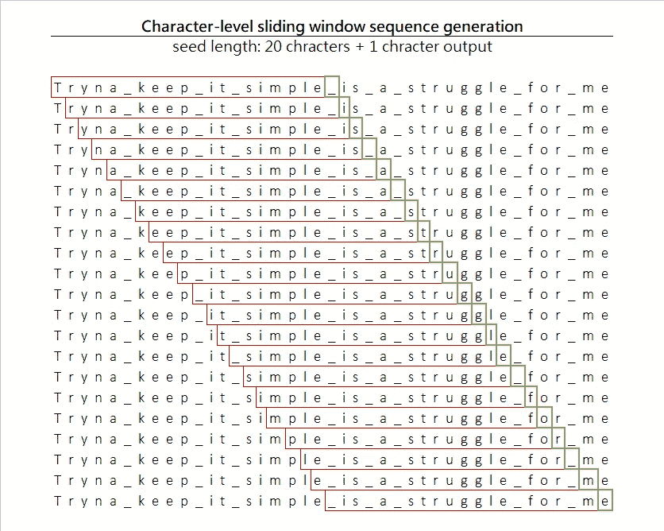

Fig. 4 Sliding window on the dataset with input/output generation

通过一次移动一个字符，我们生成长度为 20 个字符的输入和一个输出字符。此外，由于我们一次移动一个字符，我们实际上大大扩展了数据集的大小。

4.**标签编码训练序列**—最后，由于我们不希望模型处理原始字符(尽管理论上这是可能的，因为字符在技术上只是一个数字，所以你几乎可以说 ASCII 为我们编码了所有的字符)。我们将一个唯一的整数与字母表中的每个字符相关联，你可能听说过标签编码。这也是我们创建两个非常重要的映射`character-to-index`和`index-to-character`的时候。有了这两个映射，我们总是可以将任何字符编码成它的惟一整数，并且还可以将模型的输出从索引解码回它的原始字符。

5.**One-Hot-encoding dataset**—因为我们正在处理分类数据，其中所有字符都属于某种类别，所以我们必须对输入列进行编码。这里有一个[伟大的描述](https://hackernoon.com/what-is-one-hot-encoding-why-and-when-do-you-have-to-use-it-e3c6186d008f)由 [Rakshith Vasudev](https://medium.com/u/4ed456ddae20?source=post_page-----8725d71b1b12--------------------------------) 写的单热编码实际上做了什么。

一旦我们完成了这五个步骤，我们就差不多完成了，现在我们要做的就是建立模型并训练它。如果您想更深入地了解细节，这里是前五个步骤的代码。

# 3.构建模型

为了用一组先前的字符来预测下一个字符，我们将使用递归神经网络(RNN)，或者特别是长短期记忆网络(LSTM)。如果你对这两个概念都不熟悉，我建议你仔细阅读一下。 [RNNs](/introduction-to-recurrent-neural-network-27202c3945f3) 作者 [Pranoy Radhakrishnan](https://medium.com/u/cbdde324ae8d?source=post_page-----8725d71b1b12--------------------------------) 和 [LSMTs](https://medium.com/@kangeugine/long-short-term-memory-lstm-concept-cb3283934359) 作者 [Eugine Kang](https://medium.com/u/82b2bde2b1ce?source=post_page-----8725d71b1b12--------------------------------) 。如果你只是需要一个复习或感觉勇敢，这里有一个快速纲要:

## RNN 进修

通常，您会看到网络看起来像一张网，从许多节点汇聚到一个输出。大概是这样的:

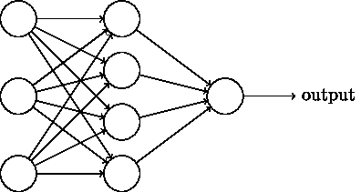

Fig. 5 Image of a Neural Network. [credit](http://neuralnetworksanddeeplearning.com)

这里我们有一个单一的输入点和一个单一的输出点。这对于不连续的输入非常有用，因为输入的顺序不会影响输出。但在我们的例子中，字符的顺序实际上非常重要，因为字符的特定顺序是创建独特单词的原因。

RNNs 通过创建一个网络来解决这个问题，该网络接收连续的输入，并且还使用来自前一个节点的激活作为下一个节点的参数。

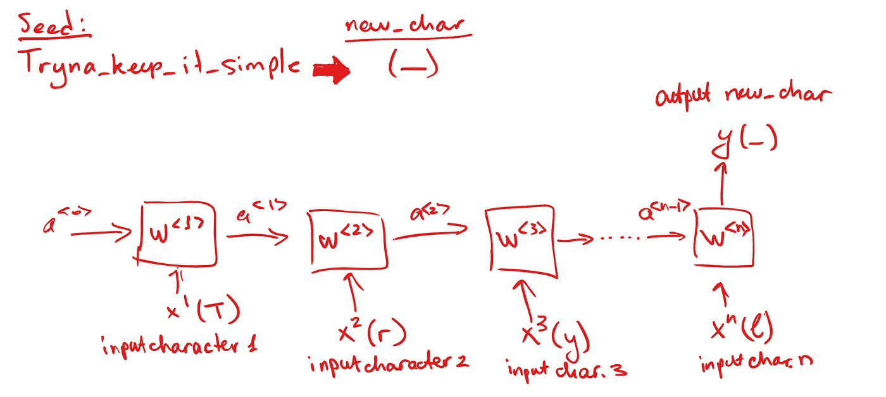

Fig. 6 Overview of a simple RNN

还记得我们的一个序列`Tryna_keep_it_simple`的例子，我们提取出在它之后的下一个字符应该是`_`。这正是我们希望我们的网络所做的。我们将输入字符序列，其中每个字符进入`T — > s<1>, r -> x<2>, n -> x<3>... e-> x<n>`，网络预测输出`y -> _`，这是一个空格，是我们的下一个字符。

## **LSTM 进修**

简单的 rnn 有一个问题，它们不太擅长将信息从非常早期的细胞传递到后来的细胞。例如，如果你正在看一个句子`Tryna keep it simple is a struggle for me`，如果你不能回头看看之前出现的其他单词，那么预测最后一个单词`me`(可以是字面上的任何人或任何东西，如:巴卡、猫、土豆)是非常困难的。

lstm 通过给每个单元增加一点内存来解决这个问题，每个单元存储一些关于之前发生的事情的信息(之前出现了什么单词)，这就是为什么 lstm 看起来像这样:

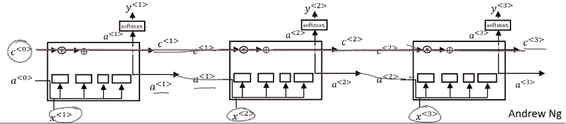

Fig. 7 LSTM visualization, taken from Andrew Ng’s Deep Learning specialization

除了传递`a<n>`激活之外，您还传递了`c<n>`，它包含了之前节点中发生的事情的信息。这就是为什么 LSTMs 更好地保留了上下文，并且通常可以为语言建模等目的做出更好的预测。

## 实际上在建造它

我以前学过一点 Keras，所以我用它作为框架来建立网络，但在现实中，这可以手工完成，唯一的区别是它会花很多时间。

如您所见，我们使用了 LSTM 模型，也使用了批处理，这意味着我们对数据子集进行训练，而不是一次训练所有数据，以略微加快训练过程。

# 4.生成歌词

在我们的网络被训练之后，这里是我们将如何寻找下一个字符。我们将获得一些随机种子，它将是用户输入的一个简单的字符串。然后，我们将使用种子作为网络的输入来预测下一个字符，我们将重复这个过程，直到我们生成一串新的行；类似于上面显示的图 2。

下面是一些生成的歌词的例子

**注意:**歌词未经审查，请自行查看

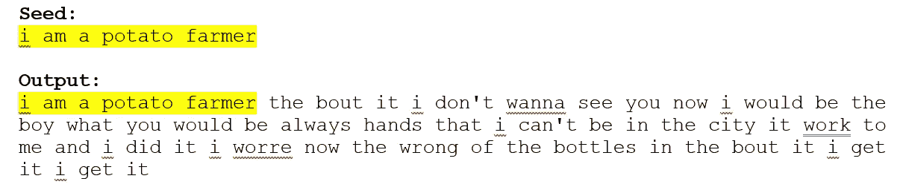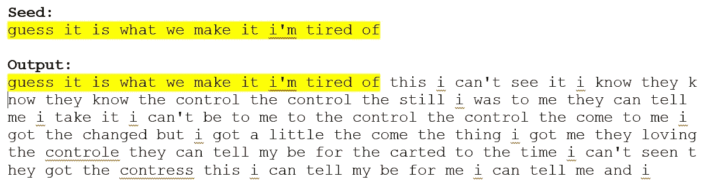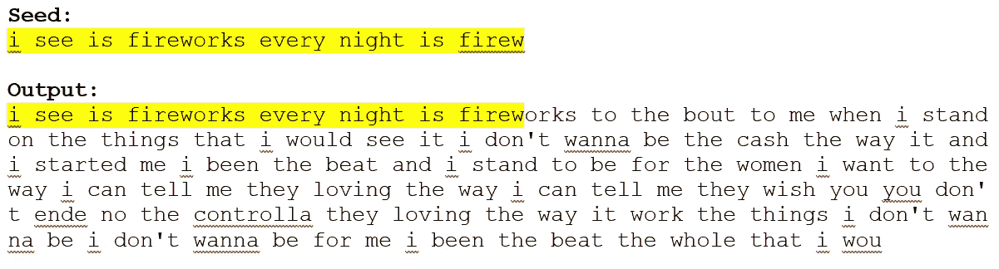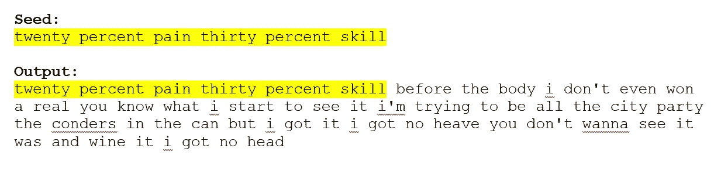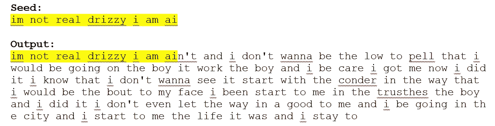

您可能已经注意到，单词有时没有意义，这是字符级模型的一个常见问题，因为输入数据经常在单词中间被分割，这使得网络学习并生成奇怪的新单词，而这些单词对它来说却有意义。

这是用单词级模型解决的问题，但是对于不到 200 行的代码，字符级模型仍然令人印象深刻。

# 其他应用

这个字符级网络中描述的想法可以扩展到许多其他应用程序，这些应用程序远比歌词生成有用。

例如，iPhone 键盘上的下一个单词推荐也是如此。

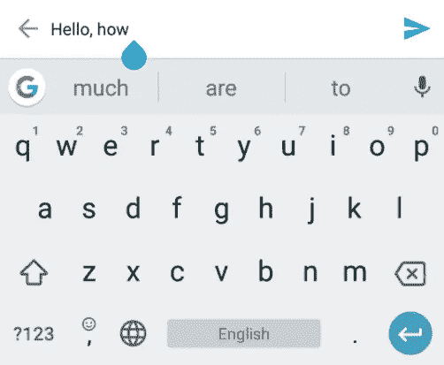

Keyboard next word prediction

想象一下，如果您构建一个足够精确的 Python 语言模型，您不仅可以自动完成关键字或变量名，还可以自动完成大块代码，从而为程序员节省大量时间。

你可能已经注意到这里的代码并不完整，并且缺少一些部分，这里是我的 [Github repo](https://github.com/nikolaevra/drake-lyric-generator) 的链接，在这里你可以更深入地了解自己构建一个类似项目的细节。

感谢来自 github 的 Keras 示例

> 总之，我希望你喜欢阅读这个故事，请考虑跟随或鼓掌👏如果你做了。如果你对更多类似的内容感兴趣，你可以在这里关注我，或者在其他任何社交媒体上关注@nikolaevra。

> 下次我会抓住你的！